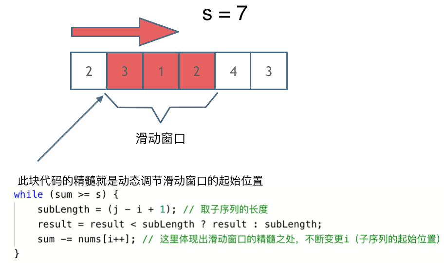

# LeetCode刷题笔记

***

- Tag顺序：数组-> 链表-> 哈希表->字符串->栈与队列->树->回溯->贪心->动态规划->图论->高级数据结构。先从简单刷起，做了几个类型题目之后，再慢慢做中等题目、困难题目。

## 数组

### 数组理论基础

- 首先要知道数组在内存中的存储方式，这样才能真正理解数组相关的面试题：

  - **数组是存放在连续内存空间上的相同类型数据的集合。** 
  - 数组可以方便的通过下标索引的方式获取到下标相对应的数据。

  注意：**数组下标都是从0开始的。** **数组内存空间的地址是连续的。** 

  - 正是**因为数组的在内存空间的地址是连续的，所以我们在删除或者增添元素的时候，就难免要移动其他元素的地址。** 

    例如删除下标为3的元素，需要对下标为3的元素后面的所有元素都要做移动操作，如图所示：

    

    **数组的元素是不能删的，只能覆盖。** 

### 1. 二分查找

#### 题目

- 给定一个 n 个元素有序的（升序）整型数组 nums 和一个目标值 target  ，写一个函数搜索 nums 中的 target，如果目标值存在返回下标，否则返回 -1。

  示例 1:

  ```
  输入: nums = [-1,0,3,5,9,12], target = 9     
  输出: 4       
  解释: 9 出现在 nums 中并且下标为 4     
  ```

  示例 2:

  ```
  输入: nums = [-1,0,3,5,9,12], target = 2     
  输出: -1        
  解释: 2 不存在 nums 中因此返回 -1     
  ```

  提示：

  - 你可以假设 nums 中的所有元素是不重复的。
  - n 将在 [1, 10000]之间。
  - nums 的每个元素都将在 [-9999, 9999]之间。

#### 思路

- **这道题目的前提是数组为有序数组**，同时题目还强调**数组中无重复元素**，因为一旦有重复元素，使用二分查找法返回的元素下标可能不是唯一的，这些都是使用二分法的前提条件。

  二分查找涉及的很多的边界条件，逻辑比较简单，但就是写不好。例如到底是 `while(left < right)` 还是 `while(left <= right)`，到底是`right = middle`呢，还是要`right = middle - 1`呢？

  大家写二分法经常写乱，主要是因为**对区间的定义没有想清楚，区间的定义就是不变量**。要在二分查找的过程中，保持不变量，就是在while寻找中每一次边界的处理都要坚持根据区间的定义来操作，这就是**循环不变量**规则。

- 我们定义 target 是在一个在左闭右闭的区间里，**也就是[left, right] （这个很重要非常重要）**。区间的定义就决定了二分法的代码应该如何写，**因为定义target在[left, right]区间，所以有如下两点：** 

  - while (left <= right) 要使用 <= ，因为left == right是有意义的，所以使用 <=
  - if (nums[middle] > target) right 要赋值为 middle - 1，因为当前这个nums[middle]一定不是target，那么接下来要查找的左区间结束下标位置就是 middle - 1

  代码如下：

  ```java
  class Solution {
      public int search(int[] nums, int target) {
          int left, right, middle;
          left = 0;
          right  = nums.length - 1;
          while(left <= right){
              middle = (left + right) / 2;
              if(nums[middle] == target){
                  return middle;
              }else if(nums[middle] < target){
                  left = middle + 1;
              }else{
                  right = middle - 1;
              }
          }
          return -1;
      }
  }
  ```

  - 时间复杂度：O(log n)
  - 空间复杂度：O(1)

### 2. 移除元素

#### 题目

- 给你一个数组 nums 和一个值 val，你需要 **原地** 移除所有数值等于 val 的元素，并返回移除后数组的新长度。

  不要使用额外的数组空间，你必须仅使用 O(1) 额外空间并 原地 修改输入数组。元素的顺序可以改变。你不需要考虑数组中超出新长度后面的元素。

  - 说明:

    为什么返回数值是整数，但输出的答案是数组呢?

    请注意，输入数组是以「引用」方式传递的，这意味着在函数里修改输入数组对于调用者是可见的。

    你可以想象内部操作如下:

    ```java
    // nums 是以“引用”方式传递的。也就是说，不对实参作任何拷贝
    int len = removeElement(nums, val);
    
    // 在函数里修改输入数组对于调用者是可见的。
    // 根据你的函数返回的长度, 它会打印出数组中 该长度范围内 的所有元素。
    for (int i = 0; i < len; i++) {
        print(nums[i]);
    }
    ```

  示例 1：

  ```
  输入：nums = [3,2,2,3], val = 3
  输出：2, nums = [2,2]
  解释：函数应该返回新的长度 2, 并且 nums 中的前两个元素均为 2。你不需要考虑数组中超出新长度后面的元素。例如，函数返回的新长度为 2 ，而 nums = [2,2,3,3] 或 nums = [2,2,0,0]，也会被视作正确答案。
  ```

   示例 2：

  ```
  输入：nums = [0,1,2,2,3,0,4,2], val = 2
  输出：5, nums = [0,1,4,0,3]
  解释：函数应该返回新的长度 5, 并且 nums 中的前五个元素为 0, 1, 3, 0, 4。注意这五个元素可为任意顺序。你不需要考虑数组中超出新长度后面的元素。
  ```

  提示：

  - `0 <= nums.length <= 100`
  - `0 <= nums[i] <= 50`
  - `0 <= val <= 100`

#### 思路

- 返回移除后数组的新长度很容易，**难点在于如何覆盖掉被移除的元素**？-> **双指针法** 

##### ★双指针法

- 双指针法（快慢指针法）： **通过一个快指针和慢指针在一个for循环下完成两个for循环的工作。** 

  定义快慢指针

  - **快指针**：寻找新数组的元素 ，新数组就是不含有目标元素的数组
  - **慢指针**：指向更新的新数组下标的位 置

  **双指针法（快慢指针法）在数组和链表的操作中是非常常见的，很多考察数组、链表、字符串等操作的面试题，都使用双指针法。** 

- 利用双指针法实现元素覆盖：

  ```java
  class Solution {
      public int removeElement(int[] nums, int val) {
          int slowIndex = 0;
          for(int fastIndex = 0; fastIndex < nums.length; fastIndex++){
              if(nums[fastIndex] != val){
                  nums[slowIndex++] = nums[fastIndex];
              }
          }
          return slowIndex;
      }
  }
  ```

  - 时间复杂度：O(n)
  - 空间复杂度：O(1)

- 由于题目允许元素的顺序可以改变，所以可以用**相向双指针法**，以实现**移动最少的元素** 

  ```java
  class Solution {
      public int removeElement(int[] nums, int val) {
          int leftIndex = 0, rightIndex = nums.length - 1;
          while(leftIndex <= rightIndex){
              //如果nums[leftIndex]的值不等于要删除的元素的值
              if(nums[leftIndex] != val){
                  if(nums[rightIndex] != val){
                      leftIndex++;
                  }else{
                      rightIndex--;
                  }
              }else{	//如果nums[leftIndex]的值等于要删除的元素的值
                  if(nums[rightIndex] != val){
                      nums[leftIndex++] = nums[rightIndex--];
                  }else{
                      rightIndex--;
                  }
              }
          }
          return leftIndex;
      }
  }
  ```

  - 时间复杂度：O(n)
  - 空间复杂度：O(1)

### 3. 有序数组的平方

#### 题目

- 给你一个按 **非递减顺序** 排序的整数数组 `nums`，返回 **每个数字的平方** 组成的新数组，要求也按 **非递减顺序** 排序。

  **示例 1：** 

  ```
  输入：nums = [-4,-1,0,3,10]
  输出：[0,1,9,16,100]
  解释：平方后，数组变为 [16,1,0,9,100]
  排序后，数组变为 [0,1,9,16,100]
  ```

  **示例 2：** 

  ```
  输入：nums = [-7,-3,2,3,11]
  输出：[4,9,9,49,121]
  ```

  **提示：** 

  - `1 <= nums.length <= 10^4`
  - `-10^4 <= nums[i] <= 10^4`
  - `nums` 已按 **非递减顺序** 排序

#### 思路

- 依然使用双指针法。

- 数组其实是有序的， 只不过负数平方之后可能成为最大数了。

  那么**数组平方的最大值就在数组的两端，不是最左边就是最右边，不可能是中间**。

  此时可以考虑双指针法了，i 指向起始位置，j 指向终止位置。

- 定义一个新数组result，和A数组一样的大小，让 k 指向result数组终止位置。

  - 如果`A[i] * A[i] < A[j] * A[j]` 那么`result[k--] = A[j] * A[j];` 。
  - 如果`A[i] * A[i] >= A[j] * A[j]` 那么`result[k--] = A[i] * A[i];` 。

  代码如下：

  ```java
  class Solution {
      public int[] sortedSquares(int[] nums) {
          int[] newNums = new int[nums.length];
          int k = newNums.length - 1;     //令k指向newNums数组的最后一个位置
          int leftIndex = 0, rightIndex = nums.length - 1;
          while(k >= 0){
              if(nums[leftIndex] * nums[leftIndex] < nums[rightIndex] * nums[rightIndex]){
                  newNums[k--] = nums[rightIndex] * nums[rightIndex];
                  rightIndex--;
              }else{
                  newNums[k--] = nums[leftIndex] * nums[leftIndex];
                  leftIndex++;
              }
          }
          return newNums;
      }
  }
  ```
  
  - 时间复杂度：O(n)
  - 空间复杂度：O(n)

### 4. 长度最小的子数组

#### 题目

- 给定一个含有 `n` 个正整数的数组和一个正整数 `target` 。找出该数组中满足其和 ≥ target 的长度最小的 连续子数组 [nums~i~, nums~i+1~, ..., nums~r-1~, nums~r~] ，并返回其长度。如果不存在符合条件的子数组，返回 0。

  **示例 1：**

  ```
  输入：target = 7, nums = [2,3,1,2,4,3]
  输出：2
  解释：子数组 [4,3] 是该条件下的长度最小的子数组。
  ```

  **示例 2：**

  ```
  输入：target = 4, nums = [1,4,4]
  输出：1
  ```

  **示例 3：**

  ```
  输入：target = 11, nums = [1,1,1,1,1,1,1,1]
  输出：0
  ```

  **提示：**

  - `1 <= target <= 10^9`
  - `1 <= nums.length <= 10^5`
  - `1 <= nums[i] <= 10^5`

#### 思路

##### ★滑动窗口

- 所谓滑动窗口，**就是不断的调节子序列的起始位置和终止位置，从而得出我们要想的结果**。

  在暴力解法中，是一个for循环滑动窗口的起始位置，一个for循环为滑动窗口的终止位置，用两个for循环 完成了一个不断搜索区间的过程。

  那么滑动窗口如何用一个for循环来完成这个操作呢？

- 首先要思考 如果用一个for循环，那么应该表示 滑动窗口的起始位置，还是终止位置。

  - 如果只用一个for循环来表示 滑动窗口的起始位置，那么如何遍历剩下的终止位置？

    此时难免再次陷入 暴力解法的怪圈。

  - 所以 **只用一个for循环，那么这个循环的索引，一定是表示 滑动窗口的终止位置**。

    那么问题来了， 滑动窗口的起始位置如何移动呢？

  在本题中实现滑动窗口，主要确定如下三点：

  1. 窗口内是什么？
  2. 如何移动窗口的起始位置？
  3. 如何移动窗口的结束位置？

- 窗口就是 满足其和 ≥ s 的长度最小的 连续 子数组。

  窗口的起始位置如何移动：如果当前窗口的值大于 s 了，窗口就要向前移动了（也就是该缩小了）。

  窗口的结束位置如何移动：**窗口的结束位置**就是遍历数组的指针，也就是**for循环里的索引**。

  解题的关键在于 **窗口的起始位置如何移动**，如图所示：

  

  可以发现**滑动窗口的精妙之处在于根据当前子序列和大小的情况，不断调节子序列的起始位置。从而将O(n^2)暴力解法降为O(n)。** 

  代码如下：

  ```java
  class Solution {
      public int minSubArrayLen(int target, int[] nums) {
          int sum, result, subArrayLen;    
          int leftIndex;  //滑动窗口起始位置
          leftIndex = sum = 0;  
          result = Integer.MAX_VALUE;
          for(int rightIndex = 0; rightIndex < nums.length; rightIndex++){
              sum += nums[rightIndex];
              while(sum >= target){
                  subArrayLen = rightIndex - leftIndex + 1;
                  result = subArrayLen < result ? subArrayLen : result;
                  sum -= nums[leftIndex++];   //滑动窗口起始位置向前移动
              }
          }
          return result == Integer.MAX_VALUE ? 0 : result;
      }
  }
  ```
  
  - 时间复杂度：O(n)
  - 空间复杂度：O(1)


### 5. 螺旋矩阵Ⅱ

#### 题目

- 给你一个正整数 `n` ，生成一个包含 `1` 到 `n^2` 所有元素，且元素按顺时针顺序螺旋排列的 `n x n` 正方形矩阵 `matrix` 。

  **示例 1：**

  ```
  输入：n = 3
  输出：[[1,2,3],[8,9,4],[7,6,5]]
  ```

  

  **示例 2：**

  ```
  输入：n = 1
  输出：[[1]]
  ```

  **提示：**

  - `1 <= n <= 20` 

#### 思路

- 求解本题要坚持**循环不变量原则**。

  模拟顺时针画矩阵的过程：

  - 填充上行从左到右
  - 填充右列从上到下
  - 填充下行从右到左
  - 填充左列从下到上

  由外向内一圈一圈这么画下去。这里一圈下来，我们要画每四条边，这四条边怎么画，每画一条边都要坚持一致的左闭右开，或者左开右闭的原则，这样这一圈才能按照统一的规则画下来。

  那么我按照**左闭右开的原则**，来画一圈，大家看一下：

  

  这里每一种颜色，代表一条边，我们遍历的长度，可以看出每一个拐角处的处理规则，拐角处让给新的一条边来继续画。这也是坚持了每条边左闭右开的原则。

  代码如下：

  ```java
  class Solution {
      public int[][] generateMatrix(int n) {
          int num = 0;    //矩阵中填入的数字
          int[][] matrix = new int[n][n];
          int start = 0;  //每一圈循环开始的点(start,start)
          int loop = 0;   //循环的圈数
          int i, j;		//i指代行下标，j指代列下标
          while (loop < n / 2) {
              for(j = start; j < n - loop - 1; j++){
                  matrix[start][j] = ++num;
              }
              for(i = start; i < n - loop - 1; i++){
                  matrix[i][j] = ++num;
              }
              for(; j > loop; j--){
                  matrix[i][j] = ++num;
              }
              for(; i > loop; i--){
                  matrix[i][j] = ++num;
              }
              start++;    //循环开始的点的更新
              loop++;     //已经循环了一圈
          }
          //当n为奇数时，处理矩阵中间的那个单元块
          if(n % 2 == 1){
              matrix[loop][loop] = ++num;
          }
          return matrix;
      }
  }
  ```

  - 时间复杂度 O(n^2): 模拟遍历二维矩阵的时间
  - 空间复杂度 O(1)

### 总结篇

- 数组是非常基础的数据结构，在面试中，考察数组的题目一般在思维上都不难，主要是考察对代码的掌控能力。也就是说，想法很简单，但实现起来 可能就不是那么回事了。

- 首先要知道数组在内存中的存储方式，这样才能真正理解数组相关的面试题。

  **数组是存放在连续内存空间上的相同类型数据的集合。** 数组可以方便的通过下标索引的方式获取到下标下对应的数据。

  需要两点注意的是：

  - **数组下标都是从0开始的。**
  - **数组内存空间的地址是连续的**

  正是**因为数组的在内存空间的地址是连续的，所以我们在删除或者增添元素的时候，就难免要移动其他元素的地址。** 

  **数组的元素是不能删的，只能覆盖。** 


## 链表

### 链表理论基础

- 什么是链表，链表是一种通过指针串联在一起的线性结构，**每一个节点由两部分组成，一个是数据域一个是指针域**（存放指向下一个节点的指针），最后一个节点的指针域指向null（空指针的意思）。

  链表的入口节点称为链表的头结点也就是head。

  

#### 链表的类型

- 单链表：即为前面的图，单链表中的指针域只能指向节点的下一个节点。

- 双链表：每一个节点有两个指针域，一个指向下一个节点，一个指向上一个节点。双链表 既可以向前查询也可以向后查询。

  

- 循环链表：顾名思义，就是链表首尾相连。循环链表可以用来解决约瑟夫环问题。

  

#### 链表的存储方式

- 了解完链表的类型，再来说一说链表在内存中的存储方式。

  **数组是在内存中是连续分布的，但是链表在内存中可不是连续分布的**。链表是通过指针域的指针链接在内存中各个节点。所以链表中的节点在内存中不是连续分布的 ，而是散乱分布在内存中的某地址上，分配机制取决于操作系统的内存管理。

  如图所示：

  

  这个链表起始节点为2， 终止节点为7， 各个节点分布在内存的不同地址空间上，通过指针串联在一起。

#### ★链表的定义

- 接下来说一说链表的定义。链表节点的定义，很多同学在面试的时候都写不好。这是因为平时在刷leetcode的时候，链表的节点都默认定义好了，直接用就行了，所以同学们都没有注意到链表的节点是如何定义的。而在面试的时候，一旦要自己手写链表，就写的错漏百出。

  ```java
  public class ListNode {
      // 结点的值
      int val;
  
      // 下一个结点
      ListNode next;
  
      // 节点的构造函数(无参)
      public ListNode() {
      }
  
      // 节点的构造函数(有一个参数)
      public ListNode(int val) {
          this.val = val;
      }
  
      // 节点的构造函数(有两个参数)
      public ListNode(int val, ListNode next) {
          this.val = val;
          this.next = next;
      }
  }
  ```

#### 链表的操作

##### 删除节点

- 删除D节点，如图所示：

  

  只要将C节点的next指针指向E节点就可以了。

  那有同学说了，D节点不是依然存留在内存里么？只不过是没有在这个链表里而已。

  是这样的，所以在C++里最好是再手动释放这个D节点，释放这块内存。

  其他语言例如Java、Python，就有自己的内存回收机制，就不用自己手动释放了。

##### 添加节点

- 添加F节点，如图所示：

  

  可以看出链表的增添和删除都是O(1)操作，也不会影响到其他节点。

  但是要注意，要是删除第五个节点，需要从头节点查找到第四个节点通过next指针进行删除操作，**查找的时间复杂度是O(n)**。

#### 性能分析

- 再把链表的特性和数组的特性进行一个对比，如图所示：

  

  数组在定义的时候，长度就是固定的，如果想改动数组的长度，就需要重新定义一个新的数组。

  链表的长度可以是不固定的，并且可以动态增删， 适合数据量不固定，频繁增删，较少查询的场景。

### 1. 移除链表元素
