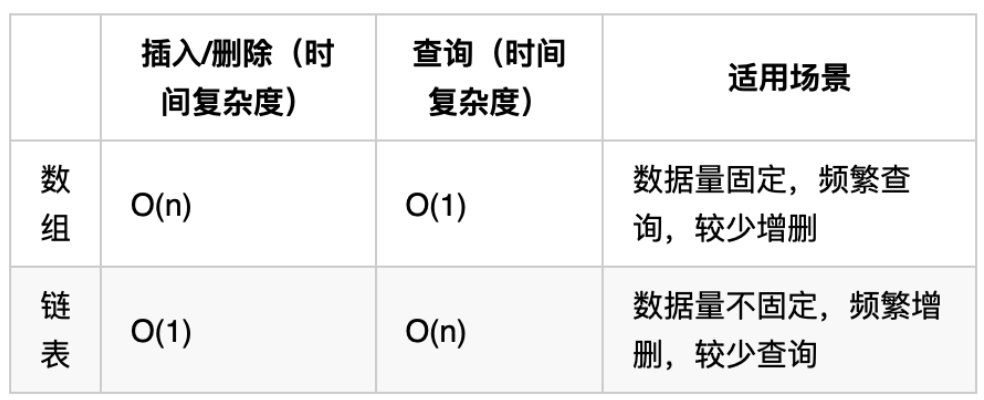

# LeetCode刷题笔记

***

- Tag顺序：数组-> 链表-> 哈希表->字符串->栈与队列->树->回溯->贪心->动态规划->图论->高级数据结构。先从简单刷起，做了几个类型题目之后，再慢慢做中等题目、困难题目。

- 兔子法：想一会儿想不出来就看答案

- 做算法题的技巧：

  - 先用固定的值对特定的例子完成求解。
  - 然后再将固定的值改为变化的值，从特定的例子推广到一般的例子，最终完成普遍意义上的求解。

  ---> **先静后动** 
  
- 对于**数组、链表**问题，要多考虑**双指针法**，链表要想到是不是可以加**虚拟头结点**。

- 对于**匹配问题**，要想到用**栈**来解决。

- 对于 **Top K** 问题，要想到用**堆**来解决。

- 对于**排列、组合、切割、子集、棋盘**问题，要想到用**回溯算法**，还可以用**剪枝**来降低执行时间。

- 对于**求最大值、最优化问题**，要想到用**贪心、动态规划**来解决。

- 另外，**递归三部曲**、**回溯三部曲**、**动归五部曲**、**二叉树的层序遍历模板**这些通用的代码模板，要牢记。

- 还有一些特殊的例子：

  - 对于**回文串**，要想到用**二维 dp 数组**来保存字符串的其中一段是否是回文串的判断，“一次计算，一直能用”。
    - 见动态规划的 “★回文子串” 题目


## 数组✔

### 数组理论基础

- 首先要知道数组在内存中的存储方式，这样才能真正理解数组相关的面试题：

  - **数组是存放在连续内存空间上的相同类型数据的集合。** 
  - 数组可以方便的通过下标索引的方式获取到下标相对应的数据。

  注意：**数组下标都是从0开始的。** **数组内存空间的地址是连续的。** 

  - 正是**因为数组的在内存空间的地址是连续的，所以我们在删除或者增添元素的时候，就难免要移动其他元素的地址。** 

    例如删除下标为3的元素，需要对下标为3的元素后面的所有元素都要做移动操作，如图所示：

    

    **数组的元素是不能删的，只能覆盖。** 

### 1. 二分查找

#### 题目

- 给定一个 n 个元素有序的（升序）整型数组 nums 和一个目标值 target  ，写一个函数搜索 nums 中的 target，如果目标值存在返回下标，否则返回 -1。

  示例 1:

  ```
  输入: nums = [-1,0,3,5,9,12], target = 9     
  输出: 4       
  解释: 9 出现在 nums 中并且下标为 4     
  ```

  示例 2:

  ```
  输入: nums = [-1,0,3,5,9,12], target = 2     
  输出: -1        
  解释: 2 不存在 nums 中因此返回 -1     
  ```

  提示：

  - 你可以假设 nums 中的所有元素是不重复的。
  - n 将在 [1, 10000]之间。
  - nums 的每个元素都将在 [-9999, 9999]之间。

#### 思路

- **这道题目的前提是数组为有序数组**，同时题目还强调**数组中无重复元素**，因为一旦有重复元素，使用二分查找法返回的元素下标可能不是唯一的，这些都是使用二分法的前提条件。

  二分查找涉及的很多的边界条件，逻辑比较简单，但就是写不好。例如到底是 `while(left < right)` 还是 `while(left <= right)`，到底是`right = middle`呢，还是要`right = middle - 1`呢？

  大家写二分法经常写乱，主要是因为**对区间的定义没有想清楚，区间的定义就是不变量**。要在二分查找的过程中，保持不变量，就是在while寻找中每一次边界的处理都要坚持根据区间的定义来操作，这就是**循环不变量**规则。

- 我们定义 target 是在一个在左闭右闭的区间里，**也就是[left, right] （这个很重要非常重要）**。区间的定义就决定了二分法的代码应该如何写，**因为定义target在[left, right]区间，所以有如下两点：** 

  - while (left <= right) 要使用 <= ，因为left == right是有意义的，所以使用 <=
  - if (nums[middle] > target) right 要赋值为 middle - 1，因为当前这个nums[middle]一定不是target，那么接下来要查找的左区间结束下标位置就是 middle - 1

  代码如下：

  ```java
  class Solution {
      public int search(int[] nums, int target) {
          int left, right, middle;
          left = 0;
          right  = nums.length - 1;
          while(left <= right){
              middle = (left + right) / 2;
              if(nums[middle] == target){
                  return middle;
              }else if(nums[middle] < target){
                  left = middle + 1;
              }else{
                  right = middle - 1;
              }
          }
          return -1;
      }
  }
  ```

  - 时间复杂度：O(log n)
  - 空间复杂度：O(1)

### 2. 移除元素

#### 题目

- 给你一个数组 nums 和一个值 val，你需要 **原地** 移除所有数值等于 val 的元素，并返回移除后数组的新长度。

  不要使用额外的数组空间，你必须仅使用 O(1) 额外空间并 原地 修改输入数组。元素的顺序可以改变。你不需要考虑数组中超出新长度后面的元素。

  - 说明:

    为什么返回数值是整数，但输出的答案是数组呢?

    请注意，输入数组是以「引用」方式传递的，这意味着在函数里修改输入数组对于调用者是可见的。

    你可以想象内部操作如下:

    ```java
    // nums 是以“引用”方式传递的。也就是说，不对实参作任何拷贝
    int len = removeElement(nums, val);
    
    // 在函数里修改输入数组对于调用者是可见的。
    // 根据你的函数返回的长度, 它会打印出数组中 该长度范围内 的所有元素。
    for (int i = 0; i < len; i++) {
        print(nums[i]);
    }
    ```

  示例 1：

  ```
  输入：nums = [3,2,2,3], val = 3
  输出：2, nums = [2,2]
  解释：函数应该返回新的长度 2, 并且 nums 中的前两个元素均为 2。你不需要考虑数组中超出新长度后面的元素。例如，函数返回的新长度为 2 ，而 nums = [2,2,3,3] 或 nums = [2,2,0,0]，也会被视作正确答案。
  ```

   示例 2：

  ```
  输入：nums = [0,1,2,2,3,0,4,2], val = 2
  输出：5, nums = [0,1,4,0,3]
  解释：函数应该返回新的长度 5, 并且 nums 中的前五个元素为 0, 1, 3, 0, 4。注意这五个元素可为任意顺序。你不需要考虑数组中超出新长度后面的元素。
  ```

  提示：

  - `0 <= nums.length <= 100`
  - `0 <= nums[i] <= 50`
  - `0 <= val <= 100`

#### 思路

- 返回移除后数组的新长度很容易，**难点在于如何覆盖掉被移除的元素**？-> **双指针法** 

##### ★双指针法

- 双指针法（快慢指针法）： **通过一个快指针和慢指针在一个for循环下完成两个for循环的工作。** 

  定义快慢指针

  - **快指针**：寻找新数组的元素 ，新数组就是不含有目标元素的数组
  - **慢指针**：指向更新的新数组下标的位置

  **双指针法（快慢指针法）在数组和链表的操作中是非常常见的，很多考察数组、链表、字符串等操作的面试题，都使用双指针法。** 

- 利用双指针法实现元素覆盖：

  ```java
  class Solution {
      public int removeElement(int[] nums, int val) {
          int slowIndex = 0;
          for(int fastIndex = 0; fastIndex < nums.length; fastIndex++){
              if(nums[fastIndex] != val){
                  nums[slowIndex++] = nums[fastIndex];
              }
          }
          return slowIndex;
      }
  }
  ```

  - 时间复杂度：O(n)
  - 空间复杂度：O(1)

- 由于题目允许元素的顺序可以改变，所以可以用**相向双指针法**，以实现**移动最少的元素** 

  ```java
  class Solution {
      public int removeElement(int[] nums, int val) {
          int leftIndex = 0, rightIndex = nums.length - 1;
          while(leftIndex <= rightIndex){
              //如果nums[leftIndex]的值不等于要删除的元素的值
              if(nums[leftIndex] != val){
                  if(nums[rightIndex] != val){
                      leftIndex++;
                  }else{
                      rightIndex--;
                  }
              }else{	//如果nums[leftIndex]的值等于要删除的元素的值
                  if(nums[rightIndex] != val){
                      nums[leftIndex++] = nums[rightIndex--];
                  }else{
                      rightIndex--;
                  }
              }
          }
          return leftIndex;
      }
  }
  ```

  - 时间复杂度：O(n)
  - 空间复杂度：O(1)

### 3. 有序数组的平方

#### 题目

- 给你一个按 **非递减顺序** 排序的整数数组 `nums`，返回 **每个数字的平方** 组成的新数组，要求也按 **非递减顺序** 排序。

  **示例 1：** 

  ```
  输入：nums = [-4,-1,0,3,10]
  输出：[0,1,9,16,100]
  解释：平方后，数组变为 [16,1,0,9,100]
  排序后，数组变为 [0,1,9,16,100]
  ```

  **示例 2：** 

  ```
  输入：nums = [-7,-3,2,3,11]
  输出：[4,9,9,49,121]
  ```

  **提示：** 

  - `1 <= nums.length <= 10^4`
  - `-10^4 <= nums[i] <= 10^4`
  - `nums` 已按 **非递减顺序** 排序

#### 思路

- 依然使用双指针法。

- 数组其实是有序的， 只不过负数平方之后可能成为最大数了。

  那么**数组平方的最大值就在数组的两端，不是最左边就是最右边，不可能是中间**。

  此时可以考虑双指针法了，i 指向起始位置，j 指向终止位置。

- 定义一个新数组result，和A数组一样的大小，让 k 指向result数组终止位置。

  - 如果`A[i] * A[i] < A[j] * A[j]` 那么`result[k--] = A[j] * A[j];` 。
  - 如果`A[i] * A[i] >= A[j] * A[j]` 那么`result[k--] = A[i] * A[i];` 。

  代码如下：

  ```java
  class Solution {
      public int[] sortedSquares(int[] nums) {
          int[] newNums = new int[nums.length];
          int k = newNums.length - 1;     //令k指向newNums数组的最后一个位置
          int leftIndex = 0, rightIndex = nums.length - 1;
          while(k >= 0){
              if(nums[leftIndex] * nums[leftIndex] < nums[rightIndex] * nums[rightIndex]){
                  newNums[k--] = nums[rightIndex] * nums[rightIndex];
                  rightIndex--;
              }else{
                  newNums[k--] = nums[leftIndex] * nums[leftIndex];
                  leftIndex++;
              }
          }
          return newNums;
      }
  }
  ```
  
  - 时间复杂度：O(n)
  - 空间复杂度：O(n)

### 4. 长度最小的子数组

#### 题目

- 给定一个含有 `n` 个正整数的数组和一个正整数 `target` 。找出该数组中满足其和 ≥ target 的长度最小的 连续子数组 [nums~i~, nums~i+1~, ..., nums~r-1~, nums~r~] ，并返回其长度。如果不存在符合条件的子数组，返回 0。

  **示例 1：**

  ```
  输入：target = 7, nums = [2,3,1,2,4,3]
  输出：2
  解释：子数组 [4,3] 是该条件下的长度最小的子数组。
  ```

  **示例 2：**

  ```
  输入：target = 4, nums = [1,4,4]
  输出：1
  ```

  **示例 3：**

  ```
  输入：target = 11, nums = [1,1,1,1,1,1,1,1]
  输出：0
  ```

  **提示：**

  - `1 <= target <= 10^9`
  - `1 <= nums.length <= 10^5`
  - `1 <= nums[i] <= 10^5`

#### 思路

##### ★滑动窗口

- 所谓滑动窗口，**就是不断的调节子序列的起始位置和终止位置，从而得出我们要想的结果**。

  在暴力解法中，是一个for循环滑动窗口的起始位置，一个for循环为滑动窗口的终止位置，用两个 for 循环 完成了一个不断搜索区间的过程。

  那么滑动窗口如何用一个for循环来完成这个操作呢？

- 首先要思考 如果用一个for循环，那么应该表示 滑动窗口的起始位置，还是终止位置。

  - 如果只用一个for循环来表示 滑动窗口的起始位置，那么如何遍历剩下的终止位置？

    此时难免再次陷入 暴力解法的怪圈。

  - 所以 **只用一个for循环，那么这个循环的索引，一定是表示 滑动窗口的终止位置**。

    那么问题来了， 滑动窗口的起始位置如何移动呢？

  在本题中实现滑动窗口，主要确定如下三点：

  1. 窗口内是什么？
  2. 如何移动窗口的起始位置？
  3. 如何移动窗口的结束位置？

- 窗口就是 满足其和 ≥ s 的长度最小的 连续 子数组。

  窗口的起始位置如何移动：如果当前窗口的值大于 s 了，窗口就要向前移动了（也就是该缩小了）。

  窗口的结束位置如何移动：**窗口的结束位置**就是遍历数组的指针，也就是**for循环里的索引**。

  解题的关键在于 **窗口的起始位置如何移动**，如图所示：

  

  可以发现**滑动窗口的精妙之处在于根据当前子序列和大小的情况，不断调节子序列的起始位置。从而将O(n^2)暴力解法降为O(n)。** 

  代码如下：

  ```java
  class Solution {
      public int minSubArrayLen(int target, int[] nums) {
          int sum, result, subArrayLen;    
          int leftIndex;  //滑动窗口起始位置
          leftIndex = sum = 0;  
          result = Integer.MAX_VALUE;
          for(int rightIndex = 0; rightIndex < nums.length; rightIndex++){
              sum += nums[rightIndex];
              while(sum >= target){
                  subArrayLen = rightIndex - leftIndex + 1;
                  result = subArrayLen < result ? subArrayLen : result;
                  sum -= nums[leftIndex++];   //滑动窗口起始位置向前移动
              }
          }
          return result == Integer.MAX_VALUE ? 0 : result;
      }
  }
  ```
  
  - 时间复杂度：O(n)
  - 空间复杂度：O(1)


### 5. 螺旋矩阵Ⅱ

#### 题目

- 给你一个正整数 `n` ，生成一个包含 `1` 到 `n^2` 所有元素，且元素按顺时针顺序螺旋排列的 `n x n` 正方形矩阵 `matrix` 。

  **示例 1：**

  ```
  输入：n = 3
  输出：[[1,2,3],[8,9,4],[7,6,5]]
  ```

  

  **示例 2：**

  ```
  输入：n = 1
  输出：[[1]]
  ```

  **提示：**

  - `1 <= n <= 20` 

#### 思路

- 求解本题要坚持**循环不变量原则**。

  模拟顺时针画矩阵的过程：

  - 填充上行从左到右
  - 填充右列从上到下
  - 填充下行从右到左
  - 填充左列从下到上

  由外向内一圈一圈这么画下去。这里一圈下来，我们要画每四条边，这四条边怎么画，每画一条边都要坚持一致的左闭右开，或者左开右闭的原则，这样这一圈才能按照统一的规则画下来。

  那么我按照**左闭右开的原则**，来画一圈，大家看一下：

  

  这里每一种颜色，代表一条边，我们遍历的长度，可以看出每一个拐角处的处理规则，拐角处让给新的一条边来继续画。这也是坚持了每条边左闭右开的原则。

  代码如下：

  ```java
  class Solution {
      public int[][] generateMatrix(int n) {
          int num = 0;    //矩阵中填入的数字
          int[][] matrix = new int[n][n];
          int start = 0;  //每一圈循环开始的点(start,start)
          int loop = 0;   //循环的圈数
          int i, j;		//i指代行下标，j指代列下标
          while (loop < n / 2) {
              for(j = start; j < n - loop - 1; j++){
                  matrix[start][j] = ++num;
              }
              for(i = start; i < n - loop - 1; i++){
                  matrix[i][j] = ++num;
              }
              for(; j > loop; j--){
                  matrix[i][j] = ++num;
              }
              for(; i > loop; i--){
                  matrix[i][j] = ++num;
              }
              start++;    //循环开始的点的更新
              loop++;     //已经循环了一圈
          }
          //当n为奇数时，处理矩阵中间的那个单元块
          if(n % 2 == 1){
              matrix[loop][loop] = ++num;
          }
          return matrix;
      }
  }
  ```

  - 时间复杂度 O(n^2): 模拟遍历二维矩阵的时间
  - 空间复杂度 O(1)

### 总结篇

- 数组是非常基础的数据结构，在面试中，考察数组的题目一般在思维上都不难，主要是考察对代码的掌控能力。也就是说，想法很简单，但实现起来 可能就不是那么回事了。

- 首先要知道数组在内存中的存储方式，这样才能真正理解数组相关的面试题。

  **数组是存放在连续内存空间上的相同类型数据的集合。** 数组可以方便的通过下标索引的方式获取到下标下对应的数据。

  需要两点注意的是：

  - **数组下标都是从0开始的。**
  - **数组内存空间的地址是连续的**

  正是**因为数组的在内存空间的地址是连续的，所以我们在删除或者增添元素的时候，就难免要移动其他元素的地址。** 

  **数组的元素是不能删的，只能覆盖。** 


### 6.数组子序列的排列

#### 题目

- 题目描述

  讨厌鬼有一个长度为 n （1 < n < 10^5）的数组，他想知道这个数组有多少个子序列是一个排列? 

  子序列的定义: 数组删除若干个元素(也可以不删)后得到的新数组。 

  排列的定义: 长度为 m 的数组，1 到 m 每个元素都出现过，且恰好出现 1 次。

- 输入描述

  第一行输入一个整数 n。 

  第二行输入 n 个正整数，a1, a2, ..., an。（1 <= ai <= 10^9）

- 输出描述

  一行一个整数，表示有多少个子序列是一个排列。由于答案过大，请将答案对 10^ 9 + 7 取模后输出

- 输入示例

  ```
  6
  1 1 5 2 3 4
  ```

  输出示例

  ```
  10
  ```

  提示信息

  符合要求的子序列有：{1}，{1}，{1，2}，{1，2}，{1，2，3}，{1，2，3}，{1，2，3，4}，{1，2，3，4}，{1，5，2，3，4}，{1，5，2，3，4}共 10 个

#### 思路

- 其实仔细考虑本题会发现，我们不需要真的去模拟删除元素，然后再去判断剩余数组是否是排列。我们只需要记录每种数字出现的次数，然后就可以通过乘法运算得到结果了，我们可以定义一个 cnt[i] 代表 i 的个数，sum[i] 代表 [1..i] 的个数。

  具体而言，举个例子：

  - 1 1 2 2 3 3
    - 1 有两个，cnt[1] = 2，sum[1] = 2
    - 2 有两个，cnt[2] = 2，sum[2] = cnt[2] * sum[1] = 4，即 [1,2] 的排列就是 cnt[2] * sum[1]，**就是 2 的个数乘前面 1 的排列的个数**
    - 3 有两个，cnt[3] = 2，sum[3] = cnt[3] * sum[2] = 8，也就是 3 有两个，然后 [1,2] 的排列有四种，那么 [1,2,3] 的排列就有 8 种

  由于本题数据范围 1 < n < 10^5，1 <= ai <= 10^9，所以相比于定义数组，定义哈希表更好一点。

  ```java
  import java.util.Scanner;
  import java.util.Map;
  import java.util.HashMap;
  
  public class Main {
      public static void main(String[] args) {
          Scanner in = new Scanner(System.in);
          int n = in.nextInt();
          // Map<数值, 相同的数值的个数>
          Map<Integer, Integer> map = new HashMap<>();
          long res = 0;
          long cur = 1; // 用于代替sum数组
          int mod = (int)1e9 + 7;
          for (int i = 0; i < n; i++) {
              int num = in.nextInt();
              map.put(num, map.getOrDefault(num, 0) + 1); // 存储每种数字出现的次数
          }
          // 长度为n的数组, 如果能得到排列, 最大的值最多为n, 所以看map中的数到n就行了
          for (int i = 1; i <= n; i++) {
              if (map.containsKey(i)) {
                  cur = (cur * map.get(i)) % mod;
                  res = (res + cur) % mod;
              } else {
                  break;
              }
          }
          System.out.println(res);
      }
  }
  ```

  - 有个坑的点是，“由于答案过大，请将答案对 10^ 9 + 7 取模后输出”，所以**在每次 for 循环的过程中，都要对 mod 进行取余**，同时，**res 和 cur 要定义成 long 类型，因为需要避免两个 int 值相乘或者相加超过 int 范围**。

## 链表✔

### 链表理论基础

- 什么是链表，链表是一种通过指针串联在一起的线性结构，**每一个结点由两部分组成，一个是数据域一个是指针域**（存放指向下一个结点的指针），最后一个结点的指针域指向null（空指针的意思）。

  链表的入口结点称为链表的头结点也就是head。

  

#### 链表的类型

- 单链表：即为前面的图，单链表中的指针域只能指向结点的下一个结点。

- 双链表：每一个结点有两个指针域，一个指向下一个结点，一个指向上一个结点。双链表 既可以向前查询也可以向后查询。

  

- 循环链表：顾名思义，就是链表首尾相连。循环链表可以用来解决约瑟夫环问题。

  

#### 链表的存储方式

- 了解完链表的类型，再来说一说链表在内存中的存储方式。

  **数组是在内存中是连续分布的，但是链表在内存中可不是连续分布的**。链表是通过指针域的指针链接在内存中各个结点。所以链表中的结点在内存中不是连续分布的 ，而是散乱分布在内存中的某地址上，分配机制取决于操作系统的内存管理。

  如图所示：

  

  这个链表起始结点为2， 终止结点为7， 各个结点分布在内存的不同地址空间上，通过指针串联在一起。

#### 链表的定义

- 接下来说一说链表的定义。链表结点的定义，很多同学在面试的时候都写不好。这是因为平时在刷leetcode的时候，链表的结点都默认定义好了，直接用就行了，所以同学们都没有注意到链表的结点是如何定义的。而在面试的时候，一旦要自己手写链表，就写的错漏百出。

  ```java
  public class ListNode {
      // 结点的值
      int val;
  
      // 下一个结点
      ListNode next;
  
      // 结点的构造函数(无参)
      public ListNode() {
      }
  
      // 结点的构造函数(有一个参数)
      public ListNode(int val) {
          this.val = val;
      }
  
      // 结点的构造函数(有两个参数)
      public ListNode(int val, ListNode next) {
          this.val = val;
          this.next = next;
      }
  }
  ```

#### 链表的操作

##### 删除结点

- 删除D结点，如图所示：

  

  只要将C结点的next指针指向E结点就可以了。

  那有同学说了，D结点不是依然存留在内存里么？只不过是没有在这个链表里而已。

  是这样的，所以在C++里最好是再手动释放这个D结点，释放这块内存。

  其他语言例如Java、Python，就有自己的内存回收机制，就不用自己手动释放了。

##### 添加结点

- 添加F结点，如图所示：

  

  可以看出链表的增添和删除都是O(1)操作，也不会影响到其他结点。

  但是要注意，要是删除第五个结点，需要从头结点查找到第四个结点通过next指针进行删除操作，**查找的时间复杂度是O(n)**。

#### 性能分析

- 再把链表的特性和数组的特性进行一个对比，如图所示：

  

  数组在定义的时候，长度就是固定的，如果想改动数组的长度，就需要重新定义一个新的数组。

  链表的长度可以是不固定的，并且可以动态增删， 适合数据量不固定，频繁增删，较少查询的场景。

### 1. 移除链表元素

#### 题目

- 给你一个链表的头结点 `head` 和一个整数 `val` ，请你删除链表中所有满足 `Node.val == val` 的结点，并返回 **新的头结点** 。

  **示例 1：**

  ```
  输入：head = [1,2,6,3,4,5,6], val = 6
  输出：[1,2,3,4,5]
  ```

  **示例 2：**

  ```
  输入：head = [], val = 1
  输出：[]
  ```

  **示例 3：**

  ```
  输入：head = [7,7,7,7], val = 7
  输出：[]
  ```

  **提示：**

  - 列表中的结点数目在范围 `[0, 104]` 内
  - `1 <= Node.val <= 50`
  - `0 <= val <= 50`

#### 思路

- 一般情况下，如果当前结点是要删除的结点，那么**让当前结点的前一个结点的next指针直接指向当前结点的下一个结点**即可。

  

  但是如果头结点是要删除的结点，就可以有两种方式对链表进行操作：

  1. **直接使用原来的链表来进行删除操作。**
  2. **设置一个虚拟头结点再进行删除操作。**

- 方式1：直接使用原来的链表来进行删除操作。

  - 该方式需要增加一段业务逻辑：

    移除头结点和移除其他结点的操作是不一样的，因为链表的其他结点都是**通过前一个结点来移除当前结点**，而头结点没有前一个结点。

    所以头结点如何移除呢，其实只要**将头结点向后移动一位**就可以，这样就从链表中移除了一个头结点。

    

    

  代码如下：

  ```java
  /**
   * Definition for singly-linked list.
   * public class ListNode {
   * int val;
   * ListNode next;
   * ListNode() {}
   * ListNode(int val) { this.val = val; }
   * ListNode(int val, ListNode next) { this.val = val; this.next = next; }
   * }
   */
  class Solution {
      public ListNode removeElements(ListNode head, int val) {
          //移除头结点
          while (head != null && head.val == val) {
              head = head.next;
          }
          if (head == null) {
              return null;
          }
          ListNode pre = head;
          ListNode cur = head.next;
          while (cur != null) {
              if (cur.val == val) {
                  pre.next = cur.next;
              } else {
                  pre = cur;
              }
              cur = cur.next;
          }
          return head;
      }
  }
  ```

##### ★虚拟头结点

- 方式2：设置一个**虚拟头结点**再进行删除操作。

  - 这种方式的好处是将删除头结点这种特殊的情况转变为一般的情况，让我们可以以一种统一的逻辑来移除链表的结点。

    

    最后记得在题目中，return 头结点的时候，别忘了 `return dummyHead.next;`， 这才是新的头结点。

  代码如下：

  ```java
  /**
   * Definition for singly-linked list.
   * public class ListNode {
   * int val;
   * ListNode next;
   * ListNode() {}
   * ListNode(int val) { this.val = val; }
   * ListNode(int val, ListNode next) { this.val = val; this.next = next; }
   * }
   */
  class Solution {
      public ListNode removeElements(ListNode head, int val) {
          if (head == null) {
              return null;
          }
          //添加虚拟头结点
          ListNode dummyHead = new ListNode(-1, head);
          ListNode pre = dummyHead;
          ListNode cur = head;
          while (cur != null) {
              if (cur.val == val) {
                  pre.next = cur.next;
              } else {
                  pre = cur;
              }
              cur = cur.next;
          }
          return dummyHead.next;
      }
  }
  ```

### 2.设计链表

#### 题目

- 你可以选择使用单链表或者双链表，设计并实现自己的链表。

  单链表中的结点应该具备两个属性：`val` 和 `next` 。`val` 是当前结点的值，`next` 是指向下一个结点的指针/引用。

  如果是双向链表，则还需要属性 `prev` 以指示链表中的上一个结点。假设链表中的所有结点下标从 **0** 开始。

- 实现 `MyLinkedList` 类：

  - `MyLinkedList()` 初始化 `MyLinkedList` 对象。
  - `int get(int index)` 获取链表中下标为 `index` 的结点的值。如果下标无效，则返回 `-1` 。
  - `void addAtHead(int val)` 将一个值为 `val` 的结点插入到链表中第一个元素之前。在插入完成后，新结点会成为链表的第一个结点。
  - `void addAtTail(int val)` 将一个值为 `val` 的结点追加到链表中作为链表的最后一个元素。
  - `void addAtIndex(int index, int val)` 将一个值为 `val` 的结点插入到链表中下标为 `index` 的结点之前。如果 `index` 等于链表的长度，那么该结点会被追加到链表的末尾。如果 `index` 比长度更大，该结点将 **不会插入** 到链表中。
  - `void deleteAtIndex(int index)` 如果下标有效，则删除链表中下标为 `index` 的结点。

  **示例：**

  ```
  输入
  ["MyLinkedList", "addAtHead", "addAtTail", "addAtIndex", "get", "deleteAtIndex", "get"]
  [[], [1], [3], [1, 2], [1], [1], [1]]
  输出
  [null, null, null, null, 2, null, 3]
  
  解释
  MyLinkedList myLinkedList = new MyLinkedList();
  myLinkedList.addAtHead(1);
  myLinkedList.addAtTail(3);
  myLinkedList.addAtIndex(1, 2);    // 链表变为 1->2->3
  myLinkedList.get(1);              // 返回 2
  myLinkedList.deleteAtIndex(1);    // 现在，链表变为 1->3
  myLinkedList.get(1);              // 返回 3
  ```

  **提示：**

  - `0 <= index, val <= 1000`
  - 请不要使用内置的 LinkedList 库。
  - 调用 `get`、`addAtHead`、`addAtTail`、`addAtIndex` 和 `deleteAtIndex` 的次数不超过 `2000` 。

#### 思路

- 单链表实现：

  ```java
  //单链表
  class ListNode {
      int val;
      ListNode next;
  
      public ListNode() {
  
      }
  
      public ListNode(int val) {
          this.val = val;
      }
  
      public ListNode(int val, ListNode next) {
          this.val = val;
          this.next = next;
      }
  }
  
  class MyLinkedList {
      //链表中元素的个数
      int size;
      //虚拟头结点
      ListNode dummyHead;
  
      //初始化链表
      public MyLinkedList() {
          size = 0;
          dummyHead = new ListNode(-1, null);
      }
  
      public int get(int index) {
          if (index < 0 || index >= size) {
              return -1;
          }
          ListNode cur = dummyHead.next;
          for (int i = 0; i < index; i++) {
              cur = cur.next;
          }
          return cur.val;
      }
  
      public void addAtHead(int val) {
          addAtIndex(0, val);
      }
  
      public void addAtTail(int val) {
          addAtIndex(size, val);
      }
  
      public void addAtIndex(int index, int val) {
          if (index < 0 || index > size) {
              return;
          }
          ListNode pre = dummyHead;
          ListNode cur = dummyHead.next;
          for (int i = 0; i < index; i++) {
              pre = cur;
              cur = cur.next;
          }
          ListNode node = new ListNode(val);
          pre.next = node;
          node.next = cur;
          size++;
      }
  
      public void deleteAtIndex(int index) {
          if (index < 0 || index >= size) {
              return;
          }
          ListNode pre = dummyHead;
          ListNode cur = dummyHead.next;
          for (int i = 0; i < index; i++) {
              pre = cur;
              cur = cur.next;
          }
          pre.next = cur.next;
          size--;
      }
  }
  
  /**
   * Your MyLinkedList object will be instantiated and called as such:
   * MyLinkedList obj = new MyLinkedList();
   * int param_1 = obj.get(index);
   * obj.addAtHead(val);
   * obj.addAtTail(val);
   * obj.addAtIndex(index,val);
   * obj.deleteAtIndex(index);
   */
  ```

  **抓住核心：`index` 指向的是要处理的结点**。

- 双链表实现：

  ```java
  //双链表
  class ListNode {
      int val;
      ListNode next, prev;
  
      public ListNode() {
      }
  
      public ListNode(int val) {
          this.val = val;
      }
  
      public ListNode(int val, ListNode prev, ListNode next) {
          this.val = val;
          this.prev = prev;
          this.next = next;
      }
  }
  
  class MyLinkedList {
      //链表中元素的个数
      int size;
      //虚拟头结点
      ListNode dummyHead, dummyTail;
  
      //初始化链表
      public MyLinkedList() {
          size = 0;
          dummyHead = new ListNode(-1);
          dummyTail = new ListNode(-1, dummyHead, null);
          dummyHead.prev = null;
          dummyHead.next = dummyTail;
      }
  
      public int get(int index) {
          if (index < 0 || index >= size) {
              return -1;
          }
          ListNode cur;
          //判断哪一边遍历的时间更短
          if (index <= size / 2) {
              cur = dummyHead.next;
              for (int i = 0; i < index; i++) {
                  cur = cur.next;
              }
          } else {
              cur = dummyTail.prev;
              for (int i = size - 1; i > index; i--) {
                  cur = cur.prev;
              }
          }
          return cur.val;
      }
  
      public void addAtHead(int val) {
          addAtIndex(0, val);
      }
  
      public void addAtTail(int val) {
          addAtIndex(size, val);
      }
  
      public void addAtIndex(int index, int val) {
          if (index < 0 || index > size) {
              return;
          }
          ListNode pre = dummyHead;
          ListNode cur = dummyHead.next;
          for (int i = 0; i < index; i++) {
              pre = cur;
              cur = cur.next;
          }
          ListNode node = new ListNode(val);
          pre.next = node;
          node.prev = pre;
          node.next = cur;
          cur.prev = node;
          size++;
      }
  
      public void deleteAtIndex(int index) {
          if (index < 0 || index >= size) {
              return;
          }
          ListNode pre = dummyHead;
          ListNode cur = dummyHead.next;
          for (int i = 0; i < index; i++) {
              pre = cur;
              cur = cur.next;
          }
          pre.next = cur.next;
          cur.next.prev = pre;
          size--;
      }
  }
  
  /**
   * Your MyLinkedList object will be instantiated and called as such:
   * MyLinkedList obj = new MyLinkedList();
   * int param_1 = obj.get(index);
   * obj.addAtHead(val);
   * obj.addAtTail(val);
   * obj.addAtIndex(index,val);
   * obj.deleteAtIndex(index);
   */
  ```

### 3.★反转链表

#### 题目

- 给你单链表的头结点 `head` ，请你反转链表，并返回反转后的链表。

  **示例 1：**

  

  ```
  输入：head = [1,2,3,4,5]
  输出：[5,4,3,2,1]
  ```

  **示例 2：**

  

  ```
  输入：head = [1,2]
  输出：[2,1]
  ```

  **示例 3：**

  ```
  输入：head = []
  输出：[]
  ```

  **提示：**

  - 链表中结点的数目范围是 `[0, 5000]`
  - `-5000 <= Node.val <= 5000`

#### 思路

- 首先定义一个`cur`指针，指向头结点，再定义一个`pre`指针，初始化为`null`。

  然后就要开始反转了，**首先要把 `cur.next` 结点用`tmp`指针保存一下**，也就是保存一下这个结点。

  为什么要保存一下这个结点呢，因为接下来要改变 `cur.next` 的指向了，将 `cur.next` 指向 `pre` ，此时已经反转了第一个结点了，为了让 `cur` 能指向下一个要反转的结点，就要用 `tmp` 保存这个结点。

  接下来，就是循环走如下代码逻辑了，继续移动`pre`和`cur`指针。

  最后，`cur` 指针已经指向了`null`，循环结束，链表也反转完毕了。 此时我们`return pre`指针就可以了，`pre`指针就指向了新的头结点。

  ```java
  /**
   * Definition for singly-linked list.
   * public class ListNode {
   *     int val;
   *     ListNode next;
   *     ListNode() {}
   *     ListNode(int val) { this.val = val; }
   *     ListNode(int val, ListNode next) { this.val = val; this.next = next; }
   * }
   */
  //双指针法
  class Solution {
      public ListNode reverseList(ListNode head) {
          ListNode pre, cur, tmp;
          pre = null;
          cur = head;
          tmp = null;
          while (cur != null) {
              //用 tmp 先保存当前结点的下一个结点
              tmp = cur.next;
              cur.next = pre;
              pre = cur;
              cur = tmp;
          }
          return pre;
      }
  }
  ```

- 还有一种递归的方法（核心思想和前面的迭代法是一样的）：

  ```java
  /**
   * Definition for singly-linked list.
   * public class ListNode {
   *     int val;
   *     ListNode next;
   *     ListNode() {}
   *     ListNode(int val) { this.val = val; }
   *     ListNode(int val, ListNode next) { this.val = val; this.next = next; }
   * }
   */
   //递归法
  class Solution {
      public ListNode reverseList(ListNode head) {
          return reverse(null, head);
      }
  
      private ListNode reverse(ListNode prev, ListNode cur) {
          if (cur == null) {
              return prev;    //返回反转以后的头指针
          }
          ListNode tmp = cur.next;
          cur.next = prev;
          return reverse(cur, tmp);
      }
  }
  ```

### 3.2 反转链表 II

#### 题目

- 给你单链表的头指针 `head` 和两个整数 `left` 和 `right` ，其中 `left <= right` 。请你反转从位置 `left` 到位置 `right` 的链表结点，返回 **反转后的链表** 。

  **示例 1：**

  

  ```
  输入：head = [1,2,3,4,5], left = 2, right = 4
  输出：[1,4,3,2,5]
  ```

  **示例 2：**

  ```
  输入：head = [5], left = 1, right = 1
  输出：[5]
  ```

  **提示：**

  - 链表中结点数目为 `n`
  - `1 <= n <= 500`
  - `-500 <= Node.val <= 500`
  - `1 <= left <= right <= n`

#### 思路

- 和 `3.反转链表` 的不同之处在于，需要额外定义两个指针，分别指向 `left - 1` 所在的结点和 `left` 所在的结点，才能完成链表的部分反转。

  ```java
  class Solution {
      public ListNode reverseBetween(ListNode head, int left, int right) {
          if (head == null || head.next == null) { // 排除特殊情况
              return head;
          }
          ListNode dummyHead = new ListNode(-1, head); // 增加一个虚拟头结点
          ListNode pre, cur, next, temp1, temp2;
          temp1 = dummyHead;
          for (int i = 0; i < left - 1; i++) {
              temp1 = temp1.next; // temp1用于指向left左边的结点
          }
          temp2 = temp1.next; // temp2用于指向left所在的结点
          pre = temp2;
          cur = temp2.next;
          for (int i = 0; i < right - left; i++) { // 反转的次数
              next = cur.next;
              cur.next = pre;
              pre = cur;
              cur = next;
          }
          temp1.next = pre;
          temp2.next = cur;
          return dummyHead.next;
      }
  }
  ```

### 3.3 K个一组翻转链表

#### 题目

- 给你链表的头结点 `head` ，每 `k` 个结点一组进行翻转，请你返回修改后的链表。

  `k` 是一个正整数，它的值小于或等于链表的长度。如果结点总数不是 `k` 的整数倍，那么请将最后剩余的结点保持原有顺序。

  你不能只是单纯的改变结点内部的值，而是需要实际进行结点交换。

  **示例 1：**

  

  ```
  输入：head = [1,2,3,4,5], k = 2
  输出：[2,1,4,3,5]
  ```

  **示例 2：**

  

  ```
  输入：head = [1,2,3,4,5], k = 3
  输出：[3,2,1,4,5]
  ```

  **提示：**

  - 链表中的结点数目为 `n`
  - `1 <= k <= n <= 5000`
  - `0 <= Node.val <= 1000`

  **进阶：**你可以设计一个只用 `O(1)` 额外内存空间的算法解决此问题吗？

#### 思路

- 这题是在 `3.2 反转链表 II` 的基础上更进一步，对多组子段进行反转。

  ```java
  class Solution {
      public ListNode reverseKGroup(ListNode head, int k) {
          // 虚拟头结点
          ListNode dummyHead = new ListNode();
          dummyHead.next = head;
          ListNode pre, cur, next, temp1, temp2;
          pre = dummyHead;
          cur = pre.next;
          int n, loop;
          n = 0;
          while (cur != null) {
              n++;
              cur = cur.next;
          }
          loop = n / k; // 计算要翻转几段
          cur = pre.next;
          for (int i = 0; i < loop; i++) {
              // 单段翻转逻辑
              temp1 = pre;
              temp2 = cur;
              for (int j = 0; j < k; j++) {
                  next = cur.next;
                  cur.next = pre;
                  pre = cur;
                  cur = next;
              }
              temp1.next = pre;
              temp2.next = cur;
              pre = temp2; // 需要让新一段开始的pre指向上一段的最后一个结点
          }
          return dummyHead.next;
      }
  }
  ```

  - 需要注意的是，**在上一段翻转完后，要让下一段开始的 `pre` 指向上一段的最后一个结点**。

### 4.两两交换链表中的结点

#### 题目

- 给你一个链表，两两交换其中相邻的结点，并返回交换后链表的头结点。你必须在不修改结点内部的值的情况下完成本题（即，只能进行结点交换）。

  **示例 1：**

  

  ```
  输入：head = [1,2,3,4]
  输出：[2,1,4,3]
  ```

  **示例 2：**

  ```
  输入：head = []
  输出：[]
  ```

  **示例 3：**

  ```
  输入：head = [1]
  输出：[1]
  ```

  **提示：**

  - 链表中结点的数目在范围 `[0, 100]` 内
  - `0 <= Node.val <= 100`

#### 思路

- 建议使用虚拟头结点，这样会方便很多，要不然每次针对头结点（没有前一个指针指向头结点），还要单独处理。

  接下来就是交换相邻两个元素了，**此时一定要画图，不画图，操作多个指针很容易乱，而且要注意操作的先后顺序**：

  - 初始时，`cur`指向虚拟头结点，然后进行如下三步：

    

    操作之后，链表如下：

    

  如此循环往复即可。

  ```java
  /**
   * Definition for singly-linked list.
   * public class ListNode {
   *     int val;
   *     ListNode next;
   *     ListNode() {}
   *     ListNode(int val) { this.val = val; }
   *     ListNode(int val, ListNode next) { this.val = val; this.next = next; }
   * }
   */
  class Solution {
      public ListNode swapPairs(ListNode head) {
          ListNode dummyHead = new ListNode(-1, head); //虚拟头结点
          ListNode cur, firstNode, secondNode;
          ListNode tmp;   //临时结点用来保存要交换的两个结点的再下一个结点
          cur = dummyHead;
          while (cur.next != null && cur.next.next != null) {
              firstNode = cur.next;
              secondNode = firstNode.next;
              tmp = secondNode.next;
              cur.next = secondNode;          //步骤1
              secondNode.next = firstNode;    //步骤2
              firstNode.next = tmp;           //步骤3
              cur = firstNode;
          }
          return dummyHead.next;
      }
  }
  ```

### 5.删除链表的倒数第N个结点

#### 题目

- 给你一个链表，删除链表的倒数第 `n` 个结点，并且返回链表的头结点。

   

  **示例 1：**

  

  ```
  输入：head = [1,2,3,4,5], n = 2
  输出：[1,2,3,5]
  ```

  **示例 2：**

  ```
  输入：head = [1], n = 1
  输出：[]
  ```

  **示例 3：**

  ```
  输入：head = [1,2], n = 1
  输出：[1]
  ```

  **提示：**

  - 链表中结点的数目为 `sz`
  - `1 <= sz <= 30`
  - `0 <= Node.val <= 100`
  - `1 <= n <= sz`

#### 思路

- 很直观的想法：先遍历一遍得到链表的长度 `sz`，然后从链表头结点开始向后找到第 `sz-n` 个结点，就是要删除的倒数第 `n` 个结点。

  考虑到有可能删除的是倒数第 `sz` 个结点，即头结点，所以添加一个虚拟头结点。

  ```java
  /**
   * Definition for singly-linked list.
   * public class ListNode {
   *     int val;
   *     ListNode next;
   *     ListNode() {}
   *     ListNode(int val) { this.val = val; }
   *     ListNode(int val, ListNode next) { this.val = val; this.next = next; }
   * }
   */
  class Solution {
      public ListNode removeNthFromEnd(ListNode head, int n) {
          //添加虚拟头结点
          ListNode dummyHead = new ListNode(-1, head);
          ListNode pre, cur;
          //计算链表结点数
          int sz = 0;
          cur = head;
          while (cur != null) {
              sz++;
              cur = cur.next;
          }
          pre = dummyHead;
          for (int i = 0; i < sz - n; i++) {
              pre = pre.next;
          }
          cur = pre.next;	//cur指向的是要删除的结点
          pre.next = cur.next;
          return dummyHead.next;
      }
  }
  ```

##### 虚拟头结点+双指针

- **进阶：**你能尝试使用一趟扫描实现吗？

  若要使用一趟扫描实现，可以用到双指针。如果要删除倒数第 `n` 个结点，让 `fast` 移动 `n` 步，然后让 `fast` 和 `slow` 同时移动，直到 `fast` 指向链表末尾。删掉 `slow` 所指向的结点就可以了。

  1. 定义 `fast` 指针和 `slow` 指针，初始值为虚拟头结点，如图：

     

  2. `fast` 首先走 `n + 1` 步 ，为什么是 `n + 1` 呢，因为只有这样同时移动的时候 `slow` 才能指向删除结点的上一个结点（方便做删除操作），如图：

     

     让 `slow` 指向要删除结点的上一个结点（方便删除）。

  3. `fast` 和 `slow` 同时移动，直到 `fast` 指向末尾，如图：

     

  4. 删除 `slow` 指向的下一个结点，如图：

     

  ```java
  /**
   * Definition for singly-linked list.
   * public class ListNode {
   *     int val;
   *     ListNode next;
   *     ListNode() {}
   *     ListNode(int val) { this.val = val; }
   *     ListNode(int val, ListNode next) { this.val = val; this.next = next; }
   * }
   */
  class Solution {
      public ListNode removeNthFromEnd(ListNode head, int n) {
          //添加虚拟头结点
          ListNode dummyHead = new ListNode(-1, head);
          //快慢指针
          ListNode fastIndex, slowIndex;
          fastIndex = dummyHead;
          slowIndex = dummyHead;
          for (int i = 0; i <= n; i++) {  //让 fastIndex 向后移动 n+1 步
              fastIndex = fastIndex.next;
          }
          while (fastIndex != null) {
              fastIndex = fastIndex.next;
              slowIndex = slowIndex.next;
          }
          //此时 slowIndex 指向的是要删除结点的前一个结点
          slowIndex.next = slowIndex.next.next;
          return dummyHead.next;
      }
  }
  ```

### 6.链表相交

#### 题目

- 给你两个单链表的头结点 `headA` 和 `headB` ，请你找出并返回两个单链表相交的起始结点。如果两个链表没有交点，返回 `null` 。

  图示两个链表在结点 `c1` 开始相交**：**

  [](https://assets.leetcode-cn.com/aliyun-lc-upload/uploads/2018/12/14/160_statement.png)

  题目数据 **保证** 整个链式结构中不存在环。

  **注意**，函数返回结果后，链表必须 **保持其原始结构** 。

  **示例 1：**

  [](https://assets.leetcode.com/uploads/2018/12/13/160_example_1.png)

  ```
  输入：intersectVal = 8, listA = [4,1,8,4,5], listB = [5,0,1,8,4,5], skipA = 2, skipB = 3
  输出：Intersected at '8'
  解释：相交结点的值为 8 （注意，如果两个链表相交则不能为 0）。
  从各自的表头开始算起，链表 A 为 [4,1,8,4,5]，链表 B 为 [5,0,1,8,4,5]。
  在 A 中，相交结点前有 2 个结点；在 B 中，相交结点前有 3 个结点。
  ```

  **示例 2：**

  [](https://assets.leetcode.com/uploads/2018/12/13/160_example_2.png)

  ```
  输入：intersectVal = 2, listA = [0,9,1,2,4], listB = [3,2,4], skipA = 3, skipB = 1
  输出：Intersected at '2'
  解释：相交结点的值为 2 （注意，如果两个链表相交则不能为 0）。
  从各自的表头开始算起，链表 A 为 [0,9,1,2,4]，链表 B 为 [3,2,4]。
  在 A 中，相交结点前有 3 个结点；在 B 中，相交结点前有 1 个结点。
  ```

  **示例 3：**

  [](https://assets.leetcode.com/uploads/2018/12/13/160_example_3.png)

  ```
  输入：intersectVal = 0, listA = [2,6,4], listB = [1,5], skipA = 3, skipB = 2
  输出：null
  解释：从各自的表头开始算起，链表 A 为 [2,6,4]，链表 B 为 [1,5]。
  由于这两个链表不相交，所以 intersectVal 必须为 0，而 skipA 和 skipB 可以是任意值。
  这两个链表不相交，因此返回 null 。
  ```

  **提示：**

  - `listA` 中结点数目为 `m`
  - `listB` 中结点数目为 `n`
  - `0 <= m, n <= 3 * 104`
  - `1 <= Node.val <= 105`
  - `0 <= skipA <= m`
  - `0 <= skipB <= n`
  - 如果 `listA` 和 `listB` 没有交点，`intersectVal` 为 `0`
  - 如果 `listA` 和 `listB` 有交点，`intersectVal == listA[skipA + 1] == listB[skipB + 1]`

#### 思路

- 简单来说，就是求两个链表交点结点的指针。 这里同学们要注意，**交点不是数值相等，而是指针相等**。

- 直观的思路：对 `listA` 中的每一个结点，在 `listB` 中都遍历一遍，看看该结点是否在 `listB` 中，若是，则该结点就是链表相交的初始结点。

  如果遍历完 `listA` 都没有结点在 `listB` 中，则这两条链表不相交。

  ```java
  /**
   * Definition for singly-linked list.
   * public class ListNode {
   *     int val;
   *     ListNode next;
   *     ListNode(int x) {
   *         val = x;
   *         next = null;
   *     }
   * }
   */
  public class Solution {
      public ListNode getIntersectionNode(ListNode headA, ListNode headB) {
          ListNode ANode = headA;
          ListNode BNode = headB;
          while (ANode != null) {
              while (BNode != ANode && BNode != null) {
                  BNode = BNode.next;
              }
              if (BNode != null) {
                  return BNode;
              }
              ANode = ANode.next;
              BNode = headB;
          }
          return null;
      }
  }
  ```

  - 时间复杂度：`O(m * n)` 
  - 空间复杂度：`O(1)` 

- **进阶：**你能否设计一个时间复杂度 `O(n)` 、仅用 `O(1)` 内存的解决方案？

  - 如果两条链表相交，则从相交点之后两个链表的结点都是一样的、Y字形，所以直接**让长链表从后面部分的结点开始和短链表进行比较，因为交点只可能出现在这段区域**。如下图所示：

    

  ```java
  /**
   * Definition for singly-linked list.
   * public class ListNode {
   *     int val;
   *     ListNode next;
   *     ListNode(int x) {
   *         val = x;
   *         next = null;
   *     }
   * }
   */
  public class Solution {
      public ListNode getIntersectionNode(ListNode headA, ListNode headB) {
          ListNode curA, curB;
          int lenA, lenB, offset;
          curA = headA;
          curB = headB;
          lenA = lenB = 0;
          //得到链表A的长度
          while (curA != null) {
              lenA++;
              curA = curA.next;
          }
          //得到链表B的长度
          while (curB != null) {
              lenB++;
              curB = curB.next;
          }
          //让curA指向长链表的头结点, curB指向短链表的头结点
          if (lenA >= lenB) {
              curA = headA;
              curB = headB;
              offset = lenA - lenB;
          }else {
              curA = headB;
              curB = headA;
              offset = lenB - lenA;
          }
          //从长链表的后面部分开始比较
          for (int i = 0; i < offset; i++) {
              curA = curA.next;
          }
          while (curA != null) {
              if (curA == curB) {
                  return curA;
              }
              curA = curA.next;
              curB = curB.next;
          }
          return null;
      }
  }
  ```

### 7.★环形链表

#### 题目

- 给定一个链表的头结点  `head` ，返回链表开始入环的第一个结点。 如果链表无环，则返回 `null`。

  如果链表中有某个结点，可以通过连续跟踪 `next` 指针再次到达，则链表中存在环。 为了表示给定链表中的环，评测系统内部使用整数 `pos` 来表示链表尾连接到链表中的位置（**索引从 0 开始**）。如果 `pos` 是 `-1`，则在该链表中没有环。**注意：`pos` 不作为参数进行传递**，仅仅是为了标识链表的实际情况。

  **不允许修改** 链表。

  **示例 1：**

  

  ```
  输入：head = [3,2,0,-4], pos = 1
  输出：返回索引为 1 的链表结点
  解释：链表中有一个环，其尾部连接到第二个结点。
  ```

  **示例 2：**

  

  ```
  输入：head = [1,2], pos = 0
  输出：返回索引为 0 的链表结点
  解释：链表中有一个环，其尾部连接到第一个结点。
  ```

  **示例 3：**

  

  ```
  输入：head = [1], pos = -1
  输出：返回 null
  解释：链表中没有环。
  ```

  **提示：**

  - 链表中结点的数目范围在范围 `[0, 104]` 内
  - `-105 <= Node.val <= 105`
  - `pos` 的值为 `-1` 或者链表中的一个有效索引

#### 思路

- 主要考察两个知识点：
  - 判断链表是否有环
  - 如果有环，如何找到这个环的入口

##### ★判断链表是否有环

###### 快慢指针法

- 可以使用**快慢指针法**，分别定义 `fast` 和 `slow` 指针，从头结点出发，`fast` 指针每次移动两个结点，`slow` 指针每次移动一个结点，如果 `fast` 和 `slow`指针在途中相遇 ，说明这个链表有环。

  为什么 `fast` 走两个结点，`slow` 走一个结点，有环的话，一定会在环内相遇呢，而不是永远的错开呢？

  - 首先第一点：`fast` 指针一定先进入环中，如果 `fast` 指针和 `slow` 指针相遇的话，一定是在环中相遇，这是毋庸置疑的。
  - 其次，因为 `fast` 是走两步，`slow` 是走一步，**其实相对于 `slow` 来说，`fast` 是一个结点一个结点的靠近 `slow` 的，所以 `fast` 一定可以和 `slow` 重合**。

##### 如果有环，如何找到这个环的入口

- 假设从头结点到环形入口结点的结点数为 `x`，环形入口结点到 `fast` 指针与 `slow` 指针相遇结点的结点数为 `y`，从相遇结点再到环形入口结点结点数为 `z`。 如图所示：

  

  - 那么相遇时： `slow` 指针走过的结点数为：`x + y`， `fast` 指针走过的结点数：`x + y + n (y + z)`，`n` 为 `fast` 指针在环内走了 `n` 圈才遇到 `slow` 指针，`(y + z)`为一圈内结点的个数。

  - 因为 `fast` 指针是一步走两个结点，`slow` 指针一步走一个结点， 所以 `fast` 指针走过的结点数 = `slow` 指针走过的结点数 * 2：`(x + y) * 2 = x + y + n (y + z)` ，两边消掉一个`(x + y)`： `x + y = n (y + z)` 。

    因为要找环形的入口，那么要求的是 `x`，因为 `x` 表示头结点到环形入口结点的的距离。

    所以要求 `x` ，将 `x` 单独放在左面：`x = n (y + z) - y`，再从 `n (y + z)` 中提出一个  `(y + z)` 来，整理公式之后为如下公式：`x = (n - 1) (y + z) + z` ，注意这里 `n` 一定是大于等于 `1` 的，因为 `fast` 指针至少要多走一圈才能相遇 `slow` 指针。

  现在我们得到了一个公式：`x = (n - 1) (y + z) + z, n >= 1`。

  - 以 `n = 1` 为例，意味着 `fast` 指针在环形里转了一圈之后，就遇到了 `slow` 指针了。

    这时公式化解为 `x = z`。

    这就意味着，**从头结点出发一个指针，从 `fast` 和 `slow` 相遇结点处也出发一个指针，这两个指针每次只走一个结点， 那么当这两个指针相遇的时候就是 环形入口的结点**。

    也就是在相遇结点处，定义一个指针 `index1`，在头结点处定一个指针 `index2`。让 `index1` 和 `index2` 同时移动，每次移动一个结点， 那么他们相遇的地方就是 环形入口的结点。

  - 那么 `n >= 1` 是什么情况呢，就是 `fast` 指针在环形转 `n` 圈之后才遇到 `slow` 指针。

    其实这种情况和 `n = 1` 的时候的效果是一样的，一样可以通过这个方法找到环形的入口结点，只不过，`index1` 指针在环里多转了 `(n-1)` 圈，然后再遇到 `index2`，相遇点依然是环形的入口结点。

```java
/**
 * Definition for singly-linked list.
 * class ListNode {
 *     int val;
 *     ListNode next;
 *     ListNode(int x) {
 *         val = x;
 *         next = null;
 *     }
 * }
 */
public class Solution {
    public ListNode detectCycle(ListNode head) {
        ListNode fastIndex, slowIndex;
        fastIndex = head;
        slowIndex = head;
        //得到快慢指针相遇的结点
        while (fastIndex != null && fastIndex.next != null) {
            fastIndex = fastIndex.next.next;
            slowIndex = slowIndex.next;
            if (fastIndex == slowIndex) {   //有环
                ListNode index1 = head;
                ListNode index2 = fastIndex;
                while (index1 != index2) {
                    index1 = index1.next;
                    index2 = index2.next;
                }
                return index1;
            }
        }
        return null;
    }
}
```

### 总结篇

- 链表的种类主要为：单链表，双链表，循环链表
- 链表的存储方式：链表的结点在内存中是分散存储的，通过指针连在一起。
- 链表是如何进行增删改查的。
- 数组和链表在不同场景下的性能分析。

- **虚拟头结点**：链表的一大问题就是操作当前结点必须要找前一个结点才能操作。这就造成了，头结点的尴尬，因为头结点没有前一个结点了。

  **每次对应头结点的情况都要单独处理，所以使用虚拟头结点的技巧，就可以解决这个问题**。

- **判断链表是否有环：使用快慢指针法来判断**。


## 哈希表✔

### 哈希表理论基础

#### 哈希表

- 首先什么是哈希表，**哈希表**（英文名字为`Hash table`，国内也有一些算法书籍翻译为**散列表**，大家看到这两个名称知道都是指 `hash table` 就可以了）。

  > 哈希表是根据关键码的值而直接进行访问的数据结构。

  - 这么这官方的解释可能有点懵，其实直白来讲其实数组就是一张哈希表。

    哈希表中关键码就是数组的索引下标，然后通过下标直接访问数组中的元素。

- 那么哈希表能解决什么问题呢，**一般哈希表都是用来快速判断一个元素是否出现在集合里。**

  例如要查询一个名字是否在这所学校里。

  要枚举的话时间复杂度是`O(n)`，但如果使用哈希表的话， 只需要`O(1)`就可以做到。

  我们只需要初始化把这所学校里学生的名字都存在哈希表里，在查询的时候通过索引直接就可以知道这位同学在不在这所学校里了。

  将学生姓名映射到哈希表上就涉及到了**hash function ，也就是哈希函数**。

#### 哈希函数

- 哈希函数，把学生的姓名直接映射为哈希表上的索引，然后就可以通过查询索引下标快速知道这位同学是否在这所学校里了。

  哈希函数如下图所示，通过 `hashCode` 把名字转化为数值，一般 `hashcode` 是通过特定编码方式，可以将其他数据格式转化为不同的数值，这样就把学生名字映射为哈希表上的索引数字了。

  

  - 如果 `hashCode` 得到的数值大于哈希表的大小了，也就是大于 `tableSize` 了，怎么办呢？

    此时为了保证映射出来的索引数值都落在哈希表上，我们会再次对数值做一个取模的操作，就保证了学生姓名一定可以映射到哈希表上了。

    此时问题又来了，哈希表我们刚刚说过，就是一个数组。

    如果学生的数量大于哈希表的大小怎么办，此时就算哈希函数计算的再均匀，也避免不了会有几位学生的名字同时映射到哈希表 同一个索引下标的位置。

    接下来**哈希碰撞**登场。

#### 哈希碰撞

- 如图所示，小李和小王都映射到了索引下标 1 的位置，**这一现象叫做哈希碰撞**。

  

  一般哈希碰撞有两种解决方法， 拉链法和线性探测法。

- **拉链法**：

  - 既然小李和小王在索引 `1` 的位置发生了冲突，那就将发生冲突的元素都存储在链表中。 这样我们就可以通过**索引 + 链表**的方式找到小李和小王了。

    

    其实拉链法就是要选择适当的哈希表的大小，这样既不会因为数组空值而浪费大量内存，也不会因为链表太长而在查找上浪费太多时间。

- **线性探测法**：

  - 使用线性探测法，一定要保证 `tableSize` 大于 `dataSize`。 我们需要依靠哈希表中的空位来解决碰撞问题。

    例如冲突的位置，放了小李，那么就向下找一个空位放置小王的信息。所以要求 `tableSize` 一定要大于 `dataSize`，要不然哈希表上就没有空置的位置来存放冲突的数据了。如图所示：

    

#### 总结

- 总结一下，**当我们遇到了要快速判断一个元素是否出现集合里的时候，就要考虑哈希法**。

  但是哈希法也是**牺牲了空间换取了时间**，因为我们要使用额外的数组，`set` 或者是 `map` 来存放数据，才能实现快速的查找。

  如果在做面试题目的时候遇到**需要判断一个元素是否出现过的场景也应该第一时间想到哈希法**！

### 1.有效的字母异位词

#### 题目

- 给定两个字符串 `s` 和 `t` ，编写一个函数来判断 `t` 是否是 `s` 的字母异位词。

  **注意：**若 `s` 和 `t` 中每个字符出现的次数都相同，则称 `s` 和 `t` 互为字母异位词。

  **示例 1:**

  ```
  输入: s = "anagram", t = "nagaram"
  输出: true
  ```

  **示例 2:**

  ```
  输入: s = "rat", t = "car"
  输出: false
  ```

  **提示:**

  - `1 <= s.length, t.length <= 5 * 104`
  - `s` 和 `t` 仅包含小写字母

#### 思路

- 定义一个数组叫做 `record` 用来记录字符串 `s` 里字符出现的次数。

  需要把字符映射到数组也就是哈希表的索引下标上，**因为字符 `a` 到字符 `z` 的 `ASCII` 是 `26` 个连续的数值，所以字符 `a` 映射为下标 `0`，相应的字符 `z` 映射为下标 `25`。** 

- 在遍历字符串 `s` 的时候，**只需要将 `record` 数组中 `s[i] - 'a'` 所在的位置的值做 `+1` 操作即可，并不需要记住字符 `a` 的ASCII，只要求出一个相对数值就可以了。** 这样就将字符串 `s` 中每个字符出现的次数，统计出来了。

  那看一下如何检查字符串 `t` 中是否出现了这些字符，同样在遍历字符串 `t` 的时候，对 `t` 中出现的字符映射哈希表索引上的数值再做 `-1` 的操作。

  那么最后检查一下，**`record` 数组如果有的元素不为零0，说明字符串 `s` 和 `t` 一定是谁多了字符或者谁少了字符，`return false`。** 

  最后如果 `record` 数组所有元素都为 `0`，说明字符串 `s` 和 `t` 是字母异位词，`return true`。

  ```java
  class Solution {
      public boolean isAnagram(String s, String t) {
          if (s.length() != t.length()) { //两个字符串长度不相等
              return false;
          }
          int[] record = new int[26]; //数组默认初始化为0
          //统计字符串 s 中各字符出现的次数
          for (int i = 0; i < s.length(); i++) {
              record[s.charAt(i) - 'a']++;
          }
          //“统计”字符串 t 中各字符出现的次数
          for (int i = 0; i < t.length(); i++) {
              record[t.charAt(i) - 'a']--;
          }
          for (int i = 0; i < record.length; i++) {
              if (record[i] != 0) {
                  return false;
              }
          }
          return true;
      }
  }
  ```

### 2.两个数组的交集

#### 题目

- 给定两个数组 `nums1` 和 `nums2` ，返回 它们的交集 。输出结果中的每个元素一定是 **唯一** 的。我们可以 **不考虑输出结果的顺序** 。

  **示例 1：**

  ```
  输入：nums1 = [1,2,2,1], nums2 = [2,2]
  输出：[2]
  ```

  **示例 2：**

  ```
  输入：nums1 = [4,9,5], nums2 = [9,4,9,8,4]
  输出：[9,4]
  解释：[4,9] 也是可通过的
  ```

  **提示：**

  - `1 <= nums1.length, nums2.length <= 1000`
  - `0 <= nums1[i], nums2[i] <= 1000`

#### 思路

- 注意题目特意说明：**输出结果中的每个元素一定是唯一的，也就是说输出的结果的去重的， 同时可以不考虑输出结果的顺序**。

  用数组来做哈希表是不错的选择，但是要注意，**使用数组来做哈希的题目，是因为题目都限制了数值的大小。**而这道题目没有限制数值的大小，就无法使用数组来做哈希表了。**如果哈希值比较少、特别分散、跨度非常大，使用数组就造成空间的极大浪费。** 

- 考虑使用 `Set` ，因为输出结果是去重的，同时可以不考虑输出顺序。

  ```java
  class Solution {
      //Set解法
      public int[] intersection(int[] nums1, int[] nums2) {
          Set<Integer> set = new HashSet<>();
          Set<Integer> resSet = new HashSet<>();
          //将数组1的元素添加到set中
          for (int i = 0; i < nums1.length; i++) {
              set.add(nums1[i]);
          }
          for (int i = 0; i < nums2.length; i++) {
              if (set.contains(nums2[i])) {   //判断set中是否含有和数组2中的元素 值相同的元素
                  resSet.add(nums2[i]);   //若有则将该元素添加到resSet中
              }
          }
          //将Set转换为数组
          int[] res = new int[resSet.size()];
          int index = 0;
          Iterator it = resSet.iterator();
          while (it.hasNext()) {
              Integer num = (Integer) it.next();
              res[index++] = num;
          }
          return res;
      }
  }
  ```

- 那有同学可能问了，遇到哈希问题我直接都用 `set` 不就得了，用什么数组啊。

  直接使用 `set` 不仅占用空间比数组大，而且速度要比数组慢，`set` 把数值映射到 `key` 上都要做`hash` 计算的。不要小瞧这个耗时，在数据量大的情况，差距是很明显的。

### 3.快乐数

#### 题目

- 编写一个算法来判断一个数 `n` 是不是快乐数。

  **「快乐数」** 定义为：

  - 对于一个正整数，每一次将该数替换为它每个位置上的数字的平方和。
  - 然后重复这个过程直到这个数变为 1，也可能是 **无限循环** 但始终变不到 1。
  - 如果这个过程 **结果为** 1，那么这个数就是快乐数。

  如果 `n` 是 快乐数 就返回 `true` ；不是，则返回 `false` 。

  **示例 1：**

  ```
  输入：n = 19
  输出：true
  解释：
  1^2 + 9^2 = 82
  8^2 + 2^2 = 68
  6^2 + 8^2 = 100
  1^2 + 0^2 + 0^2 = 1
  ```

  **示例 2：**

  ```
  输入：n = 2
  输出：false
  ```

  **提示：**

  - `1 <= n <= 2^31 - 1`

#### 思路

- 这道题目看上去貌似一道数学问题，其实并不是！

  题目中说了会 **无限循环**，那么也就是说求和的过程中，sum 会重复出现，这对解题很重要。当我们遇到了要快速判断一个元素是否出现集合里的时候，就要考虑哈希法了。

  所以这道题目**使用哈希法，来判断这个 sum 是否重复出现**，如果重复了就是 `return false`， 否则一直找到 sum 为 1 为止。

  ```java
  class Solution {
      public boolean isHappy(int n) {
          int num, nextNum;
          Set<Integer> set = new HashSet<>();
          num = n;
          set.add(num);
          while (true) {
              nextNum = getNextNum(num);
              if (nextNum == 1) {
                  return true;
              }
              if (set.contains(nextNum)) {
                  return false;
              }
              num = nextNum;
              set.add(num);
          }
      }
  
      public int getNextNum(int num) {
          int sum = 0;
          while (num != 0) {
              sum += (num % 10) * (num % 10);
              num = num / 10;
          }
          return sum;
      }
  }
  ```

### 4.两数之和

#### 题目

- 给定一个整数数组 `nums` 和一个整数目标值 `target`，请你在该数组中找出 **和为目标值** `target` 的那 **两个** 整数，并返回它们的数组下标。

  你可以假设每种输入只会对应一个答案。但是，数组中同一个元素在答案里不能重复出现。

  你可以按任意顺序返回答案。

  **示例 1：**

  ```
  输入：nums = [2,7,11,15], target = 9
  输出：[0,1]
  解释：因为 nums[0] + nums[1] == 9 ，返回 [0, 1] 。
  ```

  **示例 2：**

  ```
  输入：nums = [3,2,4], target = 6
  输出：[1,2]
  ```

  **示例 3：**

  ```
  输入：nums = [3,3], target = 6
  输出：[0,1]
  ```

  **提示：**

  - `2 <= nums.length <= 104`
  - `-109 <= nums[i] <= 109`
  - `-109 <= target <= 109`
  - **只会存在一个有效答案**

#### 思路

- 暴力解法：直接两层 for 循环遍历求解。

- **进阶：**你可以想出一个时间复杂度小于 `O(n2)` 的算法吗？

  - 因为要返回两个整数的下标，所以不仅要存这两个整数，还要存他们的下标，用 `Map` 数据结构。

  - 判断两数之和是否为目标值，只需要判断 *目标值 - 当前数* 所得的数是否在 `Map` 中。

    ```java
    class Solution {
        public int[] twoSum(int[] nums, int target) {
            int[] result = new int[2];
            if (nums == null || nums.length < 2) {
                return result;
            }
            HashMap<Integer, Integer> map = new HashMap<>();
            for (int i = 0; i < nums.length; i++) {
                // 判断 target - nums[i] 是否在 map 中
                int another = target - nums[i];
                if (map.containsKey(another)) {
                    result[0] = i;
                    result[1] = map.get(another);
                    return result;
                }
                // 如果不在，则将当前的数保存到 map 中
                map.put(nums[i], i);
            }
            // 找不到这样的两个数
            return result;
        }
    }
    ```

    - 不是一股脑把数全部加到 Map 中，而是边判断边加入

### 5.四数相加II

#### 题目

- 给你四个整数数组 `nums1`、`nums2`、`nums3` 和 `nums4` ，数组长度都是 `n` ，请你计算有多少个元组 `(i, j, k, l)` 能满足：

  - `0 <= i, j, k, l < n`
  - `nums1[i] + nums2[j] + nums3[k] + nums4[l] == 0`

  **示例 1：**

  ```
  输入：nums1 = [1,2], nums2 = [-2,-1], nums3 = [-1,2], nums4 = [0,2]
  输出：2
  解释：
  两个元组如下：
  1. (0, 0, 0, 1) -> nums1[0] + nums2[0] + nums3[0] + nums4[1] = 1 + (-2) + (-1) + 2 = 0
  2. (1, 1, 0, 0) -> nums1[1] + nums2[1] + nums3[0] + nums4[0] = 2 + (-1) + (-1) + 0 = 0
  ```

  **示例 2：**

  ```
  输入：nums1 = [0], nums2 = [0], nums3 = [0], nums4 = [0]
  输出：1
  ```

   **提示：**

  - `n == nums1.length`
  - `n == nums2.length`
  - `n == nums3.length`
  - `n == nums4.length`
  - `1 <= n <= 200`
  - `-228 <= nums1[i], nums2[i], nums3[i], nums4[i] <= 228`

#### 思路

- 直观想法是，四层 for 循环暴力破解，但是肯定是不可能这么做的，时间复杂度会达到 O(n^4)。

- 其实和 `4.两数之和` 有点类似，可以将前两个数组 A、B 用两层 for 循环，将其之和 a+b 添加到 Map 中。

  - Map 的 key 存储的是两数之和，value 存储的是两数之和出现的次数。

  然后对另外两个数组 C、D，看看 `0-(c+d)` 是否在 Map 中有存在，有的话就说明能找到 `a+b+c+d=0`，因为只要求给出满足要求的个数，所以计数就行了。

  ```java
  class Solution {
      public int fourSumCount(int[] nums1, int[] nums2, int[] nums3, int[] nums4) {
          int result = 0;
          // map 用于存储前两个数组元素之和及其出现的次数
          HashMap<Integer, Integer> map = new HashMap<>();
          for (int i = 0; i < nums1.length; i++) {
              for (int j = 0; j < nums2.length; j++) {
                  int sum = nums1[i] + nums2[j];
                  Integer count = map.get(sum);
                  if (count == null) {
                      map.put(sum, 1);
                  } else {
                      map.put(sum, count + 1);
                  }
              }
          }
          // 遍历另外两个数组
          for (int i = 0; i < nums3.length; i++) {
              for (int j = 0; j < nums4.length; j++) {
                  int sum = nums3[i] + nums4[j];
                  if (map.containsKey(0 - sum)) {
                      result += map.get(0 - sum);
                  }
              }
          }
          return result;
      }
  }
  ```

  - 时间复杂度 O(n^2)

### 6.赎金信

#### 题目

- 给你两个字符串：`ransomNote` 和 `magazine` ，判断 `ransomNote` 能不能由 `magazine` 里面的字符构成。

  如果可以，返回 `true` ；否则返回 `false` 。

  **`magazine` 中的每个字符只能在 `ransomNote` 中使用一次**。

  **示例 1：**

  ```
  输入：ransomNote = "a", magazine = "b"
  输出：false
  ```

  **示例 2：**

  ```
  输入：ransomNote = "aa", magazine = "ab"
  输出：false
  ```

  **示例 3：**

  ```
  输入：ransomNote = "aa", magazine = "aab"
  输出：true
  ```

  **提示：**

  - `1 <= ransomNote.length, magazine.length <= 105`
  - `ransomNote` 和 `magazine` 由小写英文字母组成

#### 思路

- 和 `1.有效的字母异位词` 类似，用数组来对字母进行统计。

  ```java
  class Solution {
      public boolean canConstruct(String ransomNote, String magazine) {
          int[] array = new int[26];
          // 统计magazine中的字符
          for (int i = 0; i < magazine.length(); i++) {
              char c = magazine.charAt(i);
              array[c - 'a']++;
          }
          for (int i = 0; i < ransomNote.length(); i++) {
              char c = ransomNote.charAt(i);
              if (array[c - 'a'] == 0) {
                  // 说明magazine中的字符不足以组成ransomNote
                  return false;
              } else {
                  array[c - 'a']--;
              }
          }
          return true;
      }
  }
  ```

### 7.三数之和(去重)

#### 题目

- 给你一个整数数组 `nums` ，判断是否存在三元组 `[nums[i], nums[j], nums[k]]` 满足 `i != j`、`i != k` 且 `j != k` ，同时还满足 `nums[i] + nums[j] + nums[k] == 0` 。请

  你返回所有和为 `0` 且不重复的三元组。

  **注意：**答案中不可以包含重复的三元组。

  **示例 1：**

  ```
  输入：nums = [-1,0,1,2,-1,-4]
  输出：[[-1,-1,2],[-1,0,1]]
  解释：
  nums[0] + nums[1] + nums[2] = (-1) + 0 + 1 = 0 。
  nums[1] + nums[2] + nums[4] = 0 + 1 + (-1) = 0 。
  nums[0] + nums[3] + nums[4] = (-1) + 2 + (-1) = 0 。
  不同的三元组是 [-1,0,1] 和 [-1,-1,2] 。
  注意，输出的顺序和三元组的顺序并不重要。
  ```

  **示例 2：**

  ```
  输入：nums = [0,1,1]
  输出：[]
  解释：唯一可能的三元组和不为 0 。
  ```

  **示例 3：**

  ```
  输入：nums = [0,0,0]
  输出：[[0,0,0]]
  解释：唯一可能的三元组和为 0 。
  ```

  **提示：**

  - `3 <= nums.length <= 3000`
  - `-105 <= nums[i] <= 105`

#### 思路

- 在这里用哈希表的方法不是不行，但是会比较麻烦，因为我们需要考虑去重的问题。

  - 我们用双指针法解决该题，前提是要先把 `nums` 数组进行升序排序。

  ```java
  class Solution {
      public List<List<Integer>> threeSum(int[] nums) {
          List<List<Integer>> result = new ArrayList<>();
          int leftIndex, rightIndex;
          Arrays.sort(nums); // 将数组升序排序
          for (int i = 0; i < nums.length; i++) {
              if (nums[i] > 0) { // 剪枝
                  break;
              }
              // 求a+b+c=0，a=nums[i], b=nums[leftIndex], c=nums[rightIndex]
              if (i > 0 && nums[i] == nums[i - 1]) { // 对a去重
                  continue;
              }
              leftIndex = i + 1;
              rightIndex = nums.length - 1;
              while (leftIndex < rightIndex) { // 不可能重合，所以不是<=
                  int sum = nums[i] + nums[leftIndex] + nums[rightIndex];
                  if (sum > 0) { // 说明nums[rightIndex]大了
                      rightIndex--;
                  } else if (sum < 0) { // 说明nums[leftIndex]小了
                      leftIndex++;
                  } else { // 找到了
                      List<Integer> temp = new ArrayList<>();
                      temp.add(nums[i]);
                      temp.add(nums[leftIndex]);
                      temp.add(nums[rightIndex]);
                      result.add(temp);
                      leftIndex++;
                      rightIndex--;
                      while (leftIndex < rightIndex && nums[leftIndex - 1] == nums[leftIndex]) { // 对b去重
                          leftIndex++;
                      }
                      while (leftIndex < rightIndex && nums[rightIndex + 1] == nums[rightIndex]) { // 对c去重
                          rightIndex--;
                      }
                  }
              }
          }
          return result;
      }
  }
  ```

  - 要注意去重的逻辑。

### 8.★四数之和(去重)

#### 题目

- 给你一个由 `n` 个整数组成的数组 `nums` ，和一个目标值 `target` 。请你找出并返回满足下述全部条件且**不重复**的四元组 `[nums[a], nums[b], nums[c], nums[d]]` （若两个四元组元素一一对应，则认为两个四元组重复）：

  - `0 <= a, b, c, d < n`
  - `a`、`b`、`c` 和 `d` **互不相同**
  - `nums[a] + nums[b] + nums[c] + nums[d] == target`

  你可以按 **任意顺序** 返回答案 。

  **示例 1：**

  ```
  输入：nums = [1,0,-1,0,-2,2], target = 0
  输出：[[-2,-1,1,2],[-2,0,0,2],[-1,0,0,1]]
  ```

  **示例 2：**

  ```
  输入：nums = [2,2,2,2,2], target = 8
  输出：[[2,2,2,2]]
  ```

  **提示：**

  - `1 <= nums.length <= 200`
  - `-109 <= nums[i] <= 109`
  - `-109 <= target <= 109`

#### 思路

- 思路和三数之和类似，只是在外面又嵌套了一层 for 循环。

  ```java
  class Solution {
      public List<List<Integer>> fourSum(int[] nums, int target) {
          List<List<Integer>> result = new ArrayList<>();
          int leftIndex, rightIndex;
          if (nums.length < 4) {
              return result;
          }
          Arrays.sort(nums);
          // 计算a+b+c+d=target,a=nums[i], b=nums[j], c=nums[leftIndex], d=nums[rightIndex]
          for (int i = 0; i < nums.length; i++) {
              if (nums[i] > 0 && nums[i] > target) { // 剪枝
                  break;
              }
              if (i > 0 && nums[i - 1] == nums[i]) { // 对a去重
                  continue;
              }
              for (int j = i + 1; j < nums.length; j++) {
                  if (j > i + 1 && nums[j - 1] == nums[j]) { // 对b去重
                      continue;
                  }
                  leftIndex = j + 1;
                  rightIndex = nums.length - 1;
                  while (leftIndex < rightIndex) {
                      int sum = nums[i] + nums[j] + nums[leftIndex] + nums[rightIndex];
                      if (sum > target) { // nums[rightIndex]大了
                          rightIndex--;
                      } else if (sum < target) { // nums[leftIndex]小了
                          leftIndex++;
                      } else { // 找到了
                          result.add(Arrays.asList(nums[i], nums[j], nums[leftIndex], nums[rightIndex]));
                          leftIndex++;
                          rightIndex--;
                          while (leftIndex < rightIndex && nums[leftIndex - 1] == nums[leftIndex]) { // 对c去重
                              leftIndex++;
                          }
                          while (leftIndex < rightIndex && nums[rightIndex + 1] == nums[rightIndex]) { // 对d去重
                              rightIndex--;
                          }
                      }
                  }
              }
          }
          return result;
      }
  }
  ```

  - 在这里注意一下对 b 的去重，要加上 `j > i + 1` 的逻辑判断。

### 总结篇

- **一般来说哈希表都是用来快速判断一个元素是否出现集合里**。

  对于哈希表，要知道哈希函数和哈希碰撞在哈希表中的作用。

  - **哈希函数**是把传入的key映射到符号表的索引上。
  - **哈希碰撞**处理有多个key映射到相同索引上时的情景，处理碰撞的普遍方式是拉链法和线性探测法。

- 我们一般可以采用数组、Set、Map 作为 “哈希表”

  - **数组**适合作为大小受限的 “哈希表”，例如对只有 26 个英文字母做哈希表

    如果大小没有受限，就不太适合用数组来做哈希表了。

    - 一是数组的大小是有限的，受到系统栈空间（不是数据结构的栈）的限制。
    - 二是如果数组空间够大，但哈希值比较少、特别分散、跨度非常大，使用数组就造成空间的极大浪费。

  - 对于没有限制数值大小的情况，可以用 **Set** 来做哈希表。

  - **Map** 是一种 `<key, value>` 的结构，可以用 `key` 保存数值，用 `value` 保存其他有关的值。

## 字符串

### 1.反转字符串

#### 题目

- 编写一个函数，其作用是将输入的字符串反转过来。输入字符串以字符数组 `s` 的形式给出。

  不要给另外的数组分配额外的空间，你必须**[原地](https://baike.baidu.com/item/原地算法)修改输入数组**、使用 O(1) 的额外空间解决这一问题。

  **示例 1：**

  ```
  输入：s = ["h","e","l","l","o"]
  输出：["o","l","l","e","h"]
  ```

  **示例 2：**

  ```
  输入：s = ["H","a","n","n","a","h"]
  输出：["h","a","n","n","a","H"]
  ```

  **提示：**

  - `1 <= s.length <= 105`
  - `s[i]` 都是 [ASCII](https://baike.baidu.com/item/ASCII) 码表中的可打印字符

#### 思路

- 没啥好说的，用一个临时变量辅助对两个值进行互换。

  ```java
  class Solution {
      public void reverseString(char[] s) {
          char c;
          for (int i = 0; i < s.length / 2; i++) {
              c = s[i];
              s[i] = s[s.length - i - 1];
              s[s.length - i - 1] = c;
          }
      }
  }
  ```

### 1.2 反转字符串II

#### 题目

- 给定一个字符串 `s` 和一个整数 `k`，从字符串开头算起，每计数至 `2k` 个字符，就反转这 `2k` 字符中的前 `k` 个字符。

  - 如果剩余字符少于 `k` 个，则将剩余字符全部反转。
  - 如果剩余字符小于 `2k` 但大于或等于 `k` 个，则反转前 `k` 个字符，其余字符保持原样。

  **示例 1：**

  ```
  输入：s = "abcdefg", k = 2
  输出："bacdfeg"
  ```

  **示例 2：**

  ```
  输入：s = "abcd", k = 2
  输出："bacd"
  ```

  **提示：**

  - `1 <= s.length <= 104`
  - `s` 仅由小写英文组成
  - `1 <= k <= 104`

#### 思路

- 在遍历字符串的过程中，只要让 `i += (2 * k)`，i 每次移动 2 * k 就可以了，然后判断是否需要有反转的区间。

  因为要找的也就是每2 * k 区间的起点，这样写，程序会高效很多。

  **所以当需要固定规律一段一段去处理字符串的时候，要想想在在for循环的表达式上做做文章。**

  ```java
  class Solution {
      public String reverseStr(String s, int k) {
          char[] charArray = s.toCharArray();
          for (int i = 0; i < charArray.length; i += 2 * k) {
              int start = i;
              int end = Math.min(charArray.length - 1, start + k - 1);
              while (start < end) {
                  char c;
                  c = charArray[start];
                  charArray[start] = charArray[end];
                  charArray[end] = c;
                  start++;
                  end--;
              }
          }
          return new String(charArray);
      }
  }
  ```

### 2.翻转字符串里的单词

#### 题目

- 给你一个字符串 `s` ，请你反转字符串中 **单词** 的顺序。

  **单词** 是由非空格字符组成的字符串。`s` 中使用至少一个空格将字符串中的 **单词** 分隔开。

  返回 **单词** 顺序颠倒且 **单词** 之间用单个空格连接的结果字符串。

  **注意：**输入字符串 `s`中可能会存在前导空格、尾随空格或者单词间的多个空格。返回的结果字符串中，单词间应当仅用单个空格分隔，且不包含任何额外的空格。

  **示例 1：**

  ```
  输入：s = "the sky is blue"
  输出："blue is sky the"
  ```

  **示例 2：**

  ```
  输入：s = "  hello world  "
  输出："world hello"
  解释：反转后的字符串中不能存在前导空格和尾随空格。
  ```

  **示例 3：**

  ```
  输入：s = "a good   example"
  输出："example good a"
  解释：如果两个单词间有多余的空格，反转后的字符串需要将单词间的空格减少到仅有一个。
  ```

  **提示：**

  - `1 <= s.length <= 104`
  - `s` 包含英文大小写字母、数字和空格 `' '`
  - `s` 中 **至少存在一个** 单词

#### 思路

- 如果用现有的库函数的话，这题其实很简单：

  ```java
  class Solution {
      public String reverseWords(String s) {
          StringBuilder sb = new StringBuilder();
          s = s.trim(); // 处理两头的空格
          String[] array = s.split("\\s+"); // 单词分割
          for (int i = array.length - 1; i >= 0; i--) {
              sb.append(array[i]);
              if (i > 0) {
                  sb.append(' ');
              }
          }
          return sb.toString();
      }
  }
  ```

- 进阶：不要使用现有的 trim 和 split 函数，自己完成具体的细节。

  ```java
  class Solution {
      public String reverseWords(String s) {
          StringBuilder sb = new StringBuilder();
          List<String> list;
          s = trimSpace(s);
          list = splitString(s);
          while (!list.isEmpty()) {
              String word = list.remove(list.size() - 1);
              sb.append(word);
              if (!list.isEmpty()) {
                  sb.append(' ');
              }
          }
          return sb.toString();
      }
  
      // 移除两端的空格
      public String trimSpace(String s) {
          int left, right;
          left = 0;
          right = s.length() - 1;
          while (s.charAt(left) == ' ') {
              left++;
          }
          while (s.charAt(right) == ' ') {
              right--;
          }
          return s.substring(left, right + 1);
      }
  
      // 提取出空格分隔的单词
      public List<String> splitString(String s) {
          List<String> list = new ArrayList<>();
          int start, end;
          start = end = 0;
          while (start < s.length()) {
              while (s.charAt(end) != ' ') {
                  end++;
                  if (end == s.length()) {
                      break;
                  }
              }
              String word = s.substring(start, end);
              list.add(word);
              if (end == s.length()) {
                  break;
              }
              while (s.charAt(end) == ' ') {
                  end++;
                  // 因为已经移除两端的空格了，所以不需要下面的判断
                  // if (end == s.length()) {
                  //     break;
                  // }
              }
              start = end;
          }
          return list;
      }
  }
  ```

  - 实际做题还是优先用库函数。

### 3.★实现strStr(KMP)

#### 题目

- 给你两个字符串 `haystack` 和 `needle` ，请你在 `haystack` 字符串中找出 `needle` 字符串的第一个匹配项的下标（下标从 0 开始）。如果 `needle` 不是 `haystack` 的一部分，则返回 `-1` 。

  **示例 1：**

  ```
  输入：haystack = "sadbutsad", needle = "sad"
  输出：0
  解释："sad" 在下标 0 和 6 处匹配。
  第一个匹配项的下标是 0 ，所以返回 0 。
  ```

  **示例 2：**

  ```
  输入：haystack = "leetcode", needle = "leeto"
  输出：-1
  解释："leeto" 没有在 "leetcode" 中出现，所以返回 -1 。
  ```

  **提示：**

  - `1 <= haystack.length, needle.length <= 104`
  - `haystack` 和 `needle` 仅由小写英文字符组成

#### 思路

- 对于判断是否是子串的问题，很明显是用 KMP 算法来做。
  - KMP 的经典思想就是：当出现字符串不匹配时，可以记录一部分之前已经匹配的文本内容，利用这些信息避免从头再去做匹配。

- 写过 KMP 的同学，一定都写过 next 数组，那么这个 next 数组究竟是个啥呢？

  - next 数组就是一个前缀表（prefix table）。前缀表是用来回退的，它记录了模式串与主串(文本串)不匹配的时候，模式串应该从哪里开始重新匹配。
  - 首先要知道前缀表的任务是当前位置匹配失败，找到之前已经匹配上的位置，再重新匹配，此也意味着在某个字符失配时，前缀表会告诉你下一步匹配中，应该跳到哪个位置，再进行模式串匹配。

- **所以 KMP 算法分为两步：**

  - **获得 next 数组。**
  - **使用 next 数组进行匹配。**

  ```java
  class Solution {
      public int strStr(String haystack, String needle) {
          int[] next = getNext(needle);
          int i, j;
          i = j = 0;
          while (i < haystack.length() && j < needle.length()) {
              if (haystack.charAt(i) == needle.charAt(j)) {
                  i++;
                  j++;
              } else if (j > 0) {
                  j = next[j - 1] + 1;
              } else {
                  i++;	// 说明模式串的第一个字符就没匹配，所以文本串的下标向后移动一位
              }
          }
          return j == needle.length() ? (i - j) : -1;
      }
  
      // 获取模式串的next数组
      public int[] getNext(String needle) {
          int[] next = new int[needle.length()];
          next[0] = -1;
          for (int i = 1; i < needle.length(); i++) {
              int temp = next[i - 1];
              while (temp >= 0 && needle.charAt(temp + 1) != needle.charAt(i)) {
                  temp = next[temp];
              }
              if (needle.charAt(temp + 1) == needle.charAt(i)) {
                  next[i] = temp + 1;
              } else {
                  next[i] = -1;
              }
          }
          return next;
      }
  }
  ```

### 4.重复的子字符串

#### 题目

- 给定一个非空的字符串 `s` ，检查是否可以通过由它的一个子串重复多次构成。

  **示例 1:**

  ```
  输入: s = "abab"
  输出: true
  解释: 可由子串 "ab" 重复两次构成。
  ```

  **示例 2:**

  ```
  输入: s = "aba"
  输出: false
  ```

  **示例 3:**

  ```
  输入: s = "abcabcabcabc"
  输出: true
  解释: 可由子串 "abc" 重复四次构成。 (或子串 "abcabc" 重复两次构成。)
  ```

  **提示：**

  - `1 <= s.length <= 104`
  - `s` 由小写英文字母组成

#### 思路

- 如果一个字符串能由它的子串重复多次构成，那它的子串一定是可以从开头开始截取的，所以只需要从开头开始截取不同的子串，再进行判断。

  - 所以一个 for 循环获取子串的终止位置就行了。 而且遍历的时候都不用遍历结束，只需要遍历到中间位置，因为子串结束位置大于中间位置的话，一定不能重复组成字符串。下面就是暴力破解的代码：

    ```java
    class Solution {
        public boolean repeatedSubstringPattern(String s) {
            // 暴力解法
            for (int i = 0; i < s.length() / 2; i++) {
                String sub = s.substring(0, i + 1);
                if (s.length() % sub.length() != 0) {
                    continue;
                }
                int index = 0;
                int loop = s.length() / sub.length();
                int start;
                while (index < loop) {
                    start = index * sub.length();
                    if (s.substring(start, start + sub.length()).equals(sub)) {
                        index++;
                        continue;
                    } else {
                        break;
                    }
                }
                if (index == loop) {
                    return true;
                }
            }
            return false;
        }
    }
    ```

- 这题还能用 KMP 算法求解。

  - 主要是利用 next 数组求解。

    ```java
    class Solution {
        public boolean repeatedSubstringPattern(String s) {
            int[] next = getNext(s);
            int len = s.length();
            // (len - next[len - 1] - 1)表示周期的长度
            // 数组长度减去最长相同前后缀的长度相当于是一个周期的长度，如果这个周期长度可以被数组长度整除，
            // 就说明整个数组就是这个周期的循环。
            if (next[len - 1] >= 0 && len % (len - next[len - 1] - 1) == 0) {
                return true;
            }
            return false;
        }
    
        // 获取next数组
        public int[] getNext(String s) {
            int[] next = new int[s.length()];
            next[0] = -1;
            for (int i = 1; i < s.length(); i++) {
                int temp = next[i - 1];
                while (temp >= 0 && s.charAt(temp + 1) != s.charAt(i)) {
                    temp = next[temp];
                }
                if (s.charAt(temp + 1) == s.charAt(i)) {
                    next[i] = temp + 1;
                } else {
                    next[i] = -1;
                }
            }
            return next;
        }
    }
    ```

### 总结篇

- 字符串类型的题目，往往想法比较简单，但是实现起来并不容易，复杂的字符串题目非常考验对代码的掌控能力。
  - 双指针法是字符串处理的常客。
  - KMP 算法是字符串查找最重要的算法，**要知道怎么获取 next 数组，并且如何使用它**。

### 5.字典序最小的 01 字符串

#### 题目

- 题目描述

  小红有一个 01 字符串，她可以进行最多 k 次提作，每次操作可以交换相邻的两个字符，问可以得到的字典序最小的字符串是什么。

- 输入描述

  第一行包含两个整数，n（1 < n < 10^5）和 k（1 < k < 10^9），表示字符串的长度和可以进行的操作次数。

  接下来一行一个长度为 n 的 01 字符串。

- 输出描述

  输出一个长度为 n 的字符串，表示字典序最小的字符串。

- 输入示例

  ```
  5 2
  01010
  ```

  输出示例

  ```
  00101
  ```

#### 思路

- 可以用双指针进行求解，**将第一个出现在 1 后面的 0 与最前面的 1 进行交换**。

  - 如果交换次数小于 k，则直接进行交换
  - 如果交换次数大于 k，则需要保证交换次数为 k

  ```java
  import java.util.Scanner;
  
  public class Main {
      public static void main(String[] args) {
          Scanner in = new Scanner(System.in);
          int n = in.nextInt();
          int k = in.nextInt();
          in.nextLine();
          String s = in.nextLine();
          char[] charArray = s.toCharArray();
          while (k > 0) {
              int firstOneIndex = -1; // 第一个'1'的下标
              int firstZeroAfterOneIndex = -1; // 在'1'之后的第一个'0'的下标
              for (int i = 0; i < n; i++) {
                  if (charArray[i] == '1') {
                      firstOneIndex = i;
                      break;
                  }
              }
              if (firstOneIndex == -1) {
                  System.out.println(new String(charArray));
                  return;
              }
              for (int i = firstOneIndex + 1; i < n; i++) {
                  if (charArray[i] == '0') {
                      firstZeroAfterOneIndex = i;
                      break;
                  }
              }
              if (firstZeroAfterOneIndex == -1) {
                  System.out.println(new String(charArray));
                  return;
              }
              // 第一个'1'的下标和在'1'之后的第一个'0'的下标的区间范围
              int range = firstZeroAfterOneIndex - firstOneIndex;
              if (k >= range) {
                  swap(charArray, firstOneIndex, firstZeroAfterOneIndex);
                  k -= range;
              } else {
                  swap(charArray, firstZeroAfterOneIndex - k, firstZeroAfterOneIndex);
                  break;
              }
          }
          System.out.println(new String(charArray));
      }
      
      public static void swap(char[] charArray, int i, int j) {
          char temp = charArray[i];
          charArray[i] = charArray[j];
          charArray[j] = temp;
      }
  }
  ```

## 栈与队列✔

### 栈与队列理论基础

- 队列是先进先出，入口和出口不是同一个。
- 栈是先进后出，入口和出口是同一个。

### 1.用栈实现队列

#### 题目

- 请你仅使用两个栈实现先入先出队列。队列应当支持一般队列支持的所有操作（`push`、`pop`、`peek`、`empty`）：

  实现 `MyQueue` 类：

  - `void push(int x)` 将元素 x 推到队列的末尾
  - `int pop()` 从队列的开头移除并返回元素
  - `int peek()` 返回队列开头的元素
  - `boolean empty()` 如果队列为空，返回 `true` ；否则，返回 `false`

  **说明：**

  - 你 **只能** 使用标准的栈操作 —— 也就是只有 `push to top`, `peek/pop from top`, `size`, 和 `is empty` 操作是合法的。
  - 你所使用的语言也许不支持栈。你可以使用 list 或者 deque（双端队列）来模拟一个栈，只要是标准的栈操作即可。

  **示例 1：**

  ```
  输入：
  ["MyQueue", "push", "push", "peek", "pop", "empty"]
  [[], [1], [2], [], [], []]
  输出：
  [null, null, null, 1, 1, false]
  
  解释：
  MyQueue myQueue = new MyQueue();
  myQueue.push(1); // queue is: [1]
  myQueue.push(2); // queue is: [1, 2] (leftmost is front of the queue)
  myQueue.peek(); // return 1
  myQueue.pop(); // return 1, queue is [2]
  myQueue.empty(); // return false
  ```

  **提示：**

  - `1 <= x <= 9`
  - 最多调用 `100` 次 `push`、`pop`、`peek` 和 `empty`
  - 假设所有操作都是有效的 （例如，一个空的队列不会调用 `pop` 或者 `peek` 操作）

#### 思路

- 使用栈来模式队列的行为，如果仅仅用一个栈，是一定不行的，所以需要两个栈**一个输入栈，一个输出栈**，这里要注意输入栈和输出栈的关系。

  - 在 push 数据的时候，只要数据放进输入栈就好。
  - 在 pop 的时候，操作就复杂一些，**输出栈如果为空，就要先把输入栈的数据全部导出到输出栈中，再从输出栈弹出数据**；如果输出栈不为空，则直接从出栈弹出数据就可以了。

  ```java
  class MyQueue {
      public List<Integer> stackIn;
      public List<Integer> stackOut;
  
      public MyQueue() {
          stackIn = new ArrayList<>(); // 输入栈
          stackOut = new ArrayList<>(); // 输出栈
      }
  
      public void push(int x) {
          stackIn.add(x);
      }
  
      public int pop() {
          if (!stackOut.isEmpty()) {
              return stackOut.remove(stackOut.size() - 1);
          }
          transfer();
          return stackOut.remove(stackOut.size() - 1);
      }
  
      public int peek() {
          if (!stackOut.isEmpty()) {
              return stackOut.get(stackOut.size() - 1);
          }
          transfer();
          return stackOut.get(stackOut.size() - 1);
      }
  
      public boolean empty() {
          return stackIn.isEmpty() && stackOut.isEmpty();
      }
  
      public void transfer() {
          // 将输入栈的数据全部导出到输出栈中
          while (!stackIn.isEmpty()) {
              stackOut.add(stackIn.remove(stackIn.size() - 1));
          }
      }
  }
  
  /**
   * Your MyQueue object will be instantiated and called as such:
   * MyQueue obj = new MyQueue();
   * obj.push(x);
   * int param_2 = obj.pop();
   * int param_3 = obj.peek();
   * boolean param_4 = obj.empty();
   */
  ```

### 2.用队列实现栈

#### 题目

- 请你仅使用两个队列实现一个后入先出（LIFO）的栈，并支持普通栈的全部四种操作（`push`、`top`、`pop` 和 `empty`）。

  实现 `MyStack` 类：

  - `void push(int x)` 将元素 x 压入栈顶。
  - `int pop()` 移除并返回栈顶元素。
  - `int top()` 返回栈顶元素。
  - `boolean empty()` 如果栈是空的，返回 `true` ；否则，返回 `false` 。

  **注意：**

  - 你只能使用队列的标准操作 —— 也就是 `push to back`、`peek/pop from front`、`size` 和 `is empty` 这些操作。
  - 你所使用的语言也许不支持队列。 你可以使用 list （列表）或者 deque（双端队列）来模拟一个队列 , 只要是标准的队列操作即可。

  **示例：**

  ```
  输入：
  ["MyStack", "push", "push", "top", "pop", "empty"]
  [[], [1], [2], [], [], []]
  输出：
  [null, null, null, 2, 2, false]
  
  解释：
  MyStack myStack = new MyStack();
  myStack.push(1);
  myStack.push(2);
  myStack.top(); // 返回 2
  myStack.pop(); // 返回 2
  myStack.empty(); // 返回 False
  ```

  **提示：**

  - `1 <= x <= 9`
  - 最多调用`100` 次 `push`、`pop`、`top` 和 `empty`
  - 每次调用 `pop` 和 `top` 都保证栈不为空

#### 思路

- 和 `1.用栈实现队列` 不同，另一个队列完全是用来备份的。

  - 用两个队列 que1 和 que2 实现队列的功能，que2 其实完全就是一个备份的作用，把 que1 最后面的元素以外的元素都备份到 que2，然后弹出最后面的元素，再把其他元素从 que2 导回 que1。

    代码就不写了。

- **进阶：**用一个队列来实现栈。

  - 只需要把最后面的元素以外的元素重新导入到队列中即可。

  ```java
  class MyStack {
      public List<Integer> queue;
  
      public MyStack() {
          queue = new ArrayList();
      }
  
      public void push(int x) {
          queue.add(x);
      }
  
      public int pop() {
          transfer();
          return queue.remove(0);
      }
  
      public int top() {
          transfer();
          int r = queue.get(0);
          queue.add(queue.remove(0));
          return r;
      }
  
      public boolean empty() {
          return queue.isEmpty();
      }
  
      public void transfer() {
          int temp;
          for (int i = 0; i < queue.size() - 1; i++) {
              temp = queue.remove(0);
              queue.add(temp);
          }
      }
  }
  
  /**
   * Your MyStack object will be instantiated and called as such:
   * MyStack obj = new MyStack();
   * obj.push(x);
   * int param_2 = obj.pop();
   * int param_3 = obj.top();
   * boolean param_4 = obj.empty();
   */
  ```

### 3.有效的括号

#### 题目

- 给定一个只包括 `'('`，`')'`，`'{'`，`'}'`，`'['`，`']'` 的字符串 `s` ，判断字符串是否有效。

  有效字符串需满足：

  1. 左括号必须用相同类型的右括号闭合。
  2. 左括号必须以正确的顺序闭合。
  3. 每个右括号都有一个对应的相同类型的左括号。

  **示例 1：**

  ```
  输入：s = "()"
  输出：true
  ```

  **示例 2：**

  ```
  输入：s = "()[]{}"
  输出：true
  ```

  **示例 3：**

  ```
  输入：s = "(]"
  输出：false
  ```

  **提示：**

  - `1 <= s.length <= 104`
  - `s` 仅由括号 `'()[]{}'` 组成

#### 思路

- **括号匹配是使用栈解决的经典问题。**

  - 建议在写代码之前要分析好有哪几种不匹配的情况，如果不在动手之前分析好，写出的代码也会有很多问题。

    - 第一种情况，字符串里左方向的括号多余了 ，所以不匹配。
      - 已经遍历完了字符串，但是栈不为空，说明有相应的左括号没有右括号来匹配，所以 return false
    - 第二种情况，括号没有多余，但是括号的类型没有匹配上。
      - 遍历字符串匹配的过程中，发现栈里没有要匹配的字符，所以 return false
    - 第三种情况，字符串里右方向的括号多余了，所以不匹配。
      - 遍历字符串匹配的过程中，栈已经为空了，没有匹配的字符了，说明右括号没有找到对应的左括号 return false

    ```java
    class Solution {
        public Stack<Character> stack = new Stack<>();
    
        public boolean isValid(String s) {
            char c;
            for (int i = 0; i < s.length(); i++) {
                c = s.charAt(i);
                if (c == '(' || c == '{' || c == '[') {
                    stack.push(c);
                } else if (stack.isEmpty()) {
                    return false;
                } else if (c == ')') {
                    if (stack.pop() != '(') {
                        return false;
                    }
                } else if (c == '}') {
                    if (stack.pop() != '{') {
                        return false;
                    }
                } else if (c == ']') {
                    if (stack.pop() != '[') {
                        return false;
                    }
                }
            }
            return stack.isEmpty();
        }
    }
    ```

    - 上面是将左括号入栈的写法，可以看到不是很简练。下面是看到左括号，就将相应的右括号入栈的写法：

      ```java
      class Solution {
          public Stack<Character> stack = new Stack<>();
      
          public boolean isValid(String s) {
              char c, temp;
              for (int i = 0; i < s.length(); i++) {
                  c = s.charAt(i);
                  if (c == '(') {
                      stack.push(')');
                  } else if (c == '{') {
                      stack.push('}');
                  } else if (c == '[') {
                      stack.push(']');
                  } else if (stack.isEmpty() || stack.peek() != c) {
                      return false;
                  } else {
                      stack.pop();
                  }
              }
              return stack.isEmpty();
          }
      }
      ```

- **由于栈结构的特殊性，非常适合做对称匹配类的题目**。

### 4.删除字符串中的所有相邻重复项

#### 题目

- 给出由小写字母组成的字符串 `S`，重复项删除操作会选择两个相邻且相同的字母，并删除它们。

  在 S 上反复执行重复项删除操作，直到无法继续删除。

  在完成所有重复项删除操作后返回最终的字符串。答案保证唯一。

  **示例：**

  ```
  输入："abbaca"
  输出："ca"
  解释：
  例如，在 "abbaca" 中，我们可以删除 "bb" 由于两字母相邻且相同，这是此时唯一可以执行删除操作的重复项。之后我们得到字符串 "aaca"，其中又只有 "aa" 可以执行重复项删除操作，所以最后的字符串为 "ca"。
  ```

  **提示：**

  1. `1 <= S.length <= 20000`
  2. `S` 仅由小写英文字母组成。

#### 思路

- 非常适合用栈来解决。

  ```java
  class Solution {
      public ArrayDeque<Character> deque = new ArrayDeque<>();
  
      public String removeDuplicates(String s) {
          StringBuilder sb = new StringBuilder();
          char c;
          for (int i = 0; i < s.length(); i++) {
              c = s.charAt(i);
              if (!deque.isEmpty() && c == deque.peek()) {
                  deque.pop();
              } else {
                  deque.push(c);
              }
          }
          while (!deque.isEmpty()) {
              c = deque.pop();
              sb.append(c);
          }
          return sb.reverse().toString();
      }
  }
  ```

### 5.逆波兰表达式求值

#### 题目

- 给你一个字符串数组 `tokens` ，表示一个根据 [逆波兰表示法](https://baike.baidu.com/item/逆波兰式/128437) 表示的算术表达式。

  请你计算该表达式。返回一个表示表达式值的整数。

  **注意：**

  - 有效的算符为 `'+'`、`'-'`、`'*'` 和 `'/'` 。
  - 每个操作数（运算对象）都可以是一个整数或者另一个表达式。
  - 两个整数之间的除法总是 **向零截断** 。
  - 表达式中不含除零运算。
  - 输入是一个根据逆波兰表示法表示的算术表达式。
  - 答案及所有中间计算结果可以用 **32 位** 整数表示。

  **示例 1：**

  ```
  输入：tokens = ["2","1","+","3","*"]
  输出：9
  解释：该算式转化为常见的中缀算术表达式为：((2 + 1) * 3) = 9
  ```

  **示例 2：**

  ```
  输入：tokens = ["4","13","5","/","+"]
  输出：6
  解释：该算式转化为常见的中缀算术表达式为：(4 + (13 / 5)) = 6
  ```

  **示例 3：**

  ```
  输入：tokens = ["10","6","9","3","+","-11","*","/","*","17","+","5","+"]
  输出：22
  解释：该算式转化为常见的中缀算术表达式为：
    ((10 * (6 / ((9 + 3) * -11))) + 17) + 5
  = ((10 * (6 / (12 * -11))) + 17) + 5
  = ((10 * (6 / -132)) + 17) + 5
  = ((10 * 0) + 17) + 5
  = (0 + 17) + 5
  = 17 + 5
  = 22
  ```

  **提示：**

  - `1 <= tokens.length <= 104`
  - `tokens[i]` 是一个算符（`"+"`、`"-"`、`"*"` 或 `"/"`），或是在范围 `[-200, 200]` 内的一个整数

  **逆波兰表达式：**

  逆波兰表达式是一种后缀表达式，所谓后缀就是指算符写在后面。

  - 平常使用的算式则是一种中缀表达式，如 `( 1 + 2 ) * ( 3 + 4 )` 。
  - 该算式的逆波兰表达式写法为 `( ( 1 2 + ) ( 3 4 + ) * )` 。

  逆波兰表达式主要有以下两个优点：

  - 去掉括号后表达式无歧义，上式即便写成 `1 2 + 3 4 + * `也可以依据次序计算出正确结果。
  - 适合用栈操作运算：遇到数字则入栈；遇到算符则取出栈顶两个数字进行计算，并将结果压入栈中

#### 思路

- 没啥好说的，数据结构课程的内容。

  ```java
  class Solution {
      public ArrayDeque<Integer> deque = new ArrayDeque<>();
  
      public int evalRPN(String[] tokens) {
          String s;
          Integer i1, i2, num;
          for (int i = 0; i < tokens.length; i++) {
              s = tokens[i];
              if (s.equals("+")) {
                  num = (deque.pop() + deque.pop());
                  deque.push(num);
              } else if (s.equals("-")) {
                  num = (-deque.pop() + deque.pop());
                  deque.push(num);
              } else if (s.equals("*")) {
                  num = (deque.pop() * deque.pop());
                  deque.push(num);
              } else if (s.equals("/")) {
                  i1 = deque.pop();
                  i2 = deque.pop();
                  num = (i2 / i1);
                  deque.push(num);
              } else {
                  deque.push(Integer.parseInt(s));
              }
          }
          return deque.pop();
      }
  }
  ```

### 6.滑动窗口最大值(单调队列)

#### 题目

- 给你一个整数数组 `nums`，有一个大小为 `k` 的滑动窗口从数组的最左侧移动到数组的最右侧。你只可以看到在滑动窗口内的 `k` 个数字。滑动窗口每次只向右移动一位。

  返回 滑动窗口中的最大值 。

  **示例 1：**

  ```
  输入：nums = [1,3,-1,-3,5,3,6,7], k = 3
  输出：[3,3,5,5,6,7]
  解释：
  滑动窗口的位置                最大值
  ---------------               -----
  [1  3  -1] -3  5  3  6  7       3
   1 [3  -1  -3] 5  3  6  7       3
   1  3 [-1  -3  5] 3  6  7       5
   1  3  -1 [-3  5  3] 6  7       5
   1  3  -1  -3 [5  3  6] 7       6
   1  3  -1  -3  5 [3  6  7]      7
  ```

  **示例 2：**

  ```
  输入：nums = [1], k = 1
  输出：[1]
  ```

  **提示：**

  - `1 <= nums.length <= 105`
  - `-104 <= nums[i] <= 104`
  - `1 <= k <= nums.length`

#### 思路

- 这是使用单调队列的经典题目。

  - 我们需要一个队列，这个队列放入窗口里的元素，然后随着窗口的移动，队列中的元素也一进一出，每次移动之后，队列告诉我们里面的最大值是什么。

    - 再分析一下，根据队列 FIFO 的特性，队列里的元素一定是要排序的，而且要最大值放在出队口，要不然怎么知道最大值呢。但是我们在往队列里添加元素的时候，未必能让当前窗口中最大的元素放在出队口。

    - 所以，其实**队列没有必要维护窗口里的所有元素，只需要维护有可能成为窗口里最大值的元素就可以了，保证有可能成为窗口里最大值的元素在出队口即可**。这个维护元素单调递减的队列就叫做**单调队列，即单调递减或单调递增的队列。** 

    - 举个例子，以题目示例为例，输入: nums = [1, 3, -1, -3, 5, 3, 6, 7] 和 k = 3。

      [1  3  -1] -3  5  3  6  7     3			1入队，3入队，因为 3 > 1，所以 1 出队，然后 -1 入队。最后出队口元素为 3。
       1 [3  -1  -3] 5  3  6  7     3			因为窗口滑动，所以 1 出队，但 1 已经被出队了，接着 -3 入队。最后出队口元素为 3。
       1  3 [-1  -3  5] 3  6  7     5			因为窗口滑动，所以 3 出队，接着 5 入队，因为 5 > -1，5 > -3，所以 -1、-3 出队。最后出队口元素为 5。
       1  3  -1 [-3  5  3] 6  7     5			因为窗口滑动，所以 -1 出队，但 -1 已经被出队了，接着 3 入队。最后出队口元素为 5。
       1  3  -1  -3 [5  3  6] 7     6			因为窗口滑动，所以 -3 出队，但 -3 已经被出队了，接着 6 入队，因为 6 > 5，6 > 3，所以 5、3 出队。最后出队口元素为 6。
       1  3  -1  -3  5 [3  6  7]    7			因为窗口滑动，所以 5 出队，但 5 已经被出队了，接着 7 入队，因为 7 > 6，所以 6 出队。最后出队口元素为7。

  ```java
  class Solution {
      public int[] maxSlidingWindow(int[] nums, int k) {
          int[] result = new int[nums.length - k + 1];
          int index = 0;
          MyQueue queue = new MyQueue();
          // 初始化queue
          for (int i = 0; i < k; i++) {
              queue.push(nums[i]);
          }
          result[index++] = queue.peek();
          for (int i = k; i < nums.length; i++) {
              // 窗口开始滑动
              queue.pop(nums[i - k]);
              queue.push(nums[i]);
              result[index++] = queue.peek();
          }
          return result;
      }
  }
  
  // 自己实现单调队列
  class MyQueue {
      private Deque<Integer> deque = new ArrayDeque<>();
  
      public void push(Integer elem) {
          // 在push新元素之前，将队列中所有小于它的都先从队列中去除
          // 从后面remove，因为存在这种情况：比如此时队列元素为3,1，然后2将要入队，比1大，所以1弹出，此时队列：3,2
          while (!deque.isEmpty() && deque.peekLast() < elem) {
              deque.removeLast();
          }
          deque.addLast(elem);
      }
  
      public Integer pop(Integer elem) {
          Integer i = this.peek();
          if (i.equals(elem)) { // 因为元素有可能在push方法中被提前pop掉了
              return deque.removeFirst();
          }
          return null;
      }
  
      public Integer peek() {
          return deque.peekFirst();
      }
  }
  ```

  - **要注意在新元素入队之前，将队列中小于它的都先从队列中去除，而且是从后面 remove**。

### 7.★前 K 个高频元素(堆)

#### 题目

- 给你一个整数数组 `nums` 和一个整数 `k` ，请你返回其中出现频率前 `k` 高的元素。你可以按 **任意顺序** 返回答案。

  **示例 1:**

  ```
  输入: nums = [1,1,1,2,2,3], k = 2
  输出: [1,2]
  ```

  **示例 2:**

  ```
  输入: nums = [1], k = 1
  输出: [1]
  ```

  **提示：**

  - `1 <= nums.length <= 105`
  - `k` 的取值范围是 `[1, 数组中不相同的元素的个数]`
  - 题目数据保证答案唯一，换句话说，数组中前 `k` 个高频元素的集合是唯一的

  **进阶：**你所设计算法的时间复杂度 **必须** 优于 `O(n log n)` ，其中 `n` 是数组大小。

#### 思路

- 这道题目主要涉及到如下三块内容：

  1. 统计元素出现频率

     - 首先统计元素出现的频率，这一类的问题可以使用 map 来进行统计。

  2. 对频率排序

     - 然后是对频率进行排序，这里我们可以使用一种容器适配器就是**优先级队列**。
     - 优先级队列其实**就是一个披着队列外衣的堆**，因为优先级队列对外接口只是从队头取元素，从队尾添加元素，再无其他取元素的方式，看起来就是一个队列。
       - 优先级队列内部元素是自动依照元素的权值排列。

  3. 找出前K个高频元素

     - 此时要思考一下，是使用小顶堆呢，还是大顶堆？

       - 有的同学一想，题目要求前 K 个高频元素，那么果断用大顶堆啊。

         那么问题来了，定义一个大小为 k 的大顶堆，在每次移动更新大顶堆的时候，每次弹出都把最大的元素弹出去了，那么怎么保留下来前 K 个高频元素呢。而且使用大顶堆就要把所有元素都进行排序，那能不能只排序 k 个元素呢？

       - **所以我们要用小顶堆，因为要统计最大前k个元素，小顶堆每次将最小的元素弹出，最后小顶堆里积累的就是前k个最大元素。** 

  ```java
  class Solution {
      public int[] topKFrequent(int[] nums, int k) {
          int[] result = new int[k];
          int index = 0;
          Map<Integer, Integer> map = new HashMap<>();
          Queue<Map.Entry<Integer, Integer>> pq = new PriorityQueue<>(new Comparator<Map.Entry<Integer, Integer>>() {
              @Override
              public int compare(Map.Entry<Integer, Integer> e1, Map.Entry<Integer, Integer> e2) {
                  return e1.getValue() - e2.getValue(); // 用小顶堆
              }
          });
          // 1.统计元素的频率
          for (int i = 0; i < nums.length; i++) {
              map.put(nums[i], map.getOrDefault(nums[i], 0) + 1);
          }
          // 2.根据元素频率对元素排序
          Set<Map.Entry<Integer, Integer>> set = map.entrySet();
          Iterator<Map.Entry<Integer, Integer>> it = set.iterator();
          while (it.hasNext()) {
              pq.offer(it.next());
              if (pq.size() > k) {
                  pq.poll();
              }
          }
          // 3.取出前k个高频元素
          while (!pq.isEmpty()) {
              Map.Entry<Integer, Integer> entry = pq.poll();
              result[index++] = entry.getKey();
          }
          return result;
      }
  }
  ```

### 8.简化路径

#### 题目

- 给你一个字符串 `path` ，表示指向某一文件或目录的 Unix 风格 **绝对路径** （以 `'/'` 开头），请你将其转化为更加简洁的规范路径。

  在 Unix 风格的文件系统中，一个点（`.`）表示当前目录本身；此外，两个点 （`..`） 表示将目录切换到上一级（指向父目录）；两者都可以是复杂相对路径的组成部分。任意多个连续的斜杠（即，`'//'`）都被视为单个斜杠 `'/'` 。 对于此问题，任何其他格式的点（例如，`'...'`）均被视为文件/目录名称。

  请注意，返回的 **规范路径** 必须遵循下述格式：

  - 始终以斜杠 `'/'` 开头。
  - 两个目录名之间必须只有一个斜杠 `'/'` 。
  - 最后一个目录名（如果存在）**不能** 以 `'/'` 结尾。
  - 此外，路径仅包含从根目录到目标文件或目录的路径上的目录（即，不含 `'.'` 或 `'..'`）。

  返回简化后得到的 **规范路径** 。

  **示例 1：**

  ```
  输入：path = "/home/"
  输出："/home"
  解释：注意，最后一个目录名后面没有斜杠。 
  ```

  **示例 2：**

  ```
  输入：path = "/../"
  输出："/"
  解释：从根目录向上一级是不可行的，因为根目录是你可以到达的最高级。
  ```

  **示例 3：**

  ```
  输入：path = "/home//foo/"
  输出："/home/foo"
  解释：在规范路径中，多个连续斜杠需要用一个斜杠替换。
  ```

  **示例 4：**

  ```
  输入：path = "/a/./b/../../c/"
  输出："/c"
  ```

  **提示：**

  - `1 <= path.length <= 3000`
  - `path` 由英文字母，数字，`'.'`，`'/'` 或 `'_'` 组成。
  - `path` 是一个有效的 Unix 风格绝对路径。

#### 思路

- 一开始想的是用栈，后面发现不用这么麻烦，用列表就行。

  ```java
  class Solution {
      public String simplifyPath(String path) {
          StringBuilder sb = new StringBuilder();
          LinkedList<String> list = new LinkedList<>();
          //1.将路径上的任意多个连续斜杠转换为单斜杠
          path = path.replaceAll("//+", "/");
          //2.根据单斜杠对路径进行拆分
          String[] split = path.split("/");
          //3.利用LinkedList完成解题
          for (int i = 0; i < split.length; i++) {
              if (split[i].equals("") || split[i].equals(".")) {
                  continue;
              } else if (split[i].equals("..")) {
                  if (list.isEmpty()) {
                      continue;
                  } else {
                      list.removeLast();
                  }
              } else {
                  list.addLast(split[i]);
              }
          }
          if (list.isEmpty()) {
              return "/";
          }
          while (!list.isEmpty()) {
              sb.append("/");
              sb.append(list.removeFirst());
          }
          return sb.toString();
      }
  }
  ```

## 二叉树

### 二叉树理论基础篇

#### 二叉树的种类

- 在我们解题过程中二叉树有两种主要的形式：满二叉树和完全二叉树。

  - 满二叉树：如果一棵二叉树只有度为 0 的结点和度为 2 的结点，并且度为 0 的结点在同一层上，则这棵二叉树为满二叉树。

    

  - 完全二叉树的定义如下：在完全二叉树中，除了最底层结点可能没填满外，其余每层结点数都达到最大值，并且最下面一层的结点都集中在该层最左边的若干位置。若最底层为第 h 层（h从1开始），则该层包含 1~ 2^(h-1) 个结点。

    

- 前面介绍的树，都没有数值的，而二叉搜索树是有数值的了，**二叉搜索树是一个有序树**。

  - 若它的左子树不空，则左子树上所有结点的值均小于它的根结点的值；
  - 若它的右子树不空，则右子树上所有结点的值均大于它的根结点的值；
  - 它的左、右子树也分别为二叉排序树

  
  
- 平衡二叉搜索树：又被称为 AVL 树，且具有以下性质：它是一棵空树或它的**左右两个子树的高度差的绝对值不超过 1**，并且左右两个子树都是一棵平衡二叉树。如图：

  

#### 二叉树的遍历方式

- 二叉树主要有两种遍历方式：
  - 深度优先遍历：先往深走，遇到叶子结点再往回走。
    - **前序遍历**（递归法，迭代法）
    - **中序遍历**（递归法，迭代法）
    - **后序遍历**（递归法，迭代法）
  - 广度优先遍历：一层一层的去遍历。
    - **层次遍历**（迭代法）
- 最后再说一说二叉树中深度优先和广度优先遍历实现方式，我们做二叉树相关题目，**经常会使用递归的方式来实现深度优先遍历**，也就是实现前中后序遍历，使用递归是比较方便的。
  - 之前我们讲栈与队列的时候，就说过栈其实就是递归的一种实现结构，也就说前中后序遍历的逻辑其实都是可以**借助栈使用递归的方式**来实现的。
  - 而广度优先遍历的实现一般使用**队列**来实现

#### 二叉树的定义

```java
public class TreeNode {
    int val;
    TreeNode left;
    TreeNode right;

    TreeNode() {}
    TreeNode(int val) { this.val = val; }
    TreeNode(int val, TreeNode left, TreeNode right) {
        this.val = val;
        this.left = left;
        this.right = right;
    }
}
```

### 1.★二叉树的序列化和反序列化(由输入的字符串构建二叉树)

#### 题目

- 序列化是将一个数据结构或者对象转换为连续的比特位的操作，进而可以将转换后的数据存储在一个文件或者内存中，同时也可以通过网络传输到另一个计算机环境，采取相反方式重构得到原数据。

  请设计一个算法来实现二叉树的序列化与反序列化。这里不限定你的序列 / 反序列化算法执行逻辑，你只需要保证一个二叉树可以被序列化为一个字符串并且将这个字符串反序列化为原始的树结构。

  **提示:** 输入输出格式与 LeetCode 目前使用的方式一致，详情请参阅 [LeetCode 序列化二叉树的格式](https://support.leetcode.cn/hc/kb/article/1567641/)。你并非必须采取这种方式，你也可以采用其他的方法解决这个问题。

  **示例 1：**

  

  ```
  输入：root = [1,2,3,null,null,4,5]
  输出：[1,2,3,null,null,4,5]
  ```

  **示例 2：**

  ```
  输入：root = []
  输出：[]
  ```

  **示例 3：**

  ```
  输入：root = [1]
  输出：[1]
  ```

  **示例 4：**

  ```
  输入：root = [1,2]
  输出：[1,2]
  ```

  **提示：**

  - 树中结点数在范围 `[0, 10^4]` 内
  - `-1000 <= Node.val <= 1000`

#### 思路

```java
/**
 * Definition for a binary tree node.
 * public class TreeNode {
 *     int val;
 *     TreeNode left;
 *     TreeNode right;
 *     TreeNode(int x) { val = x; }
 * }
 */
public class Codec {
    // 序列化就是层序遍历的方式
    public String serialize(TreeNode root) {
        if (root == null) return "[]";
        StringBuilder res = new StringBuilder("[");
        Queue<TreeNode> queue = new LinkedList<>();
        queue.offer(root);
        while (!queue.isEmpty()) {
            TreeNode node = queue.poll();
            if (node != null) {
                res.append(node.val).append(",");
                queue.add(node.left);
                queue.add(node.right);
            }
            else {
                res.append("null,");
            }
        }
        res.deleteCharAt(res.length() - 1); // 去除最后的","
        res.append("]");
        return res.toString();
    }
    // 反序列化就是根据元素在数组下标位置的关系来得到
    public TreeNode deserialize(String data) {
        if (data.equals("[]")) return null;
        String[] vals = data.substring(1, data.length() - 1).split(",");
        TreeNode root = new TreeNode(Integer.parseInt(vals[0]));
        Queue<TreeNode> queue = new LinkedList<>();
        queue.offer(root);
        int i = 1;
        while (!queue.isEmpty()) {
            TreeNode node = queue.poll();
            if (!vals[i].equals("null")) {
                node.left = new TreeNode(Integer.parseInt(vals[i]));
                queue.offer(node.left);
            }
            i++;
            if (!vals[i].equals("null")) {
                node.right = new TreeNode(Integer.parseInt(vals[i]));
                queue.offer(node.right);
            }
            i++;
        }
        return root;
    }
}
```

### 2.二叉树的递归遍历

#### ★递归三部曲

- 这里帮助大家确定下来递归算法的三个要素。**每次写递归，都按照这三要素来写，可以保证大家写出正确的递归算法！**

  1. **确定递归函数的参数和返回值：** 确定哪些参数是递归的过程中需要处理的，那么就在递归函数里加上这个参数， 并且还要明确每次递归的返回值是什么进而确定递归函数的返回类型。
  2. **确定终止条件：** 写完了递归算法，运行的时候，经常会遇到栈溢出的错误，就是没写终止条件或者终止条件写的不对，操作系统也是用一个栈的结构来保存每一层递归的信息，如果递归没有终止，操作系统的内存栈必然就会溢出。
  3. **确定单层递归的逻辑：** 确定每一层递归需要处理的信息。在这里也就会重复调用自己来实现递归的过程。

  **递归算法的时间复杂度**本质上是要看: **递归的次数 \* 每次递归中的操作次数**。

- 前序遍历：

  ```java
  class Solution {
      private List<Integer> result = new ArrayList<>();
  
      public List<Integer> preorderTraversal(TreeNode root) {
          // 递归终止条件
          if (root == null) {
              return result;
          }
          // 前序遍历：中左右
          result.add(root.val);
          result = preorderTraversal(root.left);
          result = preorderTraversal(root.right);
          return result;
      }
  }
  ```

- 中序遍历：

  ```java
  class Solution {
      private List<Integer> result = new ArrayList<>();
  
      public List<Integer> inorderTraversal(TreeNode root) {
          // 递归终止条件
          if (root == null) {
              return result;
          }
          // 中序遍历：左中右
          result = inorderTraversal(root.left);
          result.add(root.val);
          result = inorderTraversal(root.right);
          return result;
      }
  }
  ```

- 后序遍历：

  ```java
  class Solution {
      private List<Integer> result = new ArrayList<>();
  
      public List<Integer> postorderTraversal(TreeNode root) {
          // 递归终止条件
          if (root == null) {
              return result;
          }
          // 后序遍历：左右中
          result = postorderTraversal(root.left);
          result = postorderTraversal(root.right);
          result.add(root.val);
          return result;
      }
  }
  ```

### 3.二叉树的迭代遍历(栈)

- **递归的实现就是：每一次递归调用都会把函数的局部变量、参数值和返回地址等压入调用栈中**，然后递归返回的时候，从栈顶弹出上一次递归的各项参数，所以这就是递归为什么可以返回上一层位置的原因。那用栈也是可以实现二叉树的前中后序遍历的。

- 前序遍历：

  - 先看一下前序遍历。

    - 前序遍历是中左右，每次先处理的是中间结点，那么先将根结点放入栈中，然后将右孩子加入栈，再加入左孩子。
    - 为什么要先加入右孩子，再加入左孩子呢？ 因为这样出栈的时候才是中左右的顺序。

    

  ```java
  class Solution {
      private List<Integer> result = new ArrayList<>();
      private Deque<TreeNode> deque = new ArrayDeque<>();
  
      public List<Integer> preorderTraversal(TreeNode root) {
          if (root == null) { // 如果root为null，直接返回
              return result;
          }
          deque.push(root);
          while (!deque.isEmpty()) {
              // 根结点先出栈
              TreeNode node = deque.pop();
              result.add(node.val);
              // 先压栈右结点，再压栈左结点，才能保证前序遍历的顺序
              if (node.right != null) {
                  deque.push(node.right);
              }
              if (node.left != null) {
                  deque.push(node.left);
              }
          }
          return result;
      }
  }
  ```

- 中序遍历：

  - 中序遍历的逻辑和前序遍历不同，在前序遍历中，先访问的元素是中间结点，要处理的元素也是中间结点，所以刚刚才能写出相对简洁的代码，**因为要访问的元素和要处理的元素顺序是一致的，都是中间结点。**
    - 中序遍历是左中右，先访问的是二叉树顶部的结点，然后一层一层向下访问，直到到达树左面的最底部，再开始处理结点（也就是在把结点的数值放进result数组中），这就造成了**处理顺序和访问顺序是不一致的。** 
  - 我们可以这样做：
    - 先把根结点入栈，然后每次结点出栈的时候，如果是第一次出栈，则按照**右结点、当前结点、左结点**的顺序入栈，如果是第二次出栈，则输出。

  ```java
  class Solution {
      private List<Integer> result = new ArrayList<>();
      private List<TreeNode> temp = new ArrayList<>(); // 用于查看结点是否是第一次出栈
      private Deque<TreeNode> deque = new ArrayDeque<>();
  
      public List<Integer> inorderTraversal(TreeNode root) {
          if (root == null) { // 先排除特殊情况
              return result;
          }
          deque.push(root);
          while (!deque.isEmpty()) {
              TreeNode node = deque.pop();
              if (!temp.contains(node)) { // 结点是第一次出栈
                  temp.add(node);
                  // 如果结点是第一次出栈，就按照node.right，node，node.left的顺序入栈
                  if (node.right != null) {
                      deque.push(node.right);
                  }
                  deque.push(node);
                  if (node.left != null) {
                      deque.push(node.left);
                  }
              } else { // 结点是第二次出栈
                  result.add(node.val);
              }
          }
          return result;
      }
  }
  ```

- 后序遍历：

  - 后序遍历和中序遍历大同小异，它的处理顺序和访问顺序也是不一致的。
  - 我们可以这样做：
    - 先把根结点入栈，然后每次结点出栈的时候，如果是第一次出栈，则按照**当前结点、右结点、左结点**的顺序入栈，如果是第二次出栈，则输出。

  ```java
  class Solution {
      private List<Integer> result = new ArrayList<>();
      private List<TreeNode> temp = new ArrayList<>(); // 用于查看结点是否是第一次出栈
      private Deque<TreeNode> deque = new ArrayDeque<>();
  
      public List<Integer> postorderTraversal(TreeNode root) {
          if (root == null) { // 先排除特殊情况
              return result;
          }
          deque.push(root);
          while (!deque.isEmpty()) {
              TreeNode node = deque.pop();
              if (!temp.contains(node)) { // 结点是第一次出栈
                  temp.add(node);
                  // 如果结点是第一次出栈，就按照node，node.right，node.left的顺序入栈
                  deque.push(node);
                  if (node.right != null) {
                      deque.push(node.right);
                  }
                  if (node.left != null) {
                      deque.push(node.left);
                  }
              } else { // 结点是第二次出栈
                  result.add(node.val);
              }
          }
          return result;
      }
  }
  ```

  - 还有第二种解法：

    - 后序遍历是：左右中；前序遍历是：中左右。

      - 那我们可以按前序遍历的解法，先把 `result` 中的顺序调整为 “中右左”，然后再把 result 反转就变为了 “左右中”。

        

  ```java
  class Solution {
      private List<Integer> result = new ArrayList<>();
      private Deque<TreeNode> deque = new ArrayDeque<>();
  
      public List<Integer> postorderTraversal(TreeNode root) {
          // 先排除特殊情况
          if (root == null) {
              return result;
          }
          deque.push(root);
          while (!deque.isEmpty()) {
              TreeNode node = deque.pop();
              result.add(node.val);
              if (node.left != null) {
                  deque.push(node.left);
              }
              if (node.right != null) {
                  deque.push(node.right);
              }
          }
          Collections.reverse(result);
          return result;
      }
  }
  ```

- 总结：
  - 可以看出前序和中序是完全两种代码风格，并不像递归写法那样代码稍做调整，就可以实现前后中序。
    - **这是因为前序遍历中访问结点（遍历结点）和处理结点（将元素放进result数组中）可以同步处理，但是中序就无法做到同步！**

### 4.二叉树的统一迭代法

- 二叉树的统一迭代法就在于判断当前弹栈元素是不是第一次弹栈，如果是第一次弹栈，就要进行相应的再压栈处理，否则就输出到结果集中。

- 可以看到前中后序遍历的实现代码都可以是大同小异的：

  - 前序遍历：

    ```java
    class Solution {
        private List<Integer> result = new ArrayList<>();
        private List<TreeNode> temp = new ArrayList<>(); // 用于查看结点是否是第一次出栈
        private Deque<TreeNode> deque = new ArrayDeque<>();
    
        public List<Integer> preorderTraversal(TreeNode root) {
            if (root == null) { // 先排除特殊情况
                return result;
            }
            deque.push(root);
            while (!deque.isEmpty()) {
                TreeNode node = deque.pop();
                if (!temp.contains(node)) { // 结点是第一次出栈
                    temp.add(node);
                    // 如果结点是第一次出栈，就按照node.right，node.left，node的顺序入栈
                    if (node.right != null) {
                        deque.push(node.right);
                    }
                    if (node.left != null) {
                        deque.push(node.left);
                    }
                    deque.push(node);
                } else { // 结点是第二次出栈
                    result.add(node.val);
                }
            }
            return result;
        }
    }
    ```

  - 中序遍历：

    ```java
    class Solution {
        private List<Integer> result = new ArrayList<>();
        private List<TreeNode> temp = new ArrayList<>(); // 用于查看结点是否是第一次出栈
        private Deque<TreeNode> deque = new ArrayDeque<>();
    
        public List<Integer> inorderTraversal(TreeNode root) {
            if (root == null) { // 先排除特殊情况
                return result;
            }
            deque.push(root);
            while (!deque.isEmpty()) {
                TreeNode node = deque.pop();
                if (!temp.contains(node)) { // 结点是第一次出栈
                    temp.add(node);
                    // 如果结点是第一次出栈，就按照node.right，node，node.left的顺序入栈
                    if (node.right != null) {
                        deque.push(node.right);
                    }
                    deque.push(node);
                    if (node.left != null) {
                        deque.push(node.left);
                    }
                } else { // 结点是第二次出栈
                    result.add(node.val);
                }
            }
            return result;
        }
    }
    ```

  - 后序遍历：

    ```java
    class Solution {
        private List<Integer> result = new ArrayList<>();
        private List<TreeNode> temp = new ArrayList<>(); // 用于查看结点是否是第一次出栈
        private Deque<TreeNode> deque = new ArrayDeque<>();
    
        public List<Integer> postorderTraversal(TreeNode root) {
            if (root == null) { // 先排除特殊情况
                return result;
            }
            deque.push(root);
            while (!deque.isEmpty()) {
                TreeNode node = deque.pop();
                if (!temp.contains(node)) { // 结点是第一次出栈
                    temp.add(node);
                    // 如果结点是第一次出栈，就按照node，node.right，node.left的顺序入栈
                    deque.push(node);
                    if (node.right != null) {
                        deque.push(node.right);
                    }
                    if (node.left != null) {
                        deque.push(node.left);
                    }
                } else { // 结点是第二次出栈
                    result.add(node.val);
                }
            }
            return result;
        }
    }
    ```

### 5.二叉树的层序遍历(队列)

- 层序遍历一个二叉树。就是从左到右一层一层的去遍历二叉树。这种遍历的方式和我们之前讲过的都不太一样。

  - 需要借用一个辅助数据结构即队列来实现，**队列先进先出，符合一层一层遍历的逻辑，而用栈先进后出适合模拟深度优先遍历也就是递归的逻辑。**


#### ★层序遍历的万用模板

```java
class Solution {
    private List<List<Integer>> result = new ArrayList<>();
    private ArrayDeque<TreeNode> deque = new ArrayDeque<>(); // 辅助队列

    public List<List<Integer>> levelOrder(TreeNode root) {
        if (root == null) { // 排除特殊情况
            return result;
        }
        deque.addLast(root);
        while (!deque.isEmpty()) {
            List<Integer> itemList = new ArrayList<>(); // 保存每一层的结果
            int len = deque.size(); // 用于判断当前层是不是遍历完了
            while (len > 0) {
                TreeNode node = deque.removeFirst();
                itemList.add(node.val);
                if (node.left != null) {
                    deque.addLast(node.left);
                }
                if (node.right != null) {
                    deque.addLast(node.right);
                }
                len--;
            }
            result.add(itemList);
        }
        return result;
    }
}
```

#### 5.1 二叉树的层次遍历II

##### 题目

- 给你二叉树的根结点 `root` ，返回其结点值 **自底向上的层序遍历** 。 （即按从叶子结点所在层到根结点所在的层，逐层从左向右遍历）

  **示例 1：**

  

  ```
  输入：root = [3,9,20,null,null,15,7]
  输出：[[15,7],[9,20],[3]]
  ```

  **示例 2：**

  ```
  输入：root = [1]
  输出：[[1]]
  ```

  **示例 3：**

  ```
  输入：root = []
  输出：[]
  ```

  **提示：**

  - 树中结点数目在范围 `[0, 2000]` 内
  - `-1000 <= Node.val <= 1000`

##### 思路

- 就是在 `4.二叉树的层序遍历` 的基础上，增加一个 `Collections.reverse()` 方法而已。

  ```java
  class Solution {
      private List<List<Integer>> result = new ArrayList<>();
      private ArrayDeque<TreeNode> deque = new ArrayDeque<>();
  
      public List<List<Integer>> levelOrderBottom(TreeNode root) {
          if (root == null) { // 排除特殊情况
              return result;
          }
          deque.addLast(root);
          while (!deque.isEmpty()) {
              List<Integer> itemList = new ArrayList<>();
              int len = deque.size();
              while (len > 0) {
                  TreeNode node = deque.removeFirst();
                  itemList.add(node.val);
                  if (node.left != null) {
                      deque.add(node.left);
                  }
                  if (node.right != null) {
                      deque.add(node.right);
                  }
                  len--;
              }
              result.add(itemList);
          }
          Collections.reverse(result);
          return result;
      }
  }
  ```

#### 5.2 二叉树的右视图

##### 题目

- 给定一个二叉树的 **根结点** `root`，想象自己站在它的右侧，按照从顶部到底部的顺序，返回从右侧所能看到的结点值。

  **示例 1:**

  

  ```
  输入: [1,2,3,null,5,null,4]
  输出: [1,3,4]
  ```

  **示例 2:**

  ```
  输入: [1,null,3]
  输出: [1,3]
  ```

  **示例 3:**

  ```
  输入: []
  输出: []
  ```

  **提示:**

  - 二叉树的结点个数的范围是 `[0,100]`
  - `-100 <= Node.val <= 100` 

##### 思路

- 层序遍历的时候，判断是否遍历到单层的最后面的元素，如果是，就放进 result 数组中，随后返回 result 就可以了。

  ```java
  class Solution {
      public List<Integer> rightSideView(TreeNode root) {
          List<Integer> result = new ArrayList<>();
          if (root == null) { // 排除特殊情况
              return result;
          }
          ArrayDeque<TreeNode> deque = new ArrayDeque<>();
          deque.addLast(root);
          while (!deque.isEmpty()) {
              int len = deque.size(); // 记录当前层级的元素个数
              while (len > 0) {
                  TreeNode node = deque.removeFirst();
                  if (node.left != null) {
                      deque.addLast(node.left);
                  }
                  if (node.right != null) {
                      deque.addLast(node.right);
                  }
                  len--;
                  if (len == 0) { // len为0表示是当前层级的最后一个元素
                      result.add(node.val);
                  }
              }
          }
          return result;
      }
  }
  ```

#### 5.3 二叉树的层平均值

##### 题目

- 给定一个非空二叉树的根结点 `root` , 以数组的形式返回每一层结点的平均值。与实际答案相差 `10^(-5)` 以内的答案可以被接受。

  **示例 1：**

  

  ```
  输入：root = [3,9,20,null,null,15,7]
  输出：[3.00000,14.50000,11.00000]
  解释：第 0 层的平均值为 3,第 1 层的平均值为 14.5,第 2 层的平均值为 11 。
  因此返回 [3, 14.5, 11] 。
  ```

  **示例 2:**

  

  ```
  输入：root = [3,9,20,15,7]
  输出：[3.00000,14.50000,11.00000]
  ```

  **提示：**

  - 树中结点数量在 `[1, 104]` 范围内
  - `-2^31 <= Node.val <= 2^31 - 1`

##### 思路

- 本题就是层序遍历的时候把一层求个总和在取一个均值。

  ```java
  class Solution {
      public List<Double> averageOfLevels(TreeNode root) {
          List<Double> result = new ArrayList<>();
          ArrayDeque<TreeNode> deque = new ArrayDeque<>();
          if (root == null) { // 排除特殊情况
              return result;
          }
          deque.addLast(root);
          while (!deque.isEmpty()) {
              int len = deque.size(); // 用于判断当前层级是否遍历完
              int num = len; // 用于计算平均数
              double sum = 0; // 用于计算当前层的总和
              while (len > 0) {
                  TreeNode node = deque.removeFirst();
                  sum += node.val;
                  if (node.left != null) {
                      deque.addLast(node.left);
                  }
                  if (node.right != null) {
                      deque.addLast(node.right);
                  }
                  len--;
              }
              result.add(sum / num);
          }
          return result;
      }
  }
  ```

#### 5.4 N叉树的层序遍历

##### 题目

- 给定一个 N 叉树，返回其结点值的层序遍历。（即从左到右，逐层遍历）。

  树的序列化输入是用层序遍历，每组子结点都由 null 值分隔（参见示例）。

  **示例 1：**

  

  ```
  输入：root = [1,null,3,2,4,null,5,6]
  输出：[[1],[3,2,4],[5,6]]
  ```

  **示例 2：**

  

  ```
  输入：root = [1,null,2,3,4,5,null,null,6,7,null,8,null,9,10,null,null,11,null,12,null,13,null,null,14]
  输出：[[1],[2,3,4,5],[6,7,8,9,10],[11,12,13],[14]]
  ```

  **提示：**

  - 树的高度不会超过 `1000`
  - 树的结点总数在 `[0, 10^4]` 之间

##### 思路

- 这道题依旧是模板题，只不过一个结点有多个孩子了。

  ```java
  class Solution {
      public List<List<Integer>> levelOrder(Node root) {
          List<List<Integer>> result = new ArrayList<>();
          ArrayDeque<Node> deque = new ArrayDeque<>();
          if (root == null) { // 排除特殊情况
              return result;
          }
          deque.addLast(root);
          while (!deque.isEmpty()) {
              List<Integer> itemList = new ArrayList<>();
              int len = deque.size();
              while (len > 0) {
                  Node node = deque.removeFirst();
                  itemList.add(node.val);
                  List<Node> children = node.children;
                  for (int i = 0; i < children.size(); i++) {
                      deque.addLast(children.get(i));
                  }
                  len--;
              }
              result.add(itemList);
          }
          return result;
      }
  }
  ```

#### 5.5 在每个树行中找最大值

##### 题目

- 给定一棵二叉树的根结点 `root` ，请找出该二叉树中每一层的最大值。

  **示例1：**

  

  ```
  输入: root = [1,3,2,5,3,null,9]
  输出: [1,3,9]
  ```

  **示例2：**

  ```
  输入: root = [1,2,3]
  输出: [1,3]
  ```

  **提示：**

  - 二叉树的结点个数的范围是 `[0,104]`
  - `-2^31 <= Node.val <= 2^31 - 1`

##### 思路

- 层序遍历，取每一层的最大值。

  ```java
  class Solution {
      public List<Integer> largestValues(TreeNode root) {
          List<Integer> result = new ArrayList<>();
          ArrayDeque<TreeNode> deque = new ArrayDeque<>();
          if (root == null) { // 排除特殊情况
              return result;
          }
          deque.addLast(root);
          while (!deque.isEmpty()) {
              int max = Integer.MIN_VALUE;
              int len = deque.size(); // 用于判断当前层是否遍历完
              while (len > 0) {
                  TreeNode node = deque.removeFirst();
                  if (node.val > max) {
                      max = node.val;
                  }
                  if (node.left != null) {
                      deque.addLast(node.left);
                  }
                  if (node.right != null) {
                      deque.addLast(node.right);
                  }
                  len--;
              }
              result.add(max);
          }
          return result;
      }
  }
  ```

#### 5.6 填充每个结点的下一个右侧结点指针II

##### 题目

- 给定一个二叉树：

  ```
  struct Node {
    int val;
    Node *left;
    Node *right;
    Node *next;
  }
  ```

  填充它的每个 next 指针，让这个指针指向其下一个右侧结点。如果找不到下一个右侧结点，则将 next 指针设置为 `NULL` 。

  初始状态下，所有 next 指针都被设置为 `NULL` 。

  **示例 1：**

  

  ```
  输入：root = [1,2,3,4,5,null,7]
  输出：[1,#,2,3,#,4,5,7,#]
  解释：给定二叉树如图 A 所示，你的函数应该填充它的每个 next 指针，以指向其下一个右侧结点，如图 B 所示。序列化输出按层序遍历顺序（由 next 指针连接），'#' 表示每层的末尾。
  ```

  **示例 2：**

  ```
  输入：root = []
  输出：[]
  ```

  **提示：**

  - 树中的结点数在范围 `[0, 6000]` 内
  - `-100 <= Node.val <= 100`

##### 思路

- 依然套用层序遍历的模板，只不过要注意当 len 为 0 时，要让当前出队的结点的 next 指向 null。

  ```java
  class Solution {
      public Node connect(Node root) {
          ArrayDeque<Node> deque = new ArrayDeque<>();
          if (root == null) { // 排除特殊情况
              return null;
          }
          deque.addLast(root);
          while (!deque.isEmpty()) {
              int len = deque.size();
              while (len > 0) {
                  Node n1 = deque.removeFirst();
                  Node n2 = deque.peekFirst();
                  if (n1.left != null) {
                      deque.addLast(n1.left);
                  }
                  if (n1.right != null) {
                      deque.addLast(n1.right);
                  }
                  len--;
                  if (len == 0) {
                      n1.next = null;
                  } else {
                      n1.next = n2;
                  }
              }
          }
          return root;
      }
  }
  ```

#### 5.7 二叉树的最大深度

##### 题目

- 给定一个二叉树 `root` ，返回其最大深度。

  二叉树的 **最大深度** 是指从根结点到最远叶子结点的最长路径上的结点数。

  **示例 1：**

  

   

  ```
  输入：root = [3,9,20,null,null,15,7]
  输出：3
  ```

  **示例 2：**

  ```
  输入：root = [1,null,2]
  输出：2
  ```

  **提示：**

  - 树中结点的数量在 `[0, 10^4]` 区间内。
  - `-100 <= Node.val <= 100`

##### 思路

- 使用迭代法的话，使用层序遍历是最为合适的，因为最大的深度就是二叉树的层数，和层序遍历的方式极其吻合。

  - 在二叉树中，一层一层的来遍历二叉树，记录一下遍历的层数就是二叉树的深度。

  ```java
  class Solution {
      public int maxDepth(TreeNode root) {
          if (root == null) { // 排除特殊情况
              return 0;
          }
          int result = 0;
          ArrayDeque<TreeNode> deque = new ArrayDeque<>();
          deque.addLast(root);
          while (!deque.isEmpty()) {
              int len = deque.size();
              while (len > 0) {
                  TreeNode node = deque.removeFirst();
                  if (node.left != null) {
                      deque.addLast(node.left);
                  }
                  if (node.right != null) {
                      deque.addLast(node.right);
                  }
                  len--;
                  if (len == 0) {
                      result += 1;
                  }
              }
          }
          return result;
      }
  }
  ```
  
- 递归法：

  ```java
  class Solution {
      public int maxDepth(TreeNode root) {
          if (root == null) {
              return 0;
          }
          return getDepth(root, 1);
      }
  
      public int getDepth(TreeNode node, int depth) {
          int leftDepth, rightDepth;
          leftDepth = rightDepth = depth;
          if (node.left == null && node.right == null) {
              return depth;
          }
          if (node.left != null) {
              leftDepth = getDepth(node.left, depth + 1);
          }
          if (node.right != null) {
              rightDepth = getDepth(node.right, depth + 1);
          }
          return Math.max(leftDepth, rightDepth);
      }
  }
  ```

#### 5.8 二叉树的最小深度

##### 题目

- 给定一个二叉树，找出其最小深度。

  最小深度是从根结点到最近叶子结点的最短路径上的结点数量。

  **说明：**叶子结点是指没有子结点的结点。

  **示例 1：**

  

  ```
  输入：root = [3,9,20,null,null,15,7]
  输出：2
  ```

  **示例 2：**

  ```
  输入：root = [2,null,3,null,4,null,5,null,6]
  输出：5
  ```

  **提示：**

  - 树中结点数的范围在 `[0, 105]` 内
  - `-1000 <= Node.val <= 1000`

##### 思路

- 相对于 `4.7 二叉树的最大深度`，本题还也可以使用层序遍历的方式来解决，思路是一样的。

  - **需要注意的是，只有当左右孩子都为空的时候，才说明遍历的最低点了。如果其中一个孩子为空则不是最低点**

  ```java
  class Solution {
      public int minDepth(TreeNode root) {
          if (root == null) {
              return 0;
          }
          int result = 0;
          ArrayDeque<TreeNode> deque = new ArrayDeque<>();
          deque.addLast(root);
          while (!deque.isEmpty()) {
              int len = deque.size();
              while (len > 0) {
                  TreeNode node = deque.removeFirst();
                  // 左右子结点都为空，表示已经到最小深度处了
                  if (node.left == null && node.right == null) {
                      result++;
                      return result;
                  }
                  if (node.left != null) {
                      deque.addLast(node.left);
                  }
                  if (node.right != null) {
                      deque.addLast(node.right);
                  }
                  len--;
                  if (len == 0) {
                      result++;
                  }
              }
          }
          return result;
      }
  }
  ```
  
- 递归法：

  ```java
  class Solution {
      private int result = Integer.MAX_VALUE;
  
      public int minDepth(TreeNode root) {
          if (root == null) {
              return 0;
          }
          getDepth(root, 1);
          return result;
      }
  
      public void getDepth(TreeNode root, int depth) {
          if (root.left == null && root.right == null) {
              result = Math.min(result, depth);
              return;
          }
          if (root.left != null) {
              getDepth(root.left, depth + 1);
          }
          if (root.right != null) {
              getDepth(root.right, depth + 1);
          }
      }
  }
  ```

### 6.翻转二叉树

#### 题目

- 给你一棵二叉树的根结点 `root` ，翻转这棵二叉树，并返回其根结点。

  **示例 1：**

  

  ```
  输入：root = [4,2,7,1,3,6,9]
  输出：[4,7,2,9,6,3,1]
  ```

  **示例 2：**

  

  ```
  输入：root = [2,1,3]
  输出：[2,3,1]
  ```

  **示例 3：**

  ```
  输入：root = []
  输出：[]
  ```

  **提示：**

  - 树中结点数目范围在 `[0, 100]` 内
  - `-100 <= Node.val <= 100`

#### 思路

- 想要翻转二叉树，其实就把每一个结点的左右孩子交换一下就可以了。遍历的过程中去翻转每一个结点的左右孩子就可以达到整体翻转的效果。

  - 关键在于遍历顺序，前中后序或层序应该选哪一种遍历顺序？
  - **这道题目使用前序遍历、后序遍历、层序遍历都可以，唯独中序遍历不方便，因为中序遍历会把某些结点的左右孩子翻转了两次！建议拿纸画一画，就理解了**。

  我这里用的是层序遍历：

  ```java
  class Solution {
      public TreeNode invertTree(TreeNode root) {
          if (root == null) {
              return null;
          }
          ArrayDeque<TreeNode> deque = new ArrayDeque<>(); // 用于判断树是否遍历完了
          deque.addLast(root);
          while (!deque.isEmpty()) {
              TreeNode node = deque.removeFirst();
              TreeNode left = null;
              TreeNode right = null;
              if (node.left != null) {
                  left = node.left;
                  deque.addLast(left);
              }
              if (node.right != null) {
                  right = node.right;
                  deque.addLast(right);
              }
              node.left = right;
              node.right = left;
          }
          return root;
      }
  }
  ```

  - 用递归也能做：

    ```java
    class Solution {
        public TreeNode invertTree(TreeNode root) {
            // 递归三要素：
            //  1.确定传入的参数和返回值
            //  2.确定递归终止条件
            //  3.确定单层业务逻辑
            // 递归终止条件
            if (root == null) {
                return root;
            }
            // 这里用的是后序遍历
            TreeNode temp = root.right;
            root.right = invertTree(root.left);
            root.left = invertTree(temp);
            return root;
        }
    }
    ```

    - 但是递归比较玄学，我还是喜欢用迭代。

### 7.对称二叉树

#### 题目

- 给你一个二叉树的根结点 `root` ， 检查它是否轴对称。

  **示例 1：**

  

  ```
  输入：root = [1,2,2,3,4,4,3]
  输出：true
  ```

  **示例 2：**

  

  ```
  输入：root = [1,2,2,null,3,null,3]
  输出：false
  ```

  **提示：**

  - 树中结点数目在范围 `[1, 1000]` 内
  - `-100 <= Node.val <= 100`

  **进阶：**你可以运用递归和迭代两种方法解决这个问题吗？

#### 思路

- **首先想清楚，判断对称二叉树要比较的是哪两个结点，要比较的可不是父结点的左右子结点！**

  对于二叉树是否对称，要比较的是根结点的左子树与右子树是不是相互翻转的，理解这一点就知道了**其实我们要比较的是两个树（这两个树是根结点的左右子树）**，所以在递归遍历的过程中，也是要同时遍历两棵树。

  - 因此我们要通过递归函数的返回值来判断两个子树的**内侧结点**和**外侧结点**是否相等。

    ```java
    class Solution {
        public boolean isSymmetric(TreeNode root) {
            return compare(root.left, root.right);
        }
    
        public boolean compare(TreeNode leftNode, TreeNode rightNode) {
            // 1.确定传入参数和返回值
            // 2.确定递归终止的条件
            // 3.确定单次递归的逻辑
            if (leftNode == null && rightNode == null) {
                return true;
            } else if (leftNode == null && rightNode != null) {
                return false;
            } else if (leftNode != null && rightNode == null) {
                return false;
            } else if (leftNode.val != rightNode.val) { // 左右两个结点都不为空
                return false;
            } else { // 左右两个结点都不为空且值相等
                boolean compareIn, compareOut;
                compareIn = compare(leftNode.right, rightNode.left); // 比较内侧
                compareOut = compare(leftNode.left, rightNode.right); // 比较外侧
                return compareIn && compareOut;
            }
        }
    }
    ```

- 这题也可以用迭代来做。

  - 可以考虑用层序遍历的思想来做，对每一层都判断其是否对称，遍历到其中一层不对称就结束循环，或者直到遍历完整棵树。

    ```java
    class Solution {
        public boolean isSymmetric(TreeNode root) {
            Queue<TreeNode> queue = new LinkedList<>();
            queue.offer(root.left);
            queue.offer(root.right);
            while (!queue.isEmpty()) {
                TreeNode leftNode = queue.poll();
                TreeNode rightNode = queue.poll();
                if (leftNode == null && rightNode == null) {
                } else if (leftNode != null && rightNode == null) {
                    return false;
                } else if (leftNode == null && rightNode != null) {
                    return false;
                } else if (leftNode.val != rightNode.val) { // 两个结点都不为空
                    return false;
                } else { // 两个结点都不为空且值相同
                    // 外侧结点
                    queue.offer(leftNode.left);
                    queue.offer(rightNode.right);
                    // 内侧结点
                    queue.offer(leftNode.right);
                    queue.offer(rightNode.left);
                }
            }
            return true;
        }
    }
    ```

### 8.平衡二叉树

#### 题目

- 给定一个二叉树，判断它是否是平衡二叉树。

  **示例 1：**

  

  ```
  输入：root = [3,9,20,null,null,15,7]
  输出：true
  ```

  **示例 2：**

  

  ```
  输入：root = [1,2,2,3,3,null,null,4,4]
  输出：false
  ```

  **示例 3：**

  ```
  输入：root = []
  输出：true
  ```

  **提示：**

  - 树中的结点数在范围 `[0, 5000]` 内
  - `-104 <= Node.val <= 104`

#### 思路

- 这里强调一波概念：

  - **二叉树结点的深度**：指从根结点到该结点的最长简单路径边的条数。
  - **二叉树结点的高度**：指从该结点到叶子结点的最长简单路径边的条数。

  如图：

  
  
  - 因为**求深度**可以**从上到下去查**，所以需要前序遍历（中左右）
  
    而**求高度**只能**从下到上去查**，所以只能后序遍历（左右中）
  
- 递归三步曲分析：

  1. 明确递归函数的参数和返回值

     - 参数：当前传入结点、当前传入结点的深度。返回值：以当前传入结点为根结点的树的深度。

       那么如何标记左右子树是否差值大于 1 呢？

       **如果当前传入结点为根结点的二叉树已经不是二叉平衡树了，还返回高度的话就没有意义了**。

       **所以如果已经不是二叉平衡树了，可以返回 -1 来标记已经不符合平衡树的规则了**。

  2. 明确终止条件

     - 递归的过程中如果左右子结点都为 null，表示当前结点是叶子结点，就返回当前结点的深度。

  3. 明确单层递归的逻辑

     - 如何判断以当前传入结点为根结点的二叉树是否是平衡二叉树呢？当然是其左子树高度和其右子树高度的差值。

       分别求出其左右子树的高度，然后如果差值小于等于 1，则返回当前二叉树的高度，否则返回 -1，表示已经不是二叉平衡树了。

  ```java
  class Solution {
      public boolean isBalanced(TreeNode root) {
          if (root == null) {
              return true;
          }
          return getDepth(root, 1) != -1;
      }
  
      public int getDepth(TreeNode node, int depth) {
          int leftDepth, rightDepth;
          leftDepth = rightDepth = depth;
          if (node.left == null && node.right == null) {
              return depth;
          }
          if (node.left != null) {
              leftDepth = getDepth(node.left, depth + 1);
          }
          if (leftDepth == -1) {
              return -1;
          }
          if (node.right != null) {
              rightDepth = getDepth(node.right, depth + 1);   
          }
          if (rightDepth == -1) {
              return -1;
          }
          if (Math.abs(leftDepth - rightDepth) > 1) { // 用-1表示已经不是平衡二叉树了
              return -1;
          } else {
              return Math.max(leftDepth, rightDepth);
          }
      }
  }
  ```

### 9.二叉树的所有路径

#### 题目

- 给你一个二叉树的根结点 `root` ，按 **任意顺序** ，返回所有从根结点到叶子结点的路径。

  **叶子结点** 是指没有子结点的结点。

  **示例 1：**

  

  ```
  输入：root = [1,2,3,null,5]
  输出：["1->2->5","1->3"]
  ```

  **示例 2：**

  ```
  输入：root = [1]
  输出：["1"]
  ```

  **提示：**

  - 树中结点的数目在范围 `[1, 100]` 内
  - `-100 <= Node.val <= 100`

#### 思路

- 这道题目要求从根结点到叶子的路径，所以需要前序遍历，这样才方便让父结点指向孩子结点，找到对应的路径。

  在这道题目中将第一次涉及到回溯，因为我们要把路径记录下来，需要回溯来回退一个路径再进入另一个路径。

  前序遍历以及回溯的过程如图：

  

  我们先使用递归的方式，来做前序遍历。**要知道递归和回溯就是一家的，本题也需要回溯。**

  ```java
   // 递归三步走：
   // 1.确定传入的参数和返回的值
   // 2.确定递归终止的条件
   // 3.确定递归的单层逻辑
  class Solution {
      private List<String> result = new ArrayList<>();
      public List<String> binaryTreePaths(TreeNode root) {
          List<Integer> path = new ArrayList<>(); // path用于记录当前已经走过的结点
          if (root == null) {
              return result;
          }
          searchTreePath(root, path);
          return result;
      }
  
      // 前序遍历来遍历路径
      public void searchTreePath(TreeNode node, List<Integer> path) {
          path.add(node.val);
          if (node.left == null && node.right == null) {
              StringBuilder sb = new StringBuilder();
              for (int i = 0; i < path.size() - 1; i++) {
                  sb.append(path.get(i)).append("->");
              }
              sb.append(path.get(path.size() - 1));
              result.add(sb.toString());
              return;
          }
          if (node.left != null) {
              searchTreePath(node.left, path);
              path.remove(path.size() - 1); // 回溯
          }
          if (node.right != null) {
              searchTreePath(node.right, path);
              path.remove(path.size() - 1); // 回溯
          }
      }
  }
  ```

- 迭代法也可以做，但是明显性能不如递归+回溯。

  ```java
  class Solution {
      public List<String> binaryTreePaths(TreeNode root) {
          List<String> result = new ArrayList<>();
          if (root == null) { // 排除特殊情况
              return result;
          }
          Deque<Object> deque = new LinkedList<>();
          // 结点和路径同时入栈
          deque.push(root);
          deque.push(root.val + "");
          while (!deque.isEmpty()) {
              // 结点和路径同时出栈
              String path = (String) deque.pop();
              TreeNode node = (TreeNode) deque.pop();
              if (node.left == null && node.right == null) {
                  result.add(path);
              }
              if (node.left != null) {
                  deque.push(node.left);
                  deque.push(path + "->" + node.left.val);
              }
              if (node.right != null) {
                  deque.push(node.right);
                  deque.push(path + "->" + node.right.val);
              }
          }
          return result;
      }
  }
  ```

  - 注意这里**结点和路径同时入栈出栈**。

### 10.二叉搜索树中的搜索

#### 题目

- 给定二叉搜索树（BST）的根结点 `root` 和一个整数值 `val`。

  你需要在 BST 中找到结点值等于 `val` 的结点。 返回以该结点为根的子树。 如果结点不存在，则返回 `null` 。

  **示例 1:**

  

  ```
  输入：root = [4,2,7,1,3], val = 2
  输出：[2,1,3]
  ```

  **示例 2:**

  

  ```
  输入：root = [4,2,7,1,3], val = 5
  输出：[]
  ```

  **提示：**

  - 树中结点数在 `[1, 5000]` 范围内
  - `1 <= Node.val <= 107`
  - `root` 是二叉搜索树
  - `1 <= val <= 107`

#### 思路

- 根据二叉搜索树的特性解题：

  ```java
  class Solution {
      public TreeNode searchBST(TreeNode root, int val) {
          TreeNode node = root;
          while (node != null) {
              if (node.val == val) {
                  return node;
              } else if (node.val > val) {
                  node = node.left;
              } else {
                  node = node.right;
              }
          }
          return null;
      }
  }
  ```

### 11.验证二叉搜索树

#### 题目

- 给你一个二叉树的根结点 `root` ，判断其是否是一个有效的二叉搜索树。

  **有效** 二叉搜索树定义如下：

  - 结点的左子树只包含 **小于** 当前结点的数。
  - 结点的右子树只包含 **大于** 当前结点的数。
  - 所有左子树和右子树自身必须也是二叉搜索树。

  **示例 1：**

  

  ```
  输入：root = [2,1,3]
  输出：true
  ```

  **示例 2：**

  

  ```
  输入：root = [5,1,4,null,null,3,6]
  输出：false
  解释：根结点的值是 5 ，但是右子结点的值是 4 。
  ```

  **提示：**

  - 树中结点数目范围在`[1, 10^4]` 内
  - `-2^31 <= Node.val <= 2^31 - 1`

#### 思路

- **中序遍历下，输出的二叉搜索树结点的数值是有序序列**。有了这个特性，验证二叉搜索树，就相当于变成了判断一个序列是不是递增的了。 

  - 可以递归中序遍历将二叉搜索树转变成一个数组，然后只要比较一下，这个数组是否是有序的，**注意二叉搜索树中不能有重复元素**。

  ```java
  class Solution {
      private List<Integer> list = new ArrayList<>();
      public boolean isValidBST(TreeNode root) {
          inOrderTraversal(root);
          for (int i = 0; i < list.size() - 1; i++) {
              if (list.get(i) >= list.get(i + 1)) {
                  return false;
              }
          }
          return true;
      }
  
      public void inOrderTraversal(TreeNode node) {
          if (node == null) {
              return;
          }
          inOrderTraversal(node.left);
          list.add(node.val);
          inOrderTraversal(node.right);
      }
  }
  ```

- 这题也可以用递归来做：

  - 这道题目比较容易陷入一个陷阱：

    **不能单纯的比较左结点小于中间结点，右结点大于中间结点就完事了**。然后写出这样的代码：

    ```java
    if (root.left != null && root.left.val >= root.val) {
        return false;
    }
    if (root.right != null && root.right.val <= root.val) {
        return false;
    }
    ```

    **我们要比较的是 左子树所有结点小于中间结点，右子树所有结点大于中间结点**。所以以上代码的判断逻辑是错误的。例如： `[10,5,15,null,null,6,20]` 这个 case，结点 10 大于左结点 5，小于右结点 15，但右子树里出现了一个 6，这就不符合了：

    

  正确的递归代码如下：

  ```java
  class Solution {
      public boolean isValidBST(TreeNode root) {
          return isValidBST(root, Long.MAX_VALUE, Long.MIN_VALUE);
      }
  
      public boolean isValidBST(TreeNode node, long upper, long low) {
          if (node == null) {
              return true;
          }
          if (node.val >= upper || node.val <= low) {
              return false;
          }
          // 左子树所有结点小于中间结点，右子树所有结点大于中间结点
          return isValidBST(node.left, node.val, low) && isValidBST(node.right, upper, node.val);
      }
  }
  ```


### 12.二叉搜索树中的插入操作

#### 题目

- 给定二叉搜索树（BST）的根结点 `root` 和要插入树中的值 `value` ，将值插入二叉搜索树。 返回插入后二叉搜索树的根结点。 输入数据 **保证** 新值和原始二叉搜索树中的任意结点值都不同。

  **注意**，可能存在多种有效的插入方式，只要树在插入后仍保持为二叉搜索树即可。 你可以返回 **任意有效的结果** 。

  **示例 1：**

  

  ```
  输入：root = [4,2,7,1,3], val = 5
  输出：[4,2,7,1,3,5]
  ```

  **示例 2：**

  ```
  输入：root = [40,20,60,10,30,50,70], val = 25
  输出：[40,20,60,10,30,50,70,null,null,25]
  ```

  **示例 3：**

  ```
  输入：root = [4,2,7,1,3,null,null,null,null,null,null], val = 5
  输出：[4,2,7,1,3,5]
  ```

  **提示：**

  - 树中的结点数将在 `[0, 104]`的范围内。
  - `-10^8 <= Node.val <= 10^8`
  - 所有值 `Node.val` 是 **独一无二** 的。
  - `-10^8 <= val <= 10^8`
  - **保证** `val` 在原始 BST 中不存在。

#### 思路

- 就是利用搜索树的特性，找到要插入的地方，当然别忘了记录父结点的位置，否则无法实现插入：

  ```java
  // 迭代法
  class Solution {
      public TreeNode insertIntoBST(TreeNode root, int val) {
          if (root == null) {
              return new TreeNode(val, null, null);
          }
          TreeNode node, parent; // parent用于记录node的上一个位置
          parent = node = root;
          while (node != null) {
              parent = node;
              if (node.val < val) {
                  node = node.right;
              } else if (node.val > val) {
                  node = node.left;
              }
          }
          if (parent.val < val) {
              parent.right = new TreeNode(val, null, null);
          }else if (parent.val > val) {
              parent.left = new TreeNode(val, null, null);
          }
          return root;
      }
  }
  ```

  ```java
  // 递归法
  class Solution {
      public TreeNode insertIntoBST(TreeNode root, int val) {
          if (root == null) {
              return new TreeNode(val, null, null);
          }
          if (root.val < val) {
              root.right = insertIntoBST(root.right, val);
          } else if (root.val > val) {
              root.left = insertIntoBST(root.left, val);
          }
          return root;
      }
  }
  ```

### 13.二叉搜索树中的删除操作

#### 题目

- 给定一个二叉搜索树的根结点 **root** 和一个值 **key**，删除二叉搜索树中的 **key** 对应的结点，并保证二叉搜索树的性质不变。返回二叉搜索树（有可能被更新）的根结点的引用。

  一般来说，删除结点可分为两个步骤：

  1. 首先找到需要删除的结点；
  2. 如果找到了，删除它。

  **示例 1:**

  

  ```
  输入：root = [5,3,6,2,4,null,7], key = 3
  输出：[5,4,6,2,null,null,7]
  解释：给定需要删除的结点值是 3，所以我们首先找到 3 这个结点，然后删除它。
  一个正确的答案是 [5,4,6,2,null,null,7],
  另一个正确答案是 [5,2,6,null,4,null,7]。
  ```

  **示例 2:**

  ```
  输入: root = [5,3,6,2,4,null,7], key = 0
  输出: [5,3,6,2,4,null,7]
  解释: 二叉树不包含值为 0 的结点
  ```

  **示例 3:**

  ```
  输入: root = [], key = 0
  输出: []
  ```

  **提示:**

  - 结点数的范围 `[0, 104]`.
  - `-10^5 <= Node.val <= 10^5`
  - 结点值唯一
  - `root` 是合法的二叉搜索树
  - `-10^5 <= key <= 10^5`

#### 思路

- 递归三部曲：

  - **确定递归函数参数以及返回值**：通过递归返回值删除结点。

  - **确定终止条件**：遇到空返回，其实这也说明没找到删除的结点，遍历到空结点直接返回了

  - **确定单层递归的逻辑**：这里就需要把二叉搜索树中删除结点遇到的情况都搞清楚。有以下五种情况：

    - 第一种情况：没找到删除的结点，遍历到空结点直接返回了

    - 找到删除的结点

      - 第二种情况：左右孩子都为空（叶子结点），直接删除结点， 返回 NULL 为根结点

      - 第三种情况：删除结点的左孩子为空，右孩子不为空，删除结点，右孩子补位，返回右孩子为根结点

      - 第四种情况：删除结点的右孩子为空，左孩子不为空，删除结点，左孩子补位，返回左孩子为根结点

      - 第五种情况：左右孩子结点都不为空，则将删除结点的左子树头结点（左孩子）放到删除结点的右子树的最左面结点的左孩子上，返回删除结点右孩子为新的根结点。

        - 第五种情况有点难以理解，看下面动画：

          

  ```java
  class Solution {
      public TreeNode deleteNode(TreeNode root, int key) {
          // 情况1：要删除的结点不存在
          if (root == null) {
              return root;
          }
          if (root.val == key) { // 找到要删除的结点
              // 情况2：要删除的结点为叶子结点
              if (root.left == null && root.right == null) {
                  return null;
              }
              // 情况3：要删除的结点的左子树为null
              if (root.left == null) {
                  return root.right;
              }
              // 情况4：要删除的结点的右子树为null
              if (root.right == null) {
                  return root.left;
              }
              // 情况5：要删除的结点的左右子树都不为null
              if (root.left != null && root.right != null) {
                  TreeNode node, parent;
                  parent = node = root.right;
                  while (node != null) {
                      parent = node;
                      node = node.left;
                  }
                  parent.left = root.left;
                  return root.right;
              }
          } else if (root.val > key){
              root.left = deleteNode(root.left, key);
          } else {
              root.right = deleteNode(root.right, key);
          }
          return root;
      }
  }
  ```

- 二叉搜索树删除结点比增加结点复杂的多。**因为二叉搜索树添加结点只需要在叶子上添加就可以的，不涉及到结构的调整，而删除结点操作涉及到结构的调整。** 

### 14.最长同值路径

#### 题目

- 给定一个二叉树的 `root` ，返回 *最长的路径的长度* ，这个路径中的 *每个节点具有相同值* 。 这条路径可以经过也可以不经过根节点。

  **两个节点之间的路径长度** 由它们之间的边数表示。

  **示例 1:**

  

  ```
  输入：root = [5,4,5,1,1,5]
  输出：2
  ```

  **示例 2:**

  

  ```
  输入：root = [1,4,5,4,4,5]
  输出：2
  ```

  **提示:**

  - 树的节点数的范围是 `[0, 10^4]` 
  - `-1000 <= Node.val <= 1000`
  - 树的深度将不超过 `1000` 

#### 思路

- 可以用 dfs 来做，需要定义两个变量：

  - `cur` 用来表示以当前节点为根节点时，单边的最大路径长度
  - `max` 用来表示以当前节点为根节点时，最大路径长度(可能同时包含左边和右边而不是单边，例如示例2)

  ```java
  /**
   * Definition for a binary tree node.
   * public class TreeNode {
   *     int val;
   *     TreeNode left;
   *     TreeNode right;
   *     TreeNode() {}
   *     TreeNode(int val) { this.val = val; }
   *     TreeNode(int val, TreeNode left, TreeNode right) {
   *         this.val = val;
   *         this.left = left;
   *         this.right = right;
   *     }
   * }
   */
  class Solution {
      private int res = 0;
  
      public int longestUnivaluePath(TreeNode root) {
          dfs(root);
          return res;
      }
  
      public int dfs(TreeNode node) {
          // 确定终止条件
          if (node == null) {
              return 0;
          }
          int lcur = dfs(node.left);
          int rcur = dfs(node.right);
          // 确定单层递归逻辑
          int cur = 0; // 以当前节点为根节点时单边的最大路径长度
          int max = 0; // 以当前节点为根节点时的最大路径长度(可能同时包含左边和右边而不是单边)
          if (node.left != null && node.val == node.left.val) {
              cur = lcur + 1;
              max += (lcur + 1);
          }
          if (node.right != null && node.val == node.right.val) {
              cur = Math.max(cur, rcur + 1); // 因为是单边，所以取最大值
              max += (rcur + 1); // 因为是双边，所以左右都加
          }
          res = Math.max(res, max); // 更新结果
          return cur;
      }
  }
  ```

### 14.1 最长同值路径(ACM)

#### 题目

- **题目描述**

  给定一个二叉树的 root ，返回最长的路径的长度，这个路径中的每节点具有相同值。这条路径可以经过也可以不经过根节点。两个节点之间的路径长度 由它们之间的边数表示。 

  树的节点数的范围是 [0,10^4] -1000 <= Node.val <= 1000

  树的深度将不超过 18 层

  **输入描述**

  输入共两行，第一行是一个整数 n，表示第二行的字符串数。

  第二行包含 n 个字符串，空格隔开，数字的字符串代表该节点存在，并且值为数字，null 代表是一个空结点。

  **输出描述**

  输出一个正整数，代表最长路径长度。

  **输入示例**

  ```
  7
  5 4 5 1 1 null 5
  ```

  **输出示例**

  ```
  2
  ```

  **提示信息**

  通过层序遍历构建二叉树如下：

  

#### 思路

- 在 ACM 模式下，该题是 `1.二叉树的序列化和反序列化` 和 `14.最长同值路径` 的结合。

```java
import java.util.Scanner;
import java.util.Queue;
import java.util.LinkedList;

public class Main{
    private static int res = 0;
    
    public static void main(String[] args) {
        Scanner in = new Scanner(System.in);
        int n = in.nextInt();
        if (n <= 1) { // 排除特殊情况
            System.out.println(0);
            return;
        }
        in.nextLine();
        String data = in.nextLine();
        TreeNode root = deserialize(data, n);
        dfs(root);
        System.out.println(res);
    }
    
    // 求最长同值路径
    public static int dfs(TreeNode node) {
        if (node == null) {
            return 0;
        }
        int lcur = dfs(node.left);
        int rcur = dfs(node.right);
        int cur = 0;
        int max = 0;
        if (node.left != null && node.left.val == node.val) {
            cur = lcur + 1;
            max += (lcur + 1);
        }
        if (node.right != null && node.right.val == node.val) {
            cur = Math.max(cur, rcur + 1);
            max += (rcur + 1);
        }
        res = Math.max(res, max);
        return cur;
    }
    
    // 将字符串反序列化为二叉树
    public static TreeNode deserialize(String data, int n) {
        String[] vals = data.split(" ");
        TreeNode root = new TreeNode(Integer.parseInt(vals[0]));
        Queue<TreeNode> queue = new LinkedList<>();
        queue.offer(root);
        int i = 1;
        while (!queue.isEmpty()) {
            TreeNode node = queue.poll();
            if (!vals[i].equals("null")) {
                node.left = new TreeNode(Integer.parseInt(vals[i]));
                queue.offer(node.left);
            }
            i++;
            if (i >= n) {
                break;
            }
            if (!vals[i].equals("null")) {
                node.right = new TreeNode(Integer.parseInt(vals[i]));
                queue.offer(node.right);
            }
            i++;
            if (i >= n) {
                break;
            }
        }
        return root;
    }
}

class TreeNode {
    int val;
    TreeNode left;
    TreeNode right;
    
    TreeNode() {}
    
    TreeNode(int val) {
        this.val = val;
    }
}
```

## 回溯算法✔

### 理论基础

- 回溯法也可以叫做回溯搜索法，它是一种搜索的方式。

  回溯是递归的副产品，只要有递归就会有回溯。**所以以下讲解中，回溯函数也就是递归函数，指的都是一个函数**。

- 回溯法，一般可以解决如下几种问题：
  - **组合问题**：N 个数里面按一定规则找出 k 个数的集合
  - **切割问题**：一个字符串按一定规则有几种切割方式
  - **子集问题**：一个 N 个数的集合里有多少符合条件的子集
  - **排列问题**：N 个数按一定规则全排列，有几种排列方式
  - **棋盘问题**：N 皇后，解数独等等

- 回溯法解决的问题都可以抽象为树形结构，因为回溯法解决的都是在集合中递归查找子集，**集合的大小就构成了树的宽度，递归的深度就构成了树的深度。递归就要有终止条件，所以必然是一棵高度有限的树（N叉树）**。

### ★回溯三部曲

- 回溯三部曲：

  - **回溯函数模板返回值以及参数**：

    - 在回溯算法中，我的习惯是函数起名字为 backtracking，这个起名大家随意。

      回溯算法中函数返回值一般为void。

      再来看一下参数，因为回溯算法需要的参数可不像二叉树递归的时候那么容易一次性确定下来，所以一般是先写逻辑，然后需要什么参数，就填什么参数。回溯函数伪代码如下：

    ```java
    void backtracking(参数)
    ```

  - **回溯函数终止条件**：

    - 什么时候达到了终止条件，树中就可以看出，一般来说搜到叶子结点了，也就找到了满足条件的一条答案，把这个答案存放起来，并结束本层递归。所以回溯函数终止条件伪代码如下：

    ```java
    if (终止条件) {
        存放结果;
        return;
    }
    ```

  - **回溯搜索的遍历过程**：

    - 在上面我们提到了，回溯法一般是在集合中递归搜索，集合的大小构成了树的宽度，递归的深度构成的树的深度。如图：

      

      回溯函数遍历过程伪代码如下：

      ```java
      for (选择：本层集合中元素（树中结点孩子的数量就是集合的大小）) {
          处理结点;
          backtracking(路径，选择列表); // 递归
          回溯，撤销处理结果
      }
      ```

      - for 循环就是遍历集合区间，可以理解一个结点有多少个孩子，这个 for 循环就执行多少次。
      - backtracking 这里自己调用自己，实现递归。
      - 大家可以从图中看出**for循环可以理解是横向遍历，backtracking（递归）就是纵向遍历**，这样就把这棵树全遍历完了，一般来说，搜索叶子结点就是找的其中一个结果了。

  分析完过程，回溯算法模板框架如下：

  ```java
  void backtracking(参数) {
      if (终止条件) {
          存放结果;
          return;
      }
  
      for (选择：本层集合中元素（树中结点孩子的数量就是集合的大小）) {
          处理结点;
          backtracking(路径，选择列表); // 递归
          回溯，撤销处理结果
      }
  }
  ```

  **这份模板很重要，后面做回溯法的题目都靠它了！** 

### 1.组合问题

#### 题目

- 给定两个整数 `n` 和 `k`，返回范围 `[1, n]` 中所有可能的 `k` 个数的组合。

  你可以按 **任何顺序** 返回答案。

  **示例 1：**

  ```
  输入：n = 4, k = 2
  输出：
  [
    [2,4],
    [3,4],
    [2,3],
    [1,2],
    [1,3],
    [1,4],
  ]
  ```

  **示例 2：**

  ```
  输入：n = 1, k = 1
  输出：[[1]]
  ```

  **提示：**

  - `1 <= n <= 20`
  - `1 <= k <= n`

#### 思路

- 本题是回溯法的经典题目。直接的解法当然是使用 for 循环，例如示例中 k 为 2，很容易想到用两个 for 循环，这样就可以输出和示例中一样的结果。输入：n = 100, k = 3 那么就三层 for 循环。

  **如果n为100，k为50呢，那就50层for循环，是不是开始窒息**。此时就会发现虽然想暴力搜索，但是用 for 循环嵌套连暴力都写不出来！

- 回溯搜索法来了，虽然回溯法也是暴力，但至少能写出来，不像 for 循环嵌套 k 层让人绝望。

  那么回溯法怎么暴力搜呢？

  - 上面我们说了要解决 n 为 100，k 为 50 的情况，暴力写法需要嵌套 50 层 for 循环，那么回溯法就用递归来解决嵌套层数的问题。**用递归来做层叠嵌套（可以理解是开 k 层 for 循环），每一次的递归中嵌套一个 for 循环，那么递归就可以用于解决多层嵌套循环的问题了**。

- 把组合问题抽象为如下树形结构：

  

  - 可以看出这棵树，一开始集合是 1，2，3，4， 从左向右取数，取过的数，不再重复取。第一次取1，集合变为2，3，4 ，因为k为2，我们只需要再取一个数就可以了，分别取2，3，4，得到集合[1,2] [1,3] [1,4]，以此类推。
  - **每次从集合中选取元素，可选择的范围随着选择的进行而收缩，调整可选择的范围**。
    - **图中可以发现 n 相当于树的宽度，k 相当于树的深度**。
  - 那么如何在这个树上遍历，然后收集到我们要的结果集呢？
    - **图中每次搜索到了叶子结点，我们就找到了一个结果**。相当于只需要把达到叶子结点的结果收集起来，就可以求得 n 个数中 k 个数的组合集合。

- 回溯法三部曲：

  - **递归函数的返回值以及参数**

    - 函数里一定有两个参数，既然是集合 n 里面取 k 个数，那么 n 和 k 是两个 int 型的参数。

    - 然后还需要一个参数，为 int 型变量 startIndex，这个参数用来记录本层递归的中，集合从哪里开始遍历（集合就是[1,...,n] ）。

      - 为什么要有这个 startIndex 呢？

        **startIndex 就是防止出现重复的组合**。

    ```java
    List<List<Integer>> result; // 存放符合条件结果的集合
    List<Integer> path; // 用来存放符合条件单一结果
    void backtracking(int n, int k, int startIndex);
    ```

  - **回溯函数终止条件**

    - 什么时候到达所谓的叶子结点了呢？
      - path 这个数组的大小如果达到 k，说明我们找到了一个子集大小为 k 的组合了，path 存的就是根结点到叶子结点的路径。

    ```java
    if (path.size() == k) {
        result.add(path);
        return;
    }
    ```

  - **单层搜索的过程**

    - 回溯法的搜索过程就是一个树型结构的遍历过程，在如下图中，可以看出 for 循环用来横向遍历，递归的过程是纵向遍历。

      

      如此我们才遍历完图中的这棵树。

      - for 循环每次从 startIndex 开始遍历，然后用 path 保存取到的结点 i。

    ```java
    for (int i = startIndex; i <= n; i++) { // 控制树的横向遍历
        path.add(i); // 处理结点
        backtracking(n, k, i + 1); // 递归：控制树的纵向遍历，注意下一层搜索要从i+1开始
        path.remove(Integer.valueOf(i)); // 回溯，撤销处理的结点
    }
    ```

    - 可以看出 backtracking（递归函数）通过不断调用自己一直往深处遍历，总会遇到叶子结点，遇到了叶子结点就要返回。
    - backtracking 的下面部分就是回溯的操作了，撤销本次处理的结果。

  ```java
  class Solution {
      private List<List<Integer>> result = new ArrayList<>();
      private List<Integer> path = new ArrayList<>();
      public List<List<Integer>> combine(int n, int k) {
          backTracking(n, k, 1);
          return result;
      }
  
      public void backTracking(int n, int k, int startIndex) {
          if (path.size() == k) {
              result.add(new ArrayList<>(path));
              return;
          }
          // startIndex用于标识从哪里开始迭代，避免元素重复
          for (int i = startIndex; i <= n; i++) {
              path.add(i);
              backTracking(n, k, i + 1);
              path.remove(path.size() - 1); // 回溯
          }
      }
  }
  ```

- 上面的代码耗时很长，所以用剪枝对其进行优化，怎么优化呢？

  - 来举一个例子，n = 4，k = 4 的话，那么第一层 for 循环的时候，从元素 2 开始的遍历都没有意义了。 在第二层 for 循环，从元素 3 开始的遍历都没有意义了。

    这么说有点抽象，如图所示：

    

    - **可以剪枝的地方就在递归中每一层的for循环所选择的起始位置**。
    - **如果 for 循环选择的起始位置之后的元素个数 已经不足 我们需要的元素个数了，那么就没有必要搜索了**。

  ```java
  class Solution {
      private List<List<Integer>> result = new ArrayList<>();
      private List<Integer> path = new ArrayList<>();
      public List<List<Integer>> combine(int n, int k) {
          backTracking(n, k, 1);
          return result;
      }
  
      public void backTracking(int n, int k, int startIndex) {
          if (path.size() == k) {
              result.add(new ArrayList<>(path));
              return;
          }
          // n - startIndex + 1是剩余的还可以被添加到路径中的元素个数
          // k - path.size()是还需要被添加到路径中的元素个数
          if ((n - startIndex + 1) < (k - path.size())) {
              return;
          }
          // startIndex用于标识从哪里开始迭代，避免元素重复
          for (int i = startIndex; i <= n; i++) {
              path.add(i);
              backTracking(n, k, i + 1);
              path.remove(path.size() - 1); // 回溯
          }
      }
  }
  ```

### 2.组合总和 III

#### 题目

- 找出所有相加之和为 `n` 的 `k` 个数的组合，且满足下列条件：

  - 只使用数字 1 到 9
  - 每个数字 **最多使用一次** 

  返回 *所有可能的有效组合的列表* 。该列表不能包含相同的组合两次，组合可以以任何顺序返回。

  **示例 1:**

  ```
  输入: k = 3, n = 7
  输出: [[1,2,4]]
  解释:
  1 + 2 + 4 = 7
  没有其他符合的组合了。
  ```

  **示例 2:**

  ```
  输入: k = 3, n = 9
  输出: [[1,2,6], [1,3,5], [2,3,4]]
  解释:
  1 + 2 + 6 = 9
  1 + 3 + 5 = 9
  2 + 3 + 4 = 9
  没有其他符合的组合了。
  ```

  **示例 3:**

  ```
  输入: k = 4, n = 1
  输出: []
  解释: 不存在有效的组合。
  在[1,9]范围内使用4个不同的数字，我们可以得到的最小和是1+2+3+4 = 10，因为10 > 1，没有有效的组合。
  ```

  **提示:**

  - `2 <= k <= 9`
  - `1 <= n <= 60`

#### 思路

- 回溯三部曲：

  - **确定递归函数参数及返回值：**

    - 和 [组合问题](https://programmercarl.com/0077.组合.html) 一样，依然需要一维数组 path 来存放符合条件的结果，二维数组 result 来存放结果集。
    - 接下来还需要如下参数：
      - targetSum（int）目标和，也就是题目中的n。
      - k（int）就是题目中要求 k 个数的集合。
      - sum（int）为已经收集的元素的总和，也就是 path 里元素的总和。
      - startIndex（int）为下一层 for 循环搜索的起始位置。

  - **确定终止条件：**

    - 什么时候终止呢？
      - k 其实就已经限制树的深度，因为就取 k 个元素，树再往下深了没有意义。
      - 所以如果 path.size() 和 k 相等了，就终止。如果此时 path 里收集到的元素和（sum） 和 targetSum（就是题目描述的 n）相同了，就用 result 收集当前的结果。

  - **确定单层递归逻辑：**

    - 处理过程就是 path 收集每次选取的元素，相当于树型结构里的边，sum 来统计 path 里元素的总和。

      

      代码如下：

      ```java
      for (int i = startIndex; i <= 9; i++) {
          sum += i;
          path.add(i);
          backtracking(n, k, sum, i + 1);
          path.remove(path.size() - 1);
          sum -= i;
      }
      ```

      **别忘了处理过程 和 回溯过程是一一对应的，处理有加，回溯就要有减！** 

  ```java
  class Solution {
      private List<List<Integer>> res = new ArrayList<>();
      private List<Integer> path = new ArrayList<>();
      public List<List<Integer>> combinationSum3(int k, int n) {
          backtracking(n, k, 0, 1);
          return res;
      }
  
      public void backtracking(int n, int k, int sum, int startIndex) {
          if (path.size() == k) {
              if (sum == n) {
                  res.add(new ArrayList<>(path));
              }
              return;
          }
          for (int i = startIndex; i <= 9; i++) {
              sum += i;
              path.add(i);
              backtracking(n, k, sum, i + 1);
              path.remove(path.size() - 1);
              sum -= i;
          }
      }
  }
  ```

-  剪枝优化：

  - 已选元素总和如果已经大于 n 了，那么往后遍历就没有意义了，直接剪掉。

  ```java
  class Solution {
      private List<List<Integer>> res = new ArrayList<>();
      private List<Integer> path = new ArrayList<>();
      public List<List<Integer>> combinationSum3(int k, int n) {
          backtracking(n, k, 0, 1);
          return res;
      }
  
      public void backtracking(int n, int k, int sum, int startIndex) {
          if (path.size() == k) {
              if (sum == n) {
                  res.add(new ArrayList<>(path));
              }
              return;
          }
          // 剪枝
          if (sum > n) {
              return;
          }
          for (int i = startIndex; i <= 9; i++) {
              sum += i;
              path.add(i);
              backtracking(n, k, sum, i + 1);
              path.remove(path.size() - 1);
              sum -= i;
          }
      }
  }
  ```

### 2.2 组合总和

#### 题目

- 给你一个 **无重复元素** 的整数数组 `candidates` 和一个目标整数 `target` ，找出 `candidates` 中可以使数字和为目标数 `target` 的 所有 **不同组合** ，并以列表形式返回。你可以按 **任意顺序** 返回这些组合。

  `candidates` 中的 **同一个** 数字可以 **无限制重复被选取** 。如果至少一个数字的被选数量不同，则两种组合是不同的。 

  对于给定的输入，保证和为 `target` 的不同组合数少于 `150` 个。

  **示例 1：**

  ```
  输入：candidates = [2,3,6,7], target = 7
  输出：[[2,2,3],[7]]
  解释：
  2 和 3 可以形成一组候选，2 + 2 + 3 = 7 。注意 2 可以使用多次。
  7 也是一个候选， 7 = 7 。
  仅有这两种组合。
  ```

  **示例 2：**

  ```
  输入: candidates = [2,3,5], target = 8
  输出: [[2,2,2,2],[2,3,3],[3,5]]
  ```

  **示例 3：**

  ```
  输入: candidates = [2], target = 1
  输出: []
  ```

  **提示：**

  - `1 <= candidates.length <= 30`
  - `2 <= candidates[i] <= 40`
  - `candidates` 的所有元素 **互不相同**
  - `1 <= target <= 40`

#### 思路

- 因为同一个数字可以被重复选取，所以相比于 `2.组合总和 III`，传入递归函数的不是 i + 1，而是 i。

  ```java
  class Solution {
      private List<List<Integer>> res = new ArrayList<>();
      private List<Integer> path = new ArrayList<>();
  
      public List<List<Integer>> combinationSum(int[] candidates, int target) {
          backtracking(candidates, target, 0, 0);
          return res;
      }
  
      public void backtracking(int[] candidates, int target, int sum, int startIndex) {
          if (sum > target) {
              return;
          }
          if (sum == target) {
              res.add(new ArrayList<>(path));
              return;
          }
          for (int i = startIndex; i < candidates.length; i++) {
              sum += candidates[i];
              path.add(candidates[i]);
              backtracking(candidates, target, sum, i); // 传入 i 表示可以重复读取当前元素
              path.remove(path.size() - 1); // 回溯
              sum -= candidates[i]; // 回溯
          }
      }
  }
  ```

### 2.3 组合总和 II(去重)

#### 题目

- 给定一个候选人编号的集合 `candidates` 和一个目标数 `target` ，找出 `candidates` 中所有可以使数字和为 `target` 的组合。

  `candidates` 中的每个数字在每个组合中只能使用 **一次** 。

  **注意：**解集不能包含重复的组合。 

  **示例 1:**

  ```
  输入: candidates = [10,1,2,7,6,1,5], target = 8,
  输出:
  [
  [1,1,6],
  [1,2,5],
  [1,7],
  [2,6]
  ]
  ```

  **示例 2:**

  ```
  输入: candidates = [2,5,2,1,2], target = 5,
  输出:
  [
  [1,2,2],
  [5]
  ]
  ```

  **提示:**

  - `1 <= candidates.length <= 100`
  - `1 <= candidates[i] <= 50`
  - `1 <= target <= 30`

#### 思路

- **本题的难点在于：集合（数组candidates）有重复元素，但还不能有重复的组合**。
  - 一些同学可能想了：我把所有组合求出来，再用 set 或者 map 去重，这么做很容易超时！
  - 所以要在搜索的过程中就去掉重复组合。

- **所谓去重，其实就是使用过的元素不能重复选取。** 

  - 都知道组合问题可以抽象为树形结构，那么“使用过”在这个树形结构上是有两个维度的，一个维度是同一树枝上使用过，一个维度是同一树层上使用过。**没有理解这两个层面上的“使用过” 是造成大家没有彻底理解去重的根本原因。**
  - 那么问题来了，我们是要同一树层上使用过，还是同一树枝上使用过呢？
    - 回看一下题目，元素在同一个组合内是可以重复的，怎么重复都没事，但两个组合不能相同。
    - **所以我们要去重的是同一树层上的“使用过”，同一树枝上的都是一个组合里的元素，不用去重**。


  为了理解去重我们来举一个例子，candidates = [1, 1, 2], target = 3，（方便起见candidates已经排序了）

  - **强调一下，树层去重的话，需要对数组排序！**

  - 选择过程树形结构如图所示：

    

- 回溯三部曲：

  1. **确定递归函数参数和返回值**：

     - 与 [39.组合总和 (opens new window)](https://programmercarl.com/0039.组合总和.html) 套路相同，此题还需要加一个 bool 型数组 `used`，用来记录同一树枝上的元素是否使用过。这个集合去重的重任就是 `used` 来完成的。

  2. **确定递归终止条件**：

     - 与 [39.组合总和 (opens new window)](https://programmercarl.com/0039.组合总和.html) 相同，终止条件为 `sum > target` 和 `sum == target`。

  3. **确定单层递归逻辑**：

     - 这里与 [39.组合总和 (opens new window)](https://programmercarl.com/0039.组合总和.html) 最大的不同就是要去重了。

     - 前面我们提到：要去重的是“同一树层上的使用过”，如何判断同一树层上元素（相同的元素）是否使用过了呢。

       - **如果`candidates[i] == candidates[i - 1]` 并且 `used[i - 1] == false`，就说明：前一个树枝，使用了candidates[i - 1]，也就是说同一树层使用过candidates[i - 1]**。此时for循环里就应该做continue的操作。这块比较抽象，如图：

         

         在图中将 used 的变化用橘黄色标注上，可以看出在 candidates[i] == candidates[i - 1] 相同的情况下：

         - used[i - 1] == true，说明**同一树枝**candidates[i - 1]使用过
         - used[i - 1] == false，说明**同一树层**candidates[i - 1]使用过

         为什么 used[i - 1] == false 就是同一树层呢，因为同一树层，used[i - 1] == false 才能表示，当前取的 candidates[i] 是从 candidates[i - 1] 回溯而来的。而 used[i - 1] == true，说明是进入下一层递归，去下一个数，所以是树枝上，如图所示：

         

```java
class Solution {
    private List<List<Integer>> res = new ArrayList<>();
    private List<Integer> path = new ArrayList<>();

    public List<List<Integer>> combinationSum2(int[] candidates, int target) {
        Arrays.sort(candidates);  // 首先把candidates排序，让其相同的元素都挨在一起
        boolean[] used = new boolean[candidates.length];
        backtracking(candidates, target, 0, 0, used);
        return res;
    }

    public void backtracking(int[] candidates, int target, int sum, int startIndex, boolean[] used) {
        // for循环中的sum + candidates[i] <= target用于剪枝，来代替
        // if (sum > target) {
        // 	   return;
        // }
        if (sum == target) {
            res.add(new ArrayList<>(path));
            return;
        }
        for (int i = startIndex; i < candidates.length && sum + candidates[i] <= target; i++) {
            // used[i - 1] == true，说明同一树枝candidates[i - 1]使用过
            // used[i - 1] == false，说明同一树层candidates[i - 1]使用过
            // 要对同一树层使用过的元素进行跳过
            if (i > 0 && candidates[i] == candidates[i - 1] && used[i - 1] == false) {
                continue;
            }
            sum += candidates[i];
            path.add(candidates[i]);
            used[i] = true;
            backtracking(candidates, target, sum, i + 1, used);
            path.remove(path.size() - 1); // 回溯
            sum -= candidates[i]; // 回溯
            used[i] = false; // 回溯
        }
    }
}
```

### 3.电话号码的字母组合

#### 题目

- 给定一个仅包含数字 `2-9` 的字符串，返回所有它能表示的字母组合。答案可以按 **任意顺序** 返回。

  给出数字到字母的映射如下（与电话按键相同）。注意 1 不对应任何字母。

  

  **示例 1：**

  ```
  输入：digits = "23"
  输出：["ad","ae","af","bd","be","bf","cd","ce","cf"]
  ```

  **示例 2：**

  ```
  输入：digits = ""
  输出：[]
  ```

  **示例 3：**

  ```
  输入：digits = "2"
  输出：["a","b","c"]
  ```

  **提示：**

  - `0 <= digits.length <= 4`
  - `digits[i]` 是范围 `['2', '9']` 的一个数字。

#### 思路

- 本题要解决如下三个问题：

  1. 数字和字母如何映射

     - 可以使用 map 来做映射

  2. 两个字母就两个 for 循环，三个字符我就三个 for 循环，以此类推，然后发现代码根本写不出来

     - 用回溯来解决 n 个 for 循环的问题。例如：输入："23"，抽象为树形结构，如图所示：

       

       - 图中可以看出遍历的深度，就是输入"23"的长度，而叶子节点就是我们要收集的结果，输出["ad", "ae", "af", "bd", "be", "bf", "cd", "ce", "cf"]。
       - **写回溯的时候一定要注意横向遍历的是什么，纵向遍历的是什么。** 

  3. 输入 1 * # 按键等等异常情况

     - 题目中已经限制了，就不用考虑了，但是正常情况下是要考虑的。

  ```java
  class Solution {
      private String[] strs = {"", "", "abc", "def", "ghi", "jkl", "mno", "pqrs", "tuv", "wxyz"};
      private List<String> res = new ArrayList<>();
      private StringBuilder sb = new StringBuilder();
  
      public List<String> letterCombinations(String digits) {
          if (digits == null || digits.length() == 0) { // 排除特殊情况
              return res;
          }
          char[] charArray = digits.toCharArray();
          backtracking(charArray, 0);
          return res;
      }
  
      public void backtracking(char[] charArray, int cur) {
          // 终止条件
          if (cur == charArray.length) {
              res.add(sb.toString());
              return;
          }
          String s = strs[charArray[cur] - '0'];
          // 单层递归逻辑
          for (int i = 0; i < s.length(); i++) {
              sb.append(s.charAt(i));
              backtracking(charArray, cur + 1);
              sb.deleteCharAt(sb.length() - 1); // 回溯
          }
      }
  }
  ```

### 4.分割回文串(切割问题)

#### 题目

- 给你一个字符串 `s`，请你将 `s` 分割成一些子串，**使每个子串都是回文串**。返回 `s` 所有可能的分割方案。

  **示例 1：**

  ```
  输入：s = "aab"
  输出：[["a","a","b"],["aa","b"]]
  ```

  **示例 2：**

  ```
  输入：s = "a"
  输出：[["a"]]
  ```

  **提示：**

  - `1 <= s.length <= 16`
  - `s` 仅由小写英文字母组成

#### 思路

- 本题涉及到两个关键问题：

  1. 切割问题，有不同的切割方式

     - 这里的切割，想用for循环暴力解法，可能都不那么容易写出来，所以要换一种暴力的方式，就是回溯。

     - 我们来分析一下切割，**其实切割问题类似组合问题**。

       例如对于字符串abcdef：

       - 组合问题：选取一个a之后，在bcdef中再去选取第二个，选取b之后在cdef中再选取第三个.....。
       - 切割问题：切割一个a之后，在bcdef中再去切割第二段，切割b之后在cdef中再切割第三段.....。

       所以切割问题，也可以抽象为一棵树形结构，如图：

       

       递归用来纵向遍历，for循环用来横向遍历，切割线（就是图中的红线）切割到字符串的结尾位置，说明找到了一个切割方法。

       - **递归用于增加切割线，for 循环用于移动切割线的位置**。

       此时可以发现，切割问题的回溯搜索的过程和组合问题的回溯搜索的过程是差不多的。

  2. 判断回文

     - 判断一个字符串是否是回文。可以使用双指针法，一个指针从前向后，一个指针从后向前，如果前后指针所指向的元素是相等的，就是回文字符串了。

```java
class Solution {
    private List<List<String>> res = new ArrayList<>();
    private List<String> path = new ArrayList<>();
    public List<List<String>> partition(String s) {
        backtracking(s, 0);
        return res;
    }

    // startIndex就是切割线
    public void backtracking(String s, int startIndex) {
        // 找到了一组切割方案
        if (startIndex >= s.length()) {
            res.add(new ArrayList<>(path));
            return;
        }
        for (int i = startIndex; i < s.length(); i++) {
            if(isPalindrome(s, startIndex, i)) { // 如果是回文串，就保存
                path.add(s.substring(startIndex, i + 1));
            } else {
                continue;
            }
            backtracking(s, i + 1); // 继续向下切割
            path.remove(path.size() - 1); // 回溯
        }
    }

    // 判断是否是回文串
    public boolean isPalindrome(String s, int left, int right) {
        while (left <= right) {
            if (s.charAt(left) != s.charAt(right)) {
                return false;
            }
            left++;
            right--;
        }
        return true;
    }
}
```

### 5.复原IP地址

#### 题目

- **有效 IP 地址** 正好由四个整数（每个整数位于 `0` 到 `255` 之间组成，且不能含有前导 `0`），整数之间用 `'.'` 分隔。

  - 例如：`"0.1.2.201"` 和` "192.168.1.1"` 是 **有效** IP 地址，但是 `"0.011.255.245"`、`"192.168.1.312"` 和 `"192.168@1.1"` 是 **无效** IP 地址。

  给定一个只包含数字的字符串 `s` ，用以表示一个 IP 地址，返回所有可能的**有效 IP 地址**，这些地址可以通过在 `s` 中插入 `'.'` 来形成。你 **不能** 重新排序或删除 `s` 中的任何数字。你可以按 **任何** 顺序返回答案。

  **示例 1：**

  ```
  输入：s = "25525511135"
  输出：["255.255.11.135","255.255.111.35"]
  ```

  **示例 2：**

  ```
  输入：s = "0000"
  输出：["0.0.0.0"]
  ```

  **示例 3：**

  ```
  输入：s = "101023"
  输出：["1.0.10.23","1.0.102.3","10.1.0.23","10.10.2.3","101.0.2.3"]
  ```

  **提示：**

  - `1 <= s.length <= 20`
  - `s` 仅由数字组成

#### 思路

- 只要意识到这是切割问题，**切割问题就可以使用回溯搜索法把所有可能性搜出来**，和刚做过的[131.分割回文串 (opens new window)](https://programmercarl.com/0131.分割回文串.html)就十分类似了。切割问题可以抽象为树型结构，如图：

  

- 回溯三部曲：

  1. **确定递归函数参数及返回值：**

     - 在[131.分割回文串 (opens new window)](https://programmercarl.com/0131.分割回文串.html)中我们就提到切割问题类似组合问题。

       `startIndex` 一定是需要的，因为不能重复分割，记录下一层递归分割的起始位置。

       本题我们还需要一个变量 `depth`，记录已经分段的次数。

  2. **确定递归终止条件：**

     - 终止条件和[131.分割回文串 (opens new window)](https://programmercarl.com/0131.分割回文串.html)情况就不同了，本题明确要求只会分成 4 段，所以不能用切割线切到最后作为终止条件，而是分割的段数作为终止条件。

       depth 表示分段数量，depth 为 4 说明字符串分成了 4 段了。

       然后验证一下第四段是否合法，如果合法就加入到结果集里。

  3. **确定单层递归逻辑：**

     - 在[131.分割回文串 (opens new window)](https://programmercarl.com/0131.分割回文串.html)中已经讲过在循环遍历中如何截取子串：

       - 在`for (int i = startIndex; i < s.length(); i++)`循环中 [startIndex, i] 这个区间就是截取的子串，需要判断这个子串是否合法。

         - 如果合法就在字符串后面加上符号`.`表示已经分割。

         - 如果不合法就结束本层循环，如图中剪掉的分支：

           

```java
class Solution {
    private List<String> res = new ArrayList<>();
    private StringBuilder sb = new StringBuilder();
    public List<String> restoreIpAddresses(String s) {
        if (s.length() > 12) { // 剪枝
            return res;
        }
        backtracking(s, 0, 0);
        return res;
    }

    public void backtracking(String s, int startIndex, int depth) {
        if (depth == 4) { // 已经分成四段了
            if (startIndex == s.length()) {
                res.add(sb.toString());
            }
            return;
        }
        for (int i = startIndex; i < s.length(); i++) {
            String temp = s.substring(startIndex, i + 1);
            // 判断是否合法
            if ((temp.length() > 1 && temp.charAt(0) == '0') 
                || temp.length() > 3 
                || Integer.parseInt(temp) > 255) {
                return;
            }
            sb.append(temp);
            if (depth < 3) {
                sb.append(".");
            }
            backtracking(s, i + 1, depth + 1);
            if (depth < 3) {
                sb.delete(sb.length() - (i + 2 - startIndex), sb.length()); // 回溯，要把"."考虑进来
            } else {
                sb.delete(sb.length() - (i + 1 - startIndex), sb.length()); // 回溯
            }
        }
    }
}
```

### 6.子集问题

#### 题目

- 给你一个整数数组 `nums` ，数组中的元素 **互不相同** 。返回该数组所有可能的子集（幂集）。

  解集 **不能** 包含重复的子集。你可以按 **任意顺序** 返回解集。

  **示例 1：**

  ```
  输入：nums = [1,2,3]
  输出：[[],[1],[2],[1,2],[3],[1,3],[2,3],[1,2,3]]
  ```

  **示例 2：**

  ```
  输入：nums = [0]
  输出：[[],[0]]
  ```

  **提示：**

  - `1 <= nums.length <= 10`
  - `-10 <= nums[i] <= 10`
  - `nums` 中的所有元素 **互不相同**

#### 思路

- 如果把 子集问题、组合问题、分割问题都抽象为一棵树的话，**那么组合问题和分割问题都是收集树的叶子节点，而子集问题是找树的所有节点！**

  以示例中 nums = [1,2,3] 为例把求子集抽象为树型结构，如下：

  

  从图中红线部分，可以看出**遍历这个树的时候，把所有节点都记录下来，就是要求的子集集合**。

- 回溯三部曲：

  1. **确定递归函数参数及返回值：**

     - 子集也是一种组合问题，因为它的集合是无序的，子集 {1,2} 和子集 {2,1} 是一样的。

       那么既然是无序，取过的元素不会重复取，写回溯算法的时候，for 就要从 startIndex 开始，而不是从 0 开始。所以需要传入参数 startIndex。

  2. **确定递归终止条件：**

     - 从上图可以看出，剩余集合为空的时候，就是叶子节点。那么什么时候剩余集合为空呢？
       - 就是 startIndex 已经大于数组的长度了，就终止了，因为没有元素可取了。

  3. **确定单层递归逻辑：**

     - **求取子集问题，不需要任何剪枝！因为子集就是要遍历整棵树**。

```java
class Solution {
    private List<List<Integer>> res = new ArrayList<>();
    private List<Integer> path = new ArrayList<>();
    public List<List<Integer>> subsets(int[] nums) {
        backtracking(nums, 0);
        return res;
    }

    public void backtracking(int[] nums, int startIndex) {
        res.add(new ArrayList<>(path)); // 收集树上的所有节点
        if (startIndex >= nums.length) {
            return;
        }
        for (int i = startIndex; i < nums.length; i++) {
            path.add(nums[i]);
            backtracking(nums, i + 1);
            path.remove(path.size() - 1); // 回溯
        }
    }
}
```

- **收集树上所有的节点，那就在进入回溯函数的时候就 `add`。**

  **收集树中的叶子结点，那就在终止条件满足时才 `add`。**

### 6.2 子集 II(去重)

#### 题目

- 给你一个整数数组 `nums` ，其中可能包含重复元素，请你返回该数组所有可能的子集（幂集）。

  解集 **不能** 包含重复的子集。返回的解集中，子集可以按 **任意顺序** 排列。

  **示例 1：**

  ```
  输入：nums = [1,2,2]
  输出：[[],[1],[1,2],[1,2,2],[2],[2,2]]
  ```

  **示例 2：**

  ```
  输入：nums = [0]
  输出：[[],[0]]
  ```

  **提示：**

  - `1 <= nums.length <= 10`
  - `-10 <= nums[i] <= 10`

#### 思路

- 关于回溯算法中的去重问题，**在[40.组合总和II (opens new window)](https://programmercarl.com/0040.组合总和II.html)中已经详细讲解过了，和本题是一个套路**。用示例中的[1, 2, 2] 来举例，如图所示： （**注意去重需要先对集合排序**）

  

  从图中可以看出，**同一树层上重复取 2 就要过滤掉，同一树枝上就可以重复取 2**，因为同一树枝上元素的集合才是唯一子集。

```java
class Solution {
    private List<List<Integer>> res = new ArrayList<>();
    private List<Integer> path = new ArrayList<>();
    public List<List<Integer>> subsetsWithDup(int[] nums) {
        boolean[] used = new boolean[nums.length];
        Arrays.sort(nums); // 排序让相同的元素挨在一起
        backtracking(nums, 0, used);
        return res;
    }

    public void backtracking(int[] nums, int startIndex, boolean[] used) {
        res.add(new ArrayList<>(path)); // 保存树上的各个节点
        if (startIndex >= nums.length) {
            return;
        }
        for (int i = startIndex; i < nums.length; i++) {
            if (i > 0 && nums[i - 1] == nums[i] && used[i - 1] == false) {
                continue;
            }
            path.add(nums[i]);
            used[i] = true;
            backtracking(nums, i + 1, used);
            used[i] = false; // 回溯
            path.remove(path.size() - 1); // 回溯
        }
    }
}
```

### 7.递增子序列

#### 题目

- 给你一个整数数组 `nums` ，找出并返回所有该数组中不同的递增子序列，递增子序列中 **至少有两个元素** 。你可以按 **任意顺序** 返回答案。

  数组中可能含有重复元素，如出现两个整数相等，也可以视作递增序列的一种特殊情况。

  **示例 1：**

  ```
  输入：nums = [4,6,7,7]
  输出：[[4,6],[4,6,7],[4,6,7,7],[4,7],[4,7,7],[6,7],[6,7,7],[7,7]]
  ```

  **示例 2：**

  ```
  输入：nums = [4,4,3,2,1]
  输出：[[4,4]]
  ```

  **提示：**

  - `1 <= nums.length <= 15`
  - `-100 <= nums[i] <= 100`

#### 思路

- 这个递增子序列比较像是取有序的子集。而且本题也要求不能有相同的递增子序列。

  - 这又是子集，又是去重，让人不由自主的想起了刚刚讲过的 [90.子集II (opens new window)](https://programmercarl.com/0090.子集II.html)。

  就是因为太像了，更要注意差别所在，要不就掉坑里了！

- 在 [90.子集II (opens new window)](https://programmercarl.com/0090.子集II.html) 中我们是**通过排序，先让原数组中相同的元素挨在一起，再加一个标记数组来达到去重的目的**。而本题求自增子序列，是不能对原数组进行排序的，因为排完序的数组都是自增子序列了。

  - **所以不能使用之前的去重逻辑！**本题给出的示例，还是一个有序数组 [4, 6, 7, 7]，这更容易误导大家按照排序的思路去做了。为了有鲜明的对比，用 [4, 7, 6, 7] 这个数组来举例，抽象为树形结构如图：

  

  - 在图中可以看出，**同一父节点下的同层上使用过的元素就不能再使用了** 

  ```java
  class Solution {
      private List<List<Integer>> res = new ArrayList<>();
      private List<Integer> path = new ArrayList<>();
  
      public List<List<Integer>> findSubsequences(int[] nums) {
          backtracking(nums, 0);
          return res;
      }
  
      public void backtracking(int[] nums, int startIndex) {
          if (path.size() >= 2) {
              res.add(new ArrayList<>(path));
          }
          if (startIndex >= nums.length) {
              return;
          }
          boolean[] used = new boolean[201]; // 因为题目限制-100 <= nums[i] <= 100
          for (int i = startIndex; i < nums.length; i++) {
              if ((!path.isEmpty() && path.get(path.size() - 1) > nums[i])
                  || used[nums[i] + 100]) {
                  continue;
              }
              path.add(nums[i]);
              used[nums[i] + 100] = true; // 用于限制同一父节点下的同层上使用过的元素不能再被使用
              backtracking(nums, i + 1);
              path.remove(path.size() - 1); // 回溯
          }
      }
  }
  ```

- 注意这题和 [90.子集II (opens new window)](https://programmercarl.com/0090.子集II.html) 的关系：
  1. 这题要求递增子序列，那么就不能对原数据进行修改，即不能对原数组进行排序。
  
  2. 由于求递增子序列这个要求，潜在地把一些重复的子集给过滤掉了，例如有子集 [1, 4]，而不会有子集 [4, 1]，所以用上面的代码是可以对本题进行求解的。同时，上面的方法同样可以求解 [90.子集II (opens new window)](https://programmercarl.com/0090.子集II.html)，因为**上面的代码可以保证同一父节点下的同层上使用过的元素不能再被使用**，但是需要注意，在用上面的代码求解 [90.子集II (opens new window)](https://programmercarl.com/0090.子集II.html) 问题时，**同样需要先对原数组进行排序**，如果没有对数组提前进行排序，例如对于数组 [4, 1, 4]，如果没有排序，那么用上面的代码，子集 [4, 1] 和子集 [1, 4] 都会出现，就出现子集重复的问题。
  
     - 从效率来看，还是
  
       ```java
       // 方法一
       if (i > 0 && nums[i - 1] == nums[i] && used[i - 1] == false) {
           continue;
       }
       ```
  
       的效率要高于
  
       ```java
       // 方法二
       if (set.contains(nums[i])) { // 用set集合代替used数组进行判断
           continue;
       }
       ```
  
     - 因为方法一中 `used` 数组是全局变量，方法二中 set 集合是局部变量，前者空间复杂度为 O(n)，后者空间复杂度为 O(n^2)。另外，判断元素是否在集合中，需要频繁地使用哈希函数进行映射，也会增加执行时间。

### 8.全排列

#### 题目

- 给定一个不含重复数字的数组 `nums` ，返回其 所有可能的全排列 。你可以 **按任意顺序** 返回答案。

  **示例 1：**

  ```
  输入：nums = [1,2,3]
  输出：[[1,2,3],[1,3,2],[2,1,3],[2,3,1],[3,1,2],[3,2,1]]
  ```

  **示例 2：**

  ```
  输入：nums = [0,1]
  输出：[[0,1],[1,0]]
  ```

  **示例 3：**

  ```
  输入：nums = [1]
  输出：[[1]]
  ```

  **提示：**

  - `1 <= nums.length <= 6`
  - `-10 <= nums[i] <= 10`
  - `nums` 中的所有整数 **互不相同**

#### 思路

- 回溯法三部曲：

  - **递归函数的返回值以及参数**

    - **首先排列是有序的，也就是说 [1,2] 和 [2,1] 是两个集合，这和之前分析的子集以及组合所不同的地方**。

    - 可以看出元素 1 在 [1,2] 中已经使用过了，但是在 [2,1] 中还要在使用一次 1，所以处理排列问题就不用使用 startIndex 了。

      但排列问题需要一个 used 数组，标记已经选择的元素，如图橘黄色部分所示：

      

    ```java
    List<List<Integer>> result; // 存放符合条件结果的集合
    List<Integer> path; // 用来存放符合条件单一结果
    void backtracking(int[] nums, boolean[] used);
    ```

  - **回溯函数终止条件**

    - 什么时候到达所谓的叶子结点了呢？
      - 当收集元素的数组 path 的大小达到和 nums 数组一样大的时候，说明找到了一个全排列，也表示到达了叶子结点。

    ```java
    if (path.size() == nums.length) {
        result.add(path);
        return;
    }
    ```

  - **单层搜索的过程**

    - 因为排列问题，每次都要从头开始搜索，例如元素 1 在 [1,2] 中已经使用过了，但是在 [2,1] 中还要再使用一次 1。**而 used 数组，其实就是记录此时 path 里都有哪些元素使用了，一个排列里一个元素只能使用一次**。

    ```java
    for (int i = 0; i < nums.length; i++) {
        if (used[i] == true) continue; // path里已经收录的元素，直接跳过
        used[i] = true;
        path.add(nums[i]);
        backtracking(nums, used);
        path.remove(path.size() - 1); // 回溯
        used[i] = false; // 回溯
    }
    ```

  ```java
  class Solution {
      private List<List<Integer>> result = new ArrayList<>();
      private List<Integer> path = new ArrayList<>();
      public List<List<Integer>> permute(int[] nums) {
          boolean[] used = new boolean[nums.length];
          // 初始化used数组
          for (int i = 0; i < used.length; i++) {
              used[i] = false;
          }
          backTracking(nums, used);
          return result;
      }
  
      public void backTracking(int[] nums, boolean[] used) {
          if (path.size() == nums.length) {
              result.add(new ArrayList<>(path));
              return;
          }
          for (int i = 0; i < nums.length; i++) {
              if (used[i]) {
                  continue;
              }
              used[i] = true;
              path.add(nums[i]);
              backTracking(nums, used);
              path.remove(path.size() - 1); // 回溯
              used[i] = false; // 回溯
          }
      }
  }
  ```

  - 不用 used 数组，用 contains 方法判断元素是不是在 path 中就可以。

    ```java
    class Solution {
        private List<List<Integer>> result = new ArrayList<>();
        private List<Integer> path = new ArrayList<>();
        public List<List<Integer>> permute(int[] nums) {
            backTracking(nums);
            return result;
        }
    
        public void backTracking(int[] nums) {
            if (path.size() == nums.length) {
                result.add(new ArrayList<>(path));
                return;
            }
            for (int i = 0; i < nums.length; i++) {
                if (path.contains(nums[i])) {
                    continue;
                }
                path.add(nums[i]);
                backTracking(nums);
                path.remove(path.size() - 1); // 回溯
            }
        }
    }
    ```

### 8.2 全排列 II(去重)

#### 题目

- 给定一个可包含重复数字的序列 `nums` ，***按任意顺序*** 返回所有不重复的全排列。

  **示例 1：**

  ```
  输入：nums = [1,1,2]
  输出：
  [[1,1,2],
   [1,2,1],
   [2,1,1]]
  ```

  **示例 2：**

  ```
  输入：nums = [1,2,3]
  输出：[[1,2,3],[1,3,2],[2,1,3],[2,3,1],[3,1,2],[3,2,1]]
  ```

  **提示：**

  - `1 <= nums.length <= 8`
  - `-10 <= nums[i] <= 10`

#### 思路

- 这道题目和 [46.全排列 (opens new window)](https://programmercarl.com/0046.全排列.html) 的区别在于**给定一个可包含重复数字的序列**，要返回**所有不重复的全排列**。这里又涉及到去重了。

  - 在 [40.组合总和II (opens new window)](https://programmercarl.com/0040.组合总和II.html)、[90.子集II (opens new window)](https://programmercarl.com/0090.子集II.html) 中详细讲解了组合问题和子集问题如何去重。那么排列问题其实也是一样的套路。
  - **还要强调的是去重一定要对元素进行排序，这样我们才方便通过相邻的节点来判断是否重复使用了**。

- 以示例中的 [1,1,2]为例 （为了方便举例，已经排序）抽象为一棵树，去重过程如图：

  

  - 图中我们对同一树层，前一位（也就是nums[i-1]）如果使用过，那么就进行去重。

  **一般来说：组合问题和排列问题是在树形结构的叶子节点上收集结果，而子集问题就是取树上所有节点的结果**。

  ```java
  class Solution {
      private List<List<Integer>> res = new ArrayList<>();
      private List<Integer> path = new ArrayList<>();
  
      public List<List<Integer>> permuteUnique(int[] nums) {
          Arrays.sort(nums); // 去重问题一定要对数组元素进行排序,使得相同值的元素挨在一起
          boolean[] used = new boolean[nums.length];
          backtracking(nums, used);
          return res;
      }
  
      public void backtracking(int[] nums, boolean[] used) {
          if (path.size() == nums.length) {
              res.add(new ArrayList<>(path));
              return;
          }
          // used[i - 1] == true，说明同⼀树⽀nums[i - 1]使⽤过
          // used[i - 1] == false，说明同⼀树层nums[i - 1]使⽤过
          // 如果同⼀树层nums[i - 1]使⽤过(used[i - 1] == false)则直接跳过
          // 如果当前元素使用过也直接跳过(used[i] == true)
          for (int i = 0; i < nums.length; i++) {
              if (used[i] || (i > 0 && nums[i - 1] == nums[i] && used[i - 1] == false)) {
                  continue;
              }
              path.add(nums[i]);
              used[i] = true;
              backtracking(nums, used);
              path.remove(path.size() - 1); // 回溯
              used[i] = false; // 回溯
          }
      }
  }
  ```

### 9.重新安排行程

#### 题目

- 给你一份航线列表 `tickets` ，其中 `tickets[i] = [fromi, toi]` 表示飞机出发和降落的机场地点。请你对该行程进行重新规划排序。

  所有这些机票都属于一个从 `JFK`（肯尼迪国际机场）出发的先生，所以该行程必须从 `JFK` 开始。如果存在多种有效的行程，请你按字典排序返回最小的行程组合。

  - 例如，行程 `["JFK", "LGA"]` 与 `["JFK", "LGB"]` 相比就更小，排序更靠前。

  假定所有机票至少存在一种合理的行程。且所有的机票 必须都用一次 且 只能用一次。

  **示例 1：**

  

  ```
  输入：tickets = [["MUC","LHR"],["JFK","MUC"],["SFO","SJC"],["LHR","SFO"]]
  输出：["JFK","MUC","LHR","SFO","SJC"]
  ```

  **示例 2：**

  

  ```
  输入：tickets = [["JFK","SFO"],["JFK","ATL"],["SFO","ATL"],["ATL","JFK"],["ATL","SFO"]]
  输出：["JFK","ATL","JFK","SFO","ATL","SFO"]
  解释：另一种有效的行程是 ["JFK","SFO","ATL","JFK","ATL","SFO"] ，但是它字典排序更大更靠后。
  ```

  **提示：**

  - `1 <= tickets.length <= 300`
  - `tickets[i].length == 2`
  - `fromi.length == 3`
  - `toi.length == 3`
  - `fromi` 和 `toi` 由大写英文字母组成
  - `fromi != toi`

#### 思路

- 这道题目有几个难点：

  1. 一个行程中，如果航班处理不好容易变成一个圈，成为死循环
  2. 使用回溯法（也可以说深搜） 的话，那么终止条件是什么呢？
  3. 如何按字典排序返回最小的行程组合？

- 对于死循环，举一个有重复机场的例子：

  

  - **如果在解题的过程中没有对集合元素处理好，就会死循环。**可能出现下面的情况：

    ```java
    ["JFK","NRT","JFK","NRT","JFK","NRT","JFK"......]
    ```

  - 所以需要定义一个 `used` 数组，来判断机票是否已经使用过。

- 使用回溯法的话，那么终止条件是什么呢？

  - 以题目中的示例 1 为例，输入: [["MUC", "LHR"], ["JFK", "MUC"], ["SFO", "SJC"], ["LHR", "SFO"]] ，这是有 4 个航班，那么只要找出一种行程，行程里的机场个数是 5 就可以了。
  - 所以终止条件是：我们回溯遍历的过程中，遇到的机场个数，如果达到了（航班数量 +1），那么我们就找到了一个行程，把所有航班串在一起了。

- 如何按字典排序返回最小的行程组合？

  - 直观的想法，对所有的机票，按降落的机场地点进行排序，然后在递归函数的单层逻辑中使用 for 循环即可。

  ```java
  class Solution {
      private List<String> res = new ArrayList<>();
  
      public List<String> findItinerary(List<List<String>> tickets) {
          Collections.sort(tickets, (a, b) -> a.get(1).compareTo(b.get(1))); // 来满足字典排序
          boolean[] used = new boolean[tickets.size()]; // used数组用于判断机票是否使用过
          res.add("JFK");
          backtracking(tickets, used);
          return res;
      }
  
      public boolean backtracking(List<List<String>> tickets, boolean[] used) {
          if (res.size() == tickets.size() + 1) {
              return true;
          }
          for (int i = 0; i < tickets.size(); i++) {
              if (!used[i] && tickets.get(i).get(0).equals(res.get(res.size() - 1))) {
                  res.add(tickets.get(i).get(1));
                  used[i] = true;
                  if (backtracking(tickets, used)) {
                      return true; // 找到了解就不断return true退出递归，而不是往下回溯
                  };
                  res.remove(res.size() - 1);
                  used[i] = false;
              }
          }
          return false;
      }
  }
  ```

  - 结果发现超时了，原因在于使用 sort 方法对机票进行排序时，消耗时间过长。

- 为了减少执行时间，考虑用空间换时间，不使用 `List<List<String>> tickets` 直接进行处理，而是使用 Map 来存储机票信息：

  - `map<出发机场, map<到达机场, 航班次数>>`，注意相同的机票是可能有多张的，比如从 `JFK` 到 `NRT` 的机票有两张这种。
  - 具体来说，是 `HashMap<出发机场, TreeMap<到达机场, 航班次数>>`，用 `TreeMap` 来满足字典排序。

  ```java
  class Solution {
      private LinkedList<String> res = new LinkedList<>();
      // map<出发机场, map<到达机场, 航班次数>>
      private Map<String, Map<String, Integer>> map = new HashMap<>();
  
      public List<String> findItinerary(List<List<String>> tickets) {
          // 初始化map
          for (List<String> t : tickets) {
              String from = t.get(0);
              String to = t.get(1);
              Map<String, Integer> temp;
              if (map.containsKey(from)) {
                  temp = map.get(from);
                  temp.put(to, temp.getOrDefault(to, 0) + 1);
              } else {
                  temp = new TreeMap<>(); // 默认升序
                  temp.put(to, 1);
                  map.put(from, temp);
              }
          }
          res.add("JFK");
          backtracking(tickets.size());
          return res;
      }
  
      public boolean backtracking(int ticketsNum) {
          if (res.size() == ticketsNum + 1) {
              return true;
          }
          String last = res.peekLast();
          if (map.containsKey(last)) {
              Map<String, Integer> temp = map.get(last); // 得到下一个要飞向的机场的集合
              for (Map.Entry<String, Integer> e : temp.entrySet()) {
                  String to = e.getKey(); // 通过TreeMap来保证取出的到达机场是按字典排序的
                  Integer count = e.getValue();
                  if (count > 0) {
                      res.add(to);
                      temp.put(to, count - 1);
                      if (backtracking(ticketsNum)) {
                          return true;
                      }
                      res.removeLast(); // 回溯
                      temp.put(to, count); // 回溯，注意这里回溯是将count设置回原来的值，而不是count + 1
                  }
              }
          }
          return false;
      }
  }
  ```

### 10.N皇后

#### 题目

- 按照国际象棋的规则，皇后可以攻击与之处在同一行或同一列或同一斜线上的棋子。

  **n 皇后问题** 研究的是如何将 `n` 个皇后放置在 `n×n` 的棋盘上，并且使皇后彼此之间不能相互攻击。

  给你一个整数 `n` ，返回所有不同的 **n 皇后问题** 的解决方案。

  每一种解法包含一个不同的 **n 皇后问题** 的棋子放置方案，该方案中 `'Q'` 和 `'.'` 分别代表了皇后和空位。

  **示例 1：**

  

  ```
  输入：n = 4
  输出：[[".Q..","...Q","Q...","..Q."],["..Q.","Q...","...Q",".Q.."]]
  解释：如上图所示，4 皇后问题存在两个不同的解法。
  ```

  **示例 2：**

  ```
  输入：n = 1
  输出：[["Q"]]
  ```

  **提示：**

  - `1 <= n <= 9`

#### 思路

- N 皇后问题是经典的用回溯算法解决的问题。

- 首先来看一下皇后们的约束条件：

  1. 不能同行
  2. 不能同列
  3. 不能同斜线

  确定完约束条件，来看看究竟要怎么去搜索皇后们的位置，其实搜索皇后的位置，可以抽象为一棵树。

  以一个 3 * 3 的棋盘为例，将搜索过程抽象为一棵树，如图：

  

  从图中，可以看出，**二维矩阵中矩阵的高就是这棵树的高度，矩阵的宽就是树形结构中每一个节点的宽度**。

  那么我们用皇后们的约束条件，来回溯搜索这棵树，**只要搜索到了树的叶子节点，说明就找到了皇后们的合理位置了**。

```java
class Solution {
    private List<List<String>> res = new ArrayList<>();

    public List<List<String>> solveNQueens(int n) {
        char[][] chessboard = new char[n][n];
        // 初始化棋盘
        for (int i = 0; i < n; i++) {
            for (int j = 0; j < n; j++) {
                chessboard[i][j] = '.';
            }
        }
        backtracking(n, 0, chessboard);
        return res;
    }

    public void backtracking(int n, int row, char[][] chessboard) {
        if (row == n) {
            res.add(arrayToList(n, chessboard));
            return;
        }

        for (int i = 0; i < n; i++) {
            if (isValid(n, row, i, chessboard)) {
                chessboard[row][i] = 'Q';
                backtracking(n, row + 1, chessboard);
                chessboard[row][i] = '.'; // 回溯
            }
        }
    }

    // 判断皇后的位置是否可行
    public boolean isValid(int n, int row, int col, char[][] chessboard) {
        // 隐含的已经不可能在同一行了
        // 判断是否在同一列
        for (int i = 0; i < row; i++) {
            if (chessboard[i][col] == 'Q') {
                return false;
            }
        }
        // 判断是否在45度角的斜线上
        for (int i = row - 1, j = col + 1; i >= 0 && j < n; i--, j++) {
            if (chessboard[i][j] == 'Q') {
                return false;
            }
        }
        // 判断是否在135度角的斜线上
        for (int i = row - 1, j = col - 1; i >= 0 && j >= 0; i--, j--) {
            if (chessboard[i][j] == 'Q') {
                return false;
            }
        }
        return true;
    }

    public List<String> arrayToList(int n, char[][] chessboard) {
        List<String> temp = new ArrayList<>();
        for (int i = 0; i < n; i++) {
            temp.add(new String(chessboard[i]));
        }
        return temp;
    }
}
```

### 11.解数独

#### 题目

- 编写一个程序，通过填充空格来解决数独问题。

  数独的解法需 **遵循如下规则**：

  1. 数字 `1-9` 在每一行只能出现一次。
  2. 数字 `1-9` 在每一列只能出现一次。
  3. 数字 `1-9` 在每一个以粗实线分隔的 `3x3` 宫内只能出现一次。（请参考示例图）

  数独部分空格内已填入了数字，空白格用 `'.'` 表示。

  **示例 1：**

  

  ```
  输入：board = [["5","3",".",".","7",".",".",".","."],["6",".",".","1","9","5",".",".","."],[".","9","8",".",".",".",".","6","."],["8",".",".",".","6",".",".",".","3"],["4",".",".","8",".","3",".",".","1"],["7",".",".",".","2",".",".",".","6"],[".","6",".",".",".",".","2","8","."],[".",".",".","4","1","9",".",".","5"],[".",".",".",".","8",".",".","7","9"]]
  输出：[["5","3","4","6","7","8","9","1","2"],["6","7","2","1","9","5","3","4","8"],["1","9","8","3","4","2","5","6","7"],["8","5","9","7","6","1","4","2","3"],["4","2","6","8","5","3","7","9","1"],["7","1","3","9","2","4","8","5","6"],["9","6","1","5","3","7","2","8","4"],["2","8","7","4","1","9","6","3","5"],["3","4","5","2","8","6","1","7","9"]]
  解释：输入的数独如上图所示，唯一有效的解决方案如下所示：
  ```

  **提示：**

  - `board.length == 9`
  - `board[i].length == 9`
  - `board[i][j]` 是一位数字或者 `'.'`
  - 题目数据 **保证** 输入数独仅有一个解

#### 思路

- 棋盘搜索问题可以使用回溯法暴力搜索，只不过这次我们要做的是**二维递归**。

  - 我们之前做的题目例如：[77.组合（组合问题） (opens new window)](https://programmercarl.com/0077.组合.html)，[131.分割回文串（分割问题） (opens new window)](https://programmercarl.com/0131.分割回文串.html)，[78.子集（子集问题） (opens new window)](https://programmercarl.com/0078.子集.html)，[46.全排列（排列问题） (opens new window)](https://programmercarl.com/0046.全排列.html)，以及[51.N皇后（N皇后问题） (opens new window)](https://programmercarl.com/0051.N皇后.html)，其实这些题目都是一维递归。

  本题就不一样了，**本题中棋盘的每一个位置都要放一个数字（而N皇后是一行只放一个皇后），并检查数字是否合法，解数独的树形结构要比N皇后更宽更深**。如图所示：

  

- 回溯三部曲：

  1. **确定回溯函数及参数**：

     - 本题递归函数的返回值需要是 boolean 类型，为什么呢？
       - 因为解数独找到一个符合的条件（就在树的叶子节点上）就立刻就返回，相当于找从根节点到叶子节点一条唯一路径，所以需要使用 boolean 返回值。如果返回为 true 就不需要再执行后续的回溯代码了。

  2. **确定递归终止条件**

     - 本题递归不用终止条件，解数独是要遍历整个树形结构寻找可能的叶子节点就立刻返回。
     - 递归的下一层的棋盘一定比上一层的棋盘多一个数，等数填满了棋盘自然就终止（填满当然好了，说明找到结果了），所以不需要终止条件！

  3. **确定单层递归逻辑**

     

     - 在树形图中可以看出我们需要的是一个二维的递归 （一行一列）
     - **一个 for 循环遍历棋盘的行，一个 for 循环遍历棋盘的列，一行一列确定下来之后，递归遍历这个位置放 9 个数字的可能性！** 

- 判断棋盘是否合法有如下三个维度：

  - 同行是否重复
  - 同列是否重复
  - 9宫格里是否重复

```java
class Solution {
    public void solveSudoku(char[][] board) {
        backtracking(board);
    }

    public boolean backtracking(char[][] board) {
        for (int row = 0; row < board.length; row++) { // 遍历行
            for (int col = 0; col < board[row].length; col++) { // 遍历列
                if (board[row][col] != '.') {
                    continue;
                }
                for (char k = '1'; k <= '9'; k++) {
                    if (isValid(board, k, row, col)) {
                        board[row][col] = k;
                        if (backtracking(board)) {
                            return true; // 表明已经找到了解，直接返回，不需要再回溯了
                        }
                        board[row][col] = '.'; // 回溯
                    }
                }
                return false; // 如果数字1-9试过都不可以，就返回false
            }
        }
        return true; // 表明表格已经填满，则返回true
    }

    public boolean isValid(char[][] board, char k, int row, int col) {
        // 判断行合法
        for (int i = 0; i < 9; i++) {
            if (board[row][i] == k) {
                return false;
            }
        }
        // 判断列合法
        for (int i = 0; i < 9; i++) {
            if (board[i][col] == k) {
                return false;
            }
        }
        // 判断3x3宫内合法
        int startRow = row / 3 * 3;
        int startCol = col / 3 * 3;
        for (int i = startRow; i < startRow + 3; i++) {
            for (int j = startCol; j < startCol + 3; j++) {
                if (board[i][j] == k) {
                    return false;
                }
            }
        }
        return true;
    }
}
```

## 贪心算法

### 理论基础

- 贪心的本质是选择每一阶段的局部最优，从而达到全局最优。

- 贪心的套路（什么时候用贪心）

  - 刷题或者面试的时候，手动模拟一下感觉可以局部最优推出整体最优，而且想不到反例，那么就试一试贪心。

- 贪心一般解题步骤：

  贪心算法一般分为如下四步：

  1. 将问题分解为若干个子问题
  2. 找出适合的贪心策略
  3. 求解每一个子问题的最优解
  4. 将局部最优解堆叠成全局最优解

### 1.分发饼干

#### 题目

- 假设你是一位很棒的家长，想要给你的孩子们一些小饼干。但是，每个孩子最多只能给一块饼干。

  对每个孩子 `i`，都有一个胃口值 `g[i]`，这是能让孩子们满足胃口的饼干的最小尺寸；并且每块饼干 `j`，都有一个尺寸 `s[j]` 。如果 `s[j] >= g[i]`，我们可以将这个饼干 `j` 分配给孩子 `i` ，这个孩子会得到满足。你的目标是尽可能满足越多数量的孩子，并输出这个最大数值。

  **示例 1:**

  ```
  输入: g = [1,2,3], s = [1,1]
  输出: 1
  解释: 
  你有三个孩子和两块小饼干，3个孩子的胃口值分别是：1,2,3。
  虽然你有两块小饼干，由于他们的尺寸都是1，你只能让胃口值是1的孩子满足。
  所以你应该输出1。
  ```

  **示例 2:**

  ```
  输入: g = [1,2], s = [1,2,3]
  输出: 2
  解释: 
  你有两个孩子和三块小饼干，2个孩子的胃口值分别是1,2。
  你拥有的饼干数量和尺寸都足以让所有孩子满足。
  所以你应该输出2.
  ```

  **提示：**

  - `1 <= g.length <= 3 * 10^4`
  - `0 <= s.length <= 3 * 10^4`
  - `1 <= g[i], s[j] <= 2^31 - 1`

#### 思路

- 为了满足更多的小孩，就不要造成饼干尺寸的浪费。大尺寸的饼干既可以满足胃口大的孩子也可以满足胃口小的孩子，那么就应该优先满足胃口大的。

  - **这里的局部最优就是大饼干喂给胃口大的，充分利用饼干尺寸喂饱一个，全局最优就是喂饱尽可能多的小孩**。
  - 也可以优先把小饼干喂给胃口小的，同样也是由局部最优推导出全局最优。

  ```java
  class Solution {
      public int findContentChildren(int[] g, int[] s) {
          Arrays.sort(g); // 孩子的胃口从小到大排序
          Arrays.sort(s); // 饼干的尺寸从小到大排序
          int index = 0;
          int res = 0;
          for (int i = 0; i < s.length; i++) {
              if (index < g.length && s[i] >= g[index]) { // 小饼干优先喂给胃口小的
                  res++;
                  index++;
              }
          }
          return res;
      }
  }
  ```

### 2.摆动序列（贪心解法）

#### 题目

- 如果连续数字之间的差严格地在正数和负数之间交替，则数字序列称为 **摆动序列 。**第一个差（如果存在的话）可能是正数或负数。仅有一个元素或者含两个不等元素的序列也视作摆动序列。

  - 例如， `[1, 7, 4, 9, 2, 5]` 是一个 **摆动序列** ，因为差值 `(6, -3, 5, -7, 3)` 是正负交替出现的。
  - 相反，`[1, 4, 7, 2, 5]` 和 `[1, 7, 4, 5, 5]` 不是摆动序列，第一个序列是因为它的前两个差值都是正数，第二个序列是因为它的最后一个差值为零。

  **子序列** 可以通过从原始序列中删除一些（也可以不删除）元素来获得，剩下的元素保持其原始顺序。

  给你一个整数数组 `nums` ，返回 `nums` 中作为 **摆动序列** 的 **最长子序列的长度** 。

  **示例 1：**

  ```
  输入：nums = [1,7,4,9,2,5]
  输出：6
  解释：整个序列均为摆动序列，各元素之间的差值为 (6, -3, 5, -7, 3) 。
  ```

  **示例 2：**

  ```
  输入：nums = [1,17,5,10,13,15,10,5,16,8]
  输出：7
  解释：这个序列包含几个长度为 7 摆动序列。
  其中一个是 [1, 17, 10, 13, 10, 16, 8] ，各元素之间的差值为 (16, -7, 3, -3, 6, -8) 。
  ```

  **示例 3：**

  ```
  输入：nums = [1,2,3,4,5,6,7,8,9]
  输出：2
  ```

  **提示：**

  - `1 <= nums.length <= 1000`
  - `0 <= nums[i] <= 1000`

#### 思路

- 本题要求通过从原始序列中删除一些（也可以不删除）元素来获得子序列，剩下的元素保持其原始顺序。

  来分析一下，要求删除元素使其达到最大摆动序列，应该删除什么元素呢？

  - 用示例二来举例，如图所示：

    

    **局部最优：删除单调坡度上的节点（不包括单调坡度两端的节点），那么这个坡度就可以有两个局部峰值**。

    **整体最优：整个序列有最多的局部峰值，从而达到最长摆动序列**。

    - 局部最优推出全局最优，并举不出反例，那么试试贪心！

    **实际操作上，其实连删除的操作都不用做，因为题目要求的是最长摆动子序列的长度，所以只需要统计数组的峰值数量就可以了（相当于是删除单一坡度上的节点，然后统计长度）**

    **这就是贪心所贪的地方，让峰值尽可能的保持峰值，然后删除单一坡度上的节点**

    - 在计算是否有峰值的时候，大家知道遍历的下标 i ，计算 prediff（nums[i] - nums[i-1]） 和 curdiff（nums[i+1] - nums[i]），如果`prediff < 0 && curdiff > 0` 或者 `prediff > 0 && curdiff < 0`，此时就有波动需要统计。

  - 这是我们思考本题的一个大体思路，但本题要考虑三种情况：

    - **情况一：上下坡中有平坡**

      例如 [1,2,2,2,1]这样的数组，如图：

      

      它的摇摆序列长度是多少呢？ **其实是长度是 3**，也就是我们在删除的时候 要不删除左面的三个 2，要不就删除右边的三个 2。

      如图，可以统一规则，删除左边的三个 2：

      

      - 在图中，当 i 指向第一个 2 的时候，`prediff > 0 && curdiff = 0` ，当 i 指向最后一个 2 的时候 `prediff = 0 && curdiff < 0`。
      - 如果我们采用，删左面三个 2 的规则，那么 当 `prediff = 0 && curdiff < 0` 也要记录一个峰值，因为他是把之前相同的元素都删掉留下的峰值。
      - 所以我们记录峰值的条件应该是： `(preDiff <= 0 && curDiff > 0) || (preDiff >= 0 && curDiff < 0)`，为什么这里允许 `prediff = 0` ，就是上面所说的这种情况。

    - **情况二：数组首尾两端**

      本题统计峰值的时候，数组最左面和最右面如何统计呢？

      题目中说了，如果只有两个不同的元素，那摆动序列也是 2。例如序列[2,5]，如果靠统计差值来计算峰值个数就需要考虑数组最左面和最右面的特殊情况。

      - 因为我们在计算 prediff（nums[i] - nums[i-1]） 和 curdiff（nums[i+1] - nums[i]）的时候，至少需要三个数字才能计算，而数组只有两个数字。
      - 这里我们可以写死，就是 如果只有两个元素，且元素不同，那么结果为 2。

      不写死的话，如何和我们的判断规则结合在一起呢？

      - 可以假设，数组最前面还有一个数字，那这个数字应该是什么呢？

      - 之前我们在 讨论 情况一：相同数字连续 的时候， prediff = 0 ，curdiff < 0 或者 >0 也记为波谷。

        那么为了规则统一，针对序列[2,5]，可以假设为[2,2,5]，这样它就有坡度了即 preDiff = 0，如图：

        

        针对以上情形，result 初始为 1（默认最右面有一个峰值），此时 curDiff > 0 && preDiff <= 0，那么 result++（计算了左面的峰值），最后得到的 result 就是 2（峰值个数为 2 即摆动序列长度为 2）

    版本一的代码：

    ```java
    class Solution {
        public int wiggleMaxLength(int[] nums) {
            if (nums.length <= 1) { // 排除特殊情况
                return nums.length;
            }
            // preDiff记录之前的差值，curDiff记录当前的差值
            int preDiff, curDiff, result;
            preDiff = 0; // 初始时假设在nums[0]的左侧还有一个和nums[0]一样大的数
            result = 1;
            for (int i = 1; i < nums.length; i++) {
                curDiff = nums[i] - nums[i - 1];
                if ((preDiff <= 0 && curDiff > 0) || (preDiff >= 0 && curDiff < 0)) {
                    result++;
                }
                preDiff = curDiff;
            }
            return result;
        }
    }
    ```

    - **情况三：单调坡中有平坡**

      在版本一中，我们忽略了一种情况，即 如果在一个单调坡度上有平坡，例如[1,2,2,2,3,4]，如图：

      

      图中，我们可以看出，版本一的代码在三个地方记录峰值，但其实结果因为是 2，因为 单调中的平坡 不能算峰值（即摆动）。

      之所以版本一会出问题，是因为我们实时更新了 prediff。

      那么我们应该什么时候更新 prediff 呢？

      - 我们只需要在 这个坡度 摆动变化的时候，更新 prediff 就行，这样 prediff 在 单调区间有平坡的时候 就不会发生变化，造成我们的误判。

    最终的代码如下：

    ```java
    class Solution {
        public int wiggleMaxLength(int[] nums) {
            if (nums.length <= 1) { // 排除特殊情况
                return nums.length;
            }
            // preDiff记录之前的差值，curDiff记录当前的差值
            int preDiff, curDiff, result;
            preDiff = 0; // 初始时假设在nums[0]的左侧还有一个和nums[0]一样大的数
            result = 1;
            for (int i = 1; i < nums.length; i++) {
                curDiff = nums[i] - nums[i - 1];
                if ((preDiff <= 0 && curDiff > 0) || (preDiff >= 0 && curDiff < 0)) {
                    // 只有在坡度摆动变化的时候，才更新prediff
                    preDiff = curDiff;
                    result++;
                }
            }
            return result;
        }
    }
    ```

### 3.最大子序和

#### 题目

- 给你一个整数数组 `nums` ，请你找出一个具有最大和的连续子数组（子数组最少包含一个元素），返回其最大和。

  **子数组**是数组中的一个连续部分。

  **示例 1：**

  ```
  输入：nums = [-2,1,-3,4,-1,2,1,-5,4]
  输出：6
  解释：连续子数组 [4,-1,2,1] 的和最大，为 6 。
  ```

  **示例 2：**

  ```
  输入：nums = [1]
  输出：1
  ```

  **示例 3：**

  ```
  输入：nums = [5,4,-1,7,8]
  输出：23
  ```

  **提示：**

  - `1 <= nums.length <= 10^5`
  - `-10^4 <= nums[i] <= 10^4`

#### 思路

- 贪心解法的贪心是贪在哪里呢？

  - 如果 -2 1 在一起，计算起点的时候，一定是从 1 开始计算，因为负数只会拉低总和，这就是贪心贪的地方！
  - 局部最优：**当前“连续和”为负数的时候立刻放弃，从下一个元素重新计算“连续和”，因为负数加上下一个元素 “连续和”只会越来越小**。
  - 全局最优：选取最大“连续和”

- 从代码角度上来讲：遍历 `nums`，从头开始用 sum 累计，如果 sum 加上 nums[i] 变为负数，那么就应该从 nums[i+1] 开始，从 0 开始重新累计 sum 了，因为此时已经变为负数的 sum，只会拖累总和。

  - **这相当于是不断调整最大子序和区间的起始位置**。

  那有同学问了，区间终止位置不用调整么？ 如何才能得到最大“连续和”呢？

  - **区间的终止位置，其实就是如果 sum 取到比当前最大值 res 还大了，就及时记录下来**。

  如动画所示：

  

  - 红色的起始位置就是贪心每次取 sum 为正数的时候，开始一个区间的统计。

```java
class Solution {
    public int maxSubArray(int[] nums) {
        int res = Integer.MIN_VALUE;
        int sum = 0;
        for (int i = 0; i < nums.length; i++) {
            sum += nums[i];
            if (sum > res) { // 取区间累计的最大值（相当于不断确定最大子序终止位置）
                res = sum;
            }
            if (sum < 0) { // 相当于重置最大子序的起始位置，因为遇到负数一定是拉低总和
                sum = 0;
            }
        }
        return res;
    }
}
```

- 注意：刚开始的时候 res 要初始化为 `Integer.MIN_VALUE`，因为对于这样的例子：`nums = [-1]`，最大子序和为 -1，而不是 0，所以 res 不能初始化为 0。

### 4.最长连续递增序列

#### 题目

- 给定一个未经排序的整数数组，找到最长且 **连续递增的子序列**，并返回该序列的长度。

  **连续递增的子序列** 可以由两个下标 `l` 和 `r`（`l < r`）确定，如果对于每个 `l <= i < r`，都有 `nums[i] < nums[i + 1]` ，那么子序列 `[nums[l], nums[l + 1], ..., nums[r - 1], nums[r]]` 就是连续递增子序列。

  **示例 1：**

  ```
  输入：nums = [1,3,5,4,7]
  输出：3
  解释：最长连续递增序列是 [1,3,5], 长度为3。
  尽管 [1,3,5,7] 也是升序的子序列, 但它不是连续的，因为 5 和 7 在原数组里被 4 隔开。 
  ```

  **示例 2：**

  ```
  输入：nums = [2,2,2,2,2]
  输出：1
  解释：最长连续递增序列是 [2], 长度为1。
  ```

  **提示：**

  - `1 <= nums.length <= 10^4`
  - `-10^9 <= nums[i] <= 10^9`

#### 思路

- 遇到 nums[i] > nums[i - 1] 的情况，count 就 ++，否则 count 为 1，记录 count 的最大值就可以了。

  ```java
  class Solution {
      public int findLengthOfLCIS(int[] nums) {
          int res, count;
          res = count = 1;
          for (int i = 1; i < nums.length; i++) {
              if (nums[i] > nums[i - 1]) {
                  count++;
                  res = Math.max(res, count);
              } else {
                  count = 1;
              }
          }
          return res;
      }
  }
  ```

### 5.买卖股票的最佳时机（贪心解法）

#### 题目

- 给定一个数组 `prices` ，它的第 `i` 个元素 `prices[i]` 表示一支给定股票第 `i` 天的价格。

  你只能选择 **某一天** 买入这只股票，并选择在 **未来的某一个不同的日子** 卖出该股票。设计一个算法来计算你所能获取的最大利润。

  返回你可以从这笔交易中获取的最大利润。如果你不能获取任何利润，返回 `0` 。

  **示例 1：**

  ```
  输入：[7,1,5,3,6,4]
  输出：5
  解释：在第 2 天（股票价格 = 1）的时候买入，在第 5 天（股票价格 = 6）的时候卖出，最大利润 = 6-1 = 5 。
       注意利润不能是 7-1 = 6, 因为卖出价格需要大于买入价格；同时，你不能在买入前卖出股票。
  ```

  **示例 2：**

  ```
  输入：prices = [7,6,4,3,1]
  输出：0
  解释：在这种情况下, 没有交易完成, 所以最大利润为 0。
  ```

  **提示：**

  - `1 <= prices.length <= 10^5`
  - `0 <= prices[i] <= 10^4`

#### 思路

- 因为股票就买卖一次，那么贪心的想法很自然就是**取最左最小值，取最右最大值，那么得到的差值就是最大利润**。

  ```java
  class Solution {
      public int maxProfit(int[] prices) {
          // 贪心解法
          int res = 0;
          int low = Integer.MAX_VALUE;
          for (int i = 0; i < prices.length; i++) {
              low = Math.min(low, prices[i]); // 取最左最小值
              res = Math.max(res, prices[i] - low); // 取最大利润
          }
          return res;
      }
  }
  ```

### 5.2 买卖股票的最佳时机 II（贪心解法）

#### 题目

- 给你一个整数数组 `prices` ，其中 `prices[i]` 表示某支股票第 `i` 天的价格。

  在每一天，你可以决定是否购买和/或出售股票。你在任何时候 **最多** 只能持有 **一股** 股票。你也可以先购买，然后在 **同一天** 出售。

  返回 *你能获得的 **最大** 利润* 。

  **示例 1：**

  ```
  输入：prices = [7,1,5,3,6,4]
  输出：7
  解释：在第 2 天（股票价格 = 1）的时候买入，在第 3 天（股票价格 = 5）的时候卖出, 这笔交易所能获得利润 = 5 - 1 = 4 。
       随后，在第 4 天（股票价格 = 3）的时候买入，在第 5 天（股票价格 = 6）的时候卖出, 这笔交易所能获得利润 = 6 - 3 = 3 。
       总利润为 4 + 3 = 7 。
  ```

  **示例 2：**

  ```
  输入：prices = [1,2,3,4,5]
  输出：4
  解释：在第 1 天（股票价格 = 1）的时候买入，在第 5 天 （股票价格 = 5）的时候卖出, 这笔交易所能获得利润 = 5 - 1 = 4 。
       总利润为 4 。
  ```

  **示例 3：**

  ```
  输入：prices = [7,6,4,3,1]
  输出：0
  解释：在这种情况下, 交易无法获得正利润，所以不参与交易可以获得最大利润，最大利润为 0 。
  ```

  **提示：**

  - `1 <= prices.length <= 3 * 10^4`
  - `0 <= prices[i] <= 10^4`

#### 思路

- 如果想到其实最终利润是可以分解的，那么本题就很容易了！如何分解呢？

  - 假如第 0 天买入，第 3 天卖出，那么利润为：prices[3] - prices[0]。

    - 相当于(prices[3] - prices[2]) + (prices[2] - prices[1]) + (prices[1] - prices[0])。**此时就是把利润分解为每天为单位的维度，而不是从 0 天到第 3 天整体去考虑！** 

    - 那么根据 prices 可以得到每天的利润序列：(prices[i] - prices[i - 1]) ..... (prices[1] - prices[0])。

      

      - 需要注意的是，对于股票价格为 5 的那天，并不是把股票卖出又买入，而是将（10 - 1）的利润分解为了（10 - 5）+（5 - 1）

      从图中可以发现，其实我们需要收集每天的正利润就可以，**收集正利润的区间，就是股票买卖的区间，而我们只需要关注最终利润，不需要记录区间**。只收集正利润就是贪心所贪的地方！

  - **局部最优：收集每天的正利润，全局最优：求得最大利润**。

  ```java
  class Solution {
      public int maxProfit(int[] prices) {
          int res = 0;
          int[] profit = new int[prices.length];
          for (int i = 1; i < prices.length; i++) {
              profit[i] = prices[i] - prices[i - 1];
          }
          for (int i = 1; i < prices.length; i++) {
              if (profit[i] > 0) {
                  res += profit[i];
              }
          }
          return res;
      }
  }
  ```

### 6.跳跃游戏

#### 题目

- 给你一个非负整数数组 `nums` ，你最初位于数组的 **第一个下标** 。数组中的每个元素代表你在该位置可以跳跃的最大长度。

  判断你是否能够到达最后一个下标，如果可以，返回 `true` ；否则，返回 `false` 。

  **示例 1：**

  ```
  输入：nums = [2,3,1,1,4]
  输出：true
  解释：可以先跳 1 步，从下标 0 到达下标 1, 然后再从下标 1 跳 3 步到达最后一个下标。
  ```

  **示例 2：**

  ```
  输入：nums = [3,2,1,0,4]
  输出：false
  解释：无论怎样，总会到达下标为 3 的位置。但该下标的最大跳跃长度是 0 ， 所以永远不可能到达最后一个下标。
  ```

  **提示：**

  - `1 <= nums.length <= 104`
  - `0 <= nums[i] <= 105`

#### 思路

- 

### 7.分发糖果

#### 题目

- `n` 个孩子站成一排。给你一个整数数组 `ratings` 表示每个孩子的评分。

  你需要按照以下要求，给这些孩子分发糖果：

  - 每个孩子至少分配到 `1` 个糖果。
  - 相邻两个孩子评分更高的孩子会获得更多的糖果。

  请你给每个孩子分发糖果，计算并返回需要准备的 **最少糖果数目** 。

  **示例 1：**

  ```
  输入：ratings = [1,0,2]
  输出：5
  解释：你可以分别给第一个、第二个、第三个孩子分发 2、1、2 颗糖果。
  ```

  **示例 2：**

  ```
  输入：ratings = [1,2,2]
  输出：4
  解释：你可以分别给第一个、第二个、第三个孩子分发 1、2、1 颗糖果。
       第三个孩子只得到 1 颗糖果，这满足题面中的两个条件。
  ```

  **提示：**

  - `n == ratings.length`
  - `1 <= n <= 2 * 10^4`
  - `0 <= ratings[i] <= 2 * 10^4`

#### 思路

- 这道题目一定是要确定一边之后，再确定另一边，例如比较每一个孩子的左边，然后再比较右边，**如果两边一起考虑一定会顾此失彼**。

  - 先确定右边评分大于左边的情况（也就是从前向后遍历），此时局部最优：只要右边评分比左边大，右边的孩子就多一个糖果，全局最优：相邻的孩子中，评分高的右孩子获得比左边孩子更多的糖果。

    ```java
    // 从前向后
    for (int i = 1; i < ratings.size(); i++) {
        if (ratings[i] > ratings[i - 1]){
            candyNum[i] = candyNum[i - 1] + 1;
        }
    }
    ```

  - 再确定左孩子大于右孩子的情况（从后向前遍历），遍历顺序这里有同学可能会有疑问，为什么不能从前向后遍历呢？

    - 因为 rating[5] 与 rating[4] 的比较，要利用上 rating[5] 与 rating[6] 的比较结果，所以 要从后向前遍历。如果从前向后遍历，rating[5] 与 rating[4] 的比较 就不能用上 rating[5] 与 rating[6] 的比较结果了，因为从前往后遍历， rating[5] 与 rating[6] 的比较结果还没出来。

      也就是说，要先更新 rating[5] 的情况，才能正确的更新 rating[4] 的情况，否则就会出错，如图：

      

    如果 ratings[i] > ratings[i + 1]，此时 candyNum[i]（第 i 个小孩的糖果数量）就有两个选择了，一个是 candyNum[i + 1] + 1（从右边这个加 1 得到的糖果数量），一个是 candyNum[i]（之前比较右孩子大于左孩子得到的糖果数量）。

    - 那么又要贪心了，局部最优：取 candyNum[i + 1] + 1 和 candyNum[i] 最大的糖果数量，保证第 i 个小孩的糖果数量既大于左边的也大于右边的。全局最优：相邻的孩子中，评分高的孩子获得更多的糖果。

    - 所以就取 candyNum[i + 1] + 1 和 candyNum[i] 最大的糖果数量，**candyNum[i] 只有取最大的才能既保持对左边 candyNum[i - 1] 的糖果多，也比右边 candyNum[i + 1] 的糖果多**。如图：

      

  ```java
  class Solution {
      public int candy(int[] ratings) {
          int result = 0;
          int[] candyNum = new int[ratings.length];
          candyNum[0] = 1;
          // 第一次遍历确定右孩子评分大于左孩子评分的情况(从前向后遍历)
          for (int i = 0; i < ratings.length - 1; i++) {
              if (ratings[i + 1] > ratings[i]) {
                  candyNum[i + 1] = candyNum[i] + 1;
              } else {
                  candyNum[i + 1] = 1;
              }
          }
          // 第二次遍历确定左孩子评分大于右孩子的情况(从后向前遍历)
          for (int i = ratings.length - 1; i > 0; i--) {
              if (ratings[i - 1] > ratings[i]) {
                  candyNum[i - 1] = Math.max(candyNum[i - 1], candyNum[i] + 1);
              }
          }
          for (int i = 0; i < ratings.length; i++) {
              result += candyNum[i];
          }
          return result;
      }
  }
  ```

### 8.柠檬水找零

#### 题目

- 在柠檬水摊上，每一杯柠檬水的售价为 `5` 美元。顾客排队购买你的产品，（按账单 `bills` 支付的顺序）一次购买一杯。

  每位顾客只买一杯柠檬水，然后向你付 `5` 美元、`10` 美元或 `20` 美元。你必须给每个顾客正确找零，也就是说净交易是每位顾客向你支付 `5` 美元。

  注意，一开始你手头没有任何零钱。

  给你一个整数数组 `bills` ，其中 `bills[i]` 是第 `i` 位顾客付的账。如果你能给每位顾客正确找零，返回 `true` ，否则返回 `false` 。

  **示例 1：**

  ```
  输入：bills = [5,5,5,10,20]
  输出：true
  解释：
  前 3 位顾客那里，我们按顺序收取 3 张 5 美元的钞票。
  第 4 位顾客那里，我们收取一张 10 美元的钞票，并返还 5 美元。
  第 5 位顾客那里，我们找还一张 10 美元的钞票和一张 5 美元的钞票。
  由于所有客户都得到了正确的找零，所以我们输出 true。
  ```

  **示例 2：**

  ```
  输入：bills = [5,5,10,10,20]
  输出：false
  解释：
  前 2 位顾客那里，我们按顺序收取 2 张 5 美元的钞票。
  对于接下来的 2 位顾客，我们收取一张 10 美元的钞票，然后返还 5 美元。
  对于最后一位顾客，我们无法退回 15 美元，因为我们现在只有两张 10 美元的钞票。
  由于不是每位顾客都得到了正确的找零，所以答案是 false。
  ```

  **提示：**

  - `1 <= bills.length <= 10^5`
  - `bills[i]` 不是 `5` 就是 `10` 或是 `20` 

#### 思路

- 只需要维护三种金额的数量，5，10和20。

- 有如下三种情况：

  - 情况一：账单是 5，直接收下。
  - 情况二：账单是 10，消耗一个 5，增加一个 10
  - 情况三：账单是 20，优先消耗一个 10 和一个 5，如果不够，再消耗三个 5。
    - 在情况三，优先消耗 10 美元的策略，就体现了贪心，因为 5 美元相比 10 美元更适用。

  ```java
  class Solution {
      public boolean lemonadeChange(int[] bills) {
          int fiveNum, tenNum, twentyNum;
          fiveNum = tenNum = twentyNum = 0;
          for (int i = 0; i < bills.length; i++) {
              // 先假设找零充足
              if (bills[i] == 5) {
                  fiveNum++; // 得到一张5美元
              } else if (bills[i] == 10) {
                  tenNum++; // 得到一张10美元
                  fiveNum--; // 找零一张5美元
              } else if (bills[i] == 20) {
                  // 先假设直接找零一张10美元和一张5美元
                  twentyNum++; // 得到一张二十美元
                  tenNum--; // 找零一张10美元
                  fiveNum--; // 找零一张5美元
              }
              // 如果10美元不够，再用5美元来补
              if (tenNum == -1) {
                  tenNum++;
                  fiveNum -= 2;
              }
              // 再判断是否出现找零不够的情况
              if (fiveNum < 0) {
                  return false;
              }
          }
          return true;
      }
  }
  ```

## 动态规划

### 理论基础

- 动态规划，英文：Dynamic Programming，简称 DP，如果某一问题有很多重叠子问题，使用动态规划是最有效的。

  - 动态规划中每一个状态一定是由上一个状态推导出来的，**这一点就区分于贪心**，贪心没有状态推导，而是从局部直接选最优的。

    大家知道动规是由前一个状态推导出来的，而贪心是局部直接选最优的，对于刷题来说就够用了。


#### ★动归五部曲

- 动态规划的解题步骤：

  1. **确定dp数组（dp table）以及下标的含义**
  2. **确定递推公式**
  3. **dp 数组如何初始化**
  4. **确定遍历顺序**
  5. **举例推导 dp 数组**

  - 状态转移公式（递推公式）是很重要，但动规不仅仅只有递推公式。

    对于动态规划问题，上面这五步都搞清楚了，才能说把动态规划真的掌握了。

  一些同学可能想为什么要先确定递推公式，然后在考虑初始化呢？

  - 因为一些情况是递推公式决定了 dp 数组要如何初始化。

- 动态规划应该如何 debug？

  - **找问题的最好方式就是把dp数组打印出来，看看究竟是不是按照自己思路推导的！**
  - 一些同学对于 dp 的学习是黑盒的状态，就是不清楚 dp 数组的含义，不懂为什么这么初始化，递推公式背下来了，遍历顺序靠习惯就是这么写的，然后一鼓作气写出代码，如果代码能通过万事大吉，通过不了的话就凭感觉改一改。
    - 这是一个很不好的习惯！
  - **做动规的题目，写代码之前一定要把状态转移在 dp 数组的上具体情况模拟一遍，心中有数，确定最后推出的是想要的结果**。然后再写代码，如果代码没通过就打印 dp 数组，看看是不是和自己预先推导的哪里不一样。如果打印出来和自己预先模拟推导是一样的，那么就是自己的递归公式、初始化或者遍历顺序有问题了。如果和自己预先模拟推导的不一样，那么就是代码实现细节有问题。
    - **这样才是一个完整的思考过程，而不是一旦代码出问题，就毫无头绪的东改改西改改，最后过不了，或者说是稀里糊涂的过了**。

### 1.摆动序列（动态规划）

#### 题目

- 如果连续数字之间的差严格地在正数和负数之间交替，则数字序列称为 **摆动序列 。**第一个差（如果存在的话）可能是正数或负数。仅有一个元素或者含两个不等元素的序列也视作摆动序列。

  - 例如， `[1, 7, 4, 9, 2, 5]` 是一个 **摆动序列** ，因为差值 `(6, -3, 5, -7, 3)` 是正负交替出现的。
  - 相反，`[1, 4, 7, 2, 5]` 和 `[1, 7, 4, 5, 5]` 不是摆动序列，第一个序列是因为它的前两个差值都是正数，第二个序列是因为它的最后一个差值为零。

  **子序列** 可以通过从原始序列中删除一些（也可以不删除）元素来获得，剩下的元素保持其原始顺序。

  给你一个整数数组 `nums` ，返回 `nums` 中作为 **摆动序列** 的 **最长子序列的长度** 。

  **示例 1：**

  ```
  输入：nums = [1,7,4,9,2,5]
  输出：6
  解释：整个序列均为摆动序列，各元素之间的差值为 (6, -3, 5, -7, 3) 。
  ```

  **示例 2：**

  ```
  输入：nums = [1,17,5,10,13,15,10,5,16,8]
  输出：7
  解释：这个序列包含几个长度为 7 摆动序列。
  其中一个是 [1, 17, 10, 13, 10, 16, 8] ，各元素之间的差值为 (16, -7, 3, -3, 6, -8) 。
  ```

  **示例 3：**

  ```
  输入：nums = [1,2,3,4,5,6,7,8,9]
  输出：2
  ```

  **提示：**

  - `1 <= nums.length <= 1000`
  - `0 <= nums[i] <= 1000`

#### 思路

- 很容易可以发现，对于我们当前考虑的这个数，要么是作为山峰（即 nums[i] > nums[i-1]），要么是作为山谷（即 nums[i] < nums[i - 1]）。

  - 设 dp 状态`dp[i][0]`，表示考虑前 i 个数，**第 i 个数作为山峰的摆动子序列的最长长度**
  - 设 dp 状态`dp[i][1]`，表示考虑前 i 个数，**第 i 个数作为山谷的摆动子序列的最长长度**

  则**转移方程**为：

  - `dp[i][0] = max(dp[i - 1][0], dp[i - 1][1] + 1), nums[i] > nums[i - 1]`，表示将 nums[i] 接到前面某个山谷后面，作为山峰。
  - `dp[i][1] = max(dp[i - 1][1], dp[i - 1][0] + 1), nums[i] < nums[i - 1]`，表示将 nums[i] 接到前面某个山峰后面，作为山谷。
  - 如果 `nums[i] == nums[i - 1]`，则直接继承之前的值即可：
    - `dp[i][0] = dp[i - 1][0]`
    - `dp[i][1] = dp[i - 1][1]`

  **初始状态**：

  - `dp[0][0] = dp[0][1] = 1`。

  ```java
  class Solution {
      public int wiggleMaxLength(int[] nums) {
          int[][] dp = new int[nums.length][2];
          // 递推表达式：
          // dp[i][0] = max(dp[i - 1][0], dp[i - 1][1] + 1), nums[i] > nums[i - 1]
          // dp[i][1] = max(dp[i - 1][1], dp[i - 1][0] + 1), nums[i] < nums[i - 1]
          // 初始化
          dp[0][0] = dp[0][1] = 1;
          // 遍历
          for (int i = 1; i < nums.length; i++) {
              if (nums[i] == nums[i - 1]) {
                  dp[i][0] = dp[i - 1][0];
                  dp[i][1] = dp[i - 1][1];
              }
              // i是波峰
              if (nums[i] > nums[i - 1]) {
                  dp[i][0] = Math.max(dp[i][0], dp[i - 1][1] + 1);
                  dp[i][1] = dp[i - 1][1];
              }
              // i是波谷
              if (nums[i] < nums[i - 1]) {
                  dp[i][1] = Math.max(dp[i][1], dp[i - 1][0] + 1);
                  dp[i][0] = dp[i - 1][0];
              }
          }
          return Math.max(dp[nums.length - 1][0], dp[nums.length - 1][1]);
      }
  }
  ```

### 2.斐波那契数

#### 题目

- **斐波那契数** （通常用 `F(n)` 表示）形成的序列称为 **斐波那契数列** 。该数列由 `0` 和 `1` 开始，后面的每一项数字都是前面两项数字的和。也就是：

  ```
  F(0) = 0，F(1) = 1
  F(n) = F(n - 1) + F(n - 2)，其中 n > 1
  ```

  给定 `n` ，请计算 `F(n)` 。

  **示例 1：**

  ```
  输入：n = 2
  输出：1
  解释：F(2) = F(1) + F(0) = 1 + 0 = 1
  ```

  **示例 2：**

  ```
  输入：n = 3
  输出：2
  解释：F(3) = F(2) + F(1) = 1 + 1 = 2
  ```

  **示例 3：**

  ```
  输入：n = 4
  输出：3
  解释：F(4) = F(3) + F(2) = 2 + 1 = 3
  ```

  **提示：**

  - `0 <= n <= 30`

#### 思路

- 这道题目比较简单，可能一些同学并不需要做什么分析，直接顺手一写就过了。**但「代码随想录」的风格是：简单题目是用来加深对解题方法论的理解的**。通过这道题目让大家可以初步认识到，按照动规五部曲是如何解题的。

  - 对于动规，如果没有方法论的话，可能简单题目可以顺手一写就过，难一点就不知道如何下手了。

- 动规五部曲：

  1. **确定 dp 数组以及下标的含义**：

     - dp[i] 的定义为：第 i 个数的斐波那契数值是 dp[i]

  2. **确定递推公式**：

     - 题目已经把递推公式直接给我们了：状态转移方程 `dp[i] = dp[i - 1] + dp[i - 2];`

  3. **dp 数组如何初始化**：

     - 题目中把如何初始化也直接给我们了，如下：

       ```java
       dp[0] = 0;
       dp[1] = 1;
       ```

  4. **确定遍历顺序**：

     - 从递归公式 `dp[i] = dp[i - 1] + dp[i - 2];` 中可以看出，dp[i] 是依赖 dp[i - 1] 和 dp[i - 2] 的，那么遍历的顺序一定是从前到后遍历的。

  5. **举例推导 dp 数组**：

     - 按照这个递推公式 `dp[i] = dp[i - 1] + dp[i - 2]`，我们来推导一下，当 N 为 10 的时候，dp 数组应该是如下的数列：

       ```text
       0 1 1 2 3 5 8 13 21 34 55
       ```

       如果代码写出来，发现结果不对，就把 dp 数组打印出来看看和我们推导的数列是不是一致的。

  ```java
  class Solution {
      public int fib(int n) {
          if (n < 2) { // 排除特殊情况
              return n;
          }
          int[] dp = new int[n + 1];
          dp[0] = 0;
          dp[1] = 1;
          for (int i = 2; i <= n; i++) {
              dp[i] = dp[i - 1] + dp[i - 2];
          }
          return dp[n];
      }
  }
  ```

### 3.爬楼梯

#### 题目

- 假设你正在爬楼梯。需要 `n` 阶你才能到达楼顶。

  每次你可以爬 `1` 或 `2` 个台阶。你有多少种不同的方法可以爬到楼顶呢？

  **示例 1：**

  ```
  输入：n = 2
  输出：2
  解释：有两种方法可以爬到楼顶。
  1. 1 阶 + 1 阶
  2. 2 阶
  ```

  **示例 2：**

  ```
  输入：n = 3
  输出：3
  解释：有三种方法可以爬到楼顶。
  1. 1 阶 + 1 阶 + 1 阶
  2. 1 阶 + 2 阶
  3. 2 阶 + 1 阶
  ```

  **提示：**

  - `1 <= n <= 45`

#### 思路

- 爬到第一层楼梯有一种方法，爬到二层楼梯有两种方法。

  - 那么第一层楼梯再跨两步就到第三层 ，第二层楼梯再跨一步就到第三层。

    所以到第三层楼梯的状态可以由第二层楼梯 和 到第一层楼梯状态推导出来，那么就可以想到动态规划了。

- 我们来分析一下，动规五部曲：

  1. **确定 dp 数组以及下标的含义**：

     - dp[i]： 爬到第 i 层楼梯，有 dp[i] 种方法

  2. **确定递推公式**：

     - 从 dp[i] 的定义可以看出，dp[i] 可以有两个方向推出来。

       - 首先是 dp[i - 1]，上 i-1 层楼梯，有 dp[i - 1] 种方法，那么再一步跳一个台阶不就是 dp[i] 了么。
       - 还有就是 dp[i - 2]，上 i-2 层楼梯，有 dp[i - 2] 种方法，那么再一步跳两个台阶不就是 dp[i] 了么。

       那么 dp[i] 就是 dp[i - 1] 与 dp[i - 2] 之和：`dp[i] = dp[i - 1] + dp[i - 2]`

  3. **dp 数组如何初始化**：

     - 不考虑 dp[0] 如何初始化，只初始化 dp[1] = 1，dp[2] = 2，然后从 i = 3 开始递推。

  4. **确定遍历顺序**：

     - 从递推公式 `dp[i] = dp[i - 1] + dp[i - 2];` 中可以看出，遍历顺序一定是从前向后遍历的。

  5. **举例推导 dp 数组**：

     - 举例当 n 为 5 的时候，dp table（dp 数组）应该是这样的：

       

  ```java
  class Solution {
      public int climbStairs(int n) {
          if (n <= 1) { // 排除特殊情况
              return n;
          }
          int[] dp = new int[n + 1];
          // dp[i]：爬到第i层楼梯的方法次数
          // 递推公式：dp[i] = dp[i - 2] + dp[i - 1]
          // 初始化
          dp[1] = 1;
          dp[2] = 2;
          // 遍历
          for (int i = 3; i < n + 1; i++) {
              dp[i] = dp[i - 2] + dp[i - 1];
          }
          return dp[n];
      }
  }
  ```

- 这题用回溯也能做，而且不止针对一次只能爬一层楼梯或者两层楼梯，就算一次爬 m 层楼梯，也可以求解，但是回溯法在 LeetCode 中执行超时了（就算已经剪枝了）：

  ```java
  class Solution {
      private int result = 0;
      private int[] steps = {1, 2};
      public int climbStairs(int n) {
          backTracking(n, 0);
          return result;
      }
  
      // climb是已经爬的阶数
      public boolean backTracking(int n, int climb) {
          if (climb > n) {
              return false;
          }
          if (climb == n) {
              result++;
              return true;
          }
          for (int i = 0; i < steps.length; i++) {
              climb += steps[i];
              boolean isEnd = backTracking(n, climb);
              climb -= steps[i]; // 回溯
              // 如果当前step已经能到楼顶，那后面步伐更大的step就不需要遍历了
              if (isEnd) { // 剪枝
                  break;
              }
          }
          return false;
      }
  }
  ```

### 3.2 使用最小花费爬楼梯

#### 题目

- 给你一个整数数组 `cost` ，其中 `cost[i]` 是从楼梯第 `i` 个台阶向上爬需要支付的费用。一旦你支付此费用，即可选择向上爬一个或者两个台阶。

  你可以选择从下标为 `0` 或下标为 `1` 的台阶开始爬楼梯。

  请你计算并返回达到楼梯顶部的最低花费。

  **示例 1：**

  ```
  输入：cost = [10,15,20]
  输出：15
  解释：你将从下标为 1 的台阶开始。
  - 支付 15 ，向上爬两个台阶，到达楼梯顶部。
  总花费为 15 。
  ```

  **示例 2：**

  ```
  输入：cost = [1,100,1,1,1,100,1,1,100,1]
  输出：6
  解释：你将从下标为 0 的台阶开始。
  - 支付 1 ，向上爬两个台阶，到达下标为 2 的台阶。
  - 支付 1 ，向上爬两个台阶，到达下标为 4 的台阶。
  - 支付 1 ，向上爬两个台阶，到达下标为 6 的台阶。
  - 支付 1 ，向上爬一个台阶，到达下标为 7 的台阶。
  - 支付 1 ，向上爬两个台阶，到达下标为 9 的台阶。
  - 支付 1 ，向上爬一个台阶，到达楼梯顶部。
  总花费为 6 。
  ```

  **提示：**

  - `2 <= cost.length <= 1000`
  - `0 <= cost[i] <= 999`

#### 思路

- 动归五部曲：

  1. **确定 dp 数组以及下标的含义**
     - dp[i] 表示爬到第 i 个台阶的最低花费
  2. **确定递推公式**
     - `dp[i] = min(dp[i - 2] + cost[i - 2], dp[i - 1] + cost[i - 1])` 
  3. **对 dp 数组进行初始化**
     - dp[0] = 0
     - dp[1] = 0
  4. **确定遍历顺序**
     - 因为要根据前两个台阶得到当前台阶的最低体力花费，所以从前向后遍历
  5. **举例推导 dp 数组**

  ```java
  class Solution {
      public int minCostClimbingStairs(int[] cost) {
          int[] dp = new int[cost.length + 1];
          // 递推公式: dp[i] = min(dp[i - 2] + cost[i - 2], dp[i - 1] + cost[i - 1])
          // 初始化
          dp[0] = dp[1] = 0;
          // 从前向后遍历
          for (int i = 2; i <= cost.length; i++) {
              dp[i] = Math.min(dp[i - 2] + cost[i - 2], dp[i - 1] + cost[i - 1]);
          }
          return dp[cost.length];
      }
  }
  ```

### 4.不同路径

#### 题目

- 一个机器人位于一个 `m x n` 网格的左上角 （起始点在下图中标记为 “Start” ）。

  机器人每次只能向下或者向右移动一步。机器人试图达到网格的右下角（在下图中标记为 “Finish” ）。

  问总共有多少条不同的路径？

  **示例 1：**

  

  ```
  输入：m = 3, n = 7
  输出：28
  ```

  **示例 2：**

  ```
  输入：m = 3, n = 2
  输出：3
  解释：
  从左上角开始，总共有 3 条路径可以到达右下角。
  1. 向右 -> 向下 -> 向下
  2. 向下 -> 向下 -> 向右
  3. 向下 -> 向右 -> 向下
  ```

  **示例 3：**

  ```
  输入：m = 7, n = 3
  输出：28
  ```

  **示例 4：**

  ```
  输入：m = 3, n = 3
  输出：6
  ```

  **提示：**

  - `1 <= m, n <= 100`
  - 题目数据保证答案小于等于 `2 * 10^9`

#### 思路

- 动归五部曲：

  1. **确定 dp 数组以及下标含义：**
     - `dp[i][j]` 表示走到第（i, j）个位置时，所有的路径条数。
  2. **确定递推公式：**
     - `dp[i][j] = dp[i - 1][j] + dp[i][j - 1]` 
       - 当前位置的路径条数 = 上面相邻位置的路径条数 + 左边相邻位置的路径条数
  3. **对 dp 数组进行初始化：**
     - `dp[1][1] = 1`
       - 在起始位置就已经有一条路了
  4. **确定遍历顺序：**
     - 因为机器人只能向右或者向下，所以有两层遍历，从上到下，从左到右遍历
  5. **举例推导 dp 数组**

  ```java
  class Solution {
      public int uniquePaths(int m, int n) {
          // dp[i][j]表示走到第(i,j)个位置时, 所有的路径条数
          int[][] dp = new int[m + 1][n + 1];
          // 递推公式: dp[i][j] = dp[i - 1][j] + dp[i][j - 1]
          // 初始化
          // 下面的边界已经在数组中默认初始化了
          // dp[i][0] = 0, i >= 0 && i <= m
          // dp[0][i] = 0, i >= 0 && i <= n
          dp[1][1] = 1;
          // 遍历顺序: 从上到下，从左到右遍历
          for (int i = 1; i <= m; i++) {
              for (int j = 1; j <= n; j++) {
                  if (i == 1 && j == 1) {
                      continue;
                  }
                  dp[i][j] = dp[i - 1][j] + dp[i][j - 1];
              }
          }
          return dp[m][n];
      }
  }
  ```

### 5.整数拆分

#### 题目

- 给定一个正整数 `n` ，将其拆分为 `k` 个 **正整数** 的和（ `k >= 2` ），并使这些整数的乘积最大化。

  返回你可以获得的最大乘积 。

  **示例 1:**

  ```
  输入: n = 2
  输出: 1
  解释: 2 = 1 + 1, 1 × 1 = 1。
  ```

  **示例 2:**

  ```
  输入: n = 10
  输出: 36
  解释: 10 = 3 + 3 + 4, 3 × 3 × 4 = 36。
  ```

  **提示:**

  - `2 <= n <= 58`

#### 思路

- 动归五部曲：

  1. **确定 dp 数组以及下标的含义：**

     - dp[i]：拆分数字 i，可以得到的最大乘积为 dp[i]。

  2. **确定递推公式：**

     - dp[i] 的最大乘积是怎么得到的呢？

       可以让 j 从 1 开始遍历到 i - 1，然后有四种渠道得到 dp[i]：

       - **一个是 j * (i - j) 直接相乘**
       - **一个是 j * dp[i - j]，相当于是拆分 (i - j)**
       - **一个是 dp[j] * (i - j)，相当于是拆分 j**
       - **一个是 dp[j] * dp[i - j]，相当于是拆分 j 和 (i - j)**

     - 递推公式：`dp[i] = max({dp[i], (i - j) * j, dp[i - j] * j, (i - j) * dp[j], dp[i - j] * dp[j]})` 

       - **j * (i - j) 是单纯的把整数拆分为两个数相乘，而 j * dp[i - j]，dp[j] * (i - j)，dp[j] * dp[i - j] 是拆分成两个以及两个以上的数相乘**。

     - 在取最大值的时候，为什么还要比较 dp[i] ？

       - 因为在 j 遍历的过程中，每次都会计算 dp[i]，我们需要取其中的最大值。

     - 再仔细观察会发现，`dp[i - j] * j` 和 `(i - j) * dp[j]` 其实重复了，因为 j 是从 1 遍历到 i - 1 的：

       - 当 j = 1 时，是 dp[i - 1] * 1 和 (i - 1) * dp[1]
       - 当 j = i - 1 时，是 dp[1] * (i - 1) 和 1 * dp[i - 1]
       - 以此类推......

       重复了，所以递推公式可以简化一下。

       **最终的递推公式为：`dp[i] = max({dp[i], (i - j) * j, dp[i - j] * j, dp[i - j] * dp[j]})`** 

  3. **dp 数组初始化：**

     - dp[0] = 0
     - dp[1] = 1

  4. **确定遍历顺序：**

     - 根据递推公式易知，是顺序遍历。

  5. **举例推导 dp 数组**

  ```java
  class Solution {
      public int integerBreak(int n) {
          // dp[i]表示拆分数字i，可以得到的最大乘积
          int[] dp = new int[n + 1];
          // 递推公式：dp[i] = max({dp[i], (i - j) * j, dp[i - j] * j, dp[i - j] * dp[j]})
          // 初始化
          dp[0] = 0;
          dp[1] = 1;
          // 确定遍历顺序
          for (int i = 2; i <= n; i++) {
              for (int j = 1; j < i; j++) {
                  int max = Math.max(Math.max((i - j) * j, dp[i - j] * j), dp[i - j] * dp[j]);
                  dp[i] = Math.max(dp[i], max);
              }
          }
          return dp[n];
      }
  }
  ```

### 6.分隔数组以得到最大和

#### 题目

- 给你一个整数数组 `arr`，请你将该数组分隔为长度 **最多** 为 k 的一些（连续）子数组。分隔完成后，每个子数组的中的所有值都会变为该子数组中的最大值。

  返回将数组分隔变换后能够得到的元素最大和。本题所用到的测试用例会确保答案是一个 32 位整数。

  **示例 1：**

  ```
  输入：arr = [1,15,7,9,2,5,10], k = 3
  输出：84
  解释：数组变为 [15,15,15,9,10,10,10]
  ```

  **示例 2：**

  ```
  输入：arr = [1,4,1,5,7,3,6,1,9,9,3], k = 4
  输出：83
  ```

  **示例 3：**

  ```
  输入：arr = [1], k = 1
  输出：1
  ```

  **提示：**

  - `1 <= arr.length <= 500`
  - `0 <= arr[i] <= 10^9`
  - `1 <= k <= arr.length`

#### 思路

- 求最大和这种最优化问题，要想到用贪心算法或者动态规划。

- 我们需要将 arr 分割成若干个子数组，每个子数组的长度都不超过 k，分割后每个元素都将变成其所属子数组中的最大值，现考虑如何使数组和最大。

  - 我们很难同时分割所有元素，如果能一次只考虑分割一组，然后利用之前分割得到的信息，任务就会变得简单。试想当前枚举到了 i，我们把 i 当做这一组的末尾，然后在 `[i − k, i − 1]` 的范围内枚举 j，`[j + 1, i]` 这一段可以当做新的一组。这时我们需要利用以 j 为结尾分割的最大和，可以发现如果将这个问题的答案提前计算并存储下来，以 i 为结尾的问题就可以迎刃而解。

- 动归五部曲：

  1. **确定 dp 数组以及下标的含义**

     - dp[i] 为以 i 结尾的数组分隔后的最大和。

  2. **确定递推公式**

     - 因为将数组分隔成的子数组的最大长度为 k，所以考虑在 `[i - k + 1, i]` 这个区间做文章。
     - 让 j 在 `[i - k, i - 1]` 区间内遍历，则：
       - `dp[i] = max(dp[i], dp[j] + (i - j) * maxValue)`
       - `maxValue = max(arr[j + 1], ..., arr[i])`
     - 所以递推公式即为：`dp[i] = max(dp[i], dp[j] + (i - j) * max(arr[j + 1], ..., arr[i])), j ∈ [i - k, i - 1]` 

  3. **dp 数组初始化**

     - 对数组的前 k 个位置进行初始化。

       ```java
       for (int i = 0; i < k; i++) {
           dp[i] = (i + 1) * getMaxValue(arr, 0, i);
       }
       ```

  4. **确定遍历顺序**

     - 根据递推公式易知，是从前向后遍历。

  5. **举例推导 dp 数组**

  ```java
  class Solution {
      public int maxSumAfterPartitioning(int[] arr, int k) {
          // dp[i]表示以i结尾的数组分隔后的最大和
          int[] dp = new int[arr.length];
          // 递推公式: dp[i] = max(dp[i], dp[j] + (i - j) * max(arr[j + 1], ..., arr[i]))
          // 初始化
          for (int i = 0; i < k; i++) {
              dp[i] = (i + 1) * getMaxValue(arr, 0, i);
          }
          // 从前向后遍历
          for (int i = k; i < arr.length; i++) {
              for (int j = i - k; j <= i - 1; j++) {
                  // arr数组在[j + 1, i]之间的最大值
                  int maxValue = getMaxValue(arr, j + 1, i);
                  dp[i] = Math.max(dp[i], dp[j] + (i - j) * maxValue);
              }
          }
          return dp[dp.length - 1];
      }
  
      // 获取数组在[start, end]区间段中的最大值
      public int getMaxValue(int[] arr, int start, int end) {
          int max = arr[start];
          for (int i = start + 1; i <= end; i++) {
              if (arr[i] > max) {
                  max = arr[i];
              }
          }
          return max;
      }
  }
  ```

### ★0-1背包理论基础

#### 01背包 - 二维dp数组

- 以背包最大容量为4，物品为：

  |       | 重量 | 价值 |
  | :---: | :--: | :--: |
  | 物品0 |  1   |  15  |
  | 物品1 |  3   |  20  |
  | 物品2 |  4   |  30  |

  为例，问背包能背的物品最大价值是多少？

- 动规五部曲分析一波：

  1. **确定 dp 数组及下标含义**：

     - 对于背包问题，有一种写法， 是使用二维数组，即 **`dp[i][j]` 表示从下标为 [0-i] 的物品里任意取，放进容量为 j 的背包，价值总和最大是多少**。

       

  2. **确定递推公式**：

     - 再回顾一下 `dp[i][j]` 的含义：从下标为 [0-i] 的物品里任意取，放进容量为 j 的背包，价值总和最大是多少。

       那么可以有两个方向推出来 `dp[i][j]`：

       - **不放物品 i**：由 `dp[i - 1][j]` 推出，即背包容量为 j，里面不放物品 i 的最大价值，此时 `dp[i][j]` 就是 `dp[i - 1][j]`。(其实就是当物品 i 的重量大于背包 j 的重量时，物品 i 无法放进背包中，所以背包内的价值依然和前面相同。)
       - **放物品 i**：由 `dp[i - 1][j - weight[i]]` 推出，`dp[i - 1][j - weight[i]]` 为背包容量为 `j - weight[i]` 的时候不放物品 i 的最大价值，那么 `dp[i - 1][j - weight[i]] + value[i]` （物品 i 的价值），就是背包放物品 i 得到的最大价值。

       所以递归公式： `dp[i][j] = max(dp[i - 1][j], dp[i - 1][j - weight[i]] + value[i])`。

  3. **对 dp 数组进行初始化**：

     - 从 `dp[i][j]` 的定义出发，如果背包容量 j 为 0 的话，即 `dp[i][0]`，无论是选取哪些物品，背包价值总和一定为 0。如图：

       

     - 再看其他情况。由状态转移方程 `dp[i][j] = max(dp[i - 1][j], dp[i - 1][j - weight[i]] + value[i])` 可以看出 i 是由 i-1 推导出来，那么 i 为 0 的时候就一定要初始化。

       - `dp[0][j]`，即：i 为 0，存放编号 0 的物品的时候，各个容量的背包所能存放的最大价值。
         - 那么很明显当 `j < weight[0]` 的时候，`dp[0][j]` 应该是 0，因为背包容量比编号 0 的物品重量还小。
         - 当 `j >= weight[0]` 时，`dp[0][j]` 应该是 `value[0]`，因为背包容量放足够放编号 0 物品。

     此时 dp 数组初始化情况如图所示：

     

     - `dp[0][j]` 和 `dp[i][0]` 都已经初始化了，那么其他下标应该初始化多少呢？

       - 其实从递归公式： `dp[i][j] = max(dp[i - 1][j], dp[i - 1][j - weight[i]] + value[i]);` 可以看出 `dp[i][j]` 是由左上方数值推导出来了，那么 其他下标初始为什么数值都可以，因为都会被覆盖。但只不过一开始就统一把 dp 数组统一初始为 0，更方便一些。如图：

         

  4. **确定遍历顺序**：

     - 在如下图中，可以看出，有两个遍历的维度：物品与背包重量。

       

       那么问题来了，先遍历物品还是先遍历背包重量呢？ -> 答案是都可以，因为根据递推公式，`dp[i][j]` 所需要的数据就是左上角，不管是先遍历物品还是先遍历背包重量，都不影响 `dp[i][j]` 公式的推导。

  5. **举例推导 dp 数组**：

     - 来看一下对应的dp数组的数值，如图：

       

  - 代码如下：

    ```java
    public static void test01BagProblem2D(List<Item> itemList, Integer bagVolume) {
        int size = itemList.size();
        int[][] dp = new int[size][bagVolume + 1];
        // dp递推公式：dp[i][j] = max{dp[i - 1][j], dp[i - 1][j - weight[i]] + value[i]}
        // 初始化
        for (int i = 0; i < size; i++) {
            dp[i][0] = 0;
        }
        Item item = itemList.get(0);
        for (int j = item.getWeight(); j <= bagVolume; j++) {
            dp[0][j] = item.getValue();
        }
        // 确定遍历顺序
        for (int i = 1; i < size; i++) {
            item = itemList.get(i);
            for (int j = 1; j <= bagVolume; j++) {
                if (j - item.getWeight() < 0) {
                    dp[i][j] = dp[i - 1][j];
                } else {
                    dp[i][j] = Math.max(dp[i - 1][j] , dp[i - 1][j - item.getWeight()] + item.getValue());
                }
            }
        }
        // 举例推导dp数组
        for (int i = 0; i < size; i++) {
            for (int j = 0; j <= bagVolume; j++) {
                System.out.print(dp[i][j] + " ");
            }
            System.out.println();
        }
    }
    ```

#### 01背包 - 一维滚动数组

- 接下来还是用如下这个例子来进行讲解：

  以背包最大容量为4，物品为：

  |       | 重量 | 价值 |
  | :---: | :--: | :--: |
  | 物品0 |  1   |  15  |
  | 物品1 |  3   |  20  |
  | 物品2 |  4   |  30  |

  为例，问背包能背的物品最大价值是多少？

- 对于背包问题其实状态都是可以压缩的。

  - 在使用二维数组的时候，递推公式：`dp[i][j] = max(dp[i - 1][j], dp[i - 1][j - weight[i]] + value[i]);`

    可以发现，在对 dp[i] 那一层进行赋值时，可以先把 dp[i - 1] 这一层拷贝到 dp[i] 上，那么表达式完全可以是：`dp[i][j] = max(dp[i][j], dp[i][j - weight[i]] + value[i]);` 

    - 与其把 dp[i - 1] 这一层拷贝到 dp[i] 上，不如只用一个一维数组了，只用 dp[j]（一维数组，也可以理解是一个滚动数组）。

    这就是滚动数组的由来，需要满足的条件是**上一层可以重复利用，直接拷贝到当前层**。

- 动规五部曲分析如下：

  1. **确定 dp 数组及下标含义：**

     - 在一维 dp 数组中，dp[j] 表示：容量为 j 的背包，所背的物品价值可以最大为 dp[j]。

  2. **确定递推公式：**

     - 在使用二维数组时，递推公式为：`dp[i][j] = max(dp[i][j], dp[i][j - weight[i]] + value[i]);` 
     - 由于在一维数组中，把 dp[i - 1] 这一层拷贝到 dp[i] 这一层上，**所以递推公式转变为：**
       - **`dp[j] = max(dp[j], dp[j - weight[i]] + value[i])`** 

  3. **对 dp 数组进行初始化：**

     - dp[j] 表示：容量为 j 的背包，所背的物品价值可以最大为 dp[j]，那么 dp[0] 就应该是 0，因为背包容量为 0 所背的物品的最大价值就是 0。

       那么 dp 数组除了下标 0 的位置初始为 0，其他下标应该初始化多少呢？

       - 看一下递归公式：`dp[j] = max(dp[j], dp[j - weight[i]] + value[i]);`

         dp 数组在推导的时候一定是取价值最大的数，如果题目给的价值都是正整数那么非 0 下标都初始化为 0 就可以了。**这样才能让 dp 数组在递归公式的过程中取的是最大的价值，而不是被初始值覆盖了**。

  4. **确定遍历顺序：**

     - 这里和二维 dp 数组不同，**二维 dp 遍历的时候，背包容量是从小到大，而一维 dp 遍历的时候，背包是从大到小。**

       ```java
       for(int i = 0; i < size; i++) { // 遍历物品
           for(int j = bagVolume; j >= weight[i]; j--) { // 遍历背包容量
               dp[j] = max(dp[j], dp[j - weight[i]] + value[i]);
           }
       }
       ```

       为什么呢？

       - **倒序遍历是为了保证物品 i 只被放入一次！。但如果一旦正序遍历了，那么物品 i 就会被重复加入多次！**

         举个例子：

         - 物品 0 的重量 `weight[0] = 1`，价值 `value[0] = 15`

         - 如果正序遍历：

           - dp[1] = dp[1 - weight[0]] + value[0] = 15
           - dp[2] = dp[2 - weight[0]] + value[0] = 30

           此时dp[2]就已经是30了，意味着物品0，被放入了两次，所以不能正序遍历。

         - 为什么倒序遍历，就可以保证物品只放入一次呢？

           - 倒序就是先算dp[2]。
           - dp[2] = dp[2 - weight[0]] + value[0] = 15
           - dp[1] = dp[1 - weight[0]] + value[0] = 15

           所以从后往前循环，每次取得状态不会和之前取得状态重合，这样每种物品就只取一次了。

     - **那么问题又来了，为什么二维 dp 数组遍历的时候不用倒序呢？**

       - 因为对于二维 dp，`dp[i][j]` 都是通过上一层即 `dp[i - 1][j]` 计算而来，本层的 `dp[i][j]` 并不会被覆盖！
       - 一维 dp 数组倒序遍历的原因是：本质上还是一个对二维数组的遍历，并且**右下角的值依赖上一层左上角的值，因此需要保证左边的值仍然是上一层的，从右向左覆盖**。

  5. **举例推导 dp 数组**：

     - 一维 dp，分别用物品 0，物品 1，物品 2 来遍历背包，最终得到结果如下：

       

  代码如下：

  ```java
  public static void test01BagProblem1D(List<Item> itemList, Integer bagVolume) {
      int size = itemList.size();
      int[] dp = new int[bagVolume + 1];
      // dp递推公式：dp[j] = max{dp[j], dp[j - weight[i]] + value[i]}
      // 初始化
      dp[0] = 0;
      Item item;
      // 确定遍历顺序
      for (int i = 0; i < size; i++) {
          item = itemList.get(i);
          // 背包容量是从右往左遍历
          for (int j = bagVolume; j >= item.getWeight(); j--) {
              dp[j] = Math.max(dp[j], dp[j - item.getWeight()] + item.getValue());
          }
      }
      // 举例推导dp数组
      for (int j = 0; j <= bagVolume; j++) {
          System.out.print(dp[j] + " ");
      }
  }
  ```

### 7.分割等和子集

#### 题目

- 给你一个 **只包含正整数** 的 **非空** 数组 `nums` 。请你判断是否可以将这个数组分割成两个子集，使得两个子集的元素和相等。

  **示例 1：**

  ```
  输入：nums = [1,5,11,5]
  输出：true
  解释：数组可以分割成 [1, 5, 5] 和 [11] 。
  ```

  **示例 2：**

  ```
  输入：nums = [1,2,3,5]
  输出：false
  解释：数组不能分割成两个元素和相等的子集。
  ```

  **提示：**

  - `1 <= nums.length <= 200`
  - `1 <= nums[i] <= 100`

#### 思路

- 这道题目是要找是否可以将这个数组分割成两个子集，使得两个子集的元素和相等。

  - 那么**只要找到集合里能够出现 sum / 2 的子集总和，就算是可以分割成两个相同元素和子集了**。
  - 可以用回溯暴力求解，超时了。

  可以考虑用 01 背包来做。

- 背包问题有多种背包方式，常见的有：01背包、完全背包、多重背包、分组背包和混合背包等等。

  - **一个商品如果可以重复多次放入的是完全背包，而只能放入一次的是01背包**。
  - **要明确本题中我们要使用的是01背包，因为元素我们只能用一次。**

  **只有确定了如下四点，才能把01背包问题套到本题上来。**

  1. 背包的体积为sum / 2。
  2. 背包要放入的商品（集合里的元素）重量为 元素的数值，价值也为元素的数值。
  3. 背包如果正好装满，说明找到了总和为 sum / 2 的子集。
  4. 背包中每一个元素是不可重复放入的。

  以上分析完，我们就可以套用 01 背包，来解决这个问题了。

- 动规五部曲分析如下：

  1. **确定 dp 数组及下标含义：**

     - dp[j] 表示容量为 j 的背包，所背的物品价值最大可以为 dp[j]。那么如果背包容量为 target， dp[target] 就是装满背包之后的重量，所以 当 `dp[target] == target` 的时候，背包就装满了。

  2. **确定递推表达式：**

     - 01 背包的递推公式为：`dp[j] = max(dp[j], dp[j - weight[i]] + value[i]);`

       对于本题，相当于背包里放入数值，那么物品 i 的重量是 nums[i]，其价值也是 nums[i]。

       - 因此，递推公式：`dp[j] = max(dp[j], dp[j - nums[i]] + nums[i]);`

  3. **对 dp 数组进行初始化：**

     - 如果题目给的价值都是正整数那么非 0 下标都初始化为 0 就可以了。
     - **如果题目给的价值有负数，那么非 0 下标就要初始化为负无穷。这样才能让 dp 数组在递推的过程中取得最大的价值，而不是被初始值覆盖了。**

  4. **确定遍历顺序：**

     - 对于一维 dp 数组，物品遍历的 for 循环放在外层，遍历背包的 for 循环放在内层，且内层 for 循环倒序遍历！

  5. **举例推导 dp 数组：**

     - dp[j] 的数值一定是小于等于 j 的。**如果 dp[j] == j 说明，集合中的子集总和正好可以凑成总和 j**。

  01 背包相对于本题，主要要理解，**题目中物品是 nums[i]，重量是 nums[i]，价值也是 nums[i]，背包体积是 sum/2**。

```java
class Solution {
    public boolean canPartition(int[] nums) {
        // 用01背包来解决
        int sum = 0;
        for (int i = 0; i < nums.length; i++) {
            sum += nums[i];
        }
        if (sum % 2 == 1) { // 排除特殊情况
            return false;
        }
        int[] dp = new int[sum / 2 + 1];
        for (int i = 0; i < nums.length; i++) { // 对物品进行遍历
            for (int j = dp.length - 1; j >= nums[i]; j--) { // 对背包容量进行遍历
                dp[j] = Math.max(dp[j], dp[j - nums[i]] + nums[i]);
            }
        }
        return dp[sum / 2] == sum / 2;
    }
}
```

### ★完全背包理论基础

- 有 N 件物品和一个最多能背重量为 W 的背包。第 i 件物品的重量是 weight[i]，得到的价值是 value[i] 。**每件物品都有无限个（也就是可以放入背包多次）**，求解将哪些物品装入背包里物品价值总和最大。

  - **完全背包和01背包问题唯一不同的地方就是，每种物品有无限件**。

  与 01 背包一样，以下面这个例子为例：

  - 背包最大重量为4。

    物品为：

    |       | 重量 | 价值 |
    | :---: | :--: | :--: |
    | 物品0 |  1   |  15  |
    | 物品1 |  3   |  20  |
    | 物品2 |  4   |  30  |

    每件商品都有无限个。问背包能背的物品最大价值是多少？

- 完全背包和 01 背包的主要区别在于：

  - **01 背包的内循环是从大到小遍历，为了保证每个物品仅被添加一次**。

  - 而**完全背包的物品是可以添加多次的，所以要从小到大去遍历**，即：

    ```java
    // 先遍历物品，再遍历背包
    for(int i = 0; i < size; i++) { // 遍历物品
        for(int j = weight[i]; j <= bagVolume; j++) { // 遍历背包容量
            dp[j] = max(dp[j], dp[j - weight[i]] + value[i]);
        }
    }
    ```

- **还有一个很重要的问题，为什么遍历物品在外层循环，遍历背包容量在内层循环？**

  - 对于 01 背包问题，如果使用的是二维 dp 数组，那物品和背包容量的遍历顺序是可以颠倒的。如果使用的是一维 dp 数组，那就是先遍历物品，再遍历背包容量，且遍历背包容量是从右往左遍历。
  - 对于完全背包问题，因为物品可以被添加多次，所以遍历背包容量是从左往右遍历，这时物品和背包容量的遍历顺序是可以颠倒的。

### 8.零钱兑换II

#### 题目

- 给你一个整数数组 `coins` 表示不同面额的硬币，另给一个整数 `amount` 表示总金额。

  请你计算并返回可以凑成总金额的硬币组合数。如果任何硬币组合都无法凑出总金额，返回 `0` 。

  假设每一种面额的硬币有无限个。 

  题目数据保证结果符合 32 位带符号整数。

  **示例 1：**

  ```
  输入：amount = 5, coins = [1, 2, 5]
  输出：4
  解释：有四种方式可以凑成总金额：
  5=5
  5=2+2+1
  5=2+1+1+1
  5=1+1+1+1+1
  ```

  **示例 2：**

  ```
  输入：amount = 3, coins = [2]
  输出：0
  解释：只用面额 2 的硬币不能凑成总金额 3 。
  ```

  **示例 3：**

  ```
  输入：amount = 10, coins = [10] 
  输出：1
  ```

  **提示：**

  - `1 <= coins.length <= 300`
  - `1 <= coins[i] <= 5000`
  - `coins` 中的所有值 **互不相同**
  - `0 <= amount <= 5000`

#### 思路

- 这是一道典型的背包问题，一看到钱币数量不限，就知道这是一个完全背包。

  - 但本题和纯完全背包不一样，**纯完全背包是凑成背包最大价值是多少，而本题是要求凑成总金额的物品组合个数！**

- 动规五步曲来分析如下：

  1. **确定 dp 数组及下标含义：**

     - dp[j]：凑成总金额 j 的**货币组合数为 dp[j]**

  2. **确定递推公式：**

     - dp[j] 就是所有的 dp[j - coins[i]]（考虑 coins[i] 的情况）相加。所以递推公式：`dp[j] += dp[j - coins[i]];`
     - **求装满背包有几种方法，公式都是：`dp[j] += dp[j - nums[i]]`** 

  3. **对 dp 数组进行初始化：**

     - 首先 dp[0] 一定要为 1，dp[0] = 1 是递归公式的基础。
       - 根据递推公式 `dp[j] += dp[j - coins[i]];`，当只选一枚硬币且这枚硬币面额为 coins[i] 的时候，为一种选择，即 dp[0] = 1。
     - 下标非 0 的 dp[j] 初始化为 0，这样累计加 dp[j - coins[i]] 的时候才不会影响真正的 dp[j]。

  4. **确定遍历顺序：**

     - 本题中我们是外层 for 循环遍历物品（钱币），内层 for 遍历背包（金钱总额），还是外层 for 遍历背包（金钱总额），内层 for 循环遍历物品（钱币）呢？

       - 在完全背包问题中，物品和背包容量的遍历顺序是可以颠倒的，但是本题不行。因为纯完全背包是能凑成总和就行，不用管怎么凑的。本题是求凑出来的方案个数，且每个方案个数是为组合数。

     - 我们先来看外层 for 循环遍历物品（钱币），内层 for 遍历背包（金钱总额）的情况。

       ```java
       for (int i = 0; i < coins.size(); i++) { // 遍历物品
           for (int j = coins[i]; j <= amount; j++) { // 遍历背包容量
               dp[j] += dp[j - coins[i]];
           }
       }
       ```

       - 假设：coins[0] = 1，coins[1] = 5。
       - 那么就是先把 1 加入计算，然后再把 5 加入计算，得到的方法数量只有 {1, 5} 这种情况。而不会出现 {5, 1} 的情况。**所以这种遍历顺序中 dp[j] 里计算的是组合数！**

     - 如果把两个 for 交换顺序：

       ```java
       for (int j = 0; j <= amount; j++) { // 遍历背包容量
           for (int i = 0; i < coins.size(); i++) { // 遍历物品
               if (j - coins[i] >= 0) {
                   dp[j] += dp[j - coins[i]];
               }
           }
       }
       ```

       - 背包容量的每一个值，都是经过 1 和 5 的计算，包含了 {1, 5} 和 {5, 1} 两种情况。**此时 dp[j] 里算出来的就是排列数！**

     所以应该先遍历物品，再遍历背包容量。

  5. **举例推导 dp 数组：**。

  ```java
  class Solution {
      public int change(int amount, int[] coins) {
          // dp[j] 表示组成总金额 j 的组合数
          int[] dp = new int[amount + 1];
          // 初始化
          dp[0] = 1;
          for (int i = 0; i < coins.length; i++) { // 遍历物品
              for (int j = coins[i]; j <= amount; j++) { // 遍历背包容量
                  dp[j] += dp[j - coins[i]];
              }
          }
          return dp[amount];
      }
  }
  ```

- 在求装满背包有几种方案的时候，认清遍历顺序是非常关键的。

  - **如果求组合数就是外层 for 循环遍历物品，内层 for 遍历背包**。
  - **如果求排列数就是外层 for 遍历背包，内层 for 循环遍历物品**。

### 9.买卖股票的最佳时机（动态规划）

#### 题目

- 给定一个数组 `prices` ，它的第 `i` 个元素 `prices[i]` 表示一支给定股票第 `i` 天的价格。

  你只能选择 **某一天** 买入这只股票，并选择在 **未来的某一个不同的日子** 卖出该股票。设计一个算法来计算你所能获取的最大利润。

  返回你可以从这笔交易中获取的最大利润。如果你不能获取任何利润，返回 `0` 。

  **示例 1：**

  ```
  输入：[7,1,5,3,6,4]
  输出：5
  解释：在第 2 天（股票价格 = 1）的时候买入，在第 5 天（股票价格 = 6）的时候卖出，最大利润 = 6-1 = 5 。
       注意利润不能是 7-1 = 6, 因为卖出价格需要大于买入价格；同时，你不能在买入前卖出股票。
  ```

  **示例 2：**

  ```
  输入：prices = [7,6,4,3,1]
  输出：0
  解释：在这种情况下, 没有交易完成, 所以最大利润为 0。
  ```

  **提示：**

  - `1 <= prices.length <= 10^5`
  - `0 <= prices[i] <= 10^4`

#### 思路

- 动归五部曲：

  1. **确定 dp 数组及下标含义：**

     - `dp[i][0]` 表示第 i 天持有股票所得最多现金。`dp[i][1]` 表示第 i 天不持有股票所得最多现金。

  2. **确定递推公式：**

     - 如果第 i 天持有股票即 `dp[i][0]`，那么可以由两个状态推出来：

       - 第 i-1天 就持有股票，那么就保持现状，所得现金就是昨天持有股票的所得现金 即：`dp[i - 1][0]`
       - 第 i 天买入股票，所得现金就是买入今天的股票后所得现金即：`-prices[i]`

       那么 `dp[i][0]` 应该选所得现金最大的，所以 `dp[i][0] = max(dp[i - 1][0], -prices[i]);` 

     - 如果第 i 天不持有股票即 `dp[i][1]`， 也可以由两个状态推出来：

       - 第 i-1 天就不持有股票，那么就保持现状，所得现金就是昨天不持有股票的所得现金 即：`dp[i - 1][1]`
       - 第 i 天卖出股票，所得现金就是按照今天股票价格卖出后所得现金即：`prices[i] + dp[i - 1][0]`

       同样 `dp[i][1]` 取最大的，`dp[i][1] = max(dp[i - 1][1], prices[i] + dp[i - 1][0]);` 

  3. **对 dp 数组进行初始化：**

     - 由递推公式 `dp[i][0] = max(dp[i - 1][0], -prices[i]);` 和 `dp[i][1] = max(dp[i - 1][1], prices[i] + dp[i - 1][0]);` 可以看出：

       - 其基础都是要从 `dp[0][0]` 和 `dp[0][1]` 推导出来。

     - 那么 `dp[0][0]` 表示第 0 天持有股票，此时的持有股票就一定是买入股票了，因为不可能有前一天推出来，所以 `dp[0][0] -= prices[0];`。

       `dp[0][1]` 表示第 0 天不持有股票，不持有股票那么现金就是 0，所以 `dp[0][1] = 0;`

  4. **确定遍历顺序：**

     - 由递推公式易知，遍历是从前往后遍历。

  5. **举例推导 dp 数组：**

     - 以示例 1，输入：[7,1,5,3,6,4] 为例，dp 数组状态如下：

       

       `dp[5][1]` 就是最终结果。

  ```java
  class Solution {
      public int maxProfit(int[] prices) {
          // dp[i][0] 表示第i天持有股票时的最大利润
          // dp[i][1] 表示第i天不持有股票时的最大利润
          int[][] dp = new int[prices.length][2];
          // 递推公式：
          // dp[i][0] = max(dp[i - 1][0], -prices[i])
          // dp[i][1] = max(dp[i - 1][1], dp[i - 1][0] + prices[i])
          // 初始化
          dp[0][0] = -prices[0];
          dp[0][1] = 0;
          for (int i = 1; i < prices.length; i++) {
              dp[i][0] = Math.max(dp[i - 1][0], -prices[i]);
              dp[i][1] = Math.max(dp[i - 1][1], dp[i - 1][0] + prices[i]);
          }
          return dp[prices.length - 1][1];
      }
  }
  ```

### 9.2 买卖股票的最佳时机 II（动态规划）

#### 题目

- 给你一个整数数组 `prices` ，其中 `prices[i]` 表示某支股票第 `i` 天的价格。

  在每一天，你可以决定是否购买和/或出售股票。你在任何时候 **最多** 只能持有 **一股** 股票。你也可以先购买，然后在 **同一天** 出售。

  返回 *你能获得的 **最大** 利润* 。

  **示例 1：**

  ```
  输入：prices = [7,1,5,3,6,4]
  输出：7
  解释：在第 2 天（股票价格 = 1）的时候买入，在第 3 天（股票价格 = 5）的时候卖出, 这笔交易所能获得利润 = 5 - 1 = 4 。
       随后，在第 4 天（股票价格 = 3）的时候买入，在第 5 天（股票价格 = 6）的时候卖出, 这笔交易所能获得利润 = 6 - 3 = 3 。
       总利润为 4 + 3 = 7 。
  ```

  **示例 2：**

  ```
  输入：prices = [1,2,3,4,5]
  输出：4
  解释：在第 1 天（股票价格 = 1）的时候买入，在第 5 天 （股票价格 = 5）的时候卖出, 这笔交易所能获得利润 = 5 - 1 = 4 。
       总利润为 4 。
  ```

  **示例 3：**

  ```
  输入：prices = [7,6,4,3,1]
  输出：0
  解释：在这种情况下, 交易无法获得正利润，所以不参与交易可以获得最大利润，最大利润为 0 。
  ```

  **提示：**

  - `1 <= prices.length <= 3 * 10^4`
  - `0 <= prices[i] <= 10^4`

#### 思路

- 本题和 [121. 买卖股票的最佳时机](https://programmercarl.com/0121.买卖股票的最佳时机.html) 的唯一区别是**本题股票可以买卖多次**了（注意只有一只股票，所以再次购买前要出售掉之前的股票）。

- 其实区别主要在递推公式上，在 *买卖股票的最佳时机* 中，递推公式为：

  -  `dp[i][0] = max(dp[i - 1][0], -prices[i])`
  - `dp[i][1] = max(dp[i - 1][1], prices[i] + dp[i - 1][0])`

  而在本题，递推公式为：

  -  `dp[i][0] = max(dp[i - 1][0], dp[i - 1][1] -prices[i])`
  - `dp[i][1] = max(dp[i - 1][1], prices[i] + dp[i - 1][0])`

  在 *买卖股票的最佳时机* 中，因为股票全程只能买卖一次，所以如果买入股票，那么第 i 天持有股票即 `dp[i][0]` 一定就是  `-prices[i]`。而本题，因为一只股票可以买卖多次，所以当第 i 天买入股票的时候，所持有的现金可能有之前买卖过的利润。

  ```java
  class Solution {
      public int maxProfit(int[] prices) {
          // dp[i][0] 表示第i天持有股票时的最大利润
          // dp[i][1] 表示第i天不持有股票时的最大利润
          int[][] dp = new int[prices.length][2];
          // 递推公式：
          // dp[i][0] = max(dp[i - 1][0], dp[i - 1][1] - prices[i])
          // dp[i][1] = max(dp[i - 1][1], dp[i - 1][0] + prices[i])
          // 初始化
          dp[0][0] = -prices[0];
          dp[0][1] = 0;
          for (int i = 1; i < prices.length; i++) {
              dp[i][0] = Math.max(dp[i - 1][0], dp[i - 1][1] - prices[i]);
              dp[i][1] = Math.max(dp[i - 1][1], dp[i - 1][0] + prices[i]);
          }
          return dp[prices.length - 1][1];
      }
  }
  ```

### 9.3 买卖股票的最佳时机 III

#### 题目

- 给定一个数组，它的第 `i` 个元素是一支给定的股票在第 `i` 天的价格。

  设计一个算法来计算你所能获取的最大利润。你最多可以完成 **两笔** 交易。

  **注意：**你不能同时参与多笔交易（你必须在再次购买前出售掉之前的股票）。

  **示例 1:**

  ```
  输入：prices = [3,3,5,0,0,3,1,4]
  输出：6
  解释：在第 4 天（股票价格 = 0）的时候买入，在第 6 天（股票价格 = 3）的时候卖出，这笔交易所能获得利润 = 3-0 = 3 。
       随后，在第 7 天（股票价格 = 1）的时候买入，在第 8 天 （股票价格 = 4）的时候卖出，这笔交易所能获得利润 = 4-1 = 3 。
  ```

  **示例 2：**

  ```
  输入：prices = [1,2,3,4,5]
  输出：4
  解释：在第 1 天（股票价格 = 1）的时候买入，在第 5 天 （股票价格 = 5）的时候卖出, 这笔交易所能获得利润 = 5-1 = 4 。   
       注意你不能在第 1 天和第 2 天接连购买股票，之后再将它们卖出。   
       因为这样属于同时参与了多笔交易，你必须在再次购买前出售掉之前的股票。
  ```

  **示例 3：**

  ```
  输入：prices = [7,6,4,3,1] 
  输出：0 
  解释：在这个情况下, 没有交易完成, 所以最大利润为 0。
  ```

  **示例 4：**

  ```
  输入：prices = [1]
  输出：0
  ```

  **提示：**

  - `1 <= prices.length <= 10^5`
  - `0 <= prices[i] <= 10^5`

#### 思路

- 相对于 [122.买卖股票的最佳时机II](https://programmercarl.com/0122.买卖股票的最佳时机II.html)，本题限制了交易次数最多为 2。

  - 关键在于至多买卖两次，这意味着可以买卖一次，可以买卖两次，也可以不买卖。

- 用动态规划五部曲详细分析一下：

  1. **确定 dp 数组及下标含义：**

     - 一天一共有五个状态：
       - 没有操作（0）
       - 第一次持有股票（1）
       - 第一次不持有股票（2）
       - 第二次持有股票（3）
       - 第二次不持有股票（4）
     - `dp[i][j]` 中 i 表示第 i 天，j 为 [0 - 4] 五个状态，`dp[i][j]` 表示第 i 天状态 j 所剩最大现金。
       - 需要注意：`dp[i][1]`，**表示的是第 i 天，买入股票的状态，并不是说一定要第 i 天买入股票，这是很多同学容易陷入的误区**。例如 `dp[i][1]` ，并不是说第 i 天一定买入股票，有可能第 i-1 天就买入了，那么 `dp[i][1]` 延续买入股票的这个状态。

  2. **确定递推公式：**

     - 达到 `dp[i][1]` 状态，有两个具体操作：

       - 操作一：第 i 天买入股票了，那么 `dp[i][1] = dp[i-1][0] - prices[i]`
       - 操作二：第 i 天没有操作，而是沿用前一天买入的状态，即：`dp[i][1] = dp[i - 1][1]` 

       那么 `dp[i][1]` 究竟选 `dp[i-1][0] - prices[i]`，还是 `dp[i - 1][1]` 呢？

       - 一定是选最大的，所以 `dp[i][1] = max(dp[i-1][0] - prices[i], dp[i - 1][1]);`

     - 同理 `dp[i][2]` 也有两个操作：

       - 操作一：第 i 天卖出股票了，那么 `dp[i][2] = dp[i - 1][1] + prices[i]`
       - 操作二：第 i 天没有操作，沿用前一天卖出股票的状态，即：`dp[i][2] = dp[i - 1][2]`

       所以 `dp[i][2] = max(dp[i - 1][1] + prices[i], dp[i - 1][2])`

     - 同理可推出剩下状态部分：

       - `dp[i][3] = max(dp[i - 1][3], dp[i - 1][2] - prices[i]);` 
       - `dp[i][4] = max(dp[i - 1][4], dp[i - 1][3] + prices[i]);`

  3. **对 dp 数组进行初始化：**

     - 对于没有操作，这个最容易想到，就是 0，即：`dp[i][0] = 0;`
     - 第 0 天做第一次买入的操作，`dp[0][1] = -prices[0];`
     - 第0天做第一次卖出的操作，这个初始值应该是多少呢？
       - 此时还没有买入，怎么就卖出呢？ 其实大家可以理解当天买入，当天卖出，所以 `dp[0][2] = 0;`
     - 第0天第二次买入操作，初始值应该是多少呢？
       - 第二次买入依赖于第一次卖出的状态，其实相当于第0天第一次买入了，第一次卖出了，然后再买入一次（第二次买入），那么现在手头上没有现金，只要买入，现金就做相应的减少。所以第二次买入操作，初始化为：`dp[0][3] = -prices[0];`
     - 同理第二次卖出初始化 `dp[0][4] = 0;`

  4. **确定遍历顺序：**

     - 从递推公式容易看出来，是从前往后遍历

  5. **举例推导 dp 数组：**。

  ```java
  class Solution {
      public int maxProfit(int[] prices) {
          int[][] dp = new int[prices.length][5];
          // 确定递推公式
          //  dp[i][1] = max(dp[i - 1][0] - prices[i], dp[i - 1][1])
          //  dp[i][2] = max(dp[i - 1][1] + prices[i], dp[i - 1][2])
          //  dp[i][3] = max(dp[i - 1][2] - prices[i], dp[i - 1][3])
          //  dp[i][4] = max(dp[i - 1][3] + prices[i], dp[i - 1][4])
          // 初始化
          for (int i = 0; i < prices.length; i++) {
              dp[i][0] = 0;
          }
          dp[0][1] = -prices[0];
          dp[0][2] = 0;
          dp[0][3] = -prices[0];
          dp[0][4] = 0;
          for (int i = 1; i < prices.length; i++) {
              dp[i][1] = Math.max(dp[i - 1][0] - prices[i], dp[i - 1][1]);
              dp[i][2] = Math.max(dp[i - 1][1] + prices[i], dp[i - 1][2]);
              dp[i][3] = Math.max(dp[i - 1][2] - prices[i], dp[i - 1][3]);
              dp[i][4] = Math.max(dp[i - 1][3] + prices[i], dp[i - 1][4]);
          }
          return dp[prices.length - 1][4];
      }
  }
  ```

  - 上述代码可以进一步简化，用一维数组即可：

    ```java
    class Solution {
        public int maxProfit(int[] prices) {
            int[] dp = new int[5];
            dp[1] = -prices[0];
            dp[3] = -prices[0];
            for (int i = 1; i < prices.length; i++) {
                dp[1] = Math.max(dp[1], dp[0] - prices[i]);
                dp[2] = Math.max(dp[2], dp[1] + prices[i]);
                dp[3] = Math.max(dp[3], dp[2] - prices[i]);
                dp[4] = Math.max(dp[4], dp[3] + prices[i]);
            }
            return dp[4];
        }
    }
    ```

    - 因为 `dp[i][j]` 的状态取决于 `dp[i - 1][j - 1]` 和 `dp[i - 1][j]`

      - `dp[i][j] = dp[i - 1][j - 1] ± prices[i]` 的意思就是有买卖股票的行为。
      - `dp[i][j] = dp[i - 1][j]` 的意思就是保持前一天买卖股票的状态。

      既然如此，那可以直接用 `dp[j] = max(dp[j], dp[j - 1] ± prices[i])` 来代替 `dp[i][j] = max(dp[i - 1][j], dp[i - 1][j - 1] ± prices[i])`

      - 如果 `dp[j] = dp[j]` 了，那就代表保持了前一天买卖股票的状态。

    - 我们还发现，`dp[2]` 计算时使用的其实是当天的 `dp[1]`。但结果也是对的。

      - `dp[1] = max(dp[1], dp[0] - prices[i])`：
        - 如果 `dp[1]` 取 `dp[1]`，即保持买入股票的状态，那么 `dp[2] = max(dp[2], dp[1] + prices[i]);` 中 `dp[1] + prices[i]` 就是今天卖出。 
        - 如果 `dp[1]` 取 `dp[0] - prices[i]`，今天买入股票，那么 `dp[2] = max(dp[2], dp[1] + prices[i]);` 中的 `dp[1] + prices[i]` 相当于是今天再卖出股票，一买一卖收益为 0，对所得现金没有影响。相当于今天买入股票又卖出股票，等于没有操作，等于保持昨天卖出股票的状态了。

### 9.4 买卖股票的最佳时机 IV

#### 题目

- 给你一个整数数组 `prices` 和一个整数 `k` ，其中 `prices[i]` 是某支给定的股票在第 `i` 天的价格。

  设计一个算法来计算你所能获取的最大利润。你最多可以完成 `k` 笔交易。也就是说，你最多可以买 `k` 次，卖 `k` 次。

  **注意：**你不能同时参与多笔交易（你必须在再次购买前出售掉之前的股票）。

  **示例 1：**

  ```
  输入：k = 2, prices = [2,4,1]
  输出：2
  解释：在第 1 天 (股票价格 = 2) 的时候买入，在第 2 天 (股票价格 = 4) 的时候卖出，这笔交易所能获得利润 = 4-2 = 2 。
  ```

  **示例 2：**

  ```
  输入：k = 2, prices = [3,2,6,5,0,3]
  输出：7
  解释：在第 2 天 (股票价格 = 2) 的时候买入，在第 3 天 (股票价格 = 6) 的时候卖出, 这笔交易所能获得利润 = 6-2 = 4 。
       随后，在第 5 天 (股票价格 = 0) 的时候买入，在第 6 天 (股票价格 = 3) 的时候卖出, 这笔交易所能获得利润 = 3-0 = 3 。
  ```

  **提示：**

  - `1 <= k <= 100`
  - `1 <= prices.length <= 1000`
  - `0 <= prices[i] <= 1000`

#### 思路

- 就是 [123.买卖股票的最佳时机III](https://programmercarl.com/0123.买卖股票的最佳时机III.html) 的最多买卖 2 次变成最多买卖 k 次。代码类似。

  ```java
  class Solution {
      public int maxProfit(int k, int[] prices) {
          int[] dp = new int[2 * k]; // 用一维数组即可
          // 初始化
          // 这里把没有操作的状态给去掉了
          for (int i = 0; i < k; i++) {
              dp[2 * i] = -prices[0]; // 偶数次是买入
              dp[2 * i + 1] = 0; // 奇数次是卖出
          }
          for (int i = 1; i < prices.length; i++) {
              dp[0] = Math.max(dp[0], -prices[i]);
              dp[1] = Math.max(dp[1], dp[0] + prices[i]);
              for (int j = 1; j < k; j++) {
                  dp[2 * j] = Math.max(dp[2 * j], dp[2 * j - 1] - prices[i]);
                  dp[2 * j + 1] = Math.max(dp[2 * j + 1], dp[2 * j] + prices[i]);
              }
          }
          return dp[2 * k - 1];
      }
  }
  ```

### 10.最长递增子序列

#### 题目

- 给你一个整数数组 `nums` ，找到其中最长严格递增子序列的长度。

  **子序列** 是由数组派生而来的序列，删除（或不删除）数组中的元素而不改变其余元素的顺序。例如，`[3,6,2,7]` 是数组 `[0,3,1,6,2,2,7]` 的

  子序列。

  **示例 1：**

  ```
  输入：nums = [10,9,2,5,3,7,101,18]
  输出：4
  解释：最长递增子序列是 [2,3,7,101]，因此长度为 4 。
  ```

  **示例 2：**

  ```
  输入：nums = [0,1,0,3,2,3]
  输出：4
  ```

  **示例 3：**

  ```
  输入：nums = [7,7,7,7,7,7,7]
  输出：1
  ```

  **提示：**

  - `1 <= nums.length <= 2500`
  - `-10^4 <= nums[i] <= 10^4`

#### 思路

- 用动规五部曲来详细分析一波：

  1. **确定 dp 数组及下标含义：**

     - dp[i] 表示 i 之前包括 i 的以 nums[i] 结尾的最长递增子序列的长度。

  2. **确定递推公式：**

     - **位置 i 的最长升序子序列等于 j 从 0 到 i-1 各个位置的最长升序子序列 + 1 的最大值**。

     - `dp[i] = max(dp[i], dp[j] + 1)`

  3. **对 dp 数组进行初始化：**

     - 每一个 i，对应的 dp[i]（即最长递增子序列）起始大小至少都是1。

  4. **确定遍历顺序：**

     - dp[i] 是由 0 到 i-1 各个位置的最长递增子序列推导而来，那么遍历 i 一定是从前向后遍历。
     - j 其实就是遍历 0 到 i-1，那么是从前到后，还是从后到前遍历都无所谓，只要把 0 到 i-1 的元素都遍历了就行了。 所以默认习惯从前向后遍历。

     遍历 i 的循环在外层，遍历 j 则在内层，代码如下：

     ```java
     for (int i = 0; i < nums.length; i++) {
         for (int j = 0; j < i; j++) {
             if (nums[i] > nums[j]) {
                 dp[i] = Math.max(dp[i], dp[j] + 1);
             }
         }
     }
     ```

  5. **举例推导 dp 数组：**。

  ```java
  class Solution {
      public int lengthOfLIS(int[] nums) {
          int[] dp = new int[nums.length];
          int res = 0;
          // 递推公式: dp[i] = max(dp[i], dp[j] + 1)
          // 初始化
          for (int i = 0; i < nums.length; i++) {
              dp[i] = 1;
          }
          for (int i = 0; i < nums.length; i++) {
              for (int j = 0; j < i; j++) {
                  if (nums[i] > nums[j]) {
                      dp[i] = Math.max(dp[i], dp[j] + 1);
                  }
              }
              if (dp[i] > res) {
                  res = dp[i];
              }
          }
          return res;
      }
  }
  ```

### 11.最长重复子数组

#### 题目

- 给两个整数数组 `nums1` 和 `nums2` ，返回 *两个数组中 **公共的** 、长度最长的子数组的长度* 。

  **示例 1：**

  ```
  输入：nums1 = [1,2,3,2,1], nums2 = [3,2,1,4,7]
  输出：3
  解释：长度最长的公共子数组是 [3,2,1] 。
  ```

  **示例 2：**

  ```
  输入：nums1 = [0,0,0,0,0], nums2 = [0,0,0,0,0]
  输出：5
  ```

  **提示：**

  - `1 <= nums1.length, nums2.length <= 1000`
  - `0 <= nums1[i], nums2[i] <= 100`

#### 思路

- 注意题目中说的子数组，其实就是连续子序列。本题是动规解决的经典题目，我们只要想到用二维数组记录两个字符串的所有比较情况，这样就比较好推递推公式了。 动规五部曲分析如下：

  1. **确定 dp 数组及下标含义：**
     - `dp[i][j]` ：以下标 i 为结尾的 A，和以下标 j 为结尾的 B，最长重复子数组长度为 `dp[i][j]`。 （**特别注意**： “以下标 i 为结尾的 A” 表明是以 A[i] 为结尾的子数组）
  2. **确定递推公式：**
     - 当 A[i] == B[j] 时，`dp[i][j] = dp[i - 1][j - 1] + 1` 
  3. **对 dp 数组进行初始化：**
     - 对于 `dp[0][j]`，如果 A[0] == B[j]，`dp[0][j] = 1`，否则 `dp[0][j] = 0`
     - 对于 `dp[i][0]`，如果 A[i] == B[0]，`dp[i][0] = 1`，否则 `dp[i][0] = 0`
  4. **确定遍历顺序：**
     - 从递推公式容易看出，i 和 j 都是从小到大遍历。而不管是外循环遍历 A，还是内循环遍历 A，都是一样的，这里就用外循环遍历 A。
  5. **举例推导 dp 数组：**。

  ```java
  class Solution {
      public int findLength(int[] nums1, int[] nums2) {
          int res = 0;
          int[][] dp = new int[nums1.length][nums2.length];
          // dp[i][j] = dp[i - 1][j - 1] + 1, if nums1[i] == nums2[j]
          // 初始化
          for (int i = 0; i < nums1.length; i++) {
              if (nums1[i] == nums2[0]) {
                  dp[i][0] = 1;
                  res = 1;
              }
          }
          for (int j = 0; j < nums2.length; j++) {
              if (nums2[j] == nums1[0]) {
                  dp[0][j] = 1;
                  res = 1;
              }
          }
          for (int i = 1; i < nums1.length; i++) {
              for (int j = 1; j < nums2.length; j++) {
                  if (nums1[i] == nums2[j]) {
                      dp[i][j] = dp[i - 1][j - 1] + 1;
                  }
                  if (dp[i][j] > res) {
                      res = dp[i][j];
                  }
              }
          }
          return res;
      }
  }
  ```

### 12.最长公共子序列

#### 题目

- 给定两个字符串 `text1` 和 `text2`，返回这两个字符串的最长 **公共子序列** 的长度。如果不存在 **公共子序列** ，返回 `0` 。

  一个字符串的 **子序列** 是指这样一个新的字符串：它是由原字符串在不改变字符的相对顺序的情况下删除某些字符（也可以不删除任何字符）后组成的新字符串。

  - 例如，`"ace"` 是 `"abcde"` 的子序列，但 `"aec"` 不是 `"abcde"` 的子序列。

  两个字符串的 **公共子序列** 是这两个字符串所共同拥有的子序列。

  **示例 1：**

  ```
  输入：text1 = "abcde", text2 = "ace" 
  输出：3  
  解释：最长公共子序列是 "ace" ，它的长度为 3 。
  ```

  **示例 2：**

  ```
  输入：text1 = "abc", text2 = "abc"
  输出：3
  解释：最长公共子序列是 "abc" ，它的长度为 3 。
  ```

  **示例 3：**

  ```
  输入：text1 = "abc", text2 = "def"
  输出：0
  解释：两个字符串没有公共子序列，返回 0 。
  ```

  **提示：**

  - `1 <= text1.length, text2.length <= 1000`
  - `text1` 和 `text2` 仅由小写英文字符组成。

#### 思路

- 用动归五部曲来分析：

  1. **确定 dp 数组及下标含义：**
     - `dp[i][j]` 表示对下标 i 结尾的子序列 text1[0...i] 和下标 j 结尾的子序列 text2[0...j]，其最长公共子序列的长度为 `dp[i][j]`。
  2. **确定递推公式：**
     - 如果 text1[i] == text2[j]，那么 `dp[i][j] == dp[i - 1][j - 1] + 1`
     - 否则 `dp[i][j] = max(dp[i - 1][j], dp[i][j - 1])`
  3. **对 dp 数组进行初始化：**
     - 对 `dp[i][0]`，如果 text1[i] == text2[0]，那么 `dp[i][0] = 1`，否则 `dp[i][0] = max(dp[i][0], dp[i - 1][0])`
     - 对 `dp[0][j]`，如果 text1[0] == text2[j]，那么 `dp[0][j] = 1`，否则 `dp[0][j] = max(dp[0][j], dp[0][j - 1])`
  4. **确定遍历顺序：**
     - 从前向后遍历，text1 在外循环内循环均可。
  5. **举例推导 dp 数组：**。

  ```java
  class Solution {
      public int longestCommonSubsequence(String text1, String text2) {
          int len1 = text1.length();
          int len2 = text2.length();
          int[][] dp = new int[len1][len2];
          // if (text1[i] == text2[j]) dp[i][j] = dp[i - 1][j - 1] + 1
          // else dp[i][j] = max(dp[i - 1][j], dp[i][j - 1])
          // 初始化
          if (text1.charAt(0) == text2.charAt(0)) {
              dp[0][0] = 1;
          }
          for (int i = 1; i < len1; i++) {
              if (text1.charAt(i) == text2.charAt(0)) {
                  dp[i][0] = 1;
              } else {
                  dp[i][0] = Math.max(dp[i][0], dp[i - 1][0]);
              }
          }
          for (int j = 1; j < len2; j++) {
              if (text1.charAt(0) == text2.charAt(j)) {
                  dp[0][j] = 1;
              } else {
                  dp[0][j] = Math.max(dp[0][j], dp[0][j - 1]);
              }
          }
          for (int i = 1; i < len1; i++) {
              char c1 = text1.charAt(i);
              for (int j = 1; j < len2; j++) {
                  char c2 = text2.charAt(j);
                  if (c1 == c2) {
                      dp[i][j] = dp[i - 1][j - 1] + 1;
                  } else {
                      dp[i][j] = Math.max(dp[i - 1][j], dp[i][j - 1]);
                  }
              }
          }
          return dp[len1 - 1][len2 - 1];
      }
  }
  ```

### 13.不相交的线

#### 题目

- 在两条独立的水平线上按给定的顺序写下 `nums1` 和 `nums2` 中的整数。

  现在，可以绘制一些连接两个数字 `nums1[i]` 和 `nums2[j]` 的直线，这些直线需要同时满足：

  -  `nums1[i] == nums2[j]`
  - 且绘制的直线不与任何其他连线（非水平线）相交。

  请注意，连线即使在端点也不能相交：每个数字只能属于一条连线。

  以这种方法绘制线条，并返回可以绘制的最大连线数。

  **示例 1：**

  

  ```
  输入：nums1 = [1,4,2], nums2 = [1,2,4]
  输出：2
  解释：可以画出两条不交叉的线，如上图所示。 
  但无法画出第三条不相交的直线，因为从 nums1[1]=4 到 nums2[2]=4 的直线将与从 nums1[2]=2 到 nums2[1]=2 的直线相交。
  ```

  **示例 2：**

  ```
  输入：nums1 = [2,5,1,2,5], nums2 = [10,5,2,1,5,2]
  输出：3
  ```

  **示例 3：**

  ```
  输入：nums1 = [1,3,7,1,7,5], nums2 = [1,9,2,5,1]
  输出：2
  ```

  **提示：**

  - `1 <= nums1.length, nums2.length <= 500`
  - `1 <= nums1[i], nums2[j] <= 2000`

#### 思路

- 绘制一些连接两个数字 A[i] 和 B[j] 的直线，只要 A[i] == B[j]，且直线不能相交！

  - 直线不能相交，这就是说明在字符串 A 中找到一个与字符串 B 相同的子序列，且这个子序列不能改变相对顺序，只要相对顺序不改变，链接相同数字的直线就不会相交。拿示例一 A = [1,4,2], B = [1,2,4] 为例，相交情况如图：

    

    其实也就是说 A 和 B 的最长公共子序列是 [1,4]，长度为 2。 这个公共子序列指的是相对顺序不变（即数字 4 在字符串 A 中数字 1 的后面，那么数字 4 也应该在字符串 B 数字 1 的后面）

  - 这么分析完之后，大家可以发现：**本题说是求绘制的最大连线数，其实就是求两个字符串的最长公共子序列的长度！**

  代码和最长公共子序列的代码完全一样：

  ```java
  class Solution {
      public int maxUncrossedLines(int[] nums1, int[] nums2) {
          int len1 = nums1.length;
          int len2 = nums2.length;
          int[][] dp = new int[len1][len2];
          // if (nums1[i] == nums2[j]) dp[i][j] = dp[i - 1][j - 1] + 1
          // else dp[i][j] = max(dp[i - 1][j], dp[i][j - 1])
          // 初始化
          if (nums1[0] == nums2[0]) {
              dp[0][0] = 1;
          }
          for (int i = 1; i < len1; i++) {
              if (nums1[i] == nums2[0]) {
                  dp[i][0] = 1;
              } else {
                  dp[i][0] = Math.max(dp[i][0], dp[i - 1][0]);
              }
          }
          for (int j = 1; j < len2; j++) {
              if (nums1[0] == nums2[j]) {
                  dp[0][j] = 1;
              } else {
                  dp[0][j] = Math.max(dp[0][j], dp[0][j - 1]);
              }
          }
          for (int i = 1; i < len1; i++) {
              for (int j = 1; j < len2; j++) {
                  if (nums1[i] == nums2[j]) {
                      dp[i][j] = dp[i - 1][j - 1] + 1;
                  } else {
                      dp[i][j] = Math.max(dp[i - 1][j], dp[i][j - 1]);
                  }
              }
          }
          return dp[len1 - 1][len2 - 1];
      }
  }
  ```

### 14.★回文子串

#### 题目

- 给你一个字符串 `s` ，请你统计并返回这个字符串中 **回文子串** 的数目。

  **回文字符串** 是正着读和倒过来读一样的字符串。

  **子字符串** 是字符串中的由连续字符组成的一个序列。

  **示例 1：**

  ```
  输入：s = "abc"
  输出：3
  解释：三个回文子串: "a", "b", "c"
  ```

  **示例 2：**

  ```
  输入：s = "aaa"
  输出：6
  解释：6个回文子串: "a", "a", "a", "aa", "aa", "aaa"
  ```

  **提示：**

  - `1 <= s.length <= 1000`
  - `s` 由小写英文字母组成

#### 思路

- 动归五部曲：

  1. **确定 dp 数组及下标含义：**

     - 如果大家做了很多这种子序列相关的题目，在定义 dp 数组的时候，很自然就会想题目求什么，我们就如何定义 dp 数组。

       - 绝大多数题目确实是这样，不过本题如果我们定义，dp[i] 为下标 i 结尾的字符串有 dp[i] 个回文串的话，我们会发现很难找到递归关系。
       - dp[i] 和 dp[i-1] ，dp[i + 1] 看上去都没啥关系。

     - 所以我们要看回文串的性质。 如图：

       

       - 我们在判断字符串 s 是否是回文，那么如果我们知道 s[1]，s[2]，s[3] 这个子串是回文的，那么只需要比较 s[0] 和 s[4] 这两个元素是否相同，如果相同的话，这个字符串 s 就是回文串。
       - 那么此时我们是不是能找到一种递归关系，也就是判断一个子字符串（字符串的下标范围 [i,j] ）是否回文，依赖于子字符串（下标范围 [i + 1, j - 1]）是否是回文。

       所以为了明确这种递归关系，我们的 dp 数组是要定义成二维 dp 数组。

     - 布尔类型的 `dp[i][j]`：表示区间范围 [i,j] （注意是左闭右闭）的子串是否是回文子串，如果是，则 `dp[i][j]` 为 true，否则为 false。

  2. **确定递推公式：**

     - 在确定递推公式时，就要分析如下几种情况。

       - 当 s[i] 与 s[j] 不相等，`dp[i][j]` 一定是 false。
       - 当 s[i] 与 s[j] 相等时，这就复杂一些了，有如下三种情况：
         - 情况一：下标 i 与 j 相同，则表明是同一个字符例如 a，那当然是回文子串
         - 情况二：下标 i 与 j 相差为 1，例如 aa，也是回文子串
         - 情况三：下标 i 与 j 相差大于 1 的时候，例如 cabac，此时 s[i] 与 s[j] 已经相同了，我们看 i 到 j 区间是不是回文子串就看 aba 是不是回文就可以了，那么 aba 的区间就是 i+1 与 j-1 区间，这个区间是不是回文就看 `dp[i + 1][j - 1]` 是否为 true。

     - 以上三种情况分析完了，那么递归公式如下：

       ```java
       if (s[i] == s[j]) {
           if (j - i <= 1) { // 情况一 和 情况二
               result++;
               dp[i][j] = true;
           } else if (dp[i + 1][j - 1]) { // 情况三
               result++;
               dp[i][j] = true;
           }
       }
       ```

  3. **对 dp 数组进行初始化：**

     - 初始全部为 false

  4. **确定遍历顺序：**

     - 从递推公式中可以看出，情况三是根据 `dp[i + 1][j - 1]` 是否为 true，再对 `dp[i][j]` 进行赋值true的。

     - `dp[i + 1][j - 1]` 在 `dp[i][j]` 的左下角，如图：

       

       如果这矩阵是从上到下，从左到右遍历，那么会用到没有计算过的 `dp[i + 1][j - 1]`，也就是根据不确定是不是回文的区间 [i+1,j-1]，来判断了 [i,j] 是不是回文，那结果一定是不对的。

     - **所以一定要从下到上，从左到右遍历，这样保证 `dp[i + 1][j - 1]` 都是经过计算的**。

  5. **举例推导 dp 数组：**

     - 举例，输入："aaa"，`dp[i][j]` 状态如下：

       

       图中有 6 个 true，所以就是有 6 个回文子串。

       - **注意因为 `dp[i][j]` 的定义，所以 j 一定是大于等于 i 的，那么在填充 `dp[i][j]` 的时候一定是只填充右上半部分**。

     ```java
     class Solution {
         public int countSubstrings(String s) {
             int res = 0;
             int len = s.length();
             boolean[][] dp = new boolean[len][len];
             // 遍历顺序：从下往上，从左往右遍历
             for (int i = len - 1; i >= 0; i--) {
                 char c1 = s.charAt(i);
                 for (int j = i; j <= len - 1; j++) {
                     char c2 = s.charAt(j);
                     if (c1 == c2 && j - i <= 1) {// 情况一、二
                         dp[i][j] = true;
                         res++;
                     } else if (c1 == c2 && j - i > 1) {// 情况三
                         dp[i][j] = dp[i + 1][j - 1];
                         if (dp[i][j]) {
                             res++;
                         }
                     }
                 }
             }
             return res;
         }
     }
     ```

- 还有另一种解法，用双指针来做：

  - 首先确定回文串，就是**找中心然后向两边扩散看是不是对称的就可以了**。
  - **在遍历中心点的时候，要注意中心点有两种情况**。
    - 一个元素可以作为中心点，两个元素也可以作为中心点。

  ```java
  class Solution {
      public int countSubstrings(String s) {
          int res = 0;
          int len = s.length();
          for (int i = 0; i < len; i++) {
              res += spread(s, i, i, len); // 一个中心点
              res += spread(s, i, i + 1, len); // 两个中心点
          }
          return res;
      }
  
      public int spread(String s, int i, int j, int len) {
          int count = 0;
          while (i >= 0 && j < len && s.charAt(i) == s.charAt(j)) {
              count++;
              i--;
              j++;
          }
          return count;
      }
  }
  ```

## 前缀和

### ★理论基础

- 前缀和算法是一种用于高效计算数组前缀和的算法。**前缀和是指从数组的起始位置到某一位置的所有元素的和**。

  如下图：绿色区域的和就是前缀和数组中的 S[6]。

  

  - 这里我们需要注意的是：前 6 个数的和是 S[6]，但是数组第 6 个数下标不应该是 5 吗？
    - 我们在下表面推导公式会讲到这个问题。

- 前缀和算法其实是一个小的动态规划，其算法一般步骤如下：

  1. 创建一个比原始数组长度长 1 的前缀和数组。
  2. 遍历原始数组，计算每个位置处的前缀和，即将前一个位置的前缀和与当前位置的元素相加。
  3. 将计算得到的前缀和存储到前缀和数组的相应位置。
  4. 完成遍历后，前缀和数组中存储了原始数组每个位置的前缀和值。

  代码步骤：

  1. 先定义⼀个前缀和数组： 用 dp[i] 表示第 1 项到第 i 项区间内所有元素的和（后面会发现，第 1 项到第 i 项区间内所有元素的和就是 `dp[i] - dp[0]`，但是 dp[0] 初始化为 0，所以就是 dp[i]），那么 dp[i - 1] 里面存的就是第 1 项到第 i - 1 项区间内所有元素的和，那么可得递推公式： dp[i] = dp[i - 1] + arr[i - 1] ；

     - 这里的递推公式有几个需要注意的点：
       1. 为什么加的是 arr[i - 1]？
          - 因为数组下标是从 0 开始的，所以 “第 1 项元素” 在数组中是 arr[0]，第 i 项元素在数组中就是 arr[i - 1]，这也就是为什么递推公式中加的是 arr[i - 1]。
       2. dp[0] 的值需要初始化为 0。

     所以前缀和的计算模板为：

     ```java
     for (int i = 1; i <= nums.length; i++) {
         dp[i] = dp[i - 1] + nums[i - 1]; // 前缀和
     }
     ```

  2. 使用前缀和数组，快速求出某⼀个区间内所有元素的和： 当询问的区间是第 left 项到第 right 项时：区间内所有元素的和为： `dp[right] - dp[left - 1]`。

     - 如果我们想知道第 1 项到第 i 项区间内所有元素的和，根据上面的式子，那就是 `dp[i] - dp[0]`，因为 dp[0] = 0，所以第 1 项到第 i 项区间内所有元素的和就是 dp[i]，和前面的定义相呼应，这也就是为什么 dp[0] 需要初始化为 0。

- 为了便于理解，以下面的数组为例：

  1. 首先在初始化前缀和数组 dp 的时候，根据前面的计算模板，完成前缀和数组的初始化。
  2. 然后通过前缀和数组，就能快速地得到某段区间内的所有元素和。例如，如果想知道第 2 项到第 6 项区间内的元素和，那就是 `dp[6] - dp[1] = 18 - 2 = 16`。

  

  - **一定要注意第 i 项元素在 arr 数组中是 arr[i - 1]**，所以**如果想求 arr 数组下标为 [i, j] 区间内的元素和，那求的就是第 i+1 项到第 j+1 项区间内的元素和**，那就是 `dp[j + 1] - dp[i]`。

    **建议在面对求数组某段区间内的元素和时，先转换为求第 left 项到第 right 项区间内的元素和，再套入公式 `dp[right] - dp[left - 1]`，就不容易出错了。** 

### 1.【模板】前缀和

#### 题目

- 描述

  给定一个长度为 n 的数组 𝑎1,𝑎2,....𝑎𝑛

  接下来有 q 次查询, 每次查询有两个参数 l, r.

  对于每个询问, 请输出 𝑎𝑙+𝑎(𝑙+1)+....+𝑎𝑟

- 输入描述：

  第一行包含两个整数 n 和 q.

  第二行包含 n 个整数, 表示 𝑎1,𝑎2,....𝑎𝑛

  接下来 q 行,每行包含两个整数  l 和 r.

  1≤𝑛,𝑞≤10^5
  −10^9≤𝑎[𝑖]≤10^9
  1≤𝑙≤𝑟≤𝑛

- 输出描述：

  输出q行,每行代表一次查询的结果.

- 示例1

  输入：

  ```
  3 2
  1 2 4
  1 2
  2 3
  ```

  输出：

  ```
  3
  6
  ```

#### 思路

- 前缀和的模板题，根据前面的理论基础，可以很容易得到下面的代码：

  ```java
  import java.util.Scanner;
  
  public class Main {
      public static void main(String[] args) {
          Scanner in = new Scanner(System.in);
          int n = in.nextInt();
          int q = in.nextInt();
          int[] nums = new int[n];
          long[] dp = new long[n + 1];
          for (int i = 0; i < n; i++) {
              nums[i] = in.nextInt();
              dp[i + 1] = dp[i] + nums[i]; // 前缀和
          }
          for (int i = 0; i < q; i++) {
              int l = in.nextInt();
              int r = in.nextInt();
              System.out.println(dp[r] - dp[l - 1]);
          }
      }
  }
  ```

  - 注意 −10^9≤𝑎[𝑖]≤10^9，所以 nums 数组用 int 类型是没问题的，但是 dp 数组需要用 long 类型来存储，因为 dp 数组存储的是和，用 int 类型可能会有溢出问题。

- 这题如果用暴力解法，那每一轮查询都要遍历计算一次，时间复杂度为 O(q * n)，而用前缀和，就将时间复杂度降低到 O(n)。

### 2.寻找数组的中心下标

#### 题目

- 给你一个整数数组 `nums` ，请计算数组的 **中心下标** 。

  数组 **中心下标** 是数组的一个下标，其左侧所有元素相加的和等于右侧所有元素相加的和。

  如果中心下标位于数组最左端，那么左侧数之和视为 `0` ，因为在下标的左侧不存在元素。这一点对于中心下标位于数组最右端同样适用。

  如果数组有多个中心下标，应该返回 **最靠近左边** 的那一个。如果数组不存在中心下标，返回 `-1` 。

  **示例 1：**

  ```
  输入：nums = [1, 7, 3, 6, 5, 6]
  输出：3
  解释：
  中心下标是 3 。
  左侧数之和 sum = nums[0] + nums[1] + nums[2] = 1 + 7 + 3 = 11 ，
  右侧数之和 sum = nums[4] + nums[5] = 5 + 6 = 11 ，二者相等。
  ```

  **示例 2：**

  ```
  输入：nums = [1, 2, 3]
  输出：-1
  解释：
  数组中不存在满足此条件的中心下标。
  ```

  **示例 3：**

  ```
  输入：nums = [2, 1, -1]
  输出：0
  解释：
  中心下标是 0 。
  左侧数之和 sum = 0 ，（下标 0 左侧不存在元素），
  右侧数之和 sum = nums[1] + nums[2] = 1 + -1 = 0 。
  ```

  **提示：**

  - `1 <= nums.length <= 104`
  - `-1000 <= nums[i] <= 1000`

#### 思路

```java
class Solution {
    public int pivotIndex(int[] nums) {
        int res = -1;
        int[] dp = new int[nums.length + 1];
        for (int i = 0; i < nums.length; i++) {
            dp[i + 1] = dp[i] + nums[i]; // 前缀和
        }
        for (int i = 0; i < nums.length; i++) {
            // 下标为 i 表示的是第 i+1 项
            // 第 i+1 项左端之和那就是第 1 项到第 i 项, 代入公式为：dp[i] - dp[0]
            // 第 i+1 项右端之和那就是第 i+2 项到第 nums.length 项, 代入公式为：dp[nums.length] - dp[i + 1]
            if (dp[i] - dp[0] == dp[nums.length] - dp[i + 1]) {
                res = i;
                break;
            }
        }
        return res;
    }
}
```

- 这题就体现出**把数组下标 i 和第 i+1 项对应起来**的重要性，否则可能就容易搞乱。

### 3.除自身以外数组的乘积(前缀积+后缀积)

#### 题目

- 给你一个整数数组 `nums`，返回 数组 `answer` ，其中 `answer[i]` 等于 `nums` 中除 `nums[i]` 之外其余各元素的乘积 。

  题目数据 **保证** 数组 `nums`之中任意元素的全部前缀元素和后缀的乘积都在 **32 位** 整数范围内。

  请 **不要使用除法，**且在 `O(n)` 时间复杂度内完成此题。

  **示例 1:**

  ```
  输入: nums = [1,2,3,4]
  输出: [24,12,8,6]
  ```

  **示例 2:**

  ```
  输入: nums = [-1,1,0,-3,3]
  输出: [0,0,9,0,0]
  ```

  **提示：**

  - `2 <= nums.length <= 105`
  - `-30 <= nums[i] <= 30`
  - **保证** 数组 `nums`之中任意元素的全部前缀元素和后缀的乘积都在 **32 位** 整数范围内

#### 思路

- 注意题目的要求，不能使用除法，并且要在 O(N) 的时间复杂度内完成该题。那么我们就不能使用暴力的解法，以及求出整个数组的乘积，然后除以单个元素的方法。 继续分析，根据题意，对于每⼀个位置的最终结果 res[i] ，它是由两部分组成的：

  1. nums[0] * nums[1] * nums[2] * ... * nums[i - 1]
  2. nums[i + 1] * nums[i + 2] * ... * nums[n - 1]

  于是，我们可以利用前缀和的思想，**使用两个数组** pre 和 post，分别处理出来两个信息：

  1. **pre 表示：i 位置之前的所有元素，即 [0, i - 1] 区间内所有元素的前缀乘积**
  2. **post 表示： i 位置之后的所有元素，即 [i + 1, n - 1] 区间内所有元素的后缀乘积**

  然后再处理最终结果。

  ```java
  class Solution {
      public int[] productExceptSelf(int[] nums) {
          int[] pre = new int[nums.length + 1];
          int[] post = new int[nums.length + 1];
          int[] answer = new int[nums.length];
          pre[0] = 1;
          for (int i = 1; i <= nums.length; i++) {
              pre[i] = pre[i - 1] * nums[i - 1]; // 前缀积
          }
          post[0] = 1;
          for (int i = 1; i <= nums.length; i++) {
              post[i] = post[i - 1] * nums[nums.length - i]; // 后缀积
          }
          for (int i = 0; i < answer.length; i++) {
              // 求下标为i以外的元素的乘积，就是求第i+1项元素以外的元素乘积
              // 第1项到第i项区间内元素的乘积就是pre[i] / pre[0],因为pre[0]=1,所以就是pre[i]
              // 第i+2项到第n项区间内元素的乘积就是post[nums.length - i - 1] / post[0],因为post[0]=1,所以就是post[nums.length - i - 1]
              answer[i] = pre[i] * post[nums.length - i - 1];
          }
          return answer;
      }
  }
  ```

  - 前缀积中元素下标 i 和第 i+1 项元素相对应，以及第 left 项到第 right 项的积的计算公式 `pre[right] / pre[left - 1]` 是已经比较明确清楚的。后缀积的计算公式则需要做一些小小的转换。
  - **在后缀积中，由于是从后向前乘，所以第 left 项到第 right 项的积的计算公式为：`post[nums.length - (left - 1)] / post[nums.length - right]`**
    - 由于本题中求的是第 i+2 项到第 n 项区间内元素的乘积，所以就是 `post[nums.length - ((i + 2) - 1) / post[nums.length - nums.length] = post[nums.length - i - 1] / post[0]`。

- **注意：只需要记住前缀积的公式是 `dp[right] / dp[left - 1]`，那么后缀积的公式就是 `dp[nums.length - (left - 1)] / dp[nums.length - right]`**，前提是后缀积的数组在初始化时也是从前向后初始化。

### 4.★和为 k 的子数组

#### 题目

- 给你一个整数数组 `nums` 和一个整数 `k` ，请你统计并返回 *该数组中和为 `k` 的子数组的个数* 。

  子数组是数组中元素的连续非空序列。

  **示例 1：**

  ```
  输入：nums = [1,1,1], k = 2
  输出：2
  ```

  **示例 2：**

  ```
  输入：nums = [1,2,3], k = 3
  输出：2
  ```

  **提示：**

  - `1 <= nums.length <= 2 * 10^4`
  - `-1000 <= nums[i] <= 1000`
  - `-10^7 <= k <= 10^7`

#### 思路

- 第一种思路，暴力解法，i 指定区间的起始位置，j 指定区间的终止位置，k 从 i 遍历到 j，计算 [i, j] 区间的元素和，判断是否和 k 相等，时间复杂度为 O(n^3)，肯定是不可取的。

- 第二种思路，用前缀和降低时间复杂度，相当于把 “k 从 i 遍历到 j” 这一步给去掉了，时间复杂度为 O(n^2)。

  ```java
  class Solution {
      public int subarraySum(int[] nums, int k) {
          int res = 0;
          int[] dp = new int[nums.length + 1];
          for (int i = 1; i <= nums.length; i++) {
              dp[i] = dp[i - 1] + nums[i - 1]; // 前缀和
          }
          for (int i = 0; i < nums.length; i++) {
              for (int j = i; j < nums.length; j++) {
                  // 第i+1项到第j+1项元素和
                  if (dp[j + 1] - dp[i] == k) {
                      res++;
                  }
              }
          }
          return res;
      }
  }
  ```

  - 提交发现，虽然能通过，但是耗时很长。

- 第三种思路，在第二种思路的基础上，进一步优化，时间复杂度可以降低到 O(n)。

  - 设 i 为数组中的任意位置，用 dp[i + 1] 表示 [0, i] 区间内所有元素的和。

  - 想知道有多少个「以下标 i 为结尾的和为 k 的子数组」，就要找到有多少个起始位置为 x1, x2, x3... 使得 [x, i] 区间内的所有元素的和为 k 。

    那么 [0, x - 1] 区间内的和是不是就是 dp[i + 1] - k 了。于是问题就变成：

    - 在 [0, i - 1] 区间内，找到有多少前缀和等于 dp[i + 1] - k 即可。

    我们不用真的初始化⼀个前缀和数组，因为我们**只关心在 i 位置之前，有多少个前缀和等于 dp[i + 1] - k** 。因此，我们**仅需用⼀个哈希表，⼀边求当前位置的前缀和，⼀边存下之前每⼀种前缀和出现的次数**。

  ```java
  class Solution {
      public int subarraySum(int[] nums, int k) {
          int res = 0;
          int sum = 0;
          // key:前缀和；value:相同的前缀和的个数
          Map<Integer, Integer> preSumFreq = new HashMap<>();
          preSumFreq.put(0, 1);
          for (int i = 0; i < nums.length; i++) {
              sum += nums[i];
              if (preSumFreq.containsKey(sum - k)) { // 如果存在前缀和 = dp[i+1] - k
                  res += preSumFreq.get(sum - k);
              }
              preSumFreq.put(sum, preSumFreq.getOrDefault(sum, 0) + 1);
          }
          return res;
      }
  }
  ```

  - 对于一开始的情况，下标 0 之前没有元素，可以认为前缀和为 0，个数为 1 个，因此 `preSumFreq.put(0, 1);`，这一点是必要且合理的。
    - 具体的例子是：`nums = [3,...], k = 3` 

### 4.2 和可被 K 整除的子数组

#### 题目

- 给定一个整数数组 `nums` 和一个整数 `k` ，返回其中元素之和可被 `k` 整除的非空 **子数组** 的数目。

  **子数组** 是数组中 **连续** 的部分。

  **示例 1：**

  ```
  输入：nums = [4,5,0,-2,-3,1], k = 5
  输出：7
  解释：
  有 7 个子数组满足其元素之和可被 k = 5 整除：
  [4, 5, 0, -2, -3, 1], [5], [5, 0], [5, 0, -2, -3], [0], [0, -2, -3], [-2, -3]
  ```

  **示例 2:**

  ```
  输入: nums = [5], k = 9
  输出: 0
  ```

  **提示:**

  - `1 <= nums.length <= 3 * 10^4`
  - `-10^4 <= nums[i] <= 10^4`
  - `2 <= k <= 10^4`

#### 思路

- 会发现这题和 `4.和为 k 的子数组` 很像，其实是同一个套路，但是要稍微变通一下。

- **同余定理**：如果 (a - b) % n == 0 ，那么我们可以得到⼀个结论： a % n == b % n 。用文字叙述就是，如果两个数相减的差能被 n 整除，那么这两个数对 n 取模的结果相同。

  - 设 i 为数组中的任意位置，用 dp[i + 1] 表示 [0, i] 区间内所有元素的和。

  - 想知道有多少个「以 i 为结尾的可被 k 整除的子数组」，就要找到有多少个起始位置为 x1,x2, x3... 使得 [x, i] 区间内的所有元素的和可被 k 整除。

  - **设 [0, x - 1] 区间内所有元素之和等于 a ， [0, i] 区间内所有元素的和等于 b ，可得 (b - a) % k == 0** 

    - 根据同余定理，上式转变为：**b % k == a % k**

    于是问题就变成：

    - **找到在 [0, i - 1] 区间内，有多少前缀和的余数等于 dp[i + 1] % k 的即可**。

    这样，这个问题就和 `4.和为 k 的子数组` 几乎一模一样了。


```java
class Solution {
    public int subarraysDivByK(int[] nums, int k) {
        int res = 0;
        int sum = 0;
        // Map<前缀和 % k, 前缀和 % k 的值相同的个数>
        Map<Integer, Integer> preModFreq = new HashMap<>();
        preModFreq.put(0, 1);
        for (int i = 0; i < nums.length; i++) {
            sum += nums[i];
            int mod = (sum % k + k) % k; // 对负值进行修正
            if (preModFreq.containsKey(mod)) {
                res += preModFreq.get(mod);
            }
            preModFreq.put(mod, preModFreq.getOrDefault(mod, 0) + 1);
        }
        return res;
    }
}
```

- 有一个需要注意的点是：负数取模的结果需要被修正，例如 - 1 % 2，Java 做取模运算的时候，a % b = a - a / b * b，所以 - 1 % 2 = -1 - (-1 / 2 * 2) = -1，在本题需要将负数修正为正数，所以存入 map 中的 key 不是 sum % k，而是 (sum % k + k) % k。

- 当 k 的值不大的时候，我们甚至还能进一步对上述的代码进行优化，用数组代替哈希表，能进一步优化执行时间：

  ```java
  class Solution {
      public int subarraysDivByK(int[] nums, int k) {
          int res = 0;
          int sum = 0;
          int[] preModFreq = new int[k];
          preModFreq[0] = 1;
          for (int i = 0; i < nums.length; i++) {
              sum += nums[i];
              int mod = (sum % k + k) % k; // 对负值进行修正
              res += preModFreq[mod];
              preModFreq[mod]++;
          }
          return res;
      }
  }
  ```

### 4.3 连续数组

#### 题目

- 给定一个二进制数组 `nums` , 找到含有相同数量的 `0` 和 `1` 的最长连续子数组，并返回该子数组的长度。

  **示例 1:**

  ```
  输入: nums = [0,1]
  输出: 2
  说明: [0, 1] 是具有相同数量 0 和 1 的最长连续子数组。
  ```

  **示例 2:**

  ```
  输入: nums = [0,1,0]
  输出: 2
  说明: [0, 1] (或 [1, 0]) 是具有相同数量0和1的最长连续子数组。
  ```

  **提示：**

  - `1 <= nums.length <= 10^5`
  - `nums[i]` 不是 `0` 就是 `1`

#### 思路

- 稍微转化⼀下题目，就会变成我们熟悉的题：

  - 由于「0 和 1 的数量相同」等价于「1 的数量减去 0 的数量等于 0」，我们可以**将数组中的 0 视作 −1，则原问题转换成「求最长的连续子数组，其元素和为 0」**。
  - 那这题就和 `4.和为 k 的子数组` 完全相同了，只不过这题为 “`和为 0 的子数组`”，而且 `4.和为 k 的子数组` 求的是和为 k 的子数组的个数，而本题求的是和为 0 的最大连续子数组的长度。

- 设 i 为数组中的任意位置，用 dp[i + 1] 表示 [0, i] 区间内所有元素的和。

  - 想知道最大的「以 i 为结尾的和为 0 的子数组」，就要从左往右找到第⼀个 x1 使得 [x1, i] 区间内的所有元素的和为 0 。那么 [0, x1 - 1] 区间内的和是不是就是 dp[i + 1] 了。于是问题就变成：
    - 找到在 [0, i - 1] 区间内，第⼀次出现 dp[i + 1] 的位置。

  我们不用真的初始化⼀个前缀和数组，因为我们只关心在 i 位置之前，第⼀个前缀和等于 dp[i + 1] 的位置。因此，我们仅需用⼀个哈希表，⼀边求当前位置的前缀和，⼀边记录第⼀次出现该前缀和的位置。

```java
class Solution {
    public int findMaxLength(int[] nums) {
        int res = 0;
        int sum = 0;
        // Map<前缀和, 相同的前缀和第一次出现的位置>
        Map<Integer, Integer> preSumMap = new HashMap<>();
        // 针对的是这种例子: [0,1,...], 此时 i = 1, sum = 0, 为了得到长度为 2, 
        // 就需要 i - preSumMap.get(sum) = 1 - preSumMap.get(0) = 2, 则 preSumMap.get(0) = -1
        preSumMap.put(0, -1);
        for (int i = 0; i < nums.length; i++) {
            sum += (nums[i] == 0 ? -1 : 1);
            if (preSumMap.containsKey(sum)) {
                // 如果之前存在前缀和为sum, 说明从那之后的连续子数组的和为0
                res = Math.max(res, i - preSumMap.get(sum));
            } else {
                // 记录该前缀和第一次出现的位置
                preSumMap.put(sum, i);
            }
        }
        return res;
    }
}
```

- 注意本题和 `4.和为 k 的子数组` 的区别：
  - `4.和为 k 的子数组` 中的 Map 是 `Map<前缀和, 相同的前缀和的个数>`
  - 本题中的 Map 是 `Map<前缀和, 相同的前缀和第一次出现的位置>` 

### 5.【模板】二维前缀和

#### 题目

- 描述

  给你一个 n 行 m 列的矩阵 A ，下标从 1 开始。

  接下来有 q 次查询，每次查询输入 4 个参数 x1 , y1 , x2 , y2

  请输出以 (x1, y1) 为左上角 , (x2,y2) 为右下角的子矩阵的和

- 输入描述：

  第一行包含三个整数n,m,q.

  接下来n行，每行m个整数，代表矩阵的元素

  接下来q行，每行4个整数x1, y1, x2, y2，分别代表这次查询的参数

  1≤𝑛,𝑚≤1000
  1≤𝑞≤10^5
  −10^9≤𝑎\[𝑖][𝑗]≤10^9
  1≤𝑥1≤𝑥2≤𝑛
  1≤𝑦1≤𝑦2≤𝑚

- 输出描述：

  输出q行，每行表示查询结果。

- 示例1

  输入：

  ```
  3 4 3
  1 2 3 4
  3 2 1 0
  1 5 7 8
  1 1 2 2
  1 1 3 3
  1 2 3 4
  ```

  输出：

  ```
  8
  25
  32
  ```

  备注：读入数据可能很大，请注意读写时间。

#### 思路

- 和一维前缀和的原理类似，只不过二维前缀和求的是一个矩阵中所有元素的和。

  

  - 例如：对与 x = 4，y = 3 这么一组输入，就是将原矩阵序列中蓝色区域的元素相加，得到的结果便是前缀和矩阵 dp 中 dp\[ 4 ][ 3 ] 的值。

  例如下图，我们要求蓝色矩阵中所有元素的和。

  

- 那么我们应该怎么得到这个前缀和矩阵？

  - 同理利用递推关系求就可以了：`dp[i][j] = dp[i - 1][j] + dp[i][j - 1] - dp[i - 1][j - 1] + nums[i - 1][j - 1];`。

```java
import java.util.Scanner;

public class Main {
    public static void main(String[] args) {
        Scanner in = new Scanner(System.in);
        int n = in.nextInt();
        int m = in.nextInt();
        int q = in.nextInt();
        int[][] nums = new int[n][m]; // 其实完全可以不用定义nums数组，直接在输入的过程中就可以把前缀和矩阵给填充好
        long[][] dp = new long[n + 1][m + 1];
        for (int i = 0; i < n; i++) {
            for (int j = 0; j < m; j++) {
                nums[i][j] = in.nextInt();
            }
        }
        for (int i = 1; i <= n; i++) {
            for (int j = 1; j <= m; j++) {
                dp[i][j] = dp[i - 1][j] + dp[i][j - 1] - dp[i - 1][j - 1] + nums[i - 1][j - 1];
            }
        }
        while (q > 0) {
            int x1 = in.nextInt();
            int y1 = in.nextInt();
            int x2 = in.nextInt();
            int y2 = in.nextInt();
            long result = dp[x2][y2] - dp[x1 - 1][y2] - dp[x2][y1 - 1] + dp[x1 - 1][y1 - 1];
            System.out.println(result);
            q--;
        }
    }
}
```

### 5.2 矩阵区域和

#### 题目

- 给你一个 `m x n` 的矩阵 `mat` 和一个整数 `k` ，请你返回一个矩阵 `answer` ，其中每个 `answer[i][j]` 是所有满足下述条件的元素 `mat[r][c]` 的和： 

  - `i - k <= r <= i + k, `
  - `j - k <= c <= j + k` 且
  - `(r, c)` 在矩阵内。

  **示例 1：**

  ```
  输入：mat = [[1,2,3],[4,5,6],[7,8,9]], k = 1
  输出：[[12,21,16],[27,45,33],[24,39,28]]
  ```

  **示例 2：**

  ```
  输入：mat = [[1,2,3],[4,5,6],[7,8,9]], k = 2
  输出：[[45,45,45],[45,45,45],[45,45,45]]
  ```

  **提示：**

  - `m == mat.length`
  - `n == mat[i].length`
  - `1 <= m, n, k <= 100`
  - `1 <= mat[i][j] <= 100`

#### 思路

- ⼆维前缀和的简单应用题，关键就是我们在填写结果矩阵的时候，要找到原矩阵对应区域的「左上角」以及「右下角」的坐标。

  - 左上角坐标： x1 = i - k ， y1 = j - k ，但是由于会「超过矩阵」的范围，因此需要进行修正。
  - 右下角坐标： x2 = i + k ， y2 = j + k ，但是由于会「超过矩阵」的范围，因此需要进行修正。

  然后将求出来的坐标代⼊到「二维前缀和矩阵」的计算公式上即可。

  ```java
  class Solution {
      public int[][] matrixBlockSum(int[][] mat, int k) {
          int m = mat.length;
          int n = mat[0].length;
          int[][] dp = new int[m + 1][n + 1]; // 二维前缀和矩阵
          int[][] res = new int[m][n];
          for (int i = 1; i <= m; i++) {
              for (int j = 1; j <= n; j++) {
                  dp[i][j] = dp[i - 1][j] + dp[i][j - 1] - dp[i - 1][j - 1] + mat[i - 1][j - 1];
              }
          }
          for (int i = 1; i <= m; i++) {
              int x1 = i - k < 1 ? 1 : i - k; // 边界判断
              int x2 = i + k > m ? m : i + k; // 边界判断
              for (int j = 1; j <= n; j++) {
                  int y1 = j - k < 1 ? 1 : j - k; // 边界判断
                  int y2 = j + k > n ? n : j + k; // 边界判断
                  res[i - 1][j - 1] = dp[x2][y2] - dp[x1 - 1][y2] - dp[x2][y1 - 1] + dp[x1 - 1][y1 - 1];
              }
          }
          return res;
      }
  }
  ```

## 图论

### 深度优先搜索理论基础

- dfs 是往一个方向去搜，不到黄河不回头，直到遇到绝境了，搜不下去了，再换方向（换方向的过程就涉及到了回溯）。

#### ★DFS代码框架（递归+回溯）

- 因为 dfs 搜索往一个方向，并需要回溯，所以用递归的方式来实现是最方便的。

  ```java
  void dfs(参数) {
      if (终止条件) {
          存放结果;
          return;
      }
  
      for (选择：本结点所连接的其他结点) {
          处理结点;
          dfs(图，选择的结点); // 递归
          回溯，撤销处理结果
      }
  }
  ```

  - 可以发现 dfs 的代码框架和回溯算法的代码框架是差不多的。

- 深搜三部曲如下：

  1. **确认递归函数，参数**。

     通常我们递归的时候，我们递归搜索需要了解哪些参数，其实也可以在写递归函数的时候，发现需要什么参数，再去补充就可以。一般情况，深搜需要 **二维数组结构保存所有路径，需要一维数组保存单一路径**，这种保存结果的数组，我们可以定义一个全局变量，避免让我们的函数参数过多。例如这样：

     ```java
     List<List<int>> result; // 保存符合条件的所有路径
     List<int> path; // 起点到终点的路径
     void dfs (图，目前搜索的结点)  
     ```

  2. **确认终止条件**。

     终止条件很重要，很多同学写 dfs 的时候，之所以容易死循环，栈溢出等等这些问题，都是因为终止条件没有想清楚。

     终止不仅是结束本层递归的时候，同时也是我们收获结果的时候。

     ```java
     if (终止条件) {
         存放结果;
         return;
     }
     ```

  3. **处理目前搜索结点出发的路径**。

     一般这里就是一个 for 循环的操作，去遍历目前搜索结点所能到的所有结点。

     ```java
     for (选择：本结点所连接的其他结点) {
         处理结点;
         dfs(图，选择的结点); // 递归
         回溯，撤销处理结果
     }
     ```

### 广度优先搜索理论基础

- bfs 是先把本结点所连接的所有结点遍历一遍，走到下一个结点的时候，再把连接结点所连接的所有结点遍历一遍，搜索方向更像是广度，四面八方的搜索过程。

#### ★BFS代码框架（队列）

- 我们需要一个容器，能保存我们要遍历过的元素，**用队列，用栈，甚至用数组，都是可以的**。

  - **用队列的话，就是保证每一圈都是一个方向去转，例如统一顺时针或者逆时针**。
  - **如果用栈的话，就是第一圈顺时针遍历，第二圈逆时针遍历，第三圈有顺时针遍历**。

  那么广搜需要注意转圈搜索的顺序吗？ 不需要！

  所以用队列，还是用栈都是可以的，但大家都习惯用队列了，**所以后面都用队列来实现**。

  ```java
  void bfs(参数) {
      Queue<?> queue = new LinkedList<>();
      queue.offer(结点);
      while (!queue.isEmpty()) {
          结点 = queue.poll();
          for (结点：本结点所连接的其他结点) {
              处理结点;
              queue.offer(结点);
          }
      }
  }
  ```

### 1.所有可达路径

#### 题目

- 题目描述

  给定一个有 n 个节点的有向无环图，节点编号从 1 到 n。请编写一个函数，找出并返回所有从节点 1 到节点 n 的路径。每条路径应以节点编号的列表形式表示。

- 输入描述

  第一行包含两个整数 N，M，表示图中拥有 N 个节点，M 条边

  后续 M 行，每行包含两个整数 s 和 t，表示图中的 s 节点与 t 节点中有一条路径

  输出描述

  输出所有的可达路径，路径中所有节点之间空格隔开，每条路径独占一行，存在多条路径，路径输出的顺序可任意。如果不存在任何一条路径，则输出 -1。

  **注意输出的序列中，最后一个节点后面没有空格！** 例如正确的答案是 `1 3 5`, 而不是 `1 3 5 `， 5后面没有空格！

- 输入示例

  ```
  5 5
  1 3
  3 5
  1 2
  2 4
  4 5
  ```

  输出示例

  ```
  1 3 5
  1 2 4 5
  ```

- 提示信息

  

  **用例解释：**

  有五个节点，其中的从 1 到达 5 的路径有两个，分别是 1 -> 3 -> 5 和 1 -> 2 -> 4 -> 5。

  因为拥有多条路径，所以输出结果为：

  1 3 5
  1 2 4 5

  或

  1 2 4 5
  1 3 5
  都算正确。

  **数据范围：**

  - 图中不存在自环
  - 图中不存在平行边
  - 1 <= N <= 100
  - 1 <= M <= 500

#### 思路

- 在 ACM 模式下，图的存储的实现代码同样重要，本题将分别用 邻接矩阵 和 邻接表 的方式实现图的存储。

  - **邻接矩阵**使用**二维数组**来表示图结构，邻接矩阵是从节点的角度来表示图的，有多少节点就申请多大的二维数组。
    - 在 Java 中可以使用 `int[][]` 数组来表示

  - **邻接表**使用 **数组 + 链表** 的方式来表示图结构，邻接表是从边的数量来表示图的，有多少边才会申请对应大小的链表。
    - 在 Java 中可以使用 `List<List<Integer>>` 来表示，也可以使用 `Map<Integer, List<Integer>>` 来表示

- 本题是深度优先搜索的基础题目，使用深搜三部曲来分析题目：

  1. **确认递归函数，参数**：

     - 首先我们 dfs 函数一定要存一个图，用来遍历的。还要存一个我们目前遍历的结点，定义为 cur。还需要存一个 n，表示终点，我们遍历的时候，需要根据 cur 是否等于 n 来判断是否找到了终点。

       至于单一路径，和路径集合则可以放在全局变量，那么代码是这样的：

     ```java
     private static List<Integer> path = new ArrayList<>(); // 第一个结点到终点的路径
     private static List<List<Integer>> res = new ArrayList<>(); // 收集符合条件的路径
     public static void dfs(int[][] graph, int n, int cur)
     ```

  2. **确认终止条件**：

     - 什么时候我们就找到一条路径了？-> 当目前遍历的结点为最后一个结点的时候，cur == n，就找到了一条从出发点到终止点的路径。

     ```java
     if (cur == n) {
         res.add(new ArrayList<>(path));
         return;
     }
     ```

  3. **处理目前搜索结点出发的路径**：

     - 接下来是走当前遍历结点 cur 的下一个结点。
     - 首先是要找到 cur 结点连接了哪些结点，然后就是将 cur 所连接的结点加入到单一路径中来，最后就是回溯的过程，撤销本次添加结点的操作。代码如下：

     ```java
     for (int i = 1; i <= n; i++) {
         if (graph[cur][i] == 1) { // 遍历结点 cur 链接的所有结点
             graph[cur][i] = 0;
             path.add(i);
             dfs(graph, n, i);
             path.remove(path.size() - 1); // 回溯
             graph[cur][i] = 1; // 回溯
         }
     }
     ```

- **邻接矩阵**的整体代码如下：

  ```java
  import java.util.Scanner;
  import java.util.List;
  import java.util.ArrayList;
  
  public class Main {
      private static List<Integer> path = new ArrayList<>(); // 第一个结点到终点的路径
      private static List<List<Integer>> res = new ArrayList<>(); // 收集符合条件的路径
      
      public static void main(String[] args) {
          Scanner in = new Scanner(System.in);
          int n = in.nextInt();
          int m = in.nextInt();
          // 邻接矩阵表示图
          int[][] graph = new int[n + 1][n + 1];
          for (int i = 0; i < m; i++) {
              int s = in.nextInt();
              int t = in.nextInt();
              graph[s][t] = 1;
          }
          path.add(1);
          dfs(graph, n, 1);
          if (res.isEmpty()) { // 排除特殊情况
              System.out.println(-1);
              return;
          }
          for (List<Integer> path : res) {
              StringBuilder sb = new StringBuilder();
              for (Integer i : path) {
                  sb.append(i);
                  sb.append(" ");
              }
              sb.deleteCharAt(sb.length() - 1);
              System.out.println(sb.toString());
          }
      }
      
      public static void dfs(int[][] graph, int n, int cur) {
          if (cur == n) {
              res.add(new ArrayList<>(path));
              return;
          }
          for (int i = 1; i <= n; i++) {
              if (graph[cur][i] == 1) { // 遍历结点 cur 链接的所有结点
                  path.add(i);
                  dfs(graph, n, i);
                  path.remove(path.size() - 1); // 回溯
              }
          }
      }
  }
  ```

- **邻接表**的整体代码如下：

  ```java
  import java.util.Scanner;
  import java.util.List;
  import java.util.ArrayList;
  
  public class Main {
      private static List<Integer> path = new ArrayList<>(); // 第一个结点到终点的路径
      private static List<List<Integer>> res = new ArrayList<>(); // 收集符合条件的路径
      
      public static void main(String[] args) {
          Scanner in = new Scanner(System.in);
          int n = in.nextInt();
          int m = in.nextInt();
          // 邻接表表示图
          List<List<Integer>> graph = new ArrayList<>(n + 1);
          // 初始化邻接表
          for (int i = 0; i <= n; i++) {
              graph.add(new ArrayList<>());
          }
          for (int i = 0; i < m; i++) {
              int s = in.nextInt();
              int t = in.nextInt();
              graph.get(s).add(t);
          }
          path.add(1);
          dfs(graph, n, 1);
          if (res.isEmpty()) { // 排除特殊情况
              System.out.println(-1);
              return;
          }
          for (List<Integer> path : res) {
              StringBuilder sb = new StringBuilder();
              for (Integer i : path) {
                  sb.append(i);
                  sb.append(" ");
              }
              sb.deleteCharAt(sb.length() - 1);
              System.out.println(sb.toString());
          }
      }
      
      public static void dfs(List<List<Integer>> graph, int n, int cur) {
          if (cur == n) {
              res.add(new ArrayList<>(path));
              return;
          }
          List<Integer> nodes = graph.get(cur);
          for (Integer node : nodes) {
              path.add(node);
              dfs(graph, n, node);
              path.remove(path.size() - 1); // 回溯
          }
      }
  }
  ```

### 2.岛屿数量(dfs)

#### 题目

- 题目描述

  给定一个由 1（陆地）和 0（水）组成的矩阵，你需要计算岛屿的数量。岛屿由水平方向或垂直方向上相邻的陆地连接而成，并且四周都是水域。你可以假设矩阵外均被水包围。

- 输入描述

  第一行包含两个整数 N, M，表示矩阵的行数和列数。

  后续 N 行，每行包含 M 个数字，数字为 1 或者 0。

  输出描述

  输出一个整数，表示岛屿的数量。如果不存在岛屿，则输出 0。

- 输入示例

  ```
  4 5
  1 1 0 0 0
  1 1 0 0 0
  0 0 1 0 0
  0 0 0 1 1
  ```

  输出示例

  ```
  3
  ```

  提示信息

  

  根据测试案例中所展示，岛屿数量共有 3 个，所以输出 3。

  **数据范围：**

  1 <= N, M <= 50

#### 思路

- 注意题目中每座岛屿只能由**水平方向和/或竖直方向上**相邻的陆地连接形成。

- 也就是说斜角度链接是不算了， 例如示例，是三个岛屿，如图：

  

  这道题是 DFS，BFS，并查集的基础题目。

  本题思路，是每遇到一个没有遍历过的结点陆地，计数器就加一，然后把该结点陆地所能遍历到的陆地都标记上。在遇到标记过的陆地结点和海洋结点的时候直接跳过。 这样计数器就是最终岛屿的数量。

  那么如何把结点陆地所能遍历到的陆地都标记上呢，就可以使用 DFS，BFS 或者并查集。

- 为了统计岛屿数量同时不重复记录，每当我们搜索到一个岛后，就将这个岛 “淹没” —— 将这个岛所占的地方从 “1” 改为 “0”，这样就不用担心后续会重复记录这个岛屿了，同时将与这个岛相连的岛屿都淹没。

  ```java
  import java.util.Scanner;
  
  public class Main {
      public static void main(String[] args) {
          Scanner in = new Scanner(System.in);
          int n = in.nextInt();
          int m = in.nextInt();
          int[][] graph = new int[n][m];
          int res = 0;
          for (int i = 0; i < n; i++) {
              for (int j = 0; j < m; j++) {
                  graph[i][j] = in.nextInt();
              }
          }
          for (int i = 0; i < n; i++) {
              for (int j = 0; j < m; j++) {
                  if (graph[i][j] == 1) { // 表示看到岛屿了
                      res++;
                      dfs(graph, i, j); // 将相连的岛屿都淹没
                  }
              }
          }
          System.out.println(res);
      }
      
      public static void dfs(int[][] graph, int x, int y) {
          if (x < 0 || x >= graph.length || y < 0 || y >= graph[x].length || graph[x][y] == 0) {
              return;
          }
          graph[x][y] = 0; // 淹没岛屿
          // 淹没相连岛屿
          dfs(graph, x + 1, y);
          dfs(graph, x, y + 1);
          dfs(graph, x - 1, y);
          dfs(graph, x, y - 1);
      }
  }
  ```

### 2.2 岛屿数量(bfs)

#### 题目

- 题目描述

  给定一个由 1（陆地）和 0（水）组成的矩阵，你需要计算岛屿的数量。岛屿由水平方向或垂直方向上相邻的陆地连接而成，并且四周都是水域。你可以假设矩阵外均被水包围。

- 输入描述

  第一行包含两个整数 N, M，表示矩阵的行数和列数。

  后续 N 行，每行包含 M 个数字，数字为 1 或者 0。

  输出描述

  输出一个整数，表示岛屿的数量。如果不存在岛屿，则输出 0。

- 输入示例

  ```
  4 5
  1 1 0 0 0
  1 1 0 0 0
  0 0 1 0 0
  0 0 0 1 1
  ```

  输出示例

  ```
  3
  ```

  提示信息

  

  根据测试案例中所展示，岛屿数量共有 3 个，所以输出 3。

  **数据范围：**

  1 <= N, M <= 50

#### 思路

- BFS 解法：

  - 这里有一个广搜中很重要的细节：**只要加入队列就代表走过，就需要标记，而不是从队列拿出来的时候再去标记走过**。

    很多同学可能感觉这有区别吗？如果从队列拿出结点，再去标记这个结点走过，就会发生下图所示的结果，会导致很多结点重复加入队列。

    

  BFS 代码如下：

  ```java
  import java.util.Scanner;
  import java.util.Queue;
  import java.util.LinkedList;
  
  public class Main {
      private static int[][] dir = {
          {1, 0}, // 下 
          {0, 1}, // 右
          {-1, 0}, // 上
          {0, -1} // 左
      };
      public static void main(String[] args) {
          Scanner in = new Scanner(System.in);
          int n = in.nextInt();
          int m = in.nextInt();
          int[][] graph = new int[n][m];
          int res = 0;
          for (int i = 0; i < n; i++) {
              for (int j = 0; j < m; j++) {
                  graph[i][j] = in.nextInt();
              }
          }
          for (int i = 0; i < n; i++) {
              for (int j = 0; j < m; j++) {
                  if (graph[i][j] == 1) { // 表示看到岛屿了
                      res++;
                      bfs(graph, i, j); // 将相连的岛屿都淹没
                  }
              }
          }
          System.out.println(res);
      }
      
      public static void bfs(int[][] graph, int x, int y) {
          Queue<int[]> queue = new LinkedList<>();
          queue.offer(new int[]{x, y});
          graph[x][y] = 0; // 淹没当前岛屿
          while (!queue.isEmpty()) {
              int[] loc = queue.poll();
              for (int i = 0; i < 4; i++) {
                  int s = loc[0] + dir[i][0];
                  int t = loc[1] + dir[i][1];
                  if (s < 0 || s >= graph.length 
                      || t < 0 || t >= graph[loc[0]].length 
                      || graph[s][t] == 0) {
                          continue;
                      }
                  queue.offer(new int[]{s, t});
                  graph[s][t] = 0; // 淹没相连岛屿
              }
          }
      }
  }
  ```

### 2.3 孤岛的总面积

#### 题目

- 题目描述

  给定一个由 1（陆地）和 0（水）组成的矩阵，岛屿指的是由水平或垂直方向上相邻的陆地单元格组成的区域，且完全被水域单元格包围。孤岛是那些位于矩阵内部、所有单元格都不接触边缘的岛屿。

  现在你需要计算所有孤岛的总面积，岛屿面积的计算方式为组成岛屿的陆地的总数。

- 输入描述

  第一行包含两个整数 N, M，表示矩阵的行数和列数。之后 N 行，每行包含 M 个数字，数字为 1 或者 0。

  输出描述

  输出一个整数，表示所有孤岛的总面积，如果不存在孤岛，则输出 0。

- 输入示例

  ```
  4 5
  1 1 0 0 0
  1 1 0 0 0
  0 0 1 0 0
  0 0 0 1 1
  ```

  输出示例

  ```
  1
  ```

  提示信息

  

  在矩阵中心部分的岛屿，因为没有任何一个单元格接触到矩阵边缘，所以该岛屿属于孤岛，总面积为 1。

  数据范围：

  1 <= M, N <= 50。

#### 思路

- 本题要求找到不靠边的陆地面积，那么我们只要从周边找到陆地，然后通过 dfs 或者 bfs 将周边靠陆地且相邻的陆地都变成海洋，然后再去重新遍历地图，统计此时还剩下的陆地就可以了。

  ```java
  import java.util.Scanner;
  
  public class Main {
      public static void main(String[] args) {
          Scanner in = new Scanner(System.in);
          int n = in.nextInt();
          int m = in.nextInt();
          int[][] graph = new int[n][m];
          int res = 0;
          for (int i = 0; i < n; i++) {
              for (int j = 0; j < m; j++) {
                  graph[i][j] = in.nextInt();
              }
          }
          // 淹没靠左边和靠右边的陆地
          for (int i = 0; i < n; i++) {
              if (graph[i][0] == 1) {
                  dfs(graph, i, 0);
              }
              if (graph[i][m - 1] == 1) {
                  dfs(graph, i, m - 1);
              }
          }
          // 淹没靠上边和靠下边的陆地
          for (int j = 0; j < m; j++) {
              if (graph[0][j] == 1) {
                  dfs(graph, 0, j);
              }
              if (graph[n - 1][j] == 1) {
                  dfs(graph, n - 1, j);
              }
          }
          // 剩下的就是孤岛，直接累加即可
          for (int i = 1; i < n - 1; i++) {
              for (int j = 1; j < m - 1; j++) {
                  if (graph[i][j] == 1) {
                      res++;
                  }
              }
          }
          System.out.println(res);
      }
      
      // 淹没相连的岛屿
      public static void dfs(int[][] graph, int x, int y) {
          if (x < 0 || x >= graph.length || y < 0 || y >= graph[0].length || graph[x][y] == 0) {
              return;
          }
          graph[x][y] = 0;
          dfs(graph, x + 1, y);
          dfs(graph, x, y + 1);
          dfs(graph, x -1, y);
          dfs(graph, x, y - 1);
      }
  }
  ```

### 2.4 沉没孤岛

#### 题目

- 题目描述

  给定一个由 1（陆地）和 0（水）组成的矩阵，岛屿指的是由水平或垂直方向上相邻的陆地单元格组成的区域，且完全被水域单元格包围。孤岛是那些位于矩阵内部、所有单元格都不接触边缘的岛屿。

  现在你需要将所有孤岛“沉没”，即将孤岛中的所有陆地单元格（1）转变为水域单元格（0）。

- 输入描述

  第一行包含两个整数 N, M，表示矩阵的行数和列数。

  之后 N 行，每行包含 M 个数字，数字为 1 或者 0，表示岛屿的单元格。

  输出描述

  输出将孤岛“沉没”之后的岛屿矩阵。 注意：每个元素后面都有一个空格

- 输入示例

  ```
  4 5
  1 1 0 0 0
  1 1 0 0 0
  0 0 1 0 0
  0 0 0 1 1
  ```

  输出示例

  ```
  1 1 0 0 0
  1 1 0 0 0
  0 0 0 0 0
  0 0 0 1 1
  ```

  提示信息

  

  将孤岛沉没。

  

  

  数据范围：

  1 <= M, N <= 50。

#### 思路

- 这题和 `2.3 孤岛的总面积` 正好反过来了，`2.3 孤岛的总面积` 是求孤岛的面积，而本题是要把孤岛都淹没。那么两题在思路上也是差不多的。

- 思路依然是从地图周边出发，将周边空格相邻的陆地都做上标记，然后在遍历一遍地图，遇到 陆地 且没做过标记的，那么都是地图中间的 陆地 ，全部改成水域就行。一种直观的想法是，定义一个 visited 二维数组，单独标记周边的陆地，然后遍历地图的时候同时对 数组 graph 和 数组visited 进行判断，决定 陆地是否变成水域。

  - 这样做其实就有点麻烦了，不用额外定义空间标记周边的陆地，可以直接改陆地为其他特殊值作为标记。
    1. 步骤一：深搜或者广搜将地图周边的 1 （陆地）全部改成 2 （特殊标记）
    2. 步骤二：将水域中间 1 （陆地）全部改成 水域（0）
    3. 步骤三：将之前标记的 2 改为 1 （陆地）

  

  ```java
  import java.util.Scanner;
  
  public class Main {
      public static void main(String[] args) {
          Scanner in = new Scanner(System.in);
          int n = in.nextInt();
          int m = in.nextInt();
          int[][] graph = new int[n][m];
          for (int i = 0; i < n; i++) {
              for (int j = 0; j < m; j++) {
                  graph[i][j] = in.nextInt();
              }
          }
          for (int i = 0; i < n; i++) {
              if (graph[i][0] == 1) {
                  dfs(graph, i, 0);
              }
              if (graph[i][m - 1] == 1) {
                  dfs(graph, i, m - 1);
              }
          }
          for (int j = 0; j < m; j++) {
              if (graph[0][j] == 1) {
                  dfs(graph, 0, j);
              }
              if (graph[n - 1][j] == 1) {
                  dfs(graph, n - 1, j);
              }
          }
          for (int i = 0; i < n; i++) {
              StringBuilder sb = new StringBuilder();
              for (int j = 0; j < m; j++) {
                  if (graph[i][j] == 1) {
                      graph[i][j] = 0; // 步骤二：再将孤岛淹没
                  }
                  if (graph[i][j] == 2) {
                      graph[i][j] = 1; // 步骤三：再将原来的周边陆地恢复
                  }
                  sb.append(graph[i][j]);
                  sb.append(" ");
              }
              sb.deleteCharAt(sb.length() - 1);
              System.out.println(sb.toString());
          }
      }
      
      public static void dfs(int[][] graph, int x, int y) {
          if (x < 0 || x >= graph.length || y < 0 || y >= graph[0].length 
              || graph[x][y] == 0 || graph[x][y] == 2) {
              return;
          }
          graph[x][y] = 2; // 步骤一：先将周边陆地用特殊值标记
          dfs(graph, x + 1, y);
          dfs(graph, x, y + 1);
          dfs(graph, x - 1, y);
          dfs(graph, x, y - 1);
      }
  }
  ```

### 3.水流问题

#### 题目

- 题目描述

  现有一个 N × M 的矩阵，每个单元格包含一个数值，这个数值代表该位置的相对高度。矩阵的左边界和上边界被认为是第一组边界，而矩阵的右边界和下边界被视为第二组边界。

  矩阵模拟了一个地形，当雨水落在上面时，水会根据地形的倾斜向低处流动，但只能从较高或等高的地点流向较低或等高并且相邻（上下左右方向）的地点。我们的目标是确定那些单元格，从这些单元格出发的水可以到达第一组边界和第二组边界。

- 输入描述

  第一行包含两个整数 N 和 M，分别表示矩阵的行数和列数。 

  后续 N 行，每行包含 M 个整数，表示矩阵中的每个单元格的高度。

  输出描述

  输出共有多行，每行输出两个整数，用一个空格隔开，表示可达第一组边界和第二组边界的单元格的坐标，输出顺序任意。

- 输入示例

  ```
  5 5
  1 3 1 2 4
  1 2 1 3 2
  2 4 7 2 1
  4 5 6 1 1
  1 4 1 2 1
  ```

  输出示例

  ```
  0 4
  1 3
  2 2
  3 0
  3 1
  3 2
  4 0
  4 1
  ```

  提示信息

  

  图中的蓝色方块上的雨水既能流向第一组边界，也能流向第二组边界。所以最终答案为所有蓝色方块的坐标。 

  **数据范围：**

  1 <= M, N <= 100。

#### 思路

- 一个比较直白的想法，其实就是遍历每个点，然后看这个点的水流能不能同时到达第一组边界和第二组边界。那这其实是一种暴力解法，是会超时的：

  ```java
  import java.util.Scanner;
  
  public class Main {
      private static int[][] dir = {
        {1, 0},
        {0, 1},
        {-1, 0},
        {0, -1}
      };
      public static void main(String[] args) {
          Scanner in = new Scanner(System.in);
          int n = in.nextInt();
          int m = in.nextInt();
          int[][] graph = new int[n][m];
          for (int i = 0; i < n; i++) {
              for (int j = 0; j < m; j++) {
                  graph[i][j] = in.nextInt();
              }
          }
          for (int i = 0; i < n; i++) {
              for (int j = 0; j < m; j++) {
                  if (isReach(graph, i, j)) { // 判断当前位置的水流是否能到达边界
                      System.out.println(i + " " + j);
                  }
              }
          }
      }
      
      // 判断水流是否能到达边界
      public static boolean isReach(int[][] graph, int x, int y) {
          boolean[][] visited = new boolean[graph.length][graph[0].length];
          dfs(graph, visited, x, y);
          boolean isFirst = false;
          boolean isSecond = false;
          for (int i = 0; i < graph.length; i++) {
              if (visited[i][0]) {
                  isFirst = true;
                  break;
              }
          }
          for (int j = 0; j < graph[0].length; j++) {
              if (visited[0][j]) {
                  isFirst = true;
                  break;
              }
          }
          for (int i = 0; i < graph.length; i++) {
              if (visited[i][graph[0].length - 1]) {
                  isSecond = true;
                  break;
              }
          }
          for (int j = 0; j < graph[0].length; j++) {
              if (visited[graph.length - 1][j]) {
                  isSecond = true;
                  break;
              }
          }
          return isFirst && isSecond;
      }
      
      // 将水流能到达的位置都置为true
      public static void dfs(int[][] graph, boolean[][] visited, int x, int y) {
          visited[x][y] = true;
          for (int i = 0; i < 4; i++) {
              int nextX = x + dir[i][0];
              int nextY = y + dir[i][1];
              if (nextX < 0 || nextX >= graph.length || nextY < 0 || nextY >= graph[0].length
                  || visited[nextX][nextY] || graph[x][y] < graph[nextX][nextY]) {
                  continue;
              }
              dfs(graph, visited, nextX, nextY);
          }
      }
  }
  ```

  - 时间复杂度为 O(n^2 * m^2)。

- 我们可以反过来想，从第一组边界上的节点逆流而上，将遍历过的节点都标记上。同样从第二组边界的边上节点逆流而上，将遍历过的节点也标记上。然后**两方都标记过的节点就是既可以流向第一组边界也可以流向第二组边界的节点**。

  ```java
  import java.util.Scanner;
  
  public class Main {
      private static int[][] dir = {
        {1, 0},
        {0, 1},
        {-1, 0},
        {0, -1}
      };
      public static void main(String[] args) {
          Scanner in = new Scanner(System.in);
          int n = in.nextInt();
          int m = in.nextInt();
          int[][] graph = new int[n][m];
          boolean[][] firstBoarder = new boolean[n][m];
          boolean[][] secondBoarder = new boolean[n][m];
          for (int i = 0; i < n; i++) {
              for (int j = 0; j < m; j++) {
                  graph[i][j] = in.nextInt();
              }
          }
          // 从第一组边界逆流而上标记
          for (int i = 0; i < n; i++) {
              dfs(graph, firstBoarder, i, 0);
          }
          for (int j = 0; j < m; j++) {
              dfs(graph, firstBoarder, 0, j);
          }
          // 从第二组边界逆流而上标记
          for (int i = 0; i < n; i++) {
              dfs(graph, secondBoarder, i, m - 1);
          }
          for (int j = 0; j < m; j++) {
              dfs(graph, secondBoarder, n - 1, j);
          }
          for (int i = 0; i < n; i++) {
              for (int j = 0; j < m; j++) {
                  if (firstBoarder[i][j] && secondBoarder[i][j]) {
                      System.out.println(i + " " + j);
                  }
              }
          }
      }
      public static void dfs(int[][] graph, boolean boarder[][], int x, int y) {
          boarder[x][y] = true;
          for (int i = 0; i < 4; i++) {
              int nextX = x + dir[i][0];
              int nextY = y + dir[i][1];
              if (nextX < 0 || nextX >= graph.length || nextY < 0 || nextY >= graph[0].length
                  || graph[x][y] > graph[nextX][nextY] || boarder[nextX][nextY]) {
                  continue;
              }
              dfs(graph, boarder, nextX, nextY);
          }
      }
  }
  ```

  - 时间复杂度为 O(n * m)。

## 排序

### 1.排序数组

#### 题目

- 给你一个整数数组 `nums`，请你将该数组升序排列。

  **示例 1：**

  ```
  输入：nums = [5,2,3,1]
  输出：[1,2,3,5]
  ```

  **示例 2：**

  ```
  输入：nums = [5,1,1,2,0,0]
  输出：[0,0,1,1,2,5]
  ```

  **提示：**

  - `1 <= nums.length <= 5 * 10^4`
  - `-5 * 10^4 <= nums[i] <= 5 * 10^4`

#### 思路

- 排序方法有很多，接下来一一来实现：

  - **插入排序（稳定）**：

    ```java
    // 直接插入排序
    class Solution {
        public int[] sortArray(int[] nums) {
            for (int i = 1; i < nums.length; i++) {
                int temp = nums[i]; // 当前要排序的元素
                int j = i;
                while (j > 0 && nums[j - 1] > temp) {
                    nums[j] = nums[j - 1];
                    j--;
                }
                nums[j] = temp;
            }
            return nums;
        }
    }
    ```

  - **希尔排序（不稳定）**：

    - 将原本有大量记录数的记录进行分组，分割成若干个子序列，然后在这些子序列内分别进行插入排序，当整个序列都基本有序时，再对全体记录进行一次插入排序。
  
    ```java
    // 希尔排序
    class Solution {
        public int[] sortArray(int[] nums) {
            // incre是增量，递减到1
            for (int incre = nums.length / 2; incre > 0; incre /= 2) {
                for (int i = incre; i < nums.length; i++) {
                    int temp = nums[i];
                    int j = i;
                    while (j >= incre && nums[j - incre] > temp) {
                        nums[j] = nums[j - incre];
                        j -= incre;
                    }
                    nums[j] = temp;
                }
            }
            return nums;
        }
    }
    ```
  
  - **冒泡排序（稳定）**：
  
    ```java
    // 冒泡排序
    class Solution {
        public int[] sortArray(int[] nums) {
            for (int i = nums.length - 1; i > 0; i--) {
                boolean flag = true; // 用flag来标记是否发生了元素交换
                for (int j = 0; j < i; j++) {
                    if (nums[j] > nums[j + 1]) {
                        swap(nums, j, j + 1);
                        flag = false;
                    }
                }
                if (flag) {
                    break; // 如果没有发生元素交换，说明已经有序，退出循环
                }
            }
            return nums;
        }
    
        public void swap(int[] nums, int i, int j) {
            int temp = nums[i];
            nums[i] = nums[j];
            nums[j] = temp;
        }
    }
    ```
  
  - **★快速排序（不稳定）**：
  
    ```java
    // 快速排序
    class Solution {
        public int[] sortArray(int[] nums) {
            quickSort(nums, 0, nums.length - 1);
            return nums;
        }
    
        public void quickSort(int[] nums, int left, int right) {
            if (left >= right) {
                return;
            }
            int pivot = nums[right]; // 选择数组段中最后一个元素作为分区点
            int fast, slow;
            fast = slow = left;
            while (fast < right) {
                if (nums[fast] < pivot) {
                    // 如果快指针指向的元素小于pivot，则交换快慢指针的元素，
                    // 然后快慢指针都向后移动一位
                    swap(nums, fast, slow);
                    slow++;
                }
                // 如果快指针指向的元素大于等于pivot，则快指针直接向后移动一位
                fast++;
            }
            // 当循环结束后：
            //  [left, slow - 1]的元素小于pivot
            //  [slow, right - 1]的元素大于等于pivot
            swap(nums, slow, right);
            // 交换元素后：
            //  [left, slow - 1]的元素小于pivot
            //  [slow + 1, right]的元素大于等于pivot
            quickSort(nums, left, slow - 1);
            quickSort(nums, slow + 1, right);
        }
    
        public void swap(int[] nums, int i, int j) {
            int temp = nums[i];
            nums[i] = nums[j];
            nums[j] = temp;
        }
    }
    ```
  
    - 时间复杂度：最好、平均是 O(nlogn)，最坏是 O(n^2)
  
    对快速排序算法的优化：
  
    - 当数组长度小于某个阈值，比如说 10 的时候，转为使用插入排序。
    - 选取 pivot 的时候，不要直接用数组段的最后一个元素作为分区点，而是可以进行采样，比如采样 3 个元素，排序后取中间值作为 pivot。
      - 还可以判断采样的 3 个元素是否有序，如果有序，可以合理推测数组段大致有序，可以使用直接插入排序，因为直接插入排序在数组段大致有序的情况下时间复杂度可以达到 O(n)。
  
  - **选择排序（不稳定）**：
  
    ```java
    // 选择排序
    class Solution {
        public int[] sortArray(int[] nums) {
            for (int i = 0; i < nums.length; i++) {
                int minIndex = i;
                for (int j = i + 1; j < nums.length; j++) {
                    if (nums[j] < nums[minIndex]) {
                        minIndex = j;
                    }
                }
                swap(nums, i, minIndex);
            }
            return nums;
        }
    
        public void swap(int[] nums, int i, int j) {
            int temp = nums[i];
            nums[i] = nums[j];
            nums[j] = temp;
        }
    }
    ```
  
  - **★堆排序（不稳定）**：
  
    ```java
    // 堆排序
    class Solution {
        public int[] sortArray(int[] nums) {
            heapSort(nums);
            return nums;
        }
    
        public void heapSort(int[] nums) {
            // 1.初始化堆
            //  初始化堆是从最后一个非叶子结点开始，从右至左，从下至上调整
            //  最后一个非叶子结点的下标：((nums.length - 1) - 1) / 2 = nums.length / 2 - 1
            for (int i = nums.length / 2 - 1; i >= 0; i--) {
                heapify(nums, i, nums.length - 1);
            }
            // 2.堆排序的过程
            for (int i = nums.length - 1; i > 0; i--) {
                swap(nums, 0, i); // 将大顶堆的根结点和剩余要排序的树的最后一个结点交换
                heapify(nums, 0, i - 1); // 重新构造成大顶堆
            }
        }
    
        // 将下标为i的结点作为根结点的子树调整为一个最大堆
        // len是剩余要排序的树的最后一个结点下标
        public void heapify(int[] nums, int i, int len) {
            int temp = nums[i];
            int parent, child;
            for (parent = i; parent * 2 + 1 <= len; parent = child) {
                child = parent * 2 + 1;
                if (child + 1 <= len && nums[child + 1] > nums[child]) {
                    // 有右孩子结点并且右孩子结点的值更大
                    child++; // 让孩子结点指向右结点
                }
                if (nums[child] > temp) {
                    nums[parent] = nums[child];
                } else {
                    break;
                }
            }
            nums[parent] = temp;
        }
    
        public void swap(int[] nums, int i, int j) {
            int temp = nums[i];
            nums[i] = nums[j];
            nums[j] = temp;
        }
    }
    ```
  
    - 时间复杂度：最好、最坏、平均都是 O(nlogn)
  
  - **★归并排序（稳定）**：
  
    ```java
    // 归并排序
    class Solution {
        public int[] sortArray(int[] nums) {
            mergeSort(nums, 0, nums.length - 1);
            return nums;
        }
    
        public void mergeSort(int[] nums, int left, int right) {
            if (left >= right) {
                return;
            }
            // left + (right - left) / 2 的写法要优于 (left + right) / 2，因为考虑到了溢出的情况
            int center = left + (right - left) / 2;
            // 对左半部分进行归并排序
            mergeSort(nums, left, center);
            // 对右半部分进行归并排序
            mergeSort(nums, center + 1, right);
            // 将左右两部分合并
            merge(nums, left, center, right);
        }
    
        // left  是第一个子序列的开始位置
        // center是第一个子序列的结束位置
        // right 是第二个子序列的结束位置
        public void merge(int[] nums, int left, int center, int right) {
            int[] temp = new int[right - left + 1]; // 用多少，分配多少
            int i, j, k;
            i = left; // i指向第一个子序列的开始位置
            j = center + 1; // j指向第二个子序列的开始位置
            k = 0;
            while (i <= center && j <= right) {
                if (nums[i] <= nums[j]) {
                    temp[k++] = nums[i++];
                } else {
                    temp[k++] = nums[j++];
                }
            }
            // 第一个子序列还有剩余
            while (i <= center) {
                temp[k++] = nums[i++];
            }
            // 第二个子序列还有剩余
            while (j <= right) {
                temp[k++] = nums[j++];
            }
            // 将归并后的结果赋给原数组
            k = 0;
            for (i = left; i <= right; i++) {
                nums[i] = temp[k++];
            }
        }
    }
    ```
  
    - 时间复杂度：最好、最坏、平均都是 O(nlogn)

- 如果想要得到时间复杂度为 O(n) 的排序算法，那只能是基于非比较的排序算法，例如**基数排序**、**计数排序**、**桶排序**。
  - **桶排序**：将待排序的元素分配到有限数量的桶中，然后对每个桶中的元素进行排序，最后将所有桶中的元素合并起来得到有序序列。
    - 桶排序的关键在于如何将元素分配到桶中以及如何对桶中的元素进行排序。
