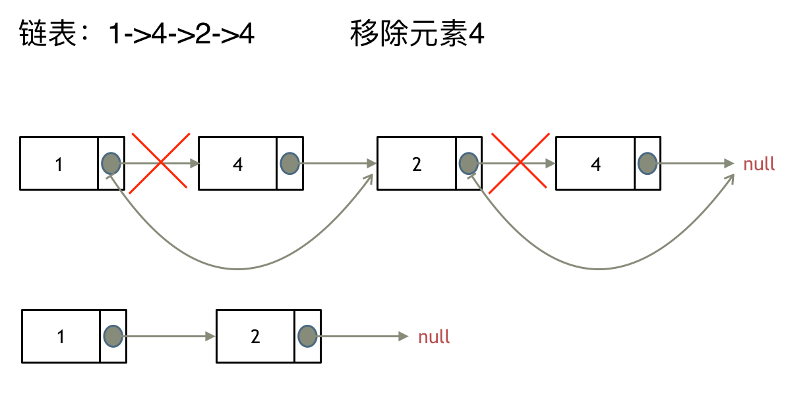
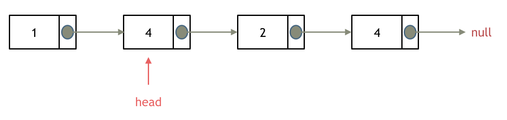
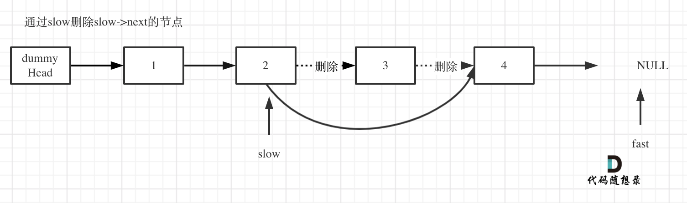

# LeetCode刷题笔记

***

- Tag顺序：数组-> 链表-> 哈希表->字符串->栈与队列->树->回溯->贪心->动态规划->图论->高级数据结构。先从简单刷起，做了几个类型题目之后，再慢慢做中等题目、困难题目。

- 兔子法：想一会儿想不出来就看答案

- 做算法题的技巧：

  - 先用固定的值对特定的例子完成求解。
  - 然后再将固定的值改为变化的值，从特定的例子推广到一般的例子，最终完成普遍意义上的求解。

  ---> **先静后动** 

## 数组

### 数组理论基础

- 首先要知道数组在内存中的存储方式，这样才能真正理解数组相关的面试题：

  - **数组是存放在连续内存空间上的相同类型数据的集合。** 
  - 数组可以方便的通过下标索引的方式获取到下标相对应的数据。

  注意：**数组下标都是从0开始的。** **数组内存空间的地址是连续的。** 

  - 正是**因为数组的在内存空间的地址是连续的，所以我们在删除或者增添元素的时候，就难免要移动其他元素的地址。** 

    例如删除下标为3的元素，需要对下标为3的元素后面的所有元素都要做移动操作，如图所示：

    

    **数组的元素是不能删的，只能覆盖。** 

### 1. 二分查找

#### 题目

- 给定一个 n 个元素有序的（升序）整型数组 nums 和一个目标值 target  ，写一个函数搜索 nums 中的 target，如果目标值存在返回下标，否则返回 -1。

  示例 1:

  ```
  输入: nums = [-1,0,3,5,9,12], target = 9     
  输出: 4       
  解释: 9 出现在 nums 中并且下标为 4     
  ```

  示例 2:

  ```
  输入: nums = [-1,0,3,5,9,12], target = 2     
  输出: -1        
  解释: 2 不存在 nums 中因此返回 -1     
  ```

  提示：

  - 你可以假设 nums 中的所有元素是不重复的。
  - n 将在 [1, 10000]之间。
  - nums 的每个元素都将在 [-9999, 9999]之间。

#### 思路

- **这道题目的前提是数组为有序数组**，同时题目还强调**数组中无重复元素**，因为一旦有重复元素，使用二分查找法返回的元素下标可能不是唯一的，这些都是使用二分法的前提条件。

  二分查找涉及的很多的边界条件，逻辑比较简单，但就是写不好。例如到底是 `while(left < right)` 还是 `while(left <= right)`，到底是`right = middle`呢，还是要`right = middle - 1`呢？

  大家写二分法经常写乱，主要是因为**对区间的定义没有想清楚，区间的定义就是不变量**。要在二分查找的过程中，保持不变量，就是在while寻找中每一次边界的处理都要坚持根据区间的定义来操作，这就是**循环不变量**规则。

- 我们定义 target 是在一个在左闭右闭的区间里，**也就是[left, right] （这个很重要非常重要）**。区间的定义就决定了二分法的代码应该如何写，**因为定义target在[left, right]区间，所以有如下两点：** 

  - while (left <= right) 要使用 <= ，因为left == right是有意义的，所以使用 <=
  - if (nums[middle] > target) right 要赋值为 middle - 1，因为当前这个nums[middle]一定不是target，那么接下来要查找的左区间结束下标位置就是 middle - 1

  代码如下：

  ```java
  class Solution {
      public int search(int[] nums, int target) {
          int left, right, middle;
          left = 0;
          right  = nums.length - 1;
          while(left <= right){
              middle = (left + right) / 2;
              if(nums[middle] == target){
                  return middle;
              }else if(nums[middle] < target){
                  left = middle + 1;
              }else{
                  right = middle - 1;
              }
          }
          return -1;
      }
  }
  ```

  - 时间复杂度：O(log n)
  - 空间复杂度：O(1)

### 2. 移除元素

#### 题目

- 给你一个数组 nums 和一个值 val，你需要 **原地** 移除所有数值等于 val 的元素，并返回移除后数组的新长度。

  不要使用额外的数组空间，你必须仅使用 O(1) 额外空间并 原地 修改输入数组。元素的顺序可以改变。你不需要考虑数组中超出新长度后面的元素。

  - 说明:

    为什么返回数值是整数，但输出的答案是数组呢?

    请注意，输入数组是以「引用」方式传递的，这意味着在函数里修改输入数组对于调用者是可见的。

    你可以想象内部操作如下:

    ```java
    // nums 是以“引用”方式传递的。也就是说，不对实参作任何拷贝
    int len = removeElement(nums, val);
    
    // 在函数里修改输入数组对于调用者是可见的。
    // 根据你的函数返回的长度, 它会打印出数组中 该长度范围内 的所有元素。
    for (int i = 0; i < len; i++) {
        print(nums[i]);
    }
    ```

  示例 1：

  ```
  输入：nums = [3,2,2,3], val = 3
  输出：2, nums = [2,2]
  解释：函数应该返回新的长度 2, 并且 nums 中的前两个元素均为 2。你不需要考虑数组中超出新长度后面的元素。例如，函数返回的新长度为 2 ，而 nums = [2,2,3,3] 或 nums = [2,2,0,0]，也会被视作正确答案。
  ```

   示例 2：

  ```
  输入：nums = [0,1,2,2,3,0,4,2], val = 2
  输出：5, nums = [0,1,4,0,3]
  解释：函数应该返回新的长度 5, 并且 nums 中的前五个元素为 0, 1, 3, 0, 4。注意这五个元素可为任意顺序。你不需要考虑数组中超出新长度后面的元素。
  ```

  提示：

  - `0 <= nums.length <= 100`
  - `0 <= nums[i] <= 50`
  - `0 <= val <= 100`

#### 思路

- 返回移除后数组的新长度很容易，**难点在于如何覆盖掉被移除的元素**？-> **双指针法** 

##### ★双指针法

- 双指针法（快慢指针法）： **通过一个快指针和慢指针在一个for循环下完成两个for循环的工作。** 

  定义快慢指针

  - **快指针**：寻找新数组的元素 ，新数组就是不含有目标元素的数组
  - **慢指针**：指向更新的新数组下标的位置

  **双指针法（快慢指针法）在数组和链表的操作中是非常常见的，很多考察数组、链表、字符串等操作的面试题，都使用双指针法。** 

- 利用双指针法实现元素覆盖：

  ```java
  class Solution {
      public int removeElement(int[] nums, int val) {
          int slowIndex = 0;
          for(int fastIndex = 0; fastIndex < nums.length; fastIndex++){
              if(nums[fastIndex] != val){
                  nums[slowIndex++] = nums[fastIndex];
              }
          }
          return slowIndex;
      }
  }
  ```

  - 时间复杂度：O(n)
  - 空间复杂度：O(1)

- 由于题目允许元素的顺序可以改变，所以可以用**相向双指针法**，以实现**移动最少的元素** 

  ```java
  class Solution {
      public int removeElement(int[] nums, int val) {
          int leftIndex = 0, rightIndex = nums.length - 1;
          while(leftIndex <= rightIndex){
              //如果nums[leftIndex]的值不等于要删除的元素的值
              if(nums[leftIndex] != val){
                  if(nums[rightIndex] != val){
                      leftIndex++;
                  }else{
                      rightIndex--;
                  }
              }else{	//如果nums[leftIndex]的值等于要删除的元素的值
                  if(nums[rightIndex] != val){
                      nums[leftIndex++] = nums[rightIndex--];
                  }else{
                      rightIndex--;
                  }
              }
          }
          return leftIndex;
      }
  }
  ```

  - 时间复杂度：O(n)
  - 空间复杂度：O(1)

### 3. 有序数组的平方

#### 题目

- 给你一个按 **非递减顺序** 排序的整数数组 `nums`，返回 **每个数字的平方** 组成的新数组，要求也按 **非递减顺序** 排序。

  **示例 1：** 

  ```
  输入：nums = [-4,-1,0,3,10]
  输出：[0,1,9,16,100]
  解释：平方后，数组变为 [16,1,0,9,100]
  排序后，数组变为 [0,1,9,16,100]
  ```

  **示例 2：** 

  ```
  输入：nums = [-7,-3,2,3,11]
  输出：[4,9,9,49,121]
  ```

  **提示：** 

  - `1 <= nums.length <= 10^4`
  - `-10^4 <= nums[i] <= 10^4`
  - `nums` 已按 **非递减顺序** 排序

#### 思路

- 依然使用双指针法。

- 数组其实是有序的， 只不过负数平方之后可能成为最大数了。

  那么**数组平方的最大值就在数组的两端，不是最左边就是最右边，不可能是中间**。

  此时可以考虑双指针法了，i 指向起始位置，j 指向终止位置。

- 定义一个新数组result，和A数组一样的大小，让 k 指向result数组终止位置。

  - 如果`A[i] * A[i] < A[j] * A[j]` 那么`result[k--] = A[j] * A[j];` 。
  - 如果`A[i] * A[i] >= A[j] * A[j]` 那么`result[k--] = A[i] * A[i];` 。

  代码如下：

  ```java
  class Solution {
      public int[] sortedSquares(int[] nums) {
          int[] newNums = new int[nums.length];
          int k = newNums.length - 1;     //令k指向newNums数组的最后一个位置
          int leftIndex = 0, rightIndex = nums.length - 1;
          while(k >= 0){
              if(nums[leftIndex] * nums[leftIndex] < nums[rightIndex] * nums[rightIndex]){
                  newNums[k--] = nums[rightIndex] * nums[rightIndex];
                  rightIndex--;
              }else{
                  newNums[k--] = nums[leftIndex] * nums[leftIndex];
                  leftIndex++;
              }
          }
          return newNums;
      }
  }
  ```
  
  - 时间复杂度：O(n)
  - 空间复杂度：O(n)

### 4. 长度最小的子数组

#### 题目

- 给定一个含有 `n` 个正整数的数组和一个正整数 `target` 。找出该数组中满足其和 ≥ target 的长度最小的 连续子数组 [nums~i~, nums~i+1~, ..., nums~r-1~, nums~r~] ，并返回其长度。如果不存在符合条件的子数组，返回 0。

  **示例 1：**

  ```
  输入：target = 7, nums = [2,3,1,2,4,3]
  输出：2
  解释：子数组 [4,3] 是该条件下的长度最小的子数组。
  ```

  **示例 2：**

  ```
  输入：target = 4, nums = [1,4,4]
  输出：1
  ```

  **示例 3：**

  ```
  输入：target = 11, nums = [1,1,1,1,1,1,1,1]
  输出：0
  ```

  **提示：**

  - `1 <= target <= 10^9`
  - `1 <= nums.length <= 10^5`
  - `1 <= nums[i] <= 10^5`

#### 思路

##### ★滑动窗口

- 所谓滑动窗口，**就是不断的调节子序列的起始位置和终止位置，从而得出我们要想的结果**。

  在暴力解法中，是一个for循环滑动窗口的起始位置，一个for循环为滑动窗口的终止位置，用两个 for 循环 完成了一个不断搜索区间的过程。

  那么滑动窗口如何用一个for循环来完成这个操作呢？

- 首先要思考 如果用一个for循环，那么应该表示 滑动窗口的起始位置，还是终止位置。

  - 如果只用一个for循环来表示 滑动窗口的起始位置，那么如何遍历剩下的终止位置？

    此时难免再次陷入 暴力解法的怪圈。

  - 所以 **只用一个for循环，那么这个循环的索引，一定是表示 滑动窗口的终止位置**。

    那么问题来了， 滑动窗口的起始位置如何移动呢？

  在本题中实现滑动窗口，主要确定如下三点：

  1. 窗口内是什么？
  2. 如何移动窗口的起始位置？
  3. 如何移动窗口的结束位置？

- 窗口就是 满足其和 ≥ s 的长度最小的 连续 子数组。

  窗口的起始位置如何移动：如果当前窗口的值大于 s 了，窗口就要向前移动了（也就是该缩小了）。

  窗口的结束位置如何移动：**窗口的结束位置**就是遍历数组的指针，也就是**for循环里的索引**。

  解题的关键在于 **窗口的起始位置如何移动**，如图所示：

  

  可以发现**滑动窗口的精妙之处在于根据当前子序列和大小的情况，不断调节子序列的起始位置。从而将O(n^2)暴力解法降为O(n)。** 

  代码如下：

  ```java
  class Solution {
      public int minSubArrayLen(int target, int[] nums) {
          int sum, result, subArrayLen;    
          int leftIndex;  //滑动窗口起始位置
          leftIndex = sum = 0;  
          result = Integer.MAX_VALUE;
          for(int rightIndex = 0; rightIndex < nums.length; rightIndex++){
              sum += nums[rightIndex];
              while(sum >= target){
                  subArrayLen = rightIndex - leftIndex + 1;
                  result = subArrayLen < result ? subArrayLen : result;
                  sum -= nums[leftIndex++];   //滑动窗口起始位置向前移动
              }
          }
          return result == Integer.MAX_VALUE ? 0 : result;
      }
  }
  ```
  
  - 时间复杂度：O(n)
  - 空间复杂度：O(1)


### 5. 螺旋矩阵Ⅱ

#### 题目

- 给你一个正整数 `n` ，生成一个包含 `1` 到 `n^2` 所有元素，且元素按顺时针顺序螺旋排列的 `n x n` 正方形矩阵 `matrix` 。

  **示例 1：**

  ```
  输入：n = 3
  输出：[[1,2,3],[8,9,4],[7,6,5]]
  ```

  

  **示例 2：**

  ```
  输入：n = 1
  输出：[[1]]
  ```

  **提示：**

  - `1 <= n <= 20` 

#### 思路

- 求解本题要坚持**循环不变量原则**。

  模拟顺时针画矩阵的过程：

  - 填充上行从左到右
  - 填充右列从上到下
  - 填充下行从右到左
  - 填充左列从下到上

  由外向内一圈一圈这么画下去。这里一圈下来，我们要画每四条边，这四条边怎么画，每画一条边都要坚持一致的左闭右开，或者左开右闭的原则，这样这一圈才能按照统一的规则画下来。

  那么我按照**左闭右开的原则**，来画一圈，大家看一下：

  

  这里每一种颜色，代表一条边，我们遍历的长度，可以看出每一个拐角处的处理规则，拐角处让给新的一条边来继续画。这也是坚持了每条边左闭右开的原则。

  代码如下：

  ```java
  class Solution {
      public int[][] generateMatrix(int n) {
          int num = 0;    //矩阵中填入的数字
          int[][] matrix = new int[n][n];
          int start = 0;  //每一圈循环开始的点(start,start)
          int loop = 0;   //循环的圈数
          int i, j;		//i指代行下标，j指代列下标
          while (loop < n / 2) {
              for(j = start; j < n - loop - 1; j++){
                  matrix[start][j] = ++num;
              }
              for(i = start; i < n - loop - 1; i++){
                  matrix[i][j] = ++num;
              }
              for(; j > loop; j--){
                  matrix[i][j] = ++num;
              }
              for(; i > loop; i--){
                  matrix[i][j] = ++num;
              }
              start++;    //循环开始的点的更新
              loop++;     //已经循环了一圈
          }
          //当n为奇数时，处理矩阵中间的那个单元块
          if(n % 2 == 1){
              matrix[loop][loop] = ++num;
          }
          return matrix;
      }
  }
  ```

  - 时间复杂度 O(n^2): 模拟遍历二维矩阵的时间
  - 空间复杂度 O(1)

### 总结篇

- 数组是非常基础的数据结构，在面试中，考察数组的题目一般在思维上都不难，主要是考察对代码的掌控能力。也就是说，想法很简单，但实现起来 可能就不是那么回事了。

- 首先要知道数组在内存中的存储方式，这样才能真正理解数组相关的面试题。

  **数组是存放在连续内存空间上的相同类型数据的集合。** 数组可以方便的通过下标索引的方式获取到下标下对应的数据。

  需要两点注意的是：

  - **数组下标都是从0开始的。**
  - **数组内存空间的地址是连续的**

  正是**因为数组的在内存空间的地址是连续的，所以我们在删除或者增添元素的时候，就难免要移动其他元素的地址。** 

  **数组的元素是不能删的，只能覆盖。** 


## 链表

### 链表理论基础

- 什么是链表，链表是一种通过指针串联在一起的线性结构，**每一个节点由两部分组成，一个是数据域一个是指针域**（存放指向下一个节点的指针），最后一个节点的指针域指向null（空指针的意思）。

  链表的入口节点称为链表的头结点也就是head。

  

#### 链表的类型

- 单链表：即为前面的图，单链表中的指针域只能指向节点的下一个节点。

- 双链表：每一个节点有两个指针域，一个指向下一个节点，一个指向上一个节点。双链表 既可以向前查询也可以向后查询。

  

- 循环链表：顾名思义，就是链表首尾相连。循环链表可以用来解决约瑟夫环问题。

  

#### 链表的存储方式

- 了解完链表的类型，再来说一说链表在内存中的存储方式。

  **数组是在内存中是连续分布的，但是链表在内存中可不是连续分布的**。链表是通过指针域的指针链接在内存中各个节点。所以链表中的节点在内存中不是连续分布的 ，而是散乱分布在内存中的某地址上，分配机制取决于操作系统的内存管理。

  如图所示：

  

  这个链表起始节点为2， 终止节点为7， 各个节点分布在内存的不同地址空间上，通过指针串联在一起。

#### 链表的定义

- 接下来说一说链表的定义。链表节点的定义，很多同学在面试的时候都写不好。这是因为平时在刷leetcode的时候，链表的节点都默认定义好了，直接用就行了，所以同学们都没有注意到链表的节点是如何定义的。而在面试的时候，一旦要自己手写链表，就写的错漏百出。

  ```java
  public class ListNode {
      // 结点的值
      int val;
  
      // 下一个结点
      ListNode next;
  
      // 节点的构造函数(无参)
      public ListNode() {
      }
  
      // 节点的构造函数(有一个参数)
      public ListNode(int val) {
          this.val = val;
      }
  
      // 节点的构造函数(有两个参数)
      public ListNode(int val, ListNode next) {
          this.val = val;
          this.next = next;
      }
  }
  ```

#### 链表的操作

##### 删除节点

- 删除D节点，如图所示：

  

  只要将C节点的next指针指向E节点就可以了。

  那有同学说了，D节点不是依然存留在内存里么？只不过是没有在这个链表里而已。

  是这样的，所以在C++里最好是再手动释放这个D节点，释放这块内存。

  其他语言例如Java、Python，就有自己的内存回收机制，就不用自己手动释放了。

##### 添加节点

- 添加F节点，如图所示：

  

  可以看出链表的增添和删除都是O(1)操作，也不会影响到其他节点。

  但是要注意，要是删除第五个节点，需要从头节点查找到第四个节点通过next指针进行删除操作，**查找的时间复杂度是O(n)**。

#### 性能分析

- 再把链表的特性和数组的特性进行一个对比，如图所示：

  

  数组在定义的时候，长度就是固定的，如果想改动数组的长度，就需要重新定义一个新的数组。

  链表的长度可以是不固定的，并且可以动态增删， 适合数据量不固定，频繁增删，较少查询的场景。

### 1. 移除链表元素

#### 题目

- 给你一个链表的头节点 `head` 和一个整数 `val` ，请你删除链表中所有满足 `Node.val == val` 的节点，并返回 **新的头节点** 。

  **示例 1：**

  ```
  输入：head = [1,2,6,3,4,5,6], val = 6
  输出：[1,2,3,4,5]
  ```

  **示例 2：**

  ```
  输入：head = [], val = 1
  输出：[]
  ```

  **示例 3：**

  ```
  输入：head = [7,7,7,7], val = 7
  输出：[]
  ```

  **提示：**

  - 列表中的节点数目在范围 `[0, 104]` 内
  - `1 <= Node.val <= 50`
  - `0 <= val <= 50`

#### 思路

- 一般情况下，如果当前节点是要删除的节点，那么**让当前节点的前一个节点的next指针直接指向当前节点的下一个节点**即可。

  

  但是如果头节点是要删除的节点，就可以有两种方式对链表进行操作：

  1. **直接使用原来的链表来进行删除操作。**
  2. **设置一个虚拟头结点再进行删除操作。**

- 方式1：直接使用原来的链表来进行删除操作。

  - 该方式需要增加一段业务逻辑：

    移除头结点和移除其他节点的操作是不一样的，因为链表的其他节点都是**通过前一个节点来移除当前节点**，而头结点没有前一个节点。

    所以头结点如何移除呢，其实只要**将头结点向后移动一位**就可以，这样就从链表中移除了一个头结点。

    

    

  代码如下：

  ```java
  /**
   * Definition for singly-linked list.
   * public class ListNode {
   * int val;
   * ListNode next;
   * ListNode() {}
   * ListNode(int val) { this.val = val; }
   * ListNode(int val, ListNode next) { this.val = val; this.next = next; }
   * }
   */
  class Solution {
      public ListNode removeElements(ListNode head, int val) {
          //移除头节点
          while (head != null && head.val == val) {
              head = head.next;
          }
          if (head == null) {
              return null;
          }
          ListNode pre = head;
          ListNode cur = head.next;
          while (cur != null) {
              if (cur.val == val) {
                  pre.next = cur.next;
              } else {
                  pre = cur;
              }
              cur = cur.next;
          }
          return head;
      }
  }
  ```

##### ★虚拟头节点

- 方式2：设置一个**虚拟头结点**再进行删除操作。

  - 这种方式的好处是将删除头节点这种特殊的情况转变为一般的情况，让我们可以以一种统一的逻辑来移除链表的节点。

    

    最后记得在题目中，return 头结点的时候，别忘了 `return dummyHead.next;`， 这才是新的头结点。

  代码如下：

  ```java
  /**
   * Definition for singly-linked list.
   * public class ListNode {
   * int val;
   * ListNode next;
   * ListNode() {}
   * ListNode(int val) { this.val = val; }
   * ListNode(int val, ListNode next) { this.val = val; this.next = next; }
   * }
   */
  class Solution {
      public ListNode removeElements(ListNode head, int val) {
          if (head == null) {
              return null;
          }
          //添加虚拟头节点
          ListNode dummyHead = new ListNode(-1, head);
          ListNode pre = dummyHead;
          ListNode cur = head;
          while (cur != null) {
              if (cur.val == val) {
                  pre.next = cur.next;
              } else {
                  pre = cur;
              }
              cur = cur.next;
          }
          return dummyHead.next;
      }
  }
  ```

### 2.设计链表

#### 题目

- 你可以选择使用单链表或者双链表，设计并实现自己的链表。

  单链表中的节点应该具备两个属性：`val` 和 `next` 。`val` 是当前节点的值，`next` 是指向下一个节点的指针/引用。

  如果是双向链表，则还需要属性 `prev` 以指示链表中的上一个节点。假设链表中的所有节点下标从 **0** 开始。

- 实现 `MyLinkedList` 类：

  - `MyLinkedList()` 初始化 `MyLinkedList` 对象。
  - `int get(int index)` 获取链表中下标为 `index` 的节点的值。如果下标无效，则返回 `-1` 。
  - `void addAtHead(int val)` 将一个值为 `val` 的节点插入到链表中第一个元素之前。在插入完成后，新节点会成为链表的第一个节点。
  - `void addAtTail(int val)` 将一个值为 `val` 的节点追加到链表中作为链表的最后一个元素。
  - `void addAtIndex(int index, int val)` 将一个值为 `val` 的节点插入到链表中下标为 `index` 的节点之前。如果 `index` 等于链表的长度，那么该节点会被追加到链表的末尾。如果 `index` 比长度更大，该节点将 **不会插入** 到链表中。
  - `void deleteAtIndex(int index)` 如果下标有效，则删除链表中下标为 `index` 的节点。

  **示例：**

  ```
  输入
  ["MyLinkedList", "addAtHead", "addAtTail", "addAtIndex", "get", "deleteAtIndex", "get"]
  [[], [1], [3], [1, 2], [1], [1], [1]]
  输出
  [null, null, null, null, 2, null, 3]
  
  解释
  MyLinkedList myLinkedList = new MyLinkedList();
  myLinkedList.addAtHead(1);
  myLinkedList.addAtTail(3);
  myLinkedList.addAtIndex(1, 2);    // 链表变为 1->2->3
  myLinkedList.get(1);              // 返回 2
  myLinkedList.deleteAtIndex(1);    // 现在，链表变为 1->3
  myLinkedList.get(1);              // 返回 3
  ```

  **提示：**

  - `0 <= index, val <= 1000`
  - 请不要使用内置的 LinkedList 库。
  - 调用 `get`、`addAtHead`、`addAtTail`、`addAtIndex` 和 `deleteAtIndex` 的次数不超过 `2000` 。

#### 思路

- 单链表实现：

  ```java
  //单链表
  class ListNode {
      int val;
      ListNode next;
  
      public ListNode() {
  
      }
  
      public ListNode(int val) {
          this.val = val;
      }
  
      public ListNode(int val, ListNode next) {
          this.val = val;
          this.next = next;
      }
  }
  
  class MyLinkedList {
      //链表中元素的个数
      int size;
      //虚拟头节点
      ListNode dummyHead;
  
      //初始化链表
      public MyLinkedList() {
          size = 0;
          dummyHead = new ListNode(-1, null);
      }
  
      public int get(int index) {
          if (index < 0 || index >= size) {
              return -1;
          }
          ListNode cur = dummyHead.next;
          for (int i = 0; i < index; i++) {
              cur = cur.next;
          }
          return cur.val;
      }
  
      public void addAtHead(int val) {
          addAtIndex(0, val);
      }
  
      public void addAtTail(int val) {
          addAtIndex(size, val);
      }
  
      public void addAtIndex(int index, int val) {
          if (index < 0 || index > size) {
              return;
          }
          ListNode pre = dummyHead;
          ListNode cur = dummyHead.next;
          for (int i = 0; i < index; i++) {
              pre = cur;
              cur = cur.next;
          }
          ListNode node = new ListNode(val);
          pre.next = node;
          node.next = cur;
          size++;
      }
  
      public void deleteAtIndex(int index) {
          if (index < 0 || index >= size) {
              return;
          }
          ListNode pre = dummyHead;
          ListNode cur = dummyHead.next;
          for (int i = 0; i < index; i++) {
              pre = cur;
              cur = cur.next;
          }
          pre.next = cur.next;
          size--;
      }
  }
  
  /**
   * Your MyLinkedList object will be instantiated and called as such:
   * MyLinkedList obj = new MyLinkedList();
   * int param_1 = obj.get(index);
   * obj.addAtHead(val);
   * obj.addAtTail(val);
   * obj.addAtIndex(index,val);
   * obj.deleteAtIndex(index);
   */
  ```

  **抓住核心：`index` 指向的是要处理的节点**。

- 双链表实现：

  ```java
  //双链表
  class ListNode {
      int val;
      ListNode next, prev;
  
      public ListNode() {
      }
  
      public ListNode(int val) {
          this.val = val;
      }
  
      public ListNode(int val, ListNode prev, ListNode next) {
          this.val = val;
          this.prev = prev;
          this.next = next;
      }
  }
  
  class MyLinkedList {
      //链表中元素的个数
      int size;
      //虚拟头节点
      ListNode dummyHead, dummyTail;
  
      //初始化链表
      public MyLinkedList() {
          size = 0;
          dummyHead = new ListNode(-1);
          dummyTail = new ListNode(-1, dummyHead, null);
          dummyHead.prev = null;
          dummyHead.next = dummyTail;
      }
  
      public int get(int index) {
          if (index < 0 || index >= size) {
              return -1;
          }
          ListNode cur;
          //判断哪一边遍历的时间更短
          if (index <= size / 2) {
              cur = dummyHead.next;
              for (int i = 0; i < index; i++) {
                  cur = cur.next;
              }
          } else {
              cur = dummyTail.prev;
              for (int i = size - 1; i > index; i--) {
                  cur = cur.prev;
              }
          }
          return cur.val;
      }
  
      public void addAtHead(int val) {
          addAtIndex(0, val);
      }
  
      public void addAtTail(int val) {
          addAtIndex(size, val);
      }
  
      public void addAtIndex(int index, int val) {
          if (index < 0 || index > size) {
              return;
          }
          ListNode pre = dummyHead;
          ListNode cur = dummyHead.next;
          for (int i = 0; i < index; i++) {
              pre = cur;
              cur = cur.next;
          }
          ListNode node = new ListNode(val);
          pre.next = node;
          node.prev = pre;
          node.next = cur;
          cur.prev = node;
          size++;
      }
  
      public void deleteAtIndex(int index) {
          if (index < 0 || index >= size) {
              return;
          }
          ListNode pre = dummyHead;
          ListNode cur = dummyHead.next;
          for (int i = 0; i < index; i++) {
              pre = cur;
              cur = cur.next;
          }
          pre.next = cur.next;
          cur.next.prev = pre;
          size--;
      }
  }
  
  /**
   * Your MyLinkedList object will be instantiated and called as such:
   * MyLinkedList obj = new MyLinkedList();
   * int param_1 = obj.get(index);
   * obj.addAtHead(val);
   * obj.addAtTail(val);
   * obj.addAtIndex(index,val);
   * obj.deleteAtIndex(index);
   */
  ```

### 3.★反转链表

#### 题目

- 给你单链表的头节点 `head` ，请你反转链表，并返回反转后的链表。

  **示例 1：**

  

  ```
  输入：head = [1,2,3,4,5]
  输出：[5,4,3,2,1]
  ```

  **示例 2：**

  

  ```
  输入：head = [1,2]
  输出：[2,1]
  ```

  **示例 3：**

  ```
  输入：head = []
  输出：[]
  ```

  **提示：**

  - 链表中节点的数目范围是 `[0, 5000]`
  - `-5000 <= Node.val <= 5000`

#### 思路

- 首先定义一个`cur`指针，指向头结点，再定义一个`pre`指针，初始化为`null`。

  然后就要开始反转了，**首先要把 `cur.next` 节点用`tmp`指针保存一下**，也就是保存一下这个节点。

  为什么要保存一下这个节点呢，因为接下来要改变 `cur.next` 的指向了，将 `cur.next` 指向 `pre` ，此时已经反转了第一个节点了，为了让 `cur` 能指向下一个要反转的节点，就要用 `tmp` 保存这个节点。

  接下来，就是循环走如下代码逻辑了，继续移动`pre`和`cur`指针。

  最后，`cur` 指针已经指向了`null`，循环结束，链表也反转完毕了。 此时我们`return pre`指针就可以了，`pre`指针就指向了新的头结点。

  ```java
  /**
   * Definition for singly-linked list.
   * public class ListNode {
   *     int val;
   *     ListNode next;
   *     ListNode() {}
   *     ListNode(int val) { this.val = val; }
   *     ListNode(int val, ListNode next) { this.val = val; this.next = next; }
   * }
   */
  //双指针法
  class Solution {
      public ListNode reverseList(ListNode head) {
          ListNode pre, cur, tmp;
          pre = null;
          cur = head;
          tmp = null;
          while (cur != null) {
              //用 tmp 先保存当前节点的下一个节点
              tmp = cur.next;
              cur.next = pre;
              pre = cur;
              cur = tmp;
          }
          return pre;
      }
  }
  ```

- 还有一种递归的方法（核心思想和前面的迭代法是一样的）：

  ```java
  /**
   * Definition for singly-linked list.
   * public class ListNode {
   *     int val;
   *     ListNode next;
   *     ListNode() {}
   *     ListNode(int val) { this.val = val; }
   *     ListNode(int val, ListNode next) { this.val = val; this.next = next; }
   * }
   */
   //递归法
  class Solution {
      public ListNode reverseList(ListNode head) {
          return reverse(null, head);
      }
  
      private ListNode reverse(ListNode prev, ListNode cur) {
          if (cur == null) {
              return prev;    //返回反转以后的头指针
          }
          ListNode tmp = cur.next;
          cur.next = prev;
          return reverse(cur, tmp);
      }
  }
  ```

### 4.两两交换链表中的节点

#### 题目

- 给你一个链表，两两交换其中相邻的节点，并返回交换后链表的头节点。你必须在不修改节点内部的值的情况下完成本题（即，只能进行节点交换）。

  **示例 1：**

  

  ```
  输入：head = [1,2,3,4]
  输出：[2,1,4,3]
  ```

  **示例 2：**

  ```
  输入：head = []
  输出：[]
  ```

  **示例 3：**

  ```
  输入：head = [1]
  输出：[1]
  ```

  **提示：**

  - 链表中节点的数目在范围 `[0, 100]` 内
  - `0 <= Node.val <= 100`

#### 思路

- 建议使用虚拟头结点，这样会方便很多，要不然每次针对头结点（没有前一个指针指向头结点），还要单独处理。

  接下来就是交换相邻两个元素了，**此时一定要画图，不画图，操作多个指针很容易乱，而且要注意操作的先后顺序**：

  - 初始时，`cur`指向虚拟头结点，然后进行如下三步：

    

    操作之后，链表如下：

    

  如此循环往复即可。

  ```java
  /**
   * Definition for singly-linked list.
   * public class ListNode {
   *     int val;
   *     ListNode next;
   *     ListNode() {}
   *     ListNode(int val) { this.val = val; }
   *     ListNode(int val, ListNode next) { this.val = val; this.next = next; }
   * }
   */
  class Solution {
      public ListNode swapPairs(ListNode head) {
          ListNode dummyHead = new ListNode(-1, head); //虚拟头节点
          ListNode cur, firstNode, secondNode;
          ListNode tmp;   //临时节点用来保存要交换的两个节点的再下一个节点
          cur = dummyHead;
          while (cur.next != null && cur.next.next != null) {
              firstNode = cur.next;
              secondNode = firstNode.next;
              tmp = secondNode.next;
              cur.next = secondNode;          //步骤1
              secondNode.next = firstNode;    //步骤2
              firstNode.next = tmp;           //步骤3
              cur = firstNode;
          }
          return dummyHead.next;
      }
  }
  ```

### 5.删除链表的倒数第N个节点

#### 题目

- 给你一个链表，删除链表的倒数第 `n` 个结点，并且返回链表的头结点。

   

  **示例 1：**

  

  ```
  输入：head = [1,2,3,4,5], n = 2
  输出：[1,2,3,5]
  ```

  **示例 2：**

  ```
  输入：head = [1], n = 1
  输出：[]
  ```

  **示例 3：**

  ```
  输入：head = [1,2], n = 1
  输出：[1]
  ```

  **提示：**

  - 链表中结点的数目为 `sz`
  - `1 <= sz <= 30`
  - `0 <= Node.val <= 100`
  - `1 <= n <= sz`

#### 思路

- 很直观的想法：先遍历一遍得到链表的长度 `sz`，然后从链表头节点开始向后找到第 `sz-n` 个节点，就是要删除的倒数第 `n` 个节点。

  考虑到有可能删除的是倒数第 `sz` 个节点，即头节点，所以添加一个虚拟头节点。

  ```java
  /**
   * Definition for singly-linked list.
   * public class ListNode {
   *     int val;
   *     ListNode next;
   *     ListNode() {}
   *     ListNode(int val) { this.val = val; }
   *     ListNode(int val, ListNode next) { this.val = val; this.next = next; }
   * }
   */
  class Solution {
      public ListNode removeNthFromEnd(ListNode head, int n) {
          //添加虚拟头节点
          ListNode dummyHead = new ListNode(-1, head);
          ListNode pre, cur;
          //计算链表节点数
          int sz = 0;
          cur = head;
          while (cur != null) {
              sz++;
              cur = cur.next;
          }
          pre = dummyHead;
          for (int i = 0; i < sz - n; i++) {
              pre = pre.next;
          }
          cur = pre.next;	//cur指向的是要删除的节点
          pre.next = cur.next;
          return dummyHead.next;
      }
  }
  ```

##### 虚拟头节点+双指针

- **进阶：**你能尝试使用一趟扫描实现吗？

  若要使用一趟扫描实现，可以用到双指针。如果要删除倒数第 `n` 个节点，让 `fast` 移动 `n` 步，然后让 `fast` 和 `slow` 同时移动，直到 `fast` 指向链表末尾。删掉 `slow` 所指向的节点就可以了。

  1. 定义 `fast` 指针和 `slow` 指针，初始值为虚拟头结点，如图：

     

  2. `fast` 首先走 `n + 1` 步 ，为什么是 `n + 1` 呢，因为只有这样同时移动的时候 `slow` 才能指向删除节点的上一个节点（方便做删除操作），如图：

     

     让 `slow` 指向要删除节点的上一个节点（方便删除）。

  3. `fast` 和 `slow` 同时移动，直到 `fast` 指向末尾，如图：

     

  4. 删除 `slow` 指向的下一个节点，如图：

     

  ```java
  /**
   * Definition for singly-linked list.
   * public class ListNode {
   *     int val;
   *     ListNode next;
   *     ListNode() {}
   *     ListNode(int val) { this.val = val; }
   *     ListNode(int val, ListNode next) { this.val = val; this.next = next; }
   * }
   */
  class Solution {
      public ListNode removeNthFromEnd(ListNode head, int n) {
          //添加虚拟头节点
          ListNode dummyHead = new ListNode(-1, head);
          //快慢指针
          ListNode fastIndex, slowIndex;
          fastIndex = dummyHead;
          slowIndex = dummyHead;
          for (int i = 0; i <= n; i++) {  //让 fastIndex 向后移动 n+1 步
              fastIndex = fastIndex.next;
          }
          while (fastIndex != null) {
              fastIndex = fastIndex.next;
              slowIndex = slowIndex.next;
          }
          //此时 slowIndex 指向的是要删除节点的前一个节点
          slowIndex.next = slowIndex.next.next;
          return dummyHead.next;
      }
  }
  ```

### 6.链表相交

#### 题目

- 给你两个单链表的头节点 `headA` 和 `headB` ，请你找出并返回两个单链表相交的起始节点。如果两个链表没有交点，返回 `null` 。

  图示两个链表在节点 `c1` 开始相交**：**

  [](https://assets.leetcode-cn.com/aliyun-lc-upload/uploads/2018/12/14/160_statement.png)

  题目数据 **保证** 整个链式结构中不存在环。

  **注意**，函数返回结果后，链表必须 **保持其原始结构** 。

  **示例 1：**

  [](https://assets.leetcode.com/uploads/2018/12/13/160_example_1.png)

  ```
  输入：intersectVal = 8, listA = [4,1,8,4,5], listB = [5,0,1,8,4,5], skipA = 2, skipB = 3
  输出：Intersected at '8'
  解释：相交节点的值为 8 （注意，如果两个链表相交则不能为 0）。
  从各自的表头开始算起，链表 A 为 [4,1,8,4,5]，链表 B 为 [5,0,1,8,4,5]。
  在 A 中，相交节点前有 2 个节点；在 B 中，相交节点前有 3 个节点。
  ```

  **示例 2：**

  [](https://assets.leetcode.com/uploads/2018/12/13/160_example_2.png)

  ```
  输入：intersectVal = 2, listA = [0,9,1,2,4], listB = [3,2,4], skipA = 3, skipB = 1
  输出：Intersected at '2'
  解释：相交节点的值为 2 （注意，如果两个链表相交则不能为 0）。
  从各自的表头开始算起，链表 A 为 [0,9,1,2,4]，链表 B 为 [3,2,4]。
  在 A 中，相交节点前有 3 个节点；在 B 中，相交节点前有 1 个节点。
  ```

  **示例 3：**

  [](https://assets.leetcode.com/uploads/2018/12/13/160_example_3.png)

  ```
  输入：intersectVal = 0, listA = [2,6,4], listB = [1,5], skipA = 3, skipB = 2
  输出：null
  解释：从各自的表头开始算起，链表 A 为 [2,6,4]，链表 B 为 [1,5]。
  由于这两个链表不相交，所以 intersectVal 必须为 0，而 skipA 和 skipB 可以是任意值。
  这两个链表不相交，因此返回 null 。
  ```

  **提示：**

  - `listA` 中节点数目为 `m`
  - `listB` 中节点数目为 `n`
  - `0 <= m, n <= 3 * 104`
  - `1 <= Node.val <= 105`
  - `0 <= skipA <= m`
  - `0 <= skipB <= n`
  - 如果 `listA` 和 `listB` 没有交点，`intersectVal` 为 `0`
  - 如果 `listA` 和 `listB` 有交点，`intersectVal == listA[skipA + 1] == listB[skipB + 1]`

#### 思路

- 简单来说，就是求两个链表交点节点的指针。 这里同学们要注意，**交点不是数值相等，而是指针相等**。

- 直观的思路：对 `listA` 中的每一个节点，在 `listB` 中都遍历一遍，看看该节点是否在 `listB` 中，若是，则该节点就是链表相交的初始节点。

  如果遍历完 `listA` 都没有节点在 `listB` 中，则这两条链表不相交。

  ```java
  /**
   * Definition for singly-linked list.
   * public class ListNode {
   *     int val;
   *     ListNode next;
   *     ListNode(int x) {
   *         val = x;
   *         next = null;
   *     }
   * }
   */
  public class Solution {
      public ListNode getIntersectionNode(ListNode headA, ListNode headB) {
          ListNode ANode = headA;
          ListNode BNode = headB;
          while (ANode != null) {
              while (BNode != ANode && BNode != null) {
                  BNode = BNode.next;
              }
              if (BNode != null) {
                  return BNode;
              }
              ANode = ANode.next;
              BNode = headB;
          }
          return null;
      }
  }
  ```

  - 时间复杂度：`O(m * n)` 
  - 空间复杂度：`O(1)` 

- **进阶：**你能否设计一个时间复杂度 `O(n)` 、仅用 `O(1)` 内存的解决方案？

  - 如果两条链表相交，则从相交点之后两个链表的节点都是一样的、Y字形，所以直接**让长链表从后面部分的节点开始和短链表进行比较，因为交点只可能出现在这段区域**。如下图所示：

    

  ```java
  /**
   * Definition for singly-linked list.
   * public class ListNode {
   *     int val;
   *     ListNode next;
   *     ListNode(int x) {
   *         val = x;
   *         next = null;
   *     }
   * }
   */
  public class Solution {
      public ListNode getIntersectionNode(ListNode headA, ListNode headB) {
          ListNode curA, curB;
          int lenA, lenB, offset;
          curA = headA;
          curB = headB;
          lenA = lenB = 0;
          //得到链表A的长度
          while (curA != null) {
              lenA++;
              curA = curA.next;
          }
          //得到链表B的长度
          while (curB != null) {
              lenB++;
              curB = curB.next;
          }
          //让curA指向长链表的头节点, curB指向短链表的头节点
          if (lenA >= lenB) {
              curA = headA;
              curB = headB;
              offset = lenA - lenB;
          }else {
              curA = headB;
              curB = headA;
              offset = lenB - lenA;
          }
          //从长链表的后面部分开始比较
          for (int i = 0; i < offset; i++) {
              curA = curA.next;
          }
          while (curA != null) {
              if (curA == curB) {
                  return curA;
              }
              curA = curA.next;
              curB = curB.next;
          }
          return null;
      }
  }
  ```

### 7.★环形链表

#### 题目

- 给定一个链表的头节点  `head` ，返回链表开始入环的第一个节点。 如果链表无环，则返回 `null`。

  如果链表中有某个节点，可以通过连续跟踪 `next` 指针再次到达，则链表中存在环。 为了表示给定链表中的环，评测系统内部使用整数 `pos` 来表示链表尾连接到链表中的位置（**索引从 0 开始**）。如果 `pos` 是 `-1`，则在该链表中没有环。**注意：`pos` 不作为参数进行传递**，仅仅是为了标识链表的实际情况。

  **不允许修改** 链表。

  **示例 1：**

  

  ```
  输入：head = [3,2,0,-4], pos = 1
  输出：返回索引为 1 的链表节点
  解释：链表中有一个环，其尾部连接到第二个节点。
  ```

  **示例 2：**

  

  ```
  输入：head = [1,2], pos = 0
  输出：返回索引为 0 的链表节点
  解释：链表中有一个环，其尾部连接到第一个节点。
  ```

  **示例 3：**

  

  ```
  输入：head = [1], pos = -1
  输出：返回 null
  解释：链表中没有环。
  ```

  **提示：**

  - 链表中节点的数目范围在范围 `[0, 104]` 内
  - `-105 <= Node.val <= 105`
  - `pos` 的值为 `-1` 或者链表中的一个有效索引

#### 思路

- 主要考察两个知识点：
  - 判断链表是否有环
  - 如果有环，如何找到这个环的入口

##### ★判断链表是否有环

###### 快慢指针法

- 可以使用**快慢指针法**，分别定义 `fast` 和 `slow` 指针，从头结点出发，`fast` 指针每次移动两个节点，`slow` 指针每次移动一个节点，如果 `fast` 和 `slow`指针在途中相遇 ，说明这个链表有环。

  为什么 `fast` 走两个节点，`slow` 走一个节点，有环的话，一定会在环内相遇呢，而不是永远的错开呢？

  - 首先第一点：`fast` 指针一定先进入环中，如果 `fast` 指针和 `slow` 指针相遇的话，一定是在环中相遇，这是毋庸置疑的。
  - 其次，因为 `fast` 是走两步，`slow` 是走一步，**其实相对于 `slow` 来说，`fast` 是一个节点一个节点的靠近 `slow` 的，所以 `fast` 一定可以和 `slow` 重合**。

##### 如果有环，如何找到这个环的入口

- 假设从头节点到环形入口节点的节点数为 `x`，环形入口节点到 `fast` 指针与 `slow` 指针相遇节点的节点数为 `y`，从相遇节点再到环形入口节点节点数为 `z`。 如图所示：

  

  - 那么相遇时： `slow` 指针走过的节点数为：`x + y`， `fast` 指针走过的节点数：`x + y + n (y + z)`，`n` 为 `fast` 指针在环内走了 `n` 圈才遇到 `slow` 指针，`(y + z)`为一圈内节点的个数。

  - 因为 `fast` 指针是一步走两个节点，`slow` 指针一步走一个节点， 所以 `fast` 指针走过的节点数 = `slow` 指针走过的节点数 * 2：`(x + y) * 2 = x + y + n (y + z)` ，两边消掉一个`(x + y)`： `x + y = n (y + z)` 。

    因为要找环形的入口，那么要求的是 `x`，因为 `x` 表示头结点到环形入口节点的的距离。

    所以要求 `x` ，将 `x` 单独放在左面：`x = n (y + z) - y`，再从 `n (y + z)` 中提出一个  `(y + z)` 来，整理公式之后为如下公式：`x = (n - 1) (y + z) + z` ，注意这里 `n` 一定是大于等于 `1` 的，因为 `fast` 指针至少要多走一圈才能相遇 `slow` 指针。

  现在我们得到了一个公式：`x = (n - 1) (y + z) + z, n >= 1`。

  - 以 `n = 1` 为例，意味着 `fast` 指针在环形里转了一圈之后，就遇到了 `slow` 指针了。

    这时公式化解为 `x = z`。

    这就意味着，**从头结点出发一个指针，从 `fast` 和 `slow` 相遇节点处也出发一个指针，这两个指针每次只走一个节点， 那么当这两个指针相遇的时候就是 环形入口的节点**。

    也就是在相遇节点处，定义一个指针 `index1`，在头结点处定一个指针 `index2`。让 `index1` 和 `index2` 同时移动，每次移动一个节点， 那么他们相遇的地方就是 环形入口的节点。

  - 那么 `n >= 1` 是什么情况呢，就是 `fast` 指针在环形转 `n` 圈之后才遇到 `slow` 指针。

    其实这种情况和 `n = 1` 的时候的效果是一样的，一样可以通过这个方法找到环形的入口节点，只不过，`index1` 指针在环里多转了 `(n-1)` 圈，然后再遇到 `index2`，相遇点依然是环形的入口节点。

```java
/**
 * Definition for singly-linked list.
 * class ListNode {
 *     int val;
 *     ListNode next;
 *     ListNode(int x) {
 *         val = x;
 *         next = null;
 *     }
 * }
 */
public class Solution {
    public ListNode detectCycle(ListNode head) {
        ListNode fastIndex, slowIndex;
        fastIndex = head;
        slowIndex = head;
        //得到快慢指针相遇的节点
        while (fastIndex != null && fastIndex.next != null) {
            fastIndex = fastIndex.next.next;
            slowIndex = slowIndex.next;
            if (fastIndex == slowIndex) {   //有环
                ListNode index1 = head;
                ListNode index2 = fastIndex;
                while (index1 != index2) {
                    index1 = index1.next;
                    index2 = index2.next;
                }
                return index1;
            }
        }
        return null;
    }
}
```

### 总结篇

- 链表的种类主要为：单链表，双链表，循环链表
- 链表的存储方式：链表的节点在内存中是分散存储的，通过指针连在一起。
- 链表是如何进行增删改查的。
- 数组和链表在不同场景下的性能分析。

- **虚拟头节点**：链表的一大问题就是操作当前节点必须要找前一个节点才能操作。这就造成了，头结点的尴尬，因为头结点没有前一个节点了。

  **每次对应头结点的情况都要单独处理，所以使用虚拟头结点的技巧，就可以解决这个问题**。

- **判断链表是否有环：使用快慢指针法来判断**。


## 哈希表

### 哈希表理论基础

#### 哈希表

- 首先什么是哈希表，**哈希表**（英文名字为`Hash table`，国内也有一些算法书籍翻译为**散列表**，大家看到这两个名称知道都是指 `hash table` 就可以了）。

  > 哈希表是根据关键码的值而直接进行访问的数据结构。

  - 这么这官方的解释可能有点懵，其实直白来讲其实数组就是一张哈希表。

    哈希表中关键码就是数组的索引下标，然后通过下标直接访问数组中的元素。

- 那么哈希表能解决什么问题呢，**一般哈希表都是用来快速判断一个元素是否出现在集合里。**

  例如要查询一个名字是否在这所学校里。

  要枚举的话时间复杂度是`O(n)`，但如果使用哈希表的话， 只需要`O(1)`就可以做到。

  我们只需要初始化把这所学校里学生的名字都存在哈希表里，在查询的时候通过索引直接就可以知道这位同学在不在这所学校里了。

  将学生姓名映射到哈希表上就涉及到了**hash function ，也就是哈希函数**。

#### 哈希函数

- 哈希函数，把学生的姓名直接映射为哈希表上的索引，然后就可以通过查询索引下标快速知道这位同学是否在这所学校里了。

  哈希函数如下图所示，通过 `hashCode` 把名字转化为数值，一般 `hashcode` 是通过特定编码方式，可以将其他数据格式转化为不同的数值，这样就把学生名字映射为哈希表上的索引数字了。

  

  - 如果 `hashCode` 得到的数值大于哈希表的大小了，也就是大于 `tableSize` 了，怎么办呢？

    此时为了保证映射出来的索引数值都落在哈希表上，我们会再次对数值做一个取模的操作，就保证了学生姓名一定可以映射到哈希表上了。

    此时问题又来了，哈希表我们刚刚说过，就是一个数组。

    如果学生的数量大于哈希表的大小怎么办，此时就算哈希函数计算的再均匀，也避免不了会有几位学生的名字同时映射到哈希表 同一个索引下标的位置。

    接下来**哈希碰撞**登场。

#### 哈希碰撞

- 如图所示，小李和小王都映射到了索引下标 1 的位置，**这一现象叫做哈希碰撞**。

  

  一般哈希碰撞有两种解决方法， 拉链法和线性探测法。

- **拉链法**：

  - 既然小李和小王在索引 `1` 的位置发生了冲突，那就将发生冲突的元素都存储在链表中。 这样我们就可以通过**索引 + 链表**的方式找到小李和小王了。

    

    其实拉链法就是要选择适当的哈希表的大小，这样既不会因为数组空值而浪费大量内存，也不会因为链表太长而在查找上浪费太多时间。

- **线性探测法**：

  - 使用线性探测法，一定要保证 `tableSize` 大于 `dataSize`。 我们需要依靠哈希表中的空位来解决碰撞问题。

    例如冲突的位置，放了小李，那么就向下找一个空位放置小王的信息。所以要求 `tableSize` 一定要大于 `dataSize`，要不然哈希表上就没有空置的位置来存放冲突的数据了。如图所示：

    

#### 总结

- 总结一下，**当我们遇到了要快速判断一个元素是否出现集合里的时候，就要考虑哈希法**。

  但是哈希法也是**牺牲了空间换取了时间**，因为我们要使用额外的数组，`set` 或者是 `map` 来存放数据，才能实现快速的查找。

  如果在做面试题目的时候遇到**需要判断一个元素是否出现过的场景也应该第一时间想到哈希法**！

### 1.有效的字母异位词

#### 题目

- 给定两个字符串 `s` 和 `t` ，编写一个函数来判断 `t` 是否是 `s` 的字母异位词。

  **注意：**若 `s` 和 `t` 中每个字符出现的次数都相同，则称 `s` 和 `t` 互为字母异位词。

  **示例 1:**

  ```
  输入: s = "anagram", t = "nagaram"
  输出: true
  ```

  **示例 2:**

  ```
  输入: s = "rat", t = "car"
  输出: false
  ```

  **提示:**

  - `1 <= s.length, t.length <= 5 * 104`
  - `s` 和 `t` 仅包含小写字母

#### 思路

- 定义一个数组叫做 `record` 用来记录字符串 `s` 里字符出现的次数。

  需要把字符映射到数组也就是哈希表的索引下标上，**因为字符 `a` 到字符 `z` 的 `ASCII` 是 `26` 个连续的数值，所以字符 `a` 映射为下标 `0`，相应的字符 `z` 映射为下标 `25`。** 

- 在遍历字符串 `s` 的时候，**只需要将 `record` 数组中 `s[i] - 'a'` 所在的位置的值做 `+1` 操作即可，并不需要记住字符 `a` 的ASCII，只要求出一个相对数值就可以了。** 这样就将字符串 `s` 中每个字符出现的次数，统计出来了。

  那看一下如何检查字符串 `t` 中是否出现了这些字符，同样在遍历字符串 `t` 的时候，对 `t` 中出现的字符映射哈希表索引上的数值再做 `-1` 的操作。

  那么最后检查一下，**`record` 数组如果有的元素不为零0，说明字符串 `s` 和 `t` 一定是谁多了字符或者谁少了字符，`return false`。** 

  最后如果 `record` 数组所有元素都为 `0`，说明字符串 `s` 和 `t` 是字母异位词，`return true`。

  ```java
  class Solution {
      public boolean isAnagram(String s, String t) {
          if (s.length() != t.length()) { //两个字符串长度不相等
              return false;
          }
          int[] record = new int[26]; //数组默认初始化为0
          //统计字符串 s 中各字符出现的次数
          for (int i = 0; i < s.length(); i++) {
              record[s.charAt(i) - 'a']++;
          }
          //“统计”字符串 t 中各字符出现的次数
          for (int i = 0; i < t.length(); i++) {
              record[t.charAt(i) - 'a']--;
          }
          for (int i = 0; i < record.length; i++) {
              if (record[i] != 0) {
                  return false;
              }
          }
          return true;
      }
  }
  ```

### 2.两个数组的交集

#### 题目

- 给定两个数组 `nums1` 和 `nums2` ，返回 它们的交集 。输出结果中的每个元素一定是 **唯一** 的。我们可以 **不考虑输出结果的顺序** 。

  **示例 1：**

  ```
  输入：nums1 = [1,2,2,1], nums2 = [2,2]
  输出：[2]
  ```

  **示例 2：**

  ```
  输入：nums1 = [4,9,5], nums2 = [9,4,9,8,4]
  输出：[9,4]
  解释：[4,9] 也是可通过的
  ```

  **提示：**

  - `1 <= nums1.length, nums2.length <= 1000`
  - `0 <= nums1[i], nums2[i] <= 1000`

#### 思路

- 注意题目特意说明：**输出结果中的每个元素一定是唯一的，也就是说输出的结果的去重的， 同时可以不考虑输出结果的顺序**。

  用数组来做哈希表是不错的选择，但是要注意，**使用数组来做哈希的题目，是因为题目都限制了数值的大小。**而这道题目没有限制数值的大小，就无法使用数组来做哈希表了。**如果哈希值比较少、特别分散、跨度非常大，使用数组就造成空间的极大浪费。** 

- 考虑使用 `Set` ，因为输出结果是去重的，同时可以不考虑输出顺序。

  ```java
  class Solution {
      //Set解法
      public int[] intersection(int[] nums1, int[] nums2) {
          Set<Integer> set = new HashSet<>();
          Set<Integer> resSet = new HashSet<>();
          //将数组1的元素添加到set中
          for (int i = 0; i < nums1.length; i++) {
              set.add(nums1[i]);
          }
          for (int i = 0; i < nums2.length; i++) {
              if (set.contains(nums2[i])) {   //判断set中是否含有和数组2中的元素 值相同的元素
                  resSet.add(nums2[i]);   //若有则将该元素添加到resSet中
              }
          }
          //将Set转换为数组
          int[] res = new int[resSet.size()];
          int index = 0;
          Iterator it = resSet.iterator();
          while (it.hasNext()) {
              Integer num = (Integer) it.next();
              res[index++] = num;
          }
          return res;
      }
  }
  ```

- 那有同学可能问了，遇到哈希问题我直接都用 `set` 不就得了，用什么数组啊。

  直接使用 `set` 不仅占用空间比数组大，而且速度要比数组慢，`set` 把数值映射到 `key` 上都要做`hash` 计算的。不要小瞧这个耗时，在数据量大的情况，差距是很明显的。

### 3.快乐数

#### 题目

- 编写一个算法来判断一个数 `n` 是不是快乐数。

  **「快乐数」** 定义为：

  - 对于一个正整数，每一次将该数替换为它每个位置上的数字的平方和。
  - 然后重复这个过程直到这个数变为 1，也可能是 **无限循环** 但始终变不到 1。
  - 如果这个过程 **结果为** 1，那么这个数就是快乐数。

  如果 `n` 是 快乐数 就返回 `true` ；不是，则返回 `false` 。

  **示例 1：**

  ```
  输入：n = 19
  输出：true
  解释：
  1^2 + 9^2 = 82
  8^2 + 2^2 = 68
  6^2 + 8^2 = 100
  1^2 + 0^2 + 0^2 = 1
  ```

  **示例 2：**

  ```
  输入：n = 2
  输出：false
  ```

  **提示：**

  - `1 <= n <= 2^31 - 1`

#### 思路

- 这道题目看上去貌似一道数学问题，其实并不是！

  题目中说了会 **无限循环**，那么也就是说求和的过程中，sum 会重复出现，这对解题很重要。当我们遇到了要快速判断一个元素是否出现集合里的时候，就要考虑哈希法了。

  所以这道题目**使用哈希法，来判断这个 sum 是否重复出现**，如果重复了就是 `return false`， 否则一直找到 sum 为 1 为止。

  ```java
  class Solution {
      public boolean isHappy(int n) {
          int num, nextNum;
          Set<Integer> set = new HashSet<>();
          num = n;
          set.add(num);
          while (true) {
              nextNum = getNextNum(num);
              if (nextNum == 1) {
                  return true;
              }
              if (set.contains(nextNum)) {
                  return false;
              }
              num = nextNum;
              set.add(num);
          }
      }
  
      public int getNextNum(int num) {
          int sum = 0;
          while (num != 0) {
              sum += (num % 10) * (num % 10);
              num = num / 10;
          }
          return sum;
      }
  }
  ```

### 4.两数之和

#### 题目

- 给定一个整数数组 `nums` 和一个整数目标值 `target`，请你在该数组中找出 **和为目标值** `target` 的那 **两个** 整数，并返回它们的数组下标。

  你可以假设每种输入只会对应一个答案。但是，数组中同一个元素在答案里不能重复出现。

  你可以按任意顺序返回答案。

  **示例 1：**

  ```
  输入：nums = [2,7,11,15], target = 9
  输出：[0,1]
  解释：因为 nums[0] + nums[1] == 9 ，返回 [0, 1] 。
  ```

  **示例 2：**

  ```
  输入：nums = [3,2,4], target = 6
  输出：[1,2]
  ```

  **示例 3：**

  ```
  输入：nums = [3,3], target = 6
  输出：[0,1]
  ```

  **提示：**

  - `2 <= nums.length <= 104`
  - `-109 <= nums[i] <= 109`
  - `-109 <= target <= 109`
  - **只会存在一个有效答案**

#### 思路

- 暴力解法：直接两层 for 循环遍历求解。

- **进阶：**你可以想出一个时间复杂度小于 `O(n2)` 的算法吗？

  - 因为要返回两个整数的下标，所以不仅要存这两个整数，还要存他们的下标，用 `Map` 数据结构。

  - 判断两数之和是否为目标值，只需要判断 *目标值 - 当前数* 所得的数是否在 `Map` 中。

    ```java
    class Solution {
        public int[] twoSum(int[] nums, int target) {
            int[] result = new int[2];
            if (nums == null || nums.length < 2) {
                return result;
            }
            HashMap<Integer, Integer> map = new HashMap<>();
            for (int i = 0; i < nums.length; i++) {
                // 判断 target - nums[i] 是否在 map 中
                int another = target - nums[i];
                if (map.containsKey(another)) {
                    result[0] = i;
                    result[1] = map.get(another);
                    return result;
                }
                // 如果不在，则将当前的数保存到 map 中
                map.put(nums[i], i);
            }
            // 找不到这样的两个数
            return result;
        }
    }
    ```

    - 不是一股脑把数全部加到 Map 中，而是边判断边加入

### 5.四数相加II

#### 题目

- 给你四个整数数组 `nums1`、`nums2`、`nums3` 和 `nums4` ，数组长度都是 `n` ，请你计算有多少个元组 `(i, j, k, l)` 能满足：

  - `0 <= i, j, k, l < n`
  - `nums1[i] + nums2[j] + nums3[k] + nums4[l] == 0`

  **示例 1：**

  ```
  输入：nums1 = [1,2], nums2 = [-2,-1], nums3 = [-1,2], nums4 = [0,2]
  输出：2
  解释：
  两个元组如下：
  1. (0, 0, 0, 1) -> nums1[0] + nums2[0] + nums3[0] + nums4[1] = 1 + (-2) + (-1) + 2 = 0
  2. (1, 1, 0, 0) -> nums1[1] + nums2[1] + nums3[0] + nums4[0] = 2 + (-1) + (-1) + 0 = 0
  ```

  **示例 2：**

  ```
  输入：nums1 = [0], nums2 = [0], nums3 = [0], nums4 = [0]
  输出：1
  ```

   **提示：**

  - `n == nums1.length`
  - `n == nums2.length`
  - `n == nums3.length`
  - `n == nums4.length`
  - `1 <= n <= 200`
  - `-228 <= nums1[i], nums2[i], nums3[i], nums4[i] <= 228`

#### 思路

- 直观想法是，四层 for 循环暴力破解，但是肯定是不可能这么做的，时间复杂度会达到 O(n^4)。

- 其实和 `4.两数之和` 有点类似，可以将前两个数组 A、B 用两层 for 循环，将其之和 a+b 添加到 Map 中。

  - Map 的 key 存储的是两数之和，value 存储的是两数之和出现的次数。

  然后对另外两个数组 C、D，看看 `0-(c+d)` 是否在 Map 中有存在，有的话就说明能找到 `a+b+c+d=0`，因为只要求给出满足要求的个数，所以计数就行了。

  ```java
  class Solution {
      public int fourSumCount(int[] nums1, int[] nums2, int[] nums3, int[] nums4) {
          int result = 0;
          // map 用于存储前两个数组元素之和及其出现的次数
          HashMap<Integer, Integer> map = new HashMap<>();
          for (int i = 0; i < nums1.length; i++) {
              for (int j = 0; j < nums2.length; j++) {
                  int sum = nums1[i] + nums2[j];
                  Integer count = map.get(sum);
                  if (count == null) {
                      map.put(sum, 1);
                  } else {
                      map.put(sum, count + 1);
                  }
              }
          }
          // 遍历另外两个数组
          for (int i = 0; i < nums3.length; i++) {
              for (int j = 0; j < nums4.length; j++) {
                  int sum = nums3[i] + nums4[j];
                  if (map.containsKey(0 - sum)) {
                      result += map.get(0 - sum);
                  }
              }
          }
          return result;
      }
  }
  ```

  - 时间复杂度 O(n^2)

### 6.赎金信

#### 题目

- 给你两个字符串：`ransomNote` 和 `magazine` ，判断 `ransomNote` 能不能由 `magazine` 里面的字符构成。

  如果可以，返回 `true` ；否则返回 `false` 。

  **`magazine` 中的每个字符只能在 `ransomNote` 中使用一次**。

  **示例 1：**

  ```
  输入：ransomNote = "a", magazine = "b"
  输出：false
  ```

  **示例 2：**

  ```
  输入：ransomNote = "aa", magazine = "ab"
  输出：false
  ```

  **示例 3：**

  ```
  输入：ransomNote = "aa", magazine = "aab"
  输出：true
  ```

  **提示：**

  - `1 <= ransomNote.length, magazine.length <= 105`
  - `ransomNote` 和 `magazine` 由小写英文字母组成

#### 思路

- 和 `1.有效的字母异位词` 类似，用数组来对字母进行统计。

  ```java
  class Solution {
      public boolean canConstruct(String ransomNote, String magazine) {
          int[] array = new int[26];
          // 统计magazine中的字符
          for (int i = 0; i < magazine.length(); i++) {
              char c = magazine.charAt(i);
              array[c - 'a']++;
          }
          for (int i = 0; i < ransomNote.length(); i++) {
              char c = ransomNote.charAt(i);
              if (array[c - 'a'] == 0) {
                  // 说明magazine中的字符不足以组成ransomNote
                  return false;
              } else {
                  array[c - 'a']--;
              }
          }
          return true;
      }
  }
  ```

### 7.三数之和(去重)

#### 题目

- 给你一个整数数组 `nums` ，判断是否存在三元组 `[nums[i], nums[j], nums[k]]` 满足 `i != j`、`i != k` 且 `j != k` ，同时还满足 `nums[i] + nums[j] + nums[k] == 0` 。请

  你返回所有和为 `0` 且不重复的三元组。

  **注意：**答案中不可以包含重复的三元组。

  **示例 1：**

  ```
  输入：nums = [-1,0,1,2,-1,-4]
  输出：[[-1,-1,2],[-1,0,1]]
  解释：
  nums[0] + nums[1] + nums[2] = (-1) + 0 + 1 = 0 。
  nums[1] + nums[2] + nums[4] = 0 + 1 + (-1) = 0 。
  nums[0] + nums[3] + nums[4] = (-1) + 2 + (-1) = 0 。
  不同的三元组是 [-1,0,1] 和 [-1,-1,2] 。
  注意，输出的顺序和三元组的顺序并不重要。
  ```

  **示例 2：**

  ```
  输入：nums = [0,1,1]
  输出：[]
  解释：唯一可能的三元组和不为 0 。
  ```

  **示例 3：**

  ```
  输入：nums = [0,0,0]
  输出：[[0,0,0]]
  解释：唯一可能的三元组和为 0 。
  ```

  **提示：**

  - `3 <= nums.length <= 3000`
  - `-105 <= nums[i] <= 105`

#### 思路

- 在这里用哈希表的方法不是不行，但是会比较麻烦，因为我们需要考虑去重的问题。

  - 我们用双指针法解决该题，前提是要先把 `nums` 数组进行升序排序。

  ```java
  class Solution {
      public List<List<Integer>> threeSum(int[] nums) {
          List<List<Integer>> result = new ArrayList<>();
          int leftIndex, rightIndex;
          Arrays.sort(nums); // 将数组升序排序
          for (int i = 0; i < nums.length; i++) {
              if (nums[i] > 0) { // 剪枝
                  break;
              }
              // 求a+b+c=0，a=nums[i], b=nums[leftIndex], c=nums[rightIndex]
              if (i > 0 && nums[i] == nums[i - 1]) { // 对a去重
                  continue;
              }
              leftIndex = i + 1;
              rightIndex = nums.length - 1;
              while (leftIndex < rightIndex) { // 不可能重合，所以不是<=
                  int sum = nums[i] + nums[leftIndex] + nums[rightIndex];
                  if (sum > 0) { // 说明nums[rightIndex]大了
                      rightIndex--;
                  } else if (sum < 0) { // 说明nums[leftIndex]小了
                      leftIndex++;
                  } else { // 找到了
                      List<Integer> tmpt = new ArrayList<>();
                      tmpt.add(nums[i]);
                      tmpt.add(nums[leftIndex]);
                      tmpt.add(nums[rightIndex]);
                      result.add(tmpt);
                      leftIndex++;
                      rightIndex--;
                      while (leftIndex < rightIndex && nums[leftIndex - 1] == nums[leftIndex]) { // 对b去重
                          leftIndex++;
                      }
                      while (leftIndex < rightIndex && nums[rightIndex + 1] == nums[rightIndex]) { // 对c去重
                          rightIndex--;
                      }
                  }
              }
          }
          return result;
      }
  }
  ```

  - 要注意去重的逻辑。

### 8.四数之和(去重)

#### 题目

- 给你一个由 `n` 个整数组成的数组 `nums` ，和一个目标值 `target` 。请你找出并返回满足下述全部条件且**不重复**的四元组 `[nums[a], nums[b], nums[c], nums[d]]` （若两个四元组元素一一对应，则认为两个四元组重复）：

  - `0 <= a, b, c, d < n`
  - `a`、`b`、`c` 和 `d` **互不相同**
  - `nums[a] + nums[b] + nums[c] + nums[d] == target`

  你可以按 **任意顺序** 返回答案 。

  **示例 1：**

  ```
  输入：nums = [1,0,-1,0,-2,2], target = 0
  输出：[[-2,-1,1,2],[-2,0,0,2],[-1,0,0,1]]
  ```

  **示例 2：**

  ```
  输入：nums = [2,2,2,2,2], target = 8
  输出：[[2,2,2,2]]
  ```

  **提示：**

  - `1 <= nums.length <= 200`
  - `-109 <= nums[i] <= 109`
  - `-109 <= target <= 109`

#### 思路

- 思路和三数之和类似，只是在外面又嵌套了一层 for 循环。

  ```java
  class Solution {
      public List<List<Integer>> fourSum(int[] nums, int target) {
          List<List<Integer>> result = new ArrayList<>();
          int leftIndex, rightIndex;
          if (nums.length < 4) {
              return result;
          }
          Arrays.sort(nums);
          // 计算a+b+c+d=target,a=nums[i], b=nums[j], c=nums[leftIndex], d=nums[rightIndex]
          for (int i = 0; i < nums.length; i++) {
              if (nums[i] > 0 && nums[i] > target) { // 剪枝
                  break;
              }
              if (i > 0 && nums[i - 1] == nums[i]) { // 对a去重
                  continue;
              }
              for (int j = i + 1; j < nums.length; j++) {
                  if (j > i + 1 && nums[j - 1] == nums[j]) { // 对b去重
                      continue;
                  }
                  leftIndex = j + 1;
                  rightIndex = nums.length - 1;
                  while (leftIndex < rightIndex) {
                      int sum = nums[i] + nums[j] + nums[leftIndex] + nums[rightIndex];
                      if (sum > target) { // nums[rightIndex]大了
                          rightIndex--;
                      } else if (sum < target) { // nums[leftIndex]小了
                          leftIndex++;
                      } else { // 找到了
                          result.add(Arrays.asList(nums[i], nums[j], nums[leftIndex], nums[rightIndex]));
                          leftIndex++;
                          rightIndex--;
                          while (leftIndex < rightIndex && nums[leftIndex - 1] == nums[leftIndex]) { // 对c去重
                              leftIndex++;
                          }
                          while (leftIndex < rightIndex && nums[rightIndex + 1] == nums[rightIndex]) { // 对d去重
                              rightIndex--;
                          }
                      }
                  }
              }
          }
          return result;
      }
  }
  ```

  - 在这里注意一下对 b 的去重，要加上 `j > i + 1` 的逻辑判断。
